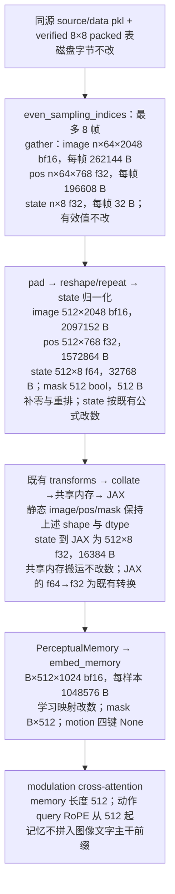
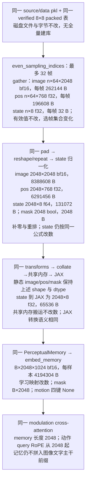

# 32 帧 × 8×8、2048 token 的无 motion modulation 训练方案

> 创建日期：2026-09-20（America/New_York），修订保留原文件名。状态：待实施。本文规划代码、配置与训练链路的改动，按两部分编写；用户当前授权仅为编写、修订方案，尚未授权实施代码或启动训练。
>
> 方案依据：`2f10473161b760f16d9240d3c2959ff326cde66b`。环境 B：主副本 `/scratch/hongze/robomme_policy_learning_MotionJEPA`，8 × A100-SXM4-80GB，数据位于 AWS 本地 NVMe RAID。本文使用函数名和配置键作为代码锚点。

## 第一部分（给人看）

本部分只讲要做什么、为什么现在跑不了、要改哪些文件、按什么顺序做。数据字节账、命令、通过条件与实测数字全部放在第二部分，这里不重复。

### 一、目标

在现有 `perceptual + frame_sampling + modulation`、motion 关闭的训练链路上**新增一档配置**：历史记忆从「最多 8 帧 × 每帧 64 token = 512」扩到「最多 32 帧 × 64 token = 2048」。数据集、模型结构、loss、优化器都不换，只是让动作分支一次读到更长的历史。已有 512 档保持原有行为，两档并存。

### 二、为什么现在不能直接跑

只把 YAML 的 `budget` 改成 2048，训练会在构造 Dataset 时抛 `ValueError`。原因是 [FrameSampDataset.__init__](src/mme_vla_suite/training/framesamp_dataset.py) 里有一个形制守卫，只放行 `(budget, token_per_image, num_views)` 为 `(512,16,1)` 或 `(512,64,1)` 的组合。守卫之后的选帧、读行、补零、展平、模型前向都已经按 `budget` 参数化（最大帧数 = `budget // 64`），不需要为 32 帧另写任何分支。所以整件事的生产改动很小，工作量主要在验证。

### 三、要改的文件

**生产代码（进训练路径），只有两处：**

1. **新增 YAML** `src/mme_vla_suite/models/config/robomme/perceptual-framesamp-modul-32frame-8x8.yaml`：从现有 `perceptual-framesamp-modul-8frame-8x8.yaml` 复制，只把 `budget: 512` 改成 `budget: 2048`，其余键（`token_per_image=64`、`num_views=1`、`memory_token_dim=1024`、`integration_type: modulation`、不写 motion 节）原样保留。
2. **放宽守卫** `framesamp_dataset.py::FrameSampDataset.__init__`：在旧的两个组合之外，额外放行「`(2048,64,1)` 且 `integration_type == modulation` 且 motion 关闭」这一种；`2048 + context`、`2048 + motion`、`2048 + 4×4` 都不放行。顺带把该文件里写死 `512` 的形状注释改成 `budget`，不动数值计算。

**验证工具（不进训练路径）：**

- `scripts/training/tests/test_pack_guards.py`：补 2048 的正反例、真实行与 padding 用例，旧 512 用例保留。
- `scripts/training/tests/ref_npy_dataset.py`：参考 Dataset 同样放行新形制，并把写死的 `_max_frames = 512 // ...` 改为从 `hc.budget` 推导。
- `scripts/training/tests/dump_fixture_samples.py` 与 `scripts/training/g0/bench_train_steps.py`：各自的 `_EXPECTED_HISTORY_CONFIGS` 白名单加入新 YAML（顺带加入旧 `perceptual-framesamp-modul.yaml`，否则旧 32×16 档没法做回归取证）。
- 新增 `scripts/training/tests/check_32frame_modul.py`：独立核对 32 帧选帧、输入装配、在线预缓存装配、checkpoint 加载后形制。
- 新增 `scripts/training/tests/check_modul_train_records.py`：核对两侧训练记录的步数、索引、初态、更新后状态是否完整一致。

**明确不改：** 已有 pkl / 8×8 packed 库 / 清单 / norm_stats（不重建库、不重抽 SigLIP）、`PerceptualMemory` / `FeatureEncoder` / `MemoryAttention` 模型代码、loss 与 AdamW/EMA、checkpoint 保存与加载实现、`training/config.py` 的全局超参。

### 四、实施顺序

1. **先改验证工具、固定基线。** 只提交上面「验证工具」那组改动，生产 `src/` 一行不动，记这个 clean commit 为 `BASE_VALIDATION`。目的：让旧 512 档在改动前就能被同一套工具取证。
2. **再加新配置与守卫。** 提交新 YAML、守卫改动和对应测试，记为 `CANDIDATE`。
3. **非训练检查。** 守卫正反例；独立选帧对照（`t=31` 取 `0..31`，`t=32` 取 `0..30,32` 这类边界）；源 NPY 参考 Dataset 对拍生产 packed Dataset（同为 2048）；batch → 共享内存 → JAX 交付逐键比对；旧 512 两档在 `BASE_VALIDATION` 与 `CANDIDATE` 上对拍确认没被改动波及。
4. **真实训练一致性。** 旧 512 两档（32×16、8×64）在两个版本上各跑 20 次更新，逐步比 loss、梯度范数、状态摘要；新 2048 档 NPY 侧与 packed 侧各跑 20 次更新，同样逐步比对。
5. **2048 真实保存与加载。** 用 `scripts/training/train.py` 跑约 100 步、真实落 checkpoint，再用 `create_trained_policy` 加载，确认快照里 `budget=2048`、motion 关闭、动作输出有限。

### 五、要留意的边界与尚未决定的事

- **512 与 2048 的结果不同是预期的。** 记忆轴变长后，20 个动作 query 的 RoPE 位置从 `512..531` 移到 `2048..2067`，即便有效帧相同前向也不同；所以不拿 512 的黄金结果去验证 2048，2048 只和「同为 2048 的独立参考链」比。
- **显存与步时要实测。** 每个样本的历史输入张量从约 3.7 MB 增到约 14.8 MB（4 倍），但整模型显存和步时不能按 4 倍推算。
- **不做断点续训。** 当前 checkpoint 只存推理参数与 norm_stats，不存优化器状态；第 5 步只验证「能保存、能加载、能出动作」。
- **尚未决定：** 正式训练的 batch、学习率、步数、GPU 数、worker 数与全新 `run_name`。本轮只修订文档；代码改动与任何训练都要等实施授权。

## 第二部分（技术细节，供 agent 追踪）

### 1. 目标配置与当前阻塞点

目标是在现有 `perceptual + frame_sampling + modulation` 链路上增加一个独立配置：**最多采样 32 帧，每帧 8×8 = 64 个视觉 token，总预算 2048，motion 关闭**。已有 512 token 配置继续保留原有行为。

当前模型已经按输入长度处理 modulation memory；实际阻塞在 [FrameSampDataset.__init__](src/mme_vla_suite/training/framesamp_dataset.py)：`(budget, token_per_image, num_views)` 只允许 `(512,16,1)` 和 `(512,64,1)`。因此只把 YAML 的 `budget` 改为 2048 会在 Dataset 构造时抛出 `ValueError`。

本方案的生产改动收敛到**一份新 YAML 和 Dataset 的配置守卫**。已有 8×8 packed 库按帧存储，可直接选出 32 帧；无需重新抽取 SigLIP、重打全量库或重新计算归一化统计量。模型、优化器、采样算法和共享内存 collate 保持现有实现，通过验证确认它们对新增长度的支持。

| 项目 | 现有无 motion 8×8 档 | 本次新增档 |
|---|---|---|
| history YAML | `perceptual-framesamp-modul-8frame-8x8.yaml` | `perceptual-framesamp-modul-32frame-8x8.yaml` |
| `budget` | 512 | 2048 |
| `token_per_image` / `num_views` | 64 / 1 | 64 / 1 |
| 最多采样帧数 | 8 | 32 |
| `integration_type` | `modulation` | `modulation` |
| `memory_token_dim` | 1024 | 1024 |
| motion | 关闭，省略整个节 | 关闭，省略整个节 |
| `streaming_obs_horizon` | 16 | 16 |

`budget` 是记忆序列长度，`memory_token_dim` 是进入 modulation 的通道宽度，两者不能混用。`streaming_obs_horizon` 是流式观察节奏，不是采样帧数，本次不改成 32。

### 2. 数据复用与输入语义

默认复用当前 1600ep 数据口径。2026-09-20 只读核对的实物如下；实施起跑前重新检查同源关系、锁状态和摘要，不把本次元数据读取当作重新完成全量 verify。

| 项目 | 路径或实测值 |
|---|---|
| 数据集根 | `v1-store/datasets/4task-v2-1600ep-604f16da/` |
| packed 输入 | 根下 `framesamp-8x8/`，实体目录 |
| 源数据 | 根下 `source/`，实体目录 |
| 清单 | 根下 `meta/episode_manifest.json` |
| packed 布局 / 状态 | `framesamp-8x8-v1` / `verified`，`manifest_scope=full` |
| 帧行数 / 执行样本数 | 1,192,918 / 605,611 |
| manifest SHA256 | `4cd5a170b0ed9718922bfd7c9287e80b3681a0ea7489dfdb07ddeb3a53dbb918` |
| norm_stats | `v1-store/train-assets/mme_vla_suite/4task-v2-1600ep-604f16da/robomme/norm_stats.json` |
| norm_stats 文件 SHA256 | `856c75ea504bd104c552027987b98a512d2d0b406738a7a8a500ada96d8ed173` |

既有建库结果见[1600ep 数据档案](docs/dataset-build-doc/4task-v2-1600ep-604f16da/result.md)。`FrameSampStore.read_image_rows` 每行提供 `(64,2048)` 的 bf16 图像特征，`pos_rows` 每行提供 `(64,768)` 的 f32 位置特征；存储布局不包含“每个训练样本最多 8 帧”的限制。

选帧继续使用 [shared/sampling.py::even_sampling_indices](src/mme_vla_suite/shared/sampling.py)。令当前 episode 的全域帧号为 `t`，最大帧数由 `2048 // (64 × 1) = 32` 得出：

- `t < 32`：选择 `0..t`，不足 32 帧的部分右侧补零，padding mask 为 False。
- `t >= 32`：按 `np.linspace(0, t, 32, dtype=np.int32)` 均匀选择 32 帧，覆盖到当前帧；这不是取最近 32 帧。
- 每帧 64 个 patch 沿原有顺序展开，有效 token 数为 `64 × min(t + 1, 32)`。不跨 episode，不读取未来帧。

`num_views=1` 指历史记忆的一路视觉特征。当前观察的两个相机输入仍走原有主干，不把它们并入这个 2048 预算。`motion_emb`、`motion_pos`、`motion_mask`、`mem_order` 全部为 None；不加载 motion store、Wan 或 MotionJEPA encoder。

### 3. 配置与代码改动

#### 3.1 新增独立 YAML

在 `src/mme_vla_suite/models/config/robomme/` 新增 `perceptual-framesamp-modul-32frame-8x8.yaml`。从现有[无 motion 8×8 YAML](src/mme_vla_suite/models/config/robomme/perceptual-framesamp-modul-8frame-8x8.yaml) 派生，除 `budget` 和说明注释外，其余配置值相同：

```yaml
# 32 帧 × 8×8 = 2048 个帧记忆 token；modulation，无 motion。
budget: 2048
num_views: 1
token_per_image: 64
streaming_obs_horizon: 16
pool_type: mean
use_pos_emb: true
use_state_emb: false
memory_feature:
  img:
    net: identity
    input_dim: 2048
  pos:
    input_dim: 768
    hidden_dim: 768
  state:
    input_dim: 8
    hidden_dim: 512
integration_type: modulation
memory_token_dim: 1024
representation_type: perceptual
perceptual_memory:
  type: frame_sampling
```

省略 motion 节即可关闭该分支，实际开关是 `motion.enabled`，无需新增 `use_motion` 键。`use_state_emb: false` 沿用现状；Dataset 仍交付 `static_state_emb`，模型不使用它构造记忆。

#### 3.2 精确扩展 Dataset 守卫

在 `src/mme_vla_suite/training/framesamp_dataset.py::FrameSampDataset.__init__` 提前读取现有的 `motion.enabled` 判定结果，再将形制守卫改为以下逻辑：

```python
shape = (int(hc.budget), int(hc.token_per_image), int(hc.num_views))
legacy_shape = shape in {(512, 16, 1), (512, 64, 1)}
new_shape = (
    shape == (2048, 64, 1)
    and str(hc.integration_type) == "modulation"
    and not self._motion_enabled
)
_req(legacy_shape or new_shape, "不支持的帧预算、网格、接入方式或 motion 组合")
```

这是拟实施逻辑，尚未写入源码。保留现有 `(integration_type, memory_token_dim)` 成对检查、库布局一致性检查以及所有 motion 开启态检查。2048 只放行本次目标；`2048 + context`、`2048 + motion`、`2048 + 4×4` 和多视角历史不随此次新增而开放。

`_max_frames`、`_pad` 和 `__getitem__` 已按配置长度工作，无需另写 32 帧装配分支。将这些函数附近的固定 `512` 形状注释改为 `budget`，使文档与行为一致；不顺带重构数值计算或 dtype。

#### 3.3 验证工具的必要扩展

| 文件 / 稳定锚点 | 拟改动及用途 |
|---|---|
| `scripts/training/tests/test_pack_guards.py`：Dataset 组、`test_g13_integration_dim_pairs`、`test_8x8_real_rows_and_padding` | 新增 2048 正反例及真实行、padding、spawn 覆盖；保留旧档用例，不把所有 512 断言替换为 2048 |
| `scripts/training/tests/ref_npy_dataset.py::RefNpyFrameSampDataset.__init__` | 放行新的无 motion modulation 形制，并把参考链 `_max_frames = 512 // ...` 改为从 `hc.budget` 推导；源 NPY 读取和参考 padding 保持独立 |
| `scripts/training/tests/dump_fixture_samples.py::_EXPECTED_HISTORY_CONFIGS` | 加入新 YAML 及旧 `perceptual-framesamp-modul.yaml`，支持新档与旧 32×16 modulation 取证；现有 `main` 已从配置推导帧数 |
| `scripts/training/g0/bench_train_steps.py::_EXPECTED_HISTORY_CONFIGS` | 加入新 YAML 以及旧 `perceptual-framesamp-modul.yaml`，支持新档参考对拍和旧 32×16 modulation 回归；记录器仍调用真实训练步骤 |
| 新增 `scripts/training/tests/check_32frame_modul.py` | 专门验证 32×64 无 motion 的独立选帧、输入装配、在线预缓存特征装配和 checkpoint 加载后的形制；不用 motion 库作测试前提 |
| 新增 `scripts/training/tests/check_modul_train_records.py` | 严格核对两侧预期更新次数、输入索引、初态、更新后状态、叶集合与有限性，再做逐位比较；不改历史验收脚本的既有门槛 |

新检查器的拟议接口为 `--store`、`--source`、`--manifest`、`--norm-stats`、`--history-config`、`--out`；若承载 checkpoint 加载检查，再增加明确的 `--checkpoint` 模式。**这些是待实现接口，不是当前可执行命令。** 源 NPY 参考读取不调用候选 Dataset 的 `_pad` 或读取器，避免两侧复制同一个错误。

训练记录检查器另拟 `--records-a`、`--records-b`、`--steps`、`--batch-size` 和 `--out` 接口，按显式预期集合验收，不靠两侧交集推断完成度。训练取证直接调用 `bench_train_steps.py` 的配置 CLI；不依赖 `run_2gpu_epoch_bench.sh`，该 shell 驱动另有 YAML 白名单，当前不能直接传新 YAML。

现有 `hand_calc_8frame.py` 写死 8 帧和 512 token，并在关闭态仍要求 `--motion`，本方案不复用它作为 2048 验收入口。现有 `compare_online_memory.py` 同样写死 512，本次在线装配验证放在新的检查器中。`single_step_grad_fixed.py` 限定已有 YAML 且不执行优化器更新，不用它替代真实训练验收。

生产模型的 `HistoryPi0Config.inputs_spec`、`PerceptualMemory`、`MemoryAttention` 及在线 `FrameSampMemory` 暂无必需改动。只有验证发现明确阻塞时才补充相应修复及证据，不预先扩大范围。

### 4. 改动前后链路与字节账

以下两图比较“当前可用的 8×64”与“拟新增的 32×64”。后者的选帧数量和模型输入有意变化，因此这两张图本身不表示两种配置数值等价。图中 `n` 为实际选中的帧数，`B` 为 batch size；字节数均按一个样本计算，进入 batch 后乘 `B`。模型 dtype 按现有 bf16 训练配置说明。

改动前：



改动后：



两图中的旁路当前观察保持原样：两路 RGB 分别由 `(224,224,3)` uint8（150,528 B）经现有图像转换进入模型，f32 时每路 602,112 B；state/action 经现有归一化与补维后分别为 `(32,)` f32（128 B）、`(20,32)` f32（2,560 B）。文本 tokenization、动作目标及样本顺序均沿用原链。实施时在真实模型入口逐键记录 shape/dtype/字节数，若与图不同先定位，不以图代替实测。

静态记忆四键在 Dataset 输出处由每样本 3,703,296 B 增至 14,813,184 B，恰为 4 倍。满历史样本的图像特征读取量由 2 MiB 增至 8 MiB；位置表 gather 和 batch 共享内存也随之增加。模型参数形状由通道宽度决定，预计不因预算改变而增加，但中间激活与 cross-attention 的 memory 轴扩大。**不能据此断言整模型显存或步时恰为 4 倍。**

### 5. 模型语义与 checkpoint 边界

[history_gemma.py::MemoryAttention.__call__](src/mme_vla_suite/models/integration/history_gemma.py) 从 `mem_seq.shape` 读取长度，并使用 `q_positions = arange(mem_len, mem_len + x_len)`。在 20 个动作 token 下，query 位置由 `512..531` 改为 `2048..2067`；key 位置由 `0..511` 改为 `0..2047`。即使短历史只有相同的几个有效帧，padding 仍占序列位置，扩大 budget 也会改变前向语义。

因此验收须区分两件事：旧 512 配置在改动前后应保持数值一致；新 2048 配置应与**同为 2048 的独立输入参考链**一致。不比较 512 与 2048 的 loss/梯度是否相同，也不拿 512 的黄金摘要证明 2048 正确。

`FeatureEncoder.__init__` 与 `MemoryAttention` 的参数按通道维度创建；`history_gemma.py::Module.init` 使用固定短 dummy memory 初始化。预算变化预计不改变参数路径或 shape，实施时要实际比较参数树。这个性质仅表示结构可能兼容，不表示旧 512 run 可以改快照后续训。新配置采用独立 run，从选定的同一 pi05_base 初始化；若以后要求从已有策略 checkpoint 微调，需另行记录初始化方式和实验口径。

[policy_config.py::_load_resolved_snapshot](src/mme_vla_suite/policies/policy_config.py) 与 `create_trained_policy` 优先读取 run 保存的解析快照。新 run 必须保存 `budget=2048`、`token_per_image=64`、`memory_token_dim=1024`，`motion_provenance.json` 记载关闭状态；仅给旧 checkpoint 换 CLI YAML 名不会把它变成 2048 模型。加载检查要求 `_assert_param_tree_exact` 通过且 `_params_have_motion` 为 False。当前保存项不含完整优化器状态，本方案不增加断点续训功能；保存目录使用零起点循环编号，100 次更新结束时的目录 `99` 对应第 100 次更新后的权重。

在线的 `FrameSampMemory.get_frame_sampling_indices`、`_prepare_frame_sampling` 以及 `MME_VLA_Policy._prepare_history` 已按配置预算推导帧数。先用与训练相同的预缓存特征验证选帧、padding、mask 和 shape；这只证明装配一致，不能代替原始 RGB 重编码的一致性或环境闭环成功率评估。

### 6. 验证顺序与通过条件

#### 6.1 非训练检查：输入内容与配置边界

1. **配置和拒绝路径。** 新 YAML 与旧 8×8 YAML 的解析结果只有 `budget` 不同；缺 motion 节与显式 `enabled: false` 均关闭。确认 `(2048,64,1)+modulation/1024+无 motion` 通过，context、motion 开启、错宽度、4×4 库、其他 budget 和多视角组合均按预期拒绝。旧两档及其现有 motion 行为继续通过原用例。
2. **独立选帧。** 新检查器直接给出预期序列，不调用 `even_sampling_indices` 来生成自己的期望值。覆盖 `t=0,1,7,8,15,30,31,32,33,63,64` 和长 episode 尾端；例如 `t=31` 是 `0..31`，`t=32` 是 `0..30,32`，`t=63` 是 `0,2,...,60,63`。合成边界覆盖全部列举时刻，真实样本仅使用清单允许的执行索引，不能因某个时刻在 demo 段而伪造训练样本。
3. **真实源 NPY 对 packed。** 同一清单、同一 norm_stats、同一 2048 YAML 下，用扩展后的 `RefNpyFrameSampDataset` 对拍生产 Dataset。覆盖短历史、恰满、超容量、demo/execution 接缝、episode 尾部及四任务样本；逐键比较 dtype、shape、原始字节，四个 None 键也纳入判定。image/pos padding 在输入端为零，mask 的 True 数等于有效帧数×64；归一化后的 state padding 不强求为零。
4. **真实 batch 与进程交付。** 混合短/长样本，经完整 transforms、现有 `_collate_fn_shm`、`_from_shared_torch` 和 JAX 交付检查。CPU 侧先比较原始字节，JAX 侧与按既有 dtype 转换得到的参考值比较，不能跨 f64/f32 要求原字节相等。至少覆盖 worker=0 和 spawn worker>0 两种路径；Dataset 的文件句柄仍为进程内懒打开。
5. **旧档回归。** 在实施前后的固定版本上，对原有 512 两种网格、支持的 integration/motion 组合运行相同配置守卫和定点输入检查；共享守卫修改不得改变已支持组合的接收条件、数值与采样顺序。

真实 packed 表已存在，本轮只需复用，不重跑全库 pack/verify。小型守卫测试可在独立临时输出根构建现有两档 fixture；显式设置 `MMEVLA_TEST_SOURCE` 和 `MMEVLA_TEST_MANIFEST` 指向本次数据，不能使用环境 A 的历史默认值。

以下是实施后可使用的现有测试入口，尚未在本轮运行；新用例应位于对应文件中，输出目录需为全新目录：

```bash
export UV_CACHE_DIR="$PWD/v1-store/cache/uv"
export XDG_CACHE_HOME="$PWD/v1-store/cache/xdg"
export HF_HOME="$PWD/v1-store/cache/hf"
export JAX_COMPILATION_CACHE_DIR="$PWD/v1-store/cache/jax"
export MMEVLA_TEST_SOURCE="$PWD/v1-store/datasets/4task-v2-1600ep-604f16da/source"
export MMEVLA_TEST_MANIFEST="$PWD/v1-store/datasets/4task-v2-1600ep-604f16da/meta/episode_manifest.json"
CUDA_VISIBLE_DEVICES='' JAX_PLATFORMS=cpu uv run --no-sync pytest \
  scripts/training/tests/test_pack_guards.py -x -q \
  --basetemp "$PWD/v1-store/tmp/modul2048-pack-guards-<唯一后缀>"
```

定点 dump 使用现有 `DTYPE_DUMP_IMPL=packed|refnpy`、`DTYPE_DUMP_DIR`、`DTYPE_MANIFEST` 接口；packed 侧 `--dataset-path` 指向 `framesamp-8x8/`，refnpy 侧指向 `source/`，两侧显式使用同一 norm_stats 资产。完整取证设置 `DTYPE_DUMP_MODE=both`、`DTYPE_DUMP_ARRAYS=0`、`DTYPE_DUMP_LIMIT=0`，保留全部键的字节摘要，避免无谓落盘大量数组。

先由新增检查器完成有界样本检查，再执行完整取证。`dump_fixture_samples.py` 还会遍历清单内全部帧和执行样本身份，不能把 `DTYPE_DUMP_LIMIT` 当作整个任务的耗时上限。现有 `compare_fixture_dumps.py` 要求两侧完整计划、`limit=0` 和恰好 200 个 batch；它不接受裁剪后的小集合，小集合由新增检查器单独验收。两种结果分别记录覆盖数，禁止空集合通过。

#### 6.2 真实训练：旧档一致性与新档可训练性

建议验证档使用 seed 42、batch 8、两张空闲 A100、FSDP 2、worker 4；这些是**待实施时确认的启动覆盖参数**，不修改 `training/config.py` 的全局默认值。以下更新步数同为方案建议，实施时一并确认。

| 验证 | 对照关系 | 建议更新次数 | 通过条件 |
|---|---|---:|---|
| 旧 512 档真实训练回归 | 改动前与改动后，各跑同一无 motion modulation 配置；覆盖 32×16 与 8×64 | 每侧每档 20 | 同初态、同索引、同 batch；逐步 loss、grad_norm、记忆梯度范数及 TrainState 摘要一致，参数实际更新 |
| 新 2048 档输入参考对拍 | 同一候选模型，源 NPY 参考 Dataset 与生产 packed Dataset | 每侧 20 | 两侧同为 2048；逐步输入、标量与参数/优化器状态摘要一致，全部有限 |
| 新 2048 训练、保存与加载 | 真实 packed 数据，生产训练入口，独立新 run | 100 | loss/梯度/更新后参数有限，观察窗口内记忆及 modulation 分支存在非零梯度和实际更新；保存 checkpoint 后按快照加载成功，动作 shape 正确且有限 |

真实训练取证复用 `scripts/training/g0/bench_train_steps.py`，它调用真实训练步骤和优化器。开启 `BENCH_RECORD_DIR`、`BENCH_DUMP_IDX=1`、`BENCH_CHECKSUM=1`、`BENCH_BATCH_DIGESTS=1`，逐步日志；摘要间隔与实际 save 调度对齐，记录初始化和每次更新后的状态，避免漏步。新 2048 参考侧使用现有 `BENCH_DATASET_IMPL=refnpy` 及显式 `BENCH_REF_SOURCE`、`BENCH_REF_MANIFEST`，同时令 `--dataset-path` 等于该 `source/` 路径；生产对照侧则指向 packed 库。无需提供 motion 资产。至少一个实际训练 batch 含有满 32 帧样本，另在定点检查覆盖短历史与混合 batch；不强求所有参数在第 0 步即有非零梯度。

bench 明确传 `--log-interval 1 --save-interval 1 --no-wandb-enabled`，不启用 overwrite/resume。沿用前述缓存根设置，并在每次 GPU 训练取证前设置以下现有环境变量及选定的 `CUDA_VISIBLE_DEVICES`：

```bash
export OPENPI_DATA_HOME="$PWD/v1-store/models"
export MMEVLA_JAX_CACHE_DIR="$PWD/v1-store/cache/jax/<唯一run>"
export XLA_FLAGS="--xla_gpu_deterministic_ops=true --xla_gpu_autotune_level=0"
```

`train.main` 会使用 `MMEVLA_JAX_CACHE_DIR` 重设编译缓存；仅设置 `JAX_COMPILATION_CACHE_DIR` 不足以防止回退到 `$HOME/.cache`。真实保存/加载短测也必须显式设置该项目内缓存路径。

为使旧档两侧具备相同取证能力，先提交只影响验证工具的准备改动，记录其 clean commit 为 `BASE_VALIDATION`，确认生产 `src/` 与方案起点一致；再提交 YAML、Dataset 和对应新档测试形成 `CANDIDATE`。两侧分别从这两个版本加载自己的源码与依赖，记录实际 `train.py`、Dataset、模型的导入路径。当前原始版本的 bench 不接受 `perceptual-framesamp-modul.yaml`，不能跳过工具准备步骤就声称已经跑了旧 32×16 modulation 回归。

取证工具会把 checkpoint 保存替换为状态摘要，因此它不能证明 checkpoint 可加载。表中最后一项单独走 `scripts/training/train.py` 真实保存，再通过 `create_trained_policy` 加载保存的推理参数和快照，验证训练、保存、加载并输出动作这条路径。bench 中的完整 TrainState 摘要用于更新一致性比较，与生产 checkpoint 的保存内容分别记录。

`compare_baseline.py` 可提供差异定位，最终由新增 `check_modul_train_records.py` 核对预期步集合完整、索引总数、配置 SHA、实际导入来源与全部记录的有限性，再比较非空且一致的参数/优化器叶集合；不能只看比较器的交集结果。`g0_gate.py` 和 `gate_8x8.py` 含历史 context 参数树、数据口径或固定步数约束，不原样套作本次 modulation 验收。严格一致性使用同卡、同环境、相同确定性设置顺序运行。若出现非确定性，先重跑同版本 A/A 定位，不能事后放宽阈值掩盖差异。

旧档回归与 2048 参考对拍证明的是各自配置内的等价性。100 步 smoke 不要求 loss 单调下降，不据此宣称策略质量提升。只做一次合成 forward、只看单步梯度或只有“进程未崩溃”，均不能替代以上验收。

### 7. 资源、起跑与加载记录

实施时重新确认环境和正在运行的任务。本文写作时 `src/`、`scripts/` 的相关文件为只读；如主副本因长训练锁定，遵循 [AGENTS.md](AGENTS.md) 的开发副本机制，使用独立 `.venv`，共享 `v1-store` 只按明确的新输出路径写入，不解锁正在训练的源码，不覆盖现有产物。当前 HF 导出相关在途文件不属于本方案的修改或提交范围。

所有 Python 检查均使用 `uv run --no-sync`，缓存与结果置于 `v1-store/`。预计超过 5 分钟的取证、训练、诊断，从 clean HEAD 启动，放入 detached tmux，使用 `PYTHONUNBUFFERED=1`、`set -o pipefail`、`tee` 和最终 `EXIT_CODE=`，在 `docs/training-doc/<run_name>/` 记录命令、commit、配置 SHA、数据摘要及结果。≤5 分钟的临时 smoke 完成后清理准确对应的临时 run。

先确认具体空闲 GPU 再显式设置 `CUDA_VISIBLE_DEVICES`；本轮不预订 GPU，也不继承旧计划中特定任务的卡号授权。若真实 2048 档在建议小 batch 下仍超显存，先记录失败与峰值，再调整已确认的启动覆盖参数，不擅自降低 memory budget 或改模型精度。

正式 batch 的容量检查还须记录主机 RSS、`/dev/shm` 峰值、worker 数、预取设置、GPU 显存和编译耗时。吞吐测量单独执行，关闭昂贵的逐步完整状态摘要，固定同一 AWS 本地 NVMe RAID 数据源，区分 warmup 与稳态；GPU 使用 500 ms 采样，报告 util 均值、0% 占比与慢步/非慢步分层，不用中位数代替利用率结论。

正式长训练的 batch、学习率、步数、FSDP、worker 数和全新 `run_name` 尚未确定。现有 `mme_vla_suite_b128_60k` 与 `mme_vla_suite_b128_80k` 只是可选条目，不在本方案中默认选定，也不把“支持 2048”扩展为已获长期训练授权。启动时的核心选择应为：

```text
--model.use-history
--model.history-config perceptual-framesamp-modul-32frame-8x8.yaml
--dataset-path v1-store/datasets/4task-v2-1600ep-604f16da/framesamp-8x8
```

同时核对 norm_stats 的文件 SHA 与解析后数组摘要，保存 `history_config.resolved.yaml`、其 SHA256 和 `motion_provenance.json`。新 run 的 checkpoint 加载后必须实际得到 2048 长度、motion 关闭；不覆盖旧 run，不修改旧快照。

### 8. 交付与完成判据

本轮交付为根目录同名文件 `0920-32frame-8x8-modul-2048-plan.md` 的修订。检查两个顶层部分、Markdown 代码围栏、相对链接、`git diff --check` 与文件范围；第一部分只写高层目标、阻塞原因、改动文件清单与实施顺序（2026-09-20 用户要求），第二部分保留具体文件、函数、参数、命令和通过条件。提交只逐文件暂存本文，使用中文 `docs:` subject，不纳入其他任务的在途文件。同步遵循 `AGENTS.md` 第 11 条：只推已有 upstream；遇到远端拒绝即停止，交用户处置，不重复推送或改写历史。

后续实施按“验证工具准备并固定基线 → 新配置与守卫 → 非训练输入验证 → 真实训练一致性 → 2048 保存/加载”顺序推进。代码交付应包含新 YAML、明确限制在本目标内的 Dataset 支持、必要测试及结果档案；每个阶段按实际代码与验证结果提交，不把本方案中的预期值写成已完成结果。

只有新配置通过守卫、真实 2048 输入对拍通过、旧 512 档回归通过、真实训练更新与 checkpoint 加载通过后，才可把结论更新为“支持 32 帧 × 8×8、2048 token 的无 motion modulation 训练”。正式大 batch 性能、长训练收敛和策略成功率由各自后续运行提供证据。
