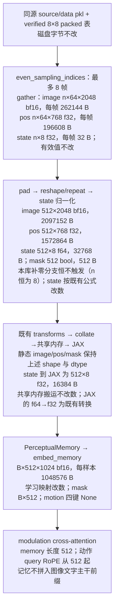
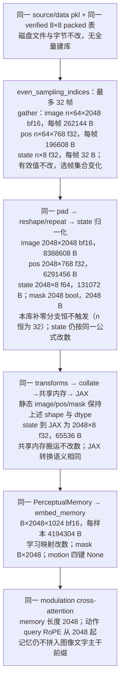

# 32 帧 × 8×8、2048 token 的无 motion modulation 训练方案

> 创建日期：2026-09-20（America/New_York），修订保留原文件名。状态：实施中。2026-09-21 用户原话：「开始实现 有问题立刻越早问用户越好 一路实现到测速结束报告用户为止」。本轮授权覆盖代码、验证、V9 容量检查、V9b 测速及 V9c 报告与可检查的启动草案；正式 80k 起跑仍须收到针对本次报告的明确同意。下文修订记录中的「仅改计划」描述的是当时授权，不限制本轮已授权实施。

> **实施期间最新决定（优先于下文原调度和等待安排）**：用户明确「能并行的尽可能并行 8个gpu你可以用」，因此独立检查并行；旧两档BASE/CAND继续GPU4、5，新2048参考/packed两侧使用GPU0、1且同卡顺序，功能检查GPU2，100步保存加载GPU6、7。用户随后明确「1000步测速后如果占用率高于50% 并且没有其他的问题 可以直接启动训练」。采用800步稳态窗口八卡总体平均GPU利用率严格大于50%、全部正确性与容量门通过、SPEED_REPORT=READY且无未解决问题的口径；满足后记录条件判定并绑定真实报告、runner、TRAIN_HEAD和已定run_name，重跑V10后直接起跑，不再重复询问。条件不满足则停在起跑前报告。完整取证要求保持不变，性能阶段仍独占八卡。
>
> 方案依据：`2f10473161b760f16d9240d3c2959ff326cde66b`。环境 B：主副本 `/scratch/hongze/robomme_policy_learning_MotionJEPA`，8 × A100-SXM4-80GB，数据位于 AWS 本地 NVMe RAID。本文使用函数名和配置键作为代码锚点。
>
> **2026-09-20 修订依据**：对本文的三路独立对抗验证（七维审查 workflow、对外部审计意见的逐条复核、主会话实测），审计锚点 `AUDIT_BASE = f4131e6a3acdc0c963f7fd6c0d2dfada9cbc728d`。本次修订落地的用户决策：定点取证链改造 `_common.py` 而**不换数据集**（只用 1600ep 及其 v2 衍生）；`state_step=1` 用 1 步补跑补齐；checkpoint 验收走 bench 落盘路径；生产改动由「两处」扩到**四个文件**；新增四项功能性检验；`AGENTS.md` 项目 scope 行本轮不动；验证步数 20/20/100 写死为已定值。
>
> **2026-09-21 修订（用户决定）**：正式档超参**原样沿用** `mme_vla_suite_b128_80k`、正式 `run_name` 定为 `v2-1600ep-m32x8x8-modul-b128-80k`；旧库 `4task-motion-400ep` / `4task-motion-40ep` **一律不再使用**，一切取证（含旧 512 两档的改前 / 改后回归）只在 `4task-v2-1600ep-604f16da` 上做；第一部分新增「六、起跑前要过的验证」「七、与前两次生产 run 的差异」「八、执行顺序」三节（精简表），命令级细节在第二部分第 8、9 节。
>
> **本次对抗审计修订**：依据 `38c7eee4dcc45a9fdfd4fb21c87463ac41c5a9da` 的静态审计，补正式配置绑定、保存现场数组、逐 token 梯度、static mask 形状、collate 与 dtype、RoPE oracle 和性能证据。用户原话：「直接修改该计划 并且在起跑v10之前加入一个测速环节 测出80k用时和gpu占用率 然后再报告用户 用户同意后再起泡」。据此增加 **V9b 测速 → V9c 报告并等待用户明确同意 → V10 最终自检 → 正式起跑**。80k 用时是从当前机器稳态实测外推的估计，不能写成已实跑 80k 的耗时；本次仍只修改计划，不实施代码、不运行验证或测速。

## 第一部分（给人看）

本部分只讲要做什么、为什么现在跑不了、要改哪些文件、按什么顺序做。数据字节账、命令、通过条件与实测数字全部放在第二部分，这里不重复。

### 一、目标

在现有 `perceptual + frame_sampling + modulation`、motion 关闭的训练链路上**新增一档配置**：历史记忆从「最多 8 帧 × 每帧 64 token = 512」扩到「最多 32 帧 × 64 token = 2048」。数据集、模型结构、loss、优化器都不换，只是让动作分支一次读到更长的历史。已有 512 档保持原有行为，两档并存。

### 二、为什么现在不能直接跑

**训练侧**：只把 YAML 的 `budget` 改成 2048，训练会在构造 Dataset 时抛 `ValueError`。原因是 [FrameSampDataset.__init__](src/mme_vla_suite/training/framesamp_dataset.py) 里有一个形制守卫，只放行 `(budget, token_per_image, num_views)` 为 `(512,16,1)` 或 `(512,64,1)` 的组合。守卫之后的选帧、读行、补零、展平、模型前向都已经按 `budget` 参数化（最大帧数 = `budget // 64`），不需要为 32 帧另写任何分支。所以生产改动本身很小，工作量主要在验证。

**验证侧还有一个独立阻塞，必须一并解决。** 仓库现成的定点取证链（`dump_fixture_samples.py` → `compare_fixture_dumps.py`）硬性要求清单里存在 `exec_start_idx == 0` 的 episode，用来覆盖「历史不足、需要补零」的分支。而 v2 私有采集给**四个任务的每一集都注入了 demo 前缀**，1600ep 清单的 `exec_start_idx` 最小 100、等于 0 的一个都没有，所以这条取证链在读任何数据之前就 `raise`。这不是取样问题而是采集契约决定的，**任何 v2 衍生库都不可能有零起点 episode**（详见 §2 与 §6.1）。因此本方案必须改 `_common.py` 的定点时刻口径，并为「补零/短历史」另找一条不依赖零起点 episode 的覆盖路径。

**由此还带出一个必须写明的数据事实**：既然真实样本的全域帧号 `t` 恒 ≥ 100 > 32，补零分支在本训练库上是**死代码**，「短历史」「混合短长 batch」这两类覆盖在真实数据上物理不可得，多条原验收条件会退化为恒真而静默通过。§6.1 已按此重写判据。

### 三、要改的文件

**训练源码与配置，共四个文件（三个已有 Python 文件、一份新 YAML）**（2026-09-20 用户批准的范围；本次把第四键 mask 的实际校验位置写清，理由见第二部分 §3.2）：

1. **新增 YAML** `src/mme_vla_suite/models/config/robomme/perceptual-framesamp-modul-32frame-8x8.yaml`：从现有 `perceptual-framesamp-modul-8frame-8x8.yaml` 复制，只把 `budget: 512` 改成 `budget: 2048`，其余键（`token_per_image=64`、`num_views=1`、`memory_token_dim=1024`、`integration_type: modulation`、不写 motion 节）原样保留。
2. **放宽守卫** `framesamp_dataset.py::FrameSampDataset.__init__`：在旧的两个组合之外，额外放行「`(2048,64,1)` 且 `integration_type == modulation` 且 motion 关闭」这一种；`2048 + context`、`2048 + motion`、`2048 + 4×4` 都不放行。新档分支**不经 `int()`、并同时加 `type(v) is int` 类型检查**（两半缺一不可，缺后者会因 `True == 1` 放行 `num_views: true`）。把 `motion.enabled` 的判定上移到守卫之前。顺带把该文件里写死 `512` 的形状注释改成 `budget`，不动数值计算。
3. **`percep_mem.py::PerceptualMemory.__call__`**：把裸 `assert` 改成显式 `raise ValueError`，核 image / pos / state 三个输入的 batch 与 budget 长度；该接口不接收 `static_mask`，不能在这里声称查了四键。裸 `budget` 补 `int()`，确保 `PYTHONOPTIMIZE=1` / `-O` 下守卫仍生效。
4. **`history_pi0.py::HistoryPi0Config.inputs_spec` 与 `HistoryPi0.embed_memory`**：前者四处 `ShapeDtypeStruct` 的 budget 补 `int()`；后者在无 motion 分支返回前显式核 `static_mask` 非 None、dtype 为 bool、shape 精确等于 `(B, budget)`，拒绝可广播的 `(B,1)`。image / pos / state 与 mask 的四键守卫由两个实际持有它们的接口共同完成。

**启动守卫另列一项**：扩展 `scripts/training/preflight_train_launch.py` 的正式配置核验，并新增对应负例。既有 25 门保留；新增门须核实际解析配置与实际输出根，不能把「共用 `TRAIN_ARGS`」误当成所有参数已被检查，详见第二部分 §7.3。

**验证工具（不进训练路径）：**

- `scripts/training/tests/_common.py`：fixture 机制当前硬性要求清单里存在 `exec_start_idx == 0` 的 episode，而 v2 数据结构性没有（见下）。把定点时刻改为**相对每集 `exec_start_idx` 的偏移**，并在 plan 里留痕。
- `scripts/training/tests/test_pack_guards.py`：补 2048 正反例（含浮点/字符串/布尔类型反例）；修 `test_g6a_exec_lookup_formula` 的 `VideoUnmask` 硬编码、`test_g2_pad_dtype_boundary` 与 `test_8x8_real_rows_and_padding` 的「样本下标当全域帧号」；旧 512 用例保留。
- `scripts/training/tests/ref_npy_dataset.py`：参考 Dataset 同样放行新形制，并把写死的 `_max_frames = 512 // ...` 改为从 `hc.budget` 推导。
- `scripts/training/tests/dump_fixture_samples.py`、`scripts/training/tests/single_step_grad.py`、`scripts/training/g0/bench_train_steps.py`：各自的 `_EXPECTED_HISTORY_CONFIGS` 白名单加入新 YAML（顺带加入旧 `perceptual-framesamp-modul.yaml`，否则旧 32×16 档没法做回归取证）。`single_step_grad.py` 现有白名单**只有 4 个 context 档、不含任何 modulation**，不补就跑不了本方案任何一档。
- `scripts/training/tests/test_padding_dtype.py`：唯一直测 fixture 四函数的 pytest，随 `_common.py` 同步适配。
- 新增 `scripts/training/tests/check_32frame_modul.py`：**装配块**、**功能块**与 **ckpt 子命令**，分别核输入、逐 token 参与及 mask / RoPE、保存现场数组到加载模型的一致性；TIC L0 仍复用既有脚本。
- 新增 `scripts/training/tests/check_modul_train_records.py`：双侧模式核对两侧训练记录完整一致；**另加单侧模式**按显式叶名清单判定 modulation 分支逐叶「梯度非零 + 参数实际更新」。
- 复用 `scripts/training/g0/check_config_provenance.py`（**本轮不改该脚本**）：checkpoint 加载后形制沿用其既有 TIC L0 五门。
- 参数化 `scripts/training/tests/compare_collate_paths.py` 的配置、batch 与索引长度；增加只允许 worker 数不同的比较模式，其余配置仍须相等。
- 新增 `scripts/training/tests/check_modul_speed.py`：包装真实训练入口，记录兼容 `StepTiming` 字段的轻量主线程计时；结合 GPU / 主机采样检查窗口、估算 80k 用时并输出报告，不开启 profiler、不改变训练计算。接口与判定行属待实施能力。

**明确不改：** 已有 pkl / 8×8 packed 库 / 清单 / norm_stats（不重建库、不重抽 SigLIP、不新建任何派生库）、`FeatureEncoder` / `MemoryAttention` 模型代码、loss 与 AdamW/EMA、checkpoint 保存与加载实现、`training/config.py` 的全局超参、`train.py::train_step` 的 `info` 字典（禁止加键，理由见 §6.2）。

### 四、实施顺序

1. **先准备旧档验证工具、固定基线。** 仅提交第八节步1b列出的fixture、白名单、参考Dataset与旧用例适配，生产src不动；新2048功能、启动守卫、测速工具留到步2b。验证后记clean commit为 `BASE_VALIDATION`，让旧512两档先取得改前证据，不以 `-k` / `xfail` 跳过失败来宣称通过。
2. **再加新配置与守卫。** 提交三个训练Python文件、新YAML、启动守卫和对应验证工具，分开记录提交；验证工具齐备后的clean HEAD记为 `CANDIDATE`。
3. **非训练检查。** 守卫正反例（含类型、mask 形状反例）；独立选帧对照；源 NPY 对拍 packed；batch → 共享内存 → JAX 逐键比对；**逐 token 梯度及故障注入证明 2048 个位置参与计算**，帧带扰动作为交叉检查；合成短历史验证 mask；独立 oracle 验证 `MemoryAttention`；在线装配冒烟；旧 512 两档在 `BASE_VALIDATION` 与 `CANDIDATE` 上回归。
4. **真实训练一致性。** 旧 512 两档（32×16、8×64）在两个版本上各跑 20 次更新，逐步比 loss、梯度范数、状态摘要；新 2048 档 NPY 侧与 packed 侧各跑 20 次更新，同样逐步比对。每档两侧各另跑一次 `--num-train-steps 1` 的同 seed run，补齐现有工具记不到的第 1 次更新后状态。
5. **2048真实保存与加载。** bench同时启用真实checkpoint保存和初/末原数组落盘，用数组建立bf16摘要与保存前动作参照；再经 `create_trained_policy` 加载，核逐叶相等、不同于初态、固定noise动作一致性及TIC L0。仅有哈希不能完成这些验收。
6. **生产容量 smoke、独立测速、用户决定、最终自检。** V9 的 20 步只验编译与容量；V9b 单独测稳态吞吐、GPU 占用率并外推 80k 用时；V9c 把结果和完整正式配置报告用户，等待明确同意。未经同意不得进入 V10 或启动正式 run；同意后仍须重跑 V10，失败即停。

### 五、已定边界与仍需用户决定的事项

- **512 与 2048 的结果不同是预期的。** 记忆轴变长后，20 个动作 query 的 RoPE 位置从 `512..531` 移到 `2048..2067`，即便有效帧相同前向也不同；所以不拿 512 的黄金结果去验证 2048，2048 只和「同为 2048 的独立参考链」比。**注意这一位移与有效帧数无关、对满历史样本同样成立**，不要写成「短历史 + padding 占位」——本库根本不存在短历史样本。
- **本训练库没有短历史样本，补零分支是死代码。** 1600ep 全部 605,611 个执行样本恒为满 32 帧，`mask` 恒全 True。因此「mask 的 True 数等于有效帧数×64」「padding 为零」「至少一个 batch 含满 32 帧样本」这类条件在本库上恒真、零鉴别力，已从判据里剔除或改写；补零与 mask 屏蔽改由合成输入与「绕过 `__getitem__` 直调 `_pad`」两条路径覆盖，**不新建任何派生库、不伪造任何清单或 pkl**。
- **显存与步时要实测，逻辑读取量增加确定。** 历史输入从每样本约 3.7 MB 增到约 14.8 MB；每 epoch 图像行逻辑读取由 1,182.8 GiB 增到 4,731.3 GiB。page cache、预读和重复访问使物理磁盘读量不同，不能用这笔字节账或顺序盘速推断瓶颈，也不能把整模型步时按 4 倍外推。
- **加载判据必须能证伪。** `budget` 不进入任何参数形状，512 档与 2048 档参数树逐路径逐形状完全相同；`_assert_param_tree_exact` 只比路径集合、`_params_have_motion` 在关闭态恒为 False，两条都无法区分「这次训练的权重」与「旧 run 的权重」「未训练的初始权重」。加上 `ema_decay=0.999` 使 100 步 checkpoint 按构造约 90.5% 是初始权重，粗判据必然失效。详见 §5。
- **不做断点续训。** 当前 checkpoint 只落 `assets` 与 `params`（`train_state` 项在 `initialize_checkpoint_dir` 里是注释掉的），完全不存优化器状态；第 5 步只验证保存、加载与动作路径。
- **已定：** 验证档 seed 42、batch 8、两张空闲 A100、FSDP 2、worker 4；更新步数旧档每侧每档 20、新档对拍每侧 20、新档训练 100（2026-09-20 用户确认写死，不再标「实施时确认」）。
- **已定（2026-09-21 用户决定）：** 正式长训练**原样沿用** `mme_vla_suite_b128_80k`（batch 128、80k 步、warmup 5k、lr 5e-5、`fsdp_devices=8`、`num_workers=16`，一项不改），全新 `run_name` 为 `v2-1600ep-m32x8x8-modul-b128-80k`。本轮只修订文档；代码改动与任何训练都要等实施授权。
- **新增用户决定：** 正式起跑必须在 V9b 测速报告之后由用户明确同意；沉默、超时、既往 run 的授权与任何 PASS 行都不能代替这次同意。
- **尚未决定：** 实施及验证测速何时开始；用户看报告后是否接受预计耗时和 GPU 占用率；若资源或性能不满足需求是否改变 worker / batch 等已定参数；训练后策略评估的 checkpoint、任务与规模（另起计划）。这些不是重新询问已定超参。测速窗口、统计方法和工具接口在 §7.2 写为本计划的技术安排，不冒称用户已逐项拍板；若需调参，先明确启动覆盖或全局默认的落点，获决定后再复测。

### 六、起跑前要过的验证

判据行全部摘进 `launch.md`；任一 FAIL 即停、把原文交用户处置，不放宽判据。**全部取证只用 `4task-v2-1600ep-604f16da`**（8×64 与 2048 走 `framesamp-8x8`，32×16 走 `framesamp`），旧库一律不用。「步骤」列对应第八节的编号。

| # | 验证 | 步骤 | 证明什么 | 判据行 | 耗时 / 资源 |
|---|---|---|---|---|---|
| G0 | 守卫正反例 | 3 | 新守卫只放行 `(2048,64,1)+modulation+无 motion`；`2048.5` / `"2048"` / `num_views: true` 三个类型反例与 `+context` / `+motion` / `+4×4` / 多视角四个组合反例全拒；旧两档接受条件逐字不变 | `GUARD_2048=PASS accept=1 reject_type=3 reject_combo=4 legacy_accept=2` | 1 min / CPU |
| G0b | static四键形状 | 3 | 三种特征长度与mask非空 / bool / 精确shape均校验，`(B,1)`广播反例及`-O`均拒绝 | `STATIC_SHAPE=PASS keys=4` | CPU |
| G1 | YAML 差异 | 3 | 新旧 YAML 解析结果只差 `budget`，且它是 `int` | `YAML_DIFF=PASS keys_diff=['budget']` | 秒级 / CPU |
| G2 | 独立选帧 | 3 | `t=31 → 0..31`、`t=32 → 0..30,32`、`t=63 → 0,2,…,60,63` 等 12 个时刻与手写期望逐个相等 | `FRAME_SELECT=PASS cases=12 mismatches=0` | 秒级 / CPU |
| G3 | fixture 向后兼容 | 1b | **`_common.py` 改造没改旧行为**：改造前后两版模块在手造零起点清单上四个 fixture 函数产出逐字相同；1600ep 上每偏移候选 1600、四任务各 400 | `FIXTURE_COMPAT=PASS mismatches=0` + `FIXTURE_NEW=PASS per_task=400/400/400/400` | 1 min / CPU |
| G4 | 初态锚点 | 3 | **`budget` 不进任何参数形状**：同 seed 下 512 档与 2048 档初始参数逐叶 sha 相同 | `INIT_SAME_512_2048=PASS leaves=61 mismatches=0` | 3 min / CPU |
| V1a | 旧档交付逐位 | 2a / 2d | **生产改动不改旧档交付内容**：8×64 与 32×16 两档在 `BASE` 与 `CAND` 上全量定点 dump 逐样本逐键字节全等 | `SAMPLE_RAW_EXACT=PASS … mismatches=0` + `BATCH_RAW_EXACT=PASS batches=200 mismatches=0` | 小时级 ×4 / CPU |
| V1b | 新档参考对拍 | 3 | **packed 交付 = 源 NPY 参考链交付**（同为 2048）：有界样本（接缝 / 尾部 / 四任务）+ 全量定点 dump 逐键全等 | `REF_VS_PACKED=PASS mismatches=0` + 同上两行 | 小时级 ×2 / CPU |
| V2 | 补零与短历史 | 3 | **`_pad` 在 `n=1..32` 全部正确**（本库真实样本恒满帧，只能合成 `t_synth`）：尾部逐位零、mask 计数与 dtype 对，且与在线侧 `right_padding_token_emb` 逐字节相同 | `PAD_SYNTH=PASS n_cases=32 online_pad_bitexact=1` | 2 min / CPU |
| V3 | batch 与进程交付 | 3 | worker 0 与 spawn 4 输入和索引一致；短 / 混合 / 满历史三档均保持 image bf16、pos f32、归一化 state f64、mask bool；JAX 只沿用 state f64→f32 | `COLLATE_EQUIV=PASS mismatches=0` + `JAX_DELIVERY=PASS` + `COLLATE_MIXED=PASS dtype_contract=1` | 5 min / CPU |
| V4 | 在线装配 | 3 | 推理侧按 2048 能装出四元组、shape / dtype / mask 计数对（不做数值等价） | `ONLINE_ASM=PASS steps=5` | 2 min / CPU |
| V5 | 功能性闸门 | 3 | **2048 个位置逐个有梯度**，并能拒绝每帧只保留一个 token 的故障；逐帧带扰动交叉检查；短历史 mask 屏蔽；独立 oracle 的数值与结构条件成立 | `TOKEN_GRAD=PASS nonzero=2048` / `TOKEN_DROP_NEGATIVE=PASS` / `FRAME_BAND_PERTURB=PASS above_noise=32` / `MASK_SYNTH=PASS` / `MEMATTN_ORACLE=PASS` | 20–40 min / GPU 4 |
| V7a | 旧档 20 步真实训练 | 2a / 2d | **生产改动不改旧档训练数值**：两档在 `BASE` 与 `CAND` 上各 20 次更新，逐步五标量 hex、索引序列、输入摘要、TrainState 逐叶摘要全等；`state_step=1` 由 1 步补跑补齐 | `SCALARS steps=20 … hex_mismatch_steps=0` / `STATE_DIGEST rows=20 mismatch=0` / `TRAIN_RECORDS=PASS` | 4 × (10–15 min) / GPU 4,5 |
| V7b | 新档 20 步参考对拍 | 4 | 源 NPY 与 packed 两条输入链各 20 次更新逐步全等；modulation 六叶 + `mem_encoder` 四叶逐叶「梯度非零 + 参数实际更新」 | 同 V7a 三行 + `MODUL_LEAVES_UPDATED=PASS leaves=10` | 2 × (15–30 min) / GPU 4,5 |
| V8 | 100步 + 保存加载 | 5 | 100步标量有限、mem_enc_norm>0；初/末原数组留存并校验，bf16加载叶与保存现场一致、十个记忆叶不同于初态、固定noise动作rms≤6.8e-5、mem_len=2048，TIC L0通过 | `TRAIN100=PASS` / `SAVE_ARRAYS=PASS` / `TIC_L0=PASS` / `CKPT_LEAF_BF16=PASS` / `CKPT_VS_INIT=PASS` / `CKPT_ACTIONS=PASS` / `CKPT_SHAPE=PASS` | 30–40 min / GPU4,5 |
| V9 | 8 卡生产形制 smoke | 7 | 编译、20 步有限、不 OOM，真实保存与加载可用；`/dev/shm` 峰值 ≤ 70%。只证明容量，不证明稳态速度 | `SMOKE20=PASS` / `PARAM_TREE_EXACT=PASS n_model=61 n_ckpt=61` / `SHM_PEAK=PASS ratio=<≤0.70>` | 预计 ≤10 min / GPU 0–7 |
| V9b | 独立生产形制测速 | 7b | 1000 步：0–99 预热、100–899 稳态、900–998 看趋势、999 真保存；测吞吐、逐卡 GPU 占用、主机资源并外推 80k 用时 | `SPEED_WINDOW=PASS` / `GPU_COVERAGE=PASS` / `ETA80K=ESTIMATE` / `SPEED_REPORT=READY` | 以 V9 步时预估并留档 / GPU 0–7 |
| V9c | 报告与用户决定 | 8 | 报告 80k ETA 范围、GPU 均值 / 0% / 慢步分层、资源峰值、限制及正式配置；用户明确同意前停在这里 | `USER_APPROVAL=PENDING`；取得本次原话并绑定报告与配置后才可记 `USER_APPROVAL=PASS` | 等待用户，不占 GPU |
| V10 | 同意后的最终自检 | 9 | 用户同意仍适用；实际解析的正式配置、输出根、HEAD、环境与数据全部匹配，8 卡空闲 | `PREFLIGHT=PASS n=<实际门数>` / `LAUNCH_CONFIG=PASS mode=prod` / `GPU_IDLE=PASS used_mib=0` / `USER_APPROVAL=PASS` | CPU 核验 / GPU 只读查询 |

**四组目的**：G3 / V1a / V7a 验旧档等价；G0–G2 / V1b / V2–V4 / V7b 验输入与交付；G4 / V5 / V8 验逐位置功能与保存加载；V9 / V9b / V9c / V10 分别负责容量、性能报告、用户决定、最终起跑条件。**不重跑历史 LR 曲线对拍**，但 V10 必须核实际解析后的 LR 配置，不能因 0916 已证而省略。`EVAL_ES_BOUND` 仍属 motion 专用；不要求 512 与 2048 数值等价；不用旧库 fixture 的 `single_step_grad_fixed.py` 替代真实训练。命令与判据见第二部分第 8 节。

### 七、与前两次生产 run 的差异

三条 run 同库、同 norm_stats、同 modulation 接入；本 run 只把帧路记忆从 8 帧扩到 32 帧，超参原样沿用 ②。引用结果须带此声明：**① 与 ③ 不逐项可比**（记忆长度不同即前向语义不同，§5）。

| 项 | ① `v2-1600ep-m8x8-modul-b128-60k` | ② `v2-1600ep-m8x8-modul-motion-b128-80k` | ③ `v2-1600ep-m32x8x8-modul-b128-80k` |
|---|---|---|---|
| 起跑 commit | `dd07f18`，09-15 | `2f10473`，09-18 | `CAND` 之后 clean HEAD，待起跑 |
| 具名配置 | `mme_vla_suite_b128_60k` | `mme_vla_suite_b128_80k` | `mme_vla_suite_b128_80k`（原样） |
| history YAML | `…-modul-8frame-8x8.yaml` | `…-modul-8frame-8x8-motion.yaml` | **`…-modul-32frame-8x8.yaml`** |
| 帧路 budget / 帧数 | 512 / 8 | 512 / 8 | **2048 / 32** |
| 记忆长度 / 动作 query RoPE 位置 | 512 / `512..531` | 672 / `672..691` | **2048 / `2048..2067`** |
| motion | 关 | 开，budget 160 | 关 |
| 参数叶 | 61 | 65 | 61（G4 证） |
| 步数 / lr / batch / EMA | 60k / 5e-5 / 128 / 0.999 | 80k / 5e-5 / 128 / 0.999 | 80k / 5e-5 / 128 / 0.999 |
| 卡 / worker / mesh | 4 卡 w8，(1,4)，per-device 32 | 8 卡 w16，(1,8)，per-device 16 | 8 卡 w16，(1,8)，per-device 16 |
| 每样本静态交付 / 每 epoch 图像逻辑读取 | 3.70 MB / 1,182.8 GiB | 3.70 MB + motion 658 KB / 同左 + motion 表 | **14.81 MB / 4,731.3 GiB**（4×，全程逻辑读取 ≈ 78 TiB，b128 每步 1 GiB；不等于磁盘实读） |
| 步时 / 全程 | 2.34 s / 39 h 05 m | 0.97–0.99 s / 21 h 37 m | 待 V9b 当前环境实测并外推；② 仅为历史参照，不能作为严格下界，**不按 4× 外推** |
| tmux | `m8-prod` | `mv2-prod` | `m2048-prod` / `m2048-dense` |

训练参数不变：数据集 `4task-v2-1600ep-604f16da/framesamp-8x8`、norm_stats `856c75ea…`、seed 42、warmup 5k、AdamW 裁剪 1.0、每 5k 保存共 16 份 checkpoint、GPU 0–7。启动核验在原有关闭态 25 门上增加配置绑定门，最终门数由实现报告；测速与正式执行均不继承验证用确定性 XLA 覆盖，也不开全程 profiler。

### 八、执行顺序（十一步，全文以本表为准）

主副本上顺序执行，每个commit后按本仓库规则同步既有upstream；步2a / 2d / 4 / 5钉GPU4,5，V5钉GPU4，V9 / V9b / 正式run分别独占0–7，V9c等待时释放GPU。会话、参数和失败分流见第二部分第9节。

1. 已定：正式档 `mme_vla_suite_b128_80k` 原样、`run_name` = `v2-1600ep-m32x8x8-modul-b128-80k`；起跑前 `df -h /scratch` ≥ 400 G。本文入库 → `docs:` → push。
2. **1b**：只改验证工具（`_common.py` 相对偏移 + plan 两新键、三处白名单、`ref_npy_dataset.py` 守卫、`test_pack_guards.py` 三处适配、G3 用例），生产 `src/` 一行不动 → 跑 G3 → `fix:` → push → `BASE=$(git rev-parse HEAD)`。
3. **2a**：在 clean `BASE` 取「改前」证——V1a 两档全量 dump（CPU，并行）‖ V7a 两档各 20 步 + 1 步（GPU 4,5，串行）。
4. **2b**：实施三个训练Python文件 + 新YAML + 守卫用例；补启动配置门 / 负例、数值验收与测速工具、collate参数化。dirty期间不跑带clean-source校验的工具，不改依赖。
5. **2c**：`commitV11.0`（生产改动）+ `commitV11.1`（验证工具）→ push → `CAND=$(git rev-parse HEAD)`，porcelain 必须为空。
6. **2d**：取「改后」证并对拍 V1a / V7a。**数值项 FAIL → 只 revert `commitV11.0`（保留 V11.1）+ push，停下交用户**；harness 失配先排查。
7. **3**：G0 / G0b / G1 / G2 / G4 / V2 / V3 / V4及启动负例、测速包装自测（CPU）→ V5（GPU4）‖ V1b全量dump（CPU）。
8. **4 → 5**：V7b refnpy vs packed 各 20 步 + 1 步 → V8 100 步 + 真实落盘 + 加载三判据 + TIC L0（GPU 4,5）。
9. **6**：步 3–8 留档 `docs/training-doc/m2048-*/` → `docs:` → push。
10. **7 → 7b → 8**：V9 8 卡 20 步 smoke → V9b 独立 1000 步测速并归档 → 完整起跑草案与测速报告提交，固定 `TRAIN_HEAD` → V9c 向用户报告并等待明确同意。测速结束释放 GPU；不同意或未答复都不得进入下一步。
11. **9 → 9b**：取得针对本报告、配置与已准备runner的同意 → 复核 V10（同意有效、runner / 配置 / HEAD / 数据 / 资源一致）→ 正式起跑（tmux `m2048-prod`，密采 `m2048-dense`）→ 300 步复核 ETA → 稳态后锁主副本只读、开发转 `-temp` → 起跑后归档。V10 失败即停；若需改已获同意的配置，重新测速 / 报告并取得相应决定。训完终判与评估另起计划。

## 第二部分（技术细节，供 agent 追踪）

### 1. 目标配置与当前阻塞点

目标是在现有 `perceptual + frame_sampling + modulation` 链路上增加一个独立配置：**最多采样 32 帧，每帧 8×8 = 64 个视觉 token，总预算 2048，motion 关闭**。已有 512 token 配置继续保留原有行为。

当前模型已经按输入长度处理 modulation memory；实际阻塞在 [FrameSampDataset.__init__](src/mme_vla_suite/training/framesamp_dataset.py)：`(budget, token_per_image, num_views)` 只允许 `(512,16,1)` 和 `(512,64,1)`。因此只把 YAML 的 `budget` 改为 2048 会在 Dataset 构造时抛出 `ValueError`。

训练路径改动为**一份新 YAML、Dataset 守卫、PerceptualMemory 三键长度守卫、HistoryPi0 的 spec 与 mask 守卫**（三个 Python 文件 + YAML）；启动工具另补正式配置核验。已有 packed 表可直接选出 32 帧，不重抽 SigLIP、不重建库、不重算 norm_stats；模型数值计算、优化器、采样算法与 collate 不变。

| 项目 | 现有无 motion 8×8 档 | 本次新增档 |
|---|---|---|
| history YAML | `perceptual-framesamp-modul-8frame-8x8.yaml` | `perceptual-framesamp-modul-32frame-8x8.yaml` |
| `budget` | 512 | 2048 |
| `token_per_image` / `num_views` | 64 / 1 | 64 / 1 |
| 最多采样帧数 | 8 | 32 |
| `integration_type` | `modulation` | `modulation` |
| `memory_token_dim` | 1024 | 1024 |
| motion | 关闭，省略整个节 | 关闭，省略整个节 |
| `streaming_obs_horizon` | 16 | 16 |

`budget` 是记忆序列长度，`memory_token_dim` 是进入 modulation 的通道宽度，两者不能混用。`streaming_obs_horizon` 是流式观察节奏，不是采样帧数，本次不改成 32。

### 2. 数据复用与输入语义

默认复用当前 1600ep 数据口径。2026-09-20 只读核对的实物如下；实施起跑前重新检查同源关系、锁状态和摘要，不把本次元数据读取当作重新完成全量 verify。

| 项目 | 路径或实测值 |
|---|---|
| 数据集根 | `v1-store/datasets/4task-v2-1600ep-604f16da/` |
| packed 输入 | 根下 `framesamp-8x8/`，实体目录 |
| 源数据 | 根下 `source/`，实体目录 |
| 清单 | 根下 `meta/episode_manifest.json` |
| 四个任务 | `canonical_order` = BinFill、RouteStick、VideoRepick、VideoUnmaskSwap，各 400 集，global episode 区间依次 `0–399` / `400–799` / `800–1199` / `1200–1599`。**与 `AGENTS.md`「项目 scope」列出的 v1 四任务（ButtonUnmask / VideoUnmask / ButtonUnmaskSwap / VideoUnmaskSwap，对应 `4task-motion-*` 系列）不是同一套，仅 VideoUnmaskSwap 重合**；取证按 global episode 区间取样，不按任务名字符串筛 |
| packed 布局 / 状态 | 在 `framesamp-8x8/meta/store_meta.json`（**不在清单里**）：`layout=framesamp-8x8-v1`、`status=verified`、`manifest_scope=full`、`subset_episodes=null` |
| 帧行数 / 执行样本数 | 1,192,918 / 605,611（`store_meta.json` 的 `num_rows` / `num_exec_samples`，与清单 `totals.timesteps` / `totals.exec_samples` 一致） |
| 清单内容指纹（清单内 `sha256` 字段） | `4cd5a170b0ed9718922bfd7c9287e80b3681a0ea7489dfdb07ddeb3a53dbb918`——由 `scripts/dataset/scan_manifest.py::manifest_sha256`（消费侧同口径实现见 `datastore/manifest.py::manifest_sha256`）对**剔除 `sha256` 键后 `sort_keys=True`、`separators=(",",":")` 的规范化 JSON 字节**取摘要。落盘用 `indent=2` 且含该键，故它**必然不等于文件 sha256，也不得用 `sha256sum` 核对** |
| 清单整文件 SHA256（可用 `sha256sum` 直核） | `df0ec8edd823b1415fa2bba6a51fa1c911dadc4d10364590d537a97526add482` |
| norm_stats | `v1-store/train-assets/mme_vla_suite/4task-v2-1600ep-604f16da/robomme/norm_stats.json` |
| norm_stats 整文件 SHA256（可用 `sha256sum` 直核） | `856c75ea504bd104c552027987b98a512d2d0b406738a7a8a500ada96d8ed173` |

起跑前核对方法固定为：**整文件哈希行用 `sha256sum <path>` 直核；清单内容指纹行不得用 `sha256sum`**，由 `datastore/manifest.py::load_manifest` 在加载时现场重算比对（不符即 raise），或由 `scripts/training/g0/check_config_provenance.py` 的 `LIB_PROVENANCE_MATCH` 判定行覆盖（该脚本文件头明文写着「口径是 `manifest_sha256` 的规范化摘要，不是文件全文 sha256」）。两种口径不得互相替代，也不得混写为同一个「SHA256」标签。

既有建库结果见[1600ep 数据档案](docs/dataset-build-doc/4task-v2-1600ep-604f16da/result.md)。`FrameSampStore.read_image_rows` 每行提供 `(64,2048)` 的 bf16 图像特征，`pos_rows` 每行提供 `(64,768)` 的 f32 位置特征；存储布局不包含“每个训练样本最多 8 帧”的限制。

选帧继续使用 [shared/sampling.py::even_sampling_indices](src/mme_vla_suite/shared/sampling.py)。令当前 episode 的全域帧号为 `t`，最大帧数由 `2048 // (64 × 1) = 32` 得出：

- `t < 32`：选择 `0..t`，不足 32 帧的部分右侧补零，padding mask 为 False。
- `t >= 32`：按 `np.linspace(0, t, 32, dtype=np.int32)` 均匀选择 32 帧，覆盖到当前帧；这不是取最近 32 帧。
- 每帧 64 个 patch 沿原有顺序展开，有效 token 数为 `64 × min(t + 1, 32)`。不跨 episode，不读取未来帧。

**本库实测：上面第一条分支不会被任何真实样本触发。** `exec_start_idx` 由 `dataset_builder/robomme_h5_utils.py::first_execution_step` 定义——从 `timestep_0` 起数 `info/is_video_demo` 为 True 的前缀长度；v2 私有采集（契约 v3）给四个任务的每一集都注入了 demo 前缀（`0914-4task-h5-merge-plan.md` 的新旧对照表记载「BinFill 也带 video demo 段，且 demo 段恰为整集一半」，而同名任务在 v1 公开集里 100 集**全部** `exec_start_idx=0`）。实测 1600 集分布：

| h5 | n | `exec_start_idx` min | max | `==0` | `<32` |
|---|---:|---:|---:|---:|---:|
| `record_dataset_BinFill.h5` | 400 | 264 | 1152 | 0 | 0 |
| `record_dataset_RouteStick.h5` | 400 | 100 | 500 | 0 | 0 |
| `record_dataset_VideoRepick.h5` | 400 | 252 | 508 | 0 | 0 |
| `record_dataset_VideoUnmaskSwap.h5` | 400 | 114 | 318 | 0 | 0 |

`framesamp_store.py::build_exec_lookup` 令 `step_of[cursor:cursor+k] = exec_start_idx + arange(k)`，故每个执行样本的全域帧号 `t ≥ exec_start_idx ≥ 100 > 32`，`even_sampling_indices` 恒走 `linspace` 分支、恒选满 32 帧，`_pad` 的 `out[n:] = 0` 一次都不执行。由此有三个必须在验收里显式处理的后果：（a）**补零与短历史只能由合成输入覆盖**，不能声称在训练库上验证过；（b）「`mask` 的 True 数 = 有效帧数×64」在本库恒等于 2048、「padding 为零」是空真命题、「至少一个 batch 含满 32 帧样本」零鉴别力，这三条不得作为判据；（c）扩容成本不被短样本稀释，§4 的 epoch 级账按 100% 满帧计。

**这个性质是采集契约决定的，换任何 v2 衍生库都一样。** `4task-v2-smoke28` 的归档清单实测同为 min=100、零起点 0 个（且库本体已按授权清理）；`pack_framesamp_store.py::_pick_episodes` 的 `--subset-prefix` 只做 `episodes[:K+1]`、episode 字典逐字照搬，`exec_start_idx` 一个不变，且另有三道闸（`dataloader.py` 对 `manifest_scope=="subset"` 要求 `MMEVLA_FRAMESAMP_ALLOW_SUBSET=1` 且日志原文「一切判据 run 无效」、motion 开启时直接 raise、`dump_fixture_samples.py` 校验 `len(ds) == totals.exec_samples`）。因此**不新建任何派生库**。

`num_views=1` 指历史记忆的一路视觉特征。当前观察的两个相机输入仍走原有主干，不把它们并入这个 2048 预算。`motion_emb`、`motion_pos`、`motion_mask`、`mem_order` 全部为 None；不加载 motion store、Wan 或 MotionJEPA encoder。

### 3. 配置与代码改动

#### 3.1 新增独立 YAML

在 `src/mme_vla_suite/models/config/robomme/` 新增 `perceptual-framesamp-modul-32frame-8x8.yaml`。从现有[无 motion 8×8 YAML](src/mme_vla_suite/models/config/robomme/perceptual-framesamp-modul-8frame-8x8.yaml) 派生，除 `budget` 和说明注释外，其余配置值相同：

```yaml
# 32 帧 × 8×8 = 2048 个帧记忆 token；modulation，无 motion。
budget: 2048
num_views: 1
token_per_image: 64
streaming_obs_horizon: 16
pool_type: mean
use_pos_emb: true
use_state_emb: false
memory_feature:
  img:
    net: identity
    input_dim: 2048
  pos:
    input_dim: 768
    hidden_dim: 768
  state:
    input_dim: 8
    hidden_dim: 512
integration_type: modulation
memory_token_dim: 1024
representation_type: perceptual
perceptual_memory:
  type: frame_sampling
```

省略 motion 节即可关闭该分支，实际开关是 `motion.enabled`，无需新增 `use_motion` 键。`use_state_emb: false` 沿用现状；Dataset 仍交付 `static_state_emb`，模型不使用它构造记忆。

#### 3.2 精确扩展 Dataset 守卫

现有守卫在 `src/mme_vla_suite/training/framesamp_dataset.py::FrameSampDataset.__init__` 内，写法是 `_req((int(hc.budget), int(hc.token_per_image), int(hc.num_views)) in {(512, 16, 1), (512, 64, 1)}, ...)`；而 `mcfg = getattr(hc, "motion", None)` / `self._motion_enabled = ...` 的赋值**位于该守卫之后**。新档放行条件依赖 motion 开关，所以必须先把这两行上移——否则构造 `(2048,64,1)` 的 Dataset 会在 `not self._motion_enabled` 处抛 `AttributeError`；由于 `and` 短路，旧 512 两档不触发，**问题恰好只在新增档暴露**。

具体改法：在 `(integration_type, memory_token_dim)` 成对 `_req` 之后、形制守卫之前插入前两行，守卫本身换成后面那段。原 motion 段落的两行赋值**保留原地不删**（同一函数内重复赋值同一属性无副作用），其后的全部 motion 开启态子检查照旧。

```python
# 提前到形制守卫之前：新档放行条件依赖 motion 开关（纯 getattr + bool，无副作用）
mcfg = getattr(hc, "motion", None)
self._motion_enabled = bool(mcfg is not None and mcfg.get("enabled", False))

raw = (hc.budget, hc.token_per_image, hc.num_views)
shape = (int(hc.budget), int(hc.token_per_image), int(hc.num_views))
legacy_shape = shape in {(512, 16, 1), (512, 64, 1)}      # 旧档接受条件逐字不变
new_shape = (
    all(type(v) is int for v in raw)   # 必须与下一行同时存在：单用 == 时 True == 1，num_views: true 会漏过
    and raw == (2048, 64, 1)           # 不经 int()：2048.5 / "2048" 在此即被拒，不再延迟到模型构造
    and str(hc.integration_type) == "modulation"
    and not self._motion_enabled
)
_req(legacy_shape or new_shape,
     f"(budget,token_per_image,num_views)={raw}（类型 {tuple(type(v).__name__ for v in raw)}）、"
     f"integration_type={hc.integration_type!r}、motion_enabled={self._motion_enabled} "
     f"不在支持的 (512,16,1)/(512,64,1) 与 (2048,64,1)+modulation+无 motion 档位中")
```

这是拟实施逻辑，尚未写入源码。保留现有 `(integration_type, memory_token_dim)` 成对检查、库布局一致性检查以及所有 motion 开启态检查。2048 只放行本次目标；`2048 + context`、`2048 + motion`、`2048 + 4×4` 和多视角历史不随此次新增而开放。

**新档分支刻意不经 `int()`，理由与配套的生产改动：** `models/config/utils.py::get_history_config` 只是裸 `omegaconf.OmegaConf.load`，**不做任何类型强制**，所以 YAML 里写 `budget: 2048.5` 会以 Python `float` 原样进来；而 `HistoryPi0Config.inputs_spec` 的四个 `ShapeDtypeStruct` 与 `percep_mem.py::PerceptualMemory.__call__` 的长度断言用的是**裸 `hc.budget`**（对比同文件 `_motion_specs` 写的是 `int(...)`，可见是疏漏）。若放任 `int()` 截断，`2048.5` 会通过 Dataset 守卫，改在 `HistoryPi0.__init__ → config.fake_obs()` 里由 `jnp.ones((1, 2048.5, 2048))` 抛 `TypeError`——仍是硬失败、不会静默错训，但报错点远离根因。旧档继续走 `int()` 路径，接受条件逐字不变（§6.1 第 5 点的旧档回归即核此点）。**本轮已批准把 `inputs_spec` 与 `percep_mem.py` 的裸 `budget` 一并补上 `int()`**（第一部分「三」的第 3、4 条），治本而非只在 Dataset 侧堵。

`_max_frames`、`_pad` 和 `__getitem__` 已按配置长度工作，无需另写 32 帧装配分支——全量 grep `src/mme_vla_suite/{models,training}/` 确认写死的 `512` 只出现在守卫本身、其报错串与两条注释里，**没有任何数值计算写死 512**。将这些函数附近的固定 `512` 形状注释改为 `budget`，使文档与行为一致；不顺带重构数值计算或 dtype。

**static 四键的生产守卫分工。** `PerceptualMemory.__call__` 只持有 image / pos / state，逐项验证非 None、batch 相同、序列长度为 `int(config.budget)`；`HistoryPi0.embed_memory` 持有 observation，在 motion 关闭分支返回前验证 `static_mask.dtype == bool`、shape 精确为 `(B, budget)`。全部使用显式 `raise ValueError`，不依赖 `assert` 或广播报错；测试覆盖 image / pos / state 长度 512、mask 缺失、非 bool、`(B,1)`、`(B,512)` 与正确 `(B,2048)`，并在 `PYTHONOPTIMIZE=1` 子进程重测拒绝路径。守卫不重排、不截断、不转换输入数值。

#### 3.3 验证工具的必要扩展

| 文件 / 稳定锚点 | 拟改动及用途 |
|---|---|
| `scripts/training/tests/_common.py`：`fixture_steps`、`fixture_per_step`、`build_fixture_indices`、`build_fixture_batches` | **定点时刻改为相对每集 `exec_start_idx` 的偏移**（见 §6.1）。`fixture_per_step` 现有的 `if n == 0: raise ValueError("清单没有 exec_start_idx=0 的 episode…")` 在 v2 上必触发；改造后按「各偏移候选数的最小值」给配额并上限 200。`BATCH_PLAN`、`BATCH_SIZE`、`FIXTURE_SEED` 与四档 ×50 = 200 batch **全部不动**，故 `compare_fixture_dumps.py` 的三条硬断言不用改。零起点清单上逐字退化为旧行为 |
| `scripts/training/tests/test_pack_guards.py`：`test_g6a_exec_lookup_formula`、`test_g2_pad_dtype_boundary`、`test_8x8_real_rows_and_padding`、`test_g13_integration_dim_pairs` | 三处 1600ep 不兼容点必修（详见本表下方）；新增 2048 正反例及真实行、spawn 覆盖；**反例须含 `budget: 2048.5`、`budget: "2048"`、`num_views: true` 三个类型反例**，以及 `2048+context`、`2048+motion`、`2048+4×4`、多视角四个组合反例。保留旧档用例，不把所有 512 断言替换为 2048 |
| `scripts/training/tests/ref_npy_dataset.py::RefNpyFrameSampDataset.__init__` | 放行新的无 motion modulation 形制（放行条件与生产侧保持同一表达式，其 motion 判定同样需在守卫前可用），并把参考链 `_max_frames = 512 // ...` 改为从 `hc.budget` 推导；源 NPY 读取和参考 padding 保持独立 |
| `scripts/training/tests/dump_fixture_samples.py`：`_EXPECTED_HISTORY_CONFIGS`、`main` 写 `fixture_plan.json` 处 | 白名单加入新 YAML 及旧 `perceptual-framesamp-modul.yaml`；plan 里**增写 `origin_mode` 与 `covers_zero_pad` 两键**，防止降级取样被静默接受（`compare_fixture_dumps.py` 已有 `plans[0] != plans[1]` 全等断言，写进去即被两侧对拍锁死） |
| `scripts/training/tests/single_step_grad.py`：`_EXPECTED_HISTORY_CONFIGS` | **现有白名单只有 4 个 context 档、不含任何 modulation**，不补则本方案任何一档都跑不了。加入新 YAML 与旧 `perceptual-framesamp-modul.yaml` |
| `scripts/training/tests/test_padding_dtype.py` | 唯一直测 fixture 四函数的 pytest（`test_fixture_indices_are_reproducible_and_on_boundary`），随 `_common.py` 同步适配；并参数化喂入零起点与非零起点两类清单，机器证明旧行为不变 |
| `scripts/training/g0/bench_train_steps.py`：`_EXPECTED_HISTORY_CONFIGS` | 加入新 YAML 以及旧 `perceptual-framesamp-modul.yaml`，支持新档参考对拍和旧 32×16 modulation 回归；记录器仍调用真实训练步骤。**不新增任何记录能力**——分支级证据用它已有的 `param_checksums.jsonl` 判读（见 §6.2） |
| 新增 `scripts/training/tests/check_32frame_modul.py` | **装配块**验选帧与交付；**功能块**在固定 2048 轴上逐 token 验梯度、按带扰动、故障注入、mask 与独立 oracle；**ckpt 子命令**从 V8 保存现场数组建立 bf16 权重和动作参照，调用已有 TIC L0 后完成三项数值验收。不依赖 motion 库 |
| 新增 `scripts/training/tests/check_modul_train_records.py` | **双侧模式**（`--records-a` / `--records-b`）：核对两侧预期更新次数、输入索引、初态、更新后状态、叶集合与有限性，再做逐位比较。**单侧模式**（`--records` + `--expect-leaves`）：只读一份 `param_checksums.jsonl`，按显式叶名清单判定 modulation 六叶与 `mem_encoder` 四叶的「梯度非零」与「参数实际更新」。两种模式都不改历史验收脚本的既有门槛 |
| `scripts/training/tests/compare_collate_paths.py` | 新增 `--history-config` / `--batch-size` / `--config`；所有写死的 128（切片、记录、索引数校验）统一取实际 batch；`compare` 新增明确的 `--allow-worker-difference`，仅允许 workers 不同，其余参数、键与索引必须相等 |
| `scripts/training/preflight_train_launch.py` 与新增 `scripts/training/tests/test_modul_launch_guards.py` | 保留现有环境 / 数据门，增加 §7.3 的实际配置与输出根绑定；负例含 smoke 步数残留、错具名配置、错 run 根、重复参数和未取得本次同意。失败必须非零退出且训练入口未调用 |
| 新增 `scripts/training/tests/check_modul_speed.py` | **待实现** `run` / `report`：前者仅包装真实训练入口及轻量计时，后者读记录算稳态吞吐、GPU 分层、保存开销与 ETA。严格区分现有训练参数和新增包装接口，细节见 §7.2 |
| 复用 `scripts/training/g0/check_config_provenance.py`（`gate_norm_stats` / `gate_lib_provenance` / `gate_motion_store_path` / `gate_ckpt_param_tree` / `gate_ckpt_dtype_profile`） | checkpoint 加载后形制沿用既有 TIC L0 五门，**本轮不改该脚本**，只以新 run 的路径调用。它 import 的正是本方案引用的同一对函数（`_assert_param_tree_exact` / `_load_resolved_snapshot` / `_params_have_motion`），且已为 motion 关闭态设计（`snapshot_enabled=False` 走 `motion_store_unused=1`，`motion_*` 字段要求为 null），`--store-subdir` 已支持 `framesamp-8x8`。若实测发现必须修改，另行立项并在本表补记 |

**`test_pack_guards.py` 的三处 1600ep 不兼容点**（都是数据事实导致，不是本次改动引入）：

1. `test_g6a_exec_lookup_formula` 用 `next(e for e in manifest["episodes"] if e["h5_file"] == "record_dataset_VideoUnmask.h5")` 定位 episode，而 1600ep 的 `canonical_order` 没有该任务 → `StopIteration`。改为遍历 `canonical_order` 去重后取每个任务的首个 episode、筛 `exec_start_idx > 0`，并加 `assert demo_eps` 接住「清单全零起点」的反例；在零起点旧库上自动只覆盖带 demo 的任务，与旧断言等价。
2. `test_g2_pad_dtype_boundary` 后半段与 `test_8x8_real_rows_and_padding` 后半段把 `ds[idx]` 当作全域帧号（前者 docstring 原文「episode 0 exec_start=0 → idx 即 step」），而 1600ep episode 0 的 `exec_start_idx=678`，`ds[30]` 的真实 step 是 708 → 断言必挂。改为先用 `_common.index_of(ep, step)` 换算（`exec_sample_offset + (step - exec_start_idx)`，该函数**已存在且已被 `dump_fixture_samples.py` 使用**，不必新写）再取样本，期望值写成 `min(step + 1, ds._max_frames) * tokens_per_frame`，`step` 只取满足 `exec_start_idx <= step < num_timesteps` 的值。注意 `ds[7]/ds[8]/ds[9]/ds[31]/ds[33]` 会**误打误撞通过**，不能当作「这几个用例没问题」的证据。两个用例的**前半段不用改**：`rows = ds._row_base[0] + frames` 用的是帧号、与 `exec_start_idx` 无关。
3. 模块 `REF_SHARD` 默认 `v1-store/datasets/ref-shard`、`MANIFEST` 默认 `v1-store/episode_manifest.json`，**环境 B 下两者都不存在**，`docs/training-doc/t8-c8-guard-s100/launch.md` 也记过该文件在本环境从未跑过 pytest。必须显式设置 §6.1 给出的两个环境变量；同时要意识到**这将是该文件在环境 B 的第一次整体真跑**，可能暴露本表之外的问题。

新检查器的拟议接口为 `--store`、`--source`、`--manifest`、`--norm-stats`、`--history-config`、`--out`。**这些是待实现接口，不是当前可执行命令。** 源 NPY 参考读取不调用候选 Dataset 的 `_pad` 或读取器，避免两侧复制同一个错误。

训练记录检查器另拟 `--records-a`、`--records-b`、`--records`、`--expect-leaves`、`--steps`、`--batch-size` 和 `--out` 接口，按显式预期集合验收，不靠两侧交集推断完成度。训练取证直接调用 `bench_train_steps.py` 的配置 CLI；不依赖 `run_2gpu_epoch_bench.sh`（另有 YAML 白名单），也不依赖 `run_dtype_dump.sh` / `run_dtype_grad.sh`（其 `GL_DATASET=${DATASETS_DIR}/4task-gl` 在环境 B 不存在），定点 dump 与梯度取证一律直接调 python。

现有 `hand_calc_8frame.py` 写死 8 帧和 512 token，并在关闭态仍要求 `--motion`，本方案不复用它作为 2048 验收入口。现有 `compare_online_memory.py`（位于 `scripts/training/g0/`）同样写死 512、无 budget 参数，本次在线装配验证放在新的检查器中。`single_step_grad_fixed.py` 限定已有 YAML 且不执行优化器更新，不用它替代真实训练验收。

**功能块复用骨架，不复用旧判据。** `motion_gates_model.py::cmd_m4` 的 `_obs_from_samples(..., motion=False)`、digest、确定性探针与垃圾注入可参考；原 `np.all(arr[~valid] == 0) and np.any(arr[valid] != 0)` 在全True mask上会退化，改成每64位置带内“至少一个非零”仍可漏检63个位置，必须按 §6.1a **逐token**判定并做删除位置的故障注入。该脚本的 `TOKENS_PER_FRAME=16 / FRAME_BUDGET=32 / MOTION_BUDGET=96 / STORE_SUBDIR=framesamp`、固定512的parallel_obs与依赖motion库的fixture不能原样复用，真实入口为 `_t3_main`。

生产模型的 `MemoryAttention` 及在线 `FrameSampMemory` 暂无必需**改动**，但 `MemoryAttention` 的位置与掩码算术要按 §6.1a 单独做解析级验证——它是本次唯一语义随 budget 改变的一环（`q_positions` 由 `512..531` 移到 `2048..2067`），而其余全部验收都共享同一份前向代码、无法证伪它本身。`HistoryPi0Config.inputs_spec` 与 `PerceptualMemory` 的改动已列入第一部分「三」的生产改动清单，不在此重复。除此之外只有验证发现明确阻塞时才补充相应修复及证据，不预先扩大范围。

### 4. 改动前后链路与字节账

以下两图比较“当前可用的 8×64”与“拟新增的 32×64”。后者的选帧数量和模型输入有意变化，因此这两张图本身不表示两种配置数值等价。图中 `n` 为实际选中的帧数，`B` 为 batch size；字节数均按一个样本计算，进入 batch 后乘 `B`。模型 dtype 按现有 bf16 训练配置说明。

改动前：



改动后：



两图中的旁路当前观察保持原样：两路 RGB 分别由 `(224,224,3)` uint8（150,528 B）经现有图像转换进入模型，f32 时每路 602,112 B；state/action 经现有归一化与补维后分别为 `(32,)` f32（128 B）、`(20,32)` f32（2,560 B）。文本 tokenization、动作目标及样本顺序均沿用原链。实施时在真实模型入口逐键记录 shape/dtype/字节数，若与图不同先定位，不以图代替实测。

静态记忆四键在 Dataset 输出处由每样本 3,703,296 B 增至 14,813,184 B，恰为 4 倍。满历史样本的图像特征读取量由 2 MiB 增至 8 MiB；位置表 gather 和 batch 共享内存也随之增加。模型参数形状由通道宽度决定，预计不因预算改变而增加，但中间激活与 cross-attention 的 memory 轴扩大。**不能据此断言整模型显存或步时恰为 4 倍。**

**epoch 级总账**（按 605,611 个执行样本、每样本恒满 32 帧现算；满帧是本库的数据事实而非估计，见 §2）。单行图像字节取 `SPECS["framesamp-8x8-v1"].image_row_bytes = 64 × 2048 × 2 = 262,144 B`：

| 项目 | 8 帧 / 512 档 | 32 帧 / 2048 档 | 倍数 |
|---|---:|---:|---:|
| 每 epoch 图像行逻辑读取 | 1,182.8 GiB | **4,731.3 GiB** | 4.000 |
| 相对 `framesamp-8x8` 库体积（291.7 GiB）的逻辑读取倍数 | 4.05× | **16.22×** | 4.000 |
| 每 epoch 静态四键交付到共享内存 / JAX | ≈2,088.7 GiB | ≈8,354.9 GiB | 4.000 |

这些是全满帧条件下的**逻辑读取与张量交付量**；`FrameSampStore.read_image_rows` 使用普通 `pread` / `preadv` 与预读提示，page cache 可满足重复访问，不能把上述数值标成块设备实际读盘量。主机缓存、预读与其他进程流量须在 V9b 单独观测；资源和性能口径见 §7。

### 5. 模型语义与 checkpoint 边界

[history_gemma.py::MemoryAttention.__call__](src/mme_vla_suite/models/integration/history_gemma.py) 从 `mem_seq.shape` 读取长度，并使用 `q_positions = arange(mem_len, mem_len + x_len)`。在 20 个动作 token 下，query 位置由 `512..531` 改为 `2048..2067`；key 位置由 `0..511` 改为 `0..2047`。**这一位移与有效帧数无关、对满历史样本同样成立**，因此扩大 budget 必然改变前向语义。（不要把理由写成「短历史 + padding 仍占序列位置」——本库所有样本都是满 32 帧，那个情形根本不存在，读者照字面核对会核不到。）

补充两点缓解事实，避免把这条读成 2048 特有的高风险：该函数内部 `(num_heads, num_kv_heads, head_dim, width) = (4, 1, 256, 1024)` 与序列长度无关，`mem_len` 纯由 `mem_seq.shape` 运行时读出，512 与 2048 执行**完全相同**的一段代码；`openpi/models/gemma.py::_apply_rope` 是 `max_wavelength=10_000` 的标准实现、float32 计算，position 到 2067 远在稳定范围内。而且 modulation + 512 档已有两次完整正式训练留档（`docs/training-doc/v2-1600ep-m8x8-modul-b128-60k`、`v2-1600ep-m8x8-modul-motion-b128-80k`）。所以这是「补一个独立锚点」的问题，不是高风险项——锚点见 §6.1a。

因此验收须区分两件事：旧 512 配置在改动前后应保持数值一致；新 2048 配置应与**同为 2048 的独立输入参考链**一致。不比较 512 与 2048 的 loss/梯度是否相同，也不拿 512 的黄金摘要证明 2048 正确。

`FeatureEncoder.__init__` 与 `MemoryAttention` 的参数按通道维度创建；`history_gemma.py::Module.init` 使用固定短 dummy memory 初始化。预算变化预计不改变参数路径或 shape，实施时要实际比较参数树。这个性质仅表示结构可能兼容，不表示旧 512 run 可以改快照后续训。新配置采用独立 run，从选定的同一 pi05_base 初始化；若以后要求从已有策略 checkpoint 微调，需另行记录初始化方式和实验口径。

#### 5.1 加载判据必须能证伪（原判据已被证明零分辨力）

[policy_config.py::_load_resolved_snapshot](src/mme_vla_suite/policies/policy_config.py) 与 `create_trained_policy` 优先读取 run 保存的解析快照。新 run 必须保存 `budget=2048`、`token_per_image=64`、`memory_token_dim=1024`，`motion_provenance.json` 记载关闭状态；仅给旧 checkpoint 换 CLI YAML 名不会把它变成 2048 模型。

**但原先写的两条判据（`_assert_param_tree_exact` 通过、`_params_have_motion` 为 False）无法支撑上面那句话，必须替换。** 三条实测事实：

- **`budget` 不进入任何参数形状。** `percep_mem.py::PerceptualMemory.__init__` 只按 `memory_feature.*.input_dim/hidden_dim` 与 `memory_token_dim` 建参数；`history_gemma.py` 全文没有 `budget`，`MemoryAttention` 的参数 shape 由硬编码 `(4,1,256,1024)` 决定。**512 档与 2048 档的参数树逐路径、逐形状完全相同。**
- **`_assert_param_tree_exact` 只比对路径字符串集合的 missing/extra，连形状都不比**（形状由更早一步 `BaseModelConfig.load` 里的 `at.check_pytree_equality(check_shapes=True, check_dtypes=False)` 把关）；**`_params_have_motion` 只查路径含不含 `motion_pos_proj` / `motion_encoder_static`**，而这两个 `nnx.Linear` 在 `PerceptualMemory.__init__` 的 `if self.motion_enabled:` 内才创建，关闭态必然为 False。两条都**已在 `create_trained_policy` 内部被调用**，写成「加载检查要求」等价于「没抛异常」。
- **保存的是以初态起步的EMA权重。** `_split_params` 优先保存 `ema_params`，`init_train_state` 用初始params初始化EMA；`ema_decay=0.999` 时100步后初态在递推展开中的系数为 `0.999^100≈0.9048`。这个系数不能推出实际权重相对差小于10%，更不能代替保存现场的逐叶数值证据。

按现行判据，把 8 帧 512 旧 run 的 `params/` 拷到一个手写 `budget: 2048` 的快照旁边，`create_trained_policy` 会加载成功、两条判据全过、动作有限——上一段那句「换 CLI YAML 名不会把它变成 2048 模型」**恰恰无法被其自身判据证伪**。因此加载判据改为以下三条，全部写进 §6.2 表最后一行：

- **(a) 逐叶数值锚定。** V8 必须设置 `BENCH_STATE_DUMP_STEPS=0,99` 与全新 `BENCH_STATE_DUMP_DIR`，利用 `bench_train_steps.py::_checksum_full_state` 留下初态与保存现场的 `.bin` 和含 dtype / shape / offset / nbytes / sha 的 `.json`；先核原始数组与同次 `param_checksums.jsonl` 一致，再取 `ema_params` **转 bf16 后重新计算摘要**，与 `restore_params(..., dtype=jnp.bfloat16)` 逐叶比较。默认哈希不可逆，不能事后转 dtype；只设置 `BENCH_SAVE_FINAL_CKPT=1` 不足以完成此项。现有注释估单步完整 TrainState 约 14 GB，两个快照的实际字节量与可用空间须记档，不把数组提交 Git。
- **(b) 与初始权重不同。** 从上述两个原始数组快照取同一叶清单，要求十个记忆 / modulation 叶在加载使用的 bf16 口径下都不等于初态，同时报告 f32 与 bf16 的变化叶数和相对变化量。`0.999^100` 描述初态在 EMA 递推式中的系数，不等于实际权重一定变化 10%；不预填变化量级，也不以哈希推断变化大小。
- **(c) 动作对拍。** 从保存现场原数组重建参照模型，与 `create_trained_policy` 加载模型统一使用 bf16 参数、相同配置、同一预处理层的 `observation`、固定 noise 和 `num_steps=10`，比较归一化动作并核 shape / 有限性；不能从待验 checkpoint 自身重建参照。历史 `ACT_CKPT_DTYPE` 的 `6.8e-4` 比的是混合精度与 bf16，不是本项两侧同精度的误差；它只作量级背景。本计划将“显著低于”具体化为预先固定的 `rms_diff <= 6.8e-5`，并报告 A/A 重复误差；超阈值先定位，不事后放宽。逐位一致若实测成立照实报告，不预称必然失败。

加载检查的执行入口是 `scripts/training/g0/check_config_provenance.py` 的 TIC L0 五门（`NORM_STATS_SAME` / `LIB_PROVENANCE_MATCH` / `MOTION_STORE_PATH` / `CKPT_PARAM_TREE` / `CKPT_DTYPE_PROFILE`），前四条阻断；该脚本本轮不改，只以新 run 路径调用。拟议调用形如（实施时按实际 run 路径填写，**尚非可执行命令**）：

```bash
JAX_PLATFORMS=cpu CUDA_VISIBLE_DEVICES='' uv run --no-sync python scripts/training/g0/check_config_provenance.py \
  --ckpt <run>/checkpoints/<末目录> --lib v1-store/datasets/4task-v2-1600ep-604f16da \
  --store-subdir framesamp-8x8 --train-config <本次训练配置名> \
  --norm-stats v1-store/train-assets/mme_vla_suite/4task-v2-1600ep-604f16da/robomme/norm_stats.json \
  --out <records>/l0.json     # 唯一成功行 TIC_L0=PASS
```

另须在加载后显式断言 `history_config.budget == 2048`、`token_per_image == 64`、`memory_token_dim == 1024`、motion 关闭，并在一次真实前向里断言实际进入 `MemoryAttention` 的 `mem_seq.shape[1] == 2048`。**这条断言不依赖 `percep_mem.py::PerceptualMemory.__call__` 里那道长度检查**——它原本是裸 `assert`（`PYTHONOPTIMIZE=1` / `-O` 会剥离），本方案已把它改成显式 `raise`（第一部分「三」第 3 条），但验收判据仍自带独立断言，不把守卫当判据。缓解事实：`create_trained_policy` 在 `resolved_path.exists()` 分支是**无条件硬替换** `history_config=resolved_history_config`，不存在条件性回退到 512 的 stale-default 路径。

**保存项与目录编号。** `initialize_checkpoint_dir` 的 `item_handlers` 只有 `{"assets", "params"}`，`"train_state": ocp.PyTreeCheckpointHandler()` 一项是注释掉的；`save_state` 的 `items` 同样只有这两项。即 `opt_state`、`step` 一个都不存（不是「不完整」，是完全没有），相应地 `train.py::main` 硬禁 `--overwrite / --resume`，本方案不增加断点续训功能。保存目录名为训练循环的零起点索引 `step`，而保存发生在该轮 `ptrain_step` **之后**，故 `--num-train-steps 100` 时末目录 `99` 对应 `train_state.step == 100`（即第 100 次更新之后）的状态快照——`step > start_step` 不破坏这一点，末步由 `step == config.num_train_steps - 1` 无条件兜底，`final_checkpoint.json` 的 `state_step = step + 1` 与 `env-b-aws-replication.md` 实测 `BENCH_FINAL_STEP=99 → state_step=100` 双重佐证。**但其内容是该时刻的 `ema_params`，不是第 100 次更新后的 `params`**，措辞不得混写。

#### 5.2 在线侧

在线的 `FrameSampMemory.get_frame_sampling_indices`、`_prepare_frame_sampling` 以及 `MME_VLA_Policy._prepare_history` 已按配置预算推导帧数。先用与训练相同的预缓存特征验证选帧、padding、mask 和 shape；这只证明装配一致，不能代替原始 RGB 重编码的一致性或环境闭环成功率评估。

**在线协议允许短历史，仍须验证 padding。** 在线 `step_idx` 从 `-1` 按送入帧数累加；未预填足够帧时 2048 档会在累计帧数不足 32 时补零。但 `examples/robomme/eval.py` 可在首次推理前写入整个 `pre_traj`，带长 demo 的 episode 第一次动作就可能满长，不能声称每个 episode 开头必然短历史。MASK_SYNTH 验的是支持的短输入协议。`add_buffer` 不接收 budget；budget 的参数化发生在采样与 `_prepare_history`，在线冒烟不替代真实 RGB 编码或策略成功率评估。

### 6. 验证顺序与通过条件

#### 6.1 非训练检查：输入内容与配置边界

1. **配置和拒绝路径。** 新 YAML 与旧 8×8 YAML 的解析结果只有 `budget` 不同；缺 motion 节与显式 `enabled: false` 均关闭。确认 `(2048,64,1)+modulation/1024+无 motion` 通过，context、motion 开启、错宽度、4×4 库、其他 budget 和多视角组合均按预期拒绝。旧两档及其现有 motion 行为继续通过原用例。
2. **独立选帧。** 新检查器直接给出预期序列，不调用 `even_sampling_indices` 来生成自己的期望值。覆盖 `t=0,1,7,8,15,30,31,32,33,63,64` 和长 episode 尾端；例如 `t=31` 是 `0..31`，`t=32` 是 `0..30,32`，`t=63` 是 `0,2,...,60,63`。合成边界覆盖全部列举时刻，真实样本仅使用清单允许的执行索引，不能因某个时刻在 demo 段而伪造训练样本。
3. **真实源NPY对packed。** 同一清单、norm_stats、2048 YAML下，对拍参考与生产Dataset；真实样本覆盖demo/execution接缝 `idx=exec_sample_offset`、episode尾部 `idx=exec_sample_offset+exec_samples-1`，以及四任务的global episode区间0–399 / 400–799 / 800–1199 / 1200–1599，每任务至少100个非重复执行样本。逐键比dtype、shape、字节与四个None键；归一化state padding不强求零。真实库无法覆盖t=31/32的恰满与超容量切换，该边界明确由独立合成选帧检查承担。

   **本项不覆盖短历史，也不得以 mask 计数作判据。** 本库不存在 `t < 32` 的真实样本（§2），`mask` 恒全 True、`sum == 2048`，「mask 的 True 数等于有效帧数×64」与「image/pos padding 在输入端为零」在此退化为恒真与空真命题，写进判据只会静默拿 PASS。补零与短历史由第 3a 项承担。

   **还须在留档写明本对拍的证明边界**：两条链共用 `even_sampling_indices`（同一函数 import）、归一化逐字同式、Dataset 之后的 transforms / `_collate_fn_shm` / JAX 交付 / 模型 100% 共享；真正独立的只有三跳——特征来源（源 npy vs `FrameSampStore`）、padding 实现（`shared/data_utils.py::right_padding_token_emb` vs 自写 `_pad`）、身份换算（内联重算 vs `build_exec_lookup`）。故它能证伪 packed 表行号/游程/`row_base` 错、padding 的 dtype 与填充差异、清单换算不一致、库布局错配、spawn 下句柄复用污染；**不能**证伪选帧公式、归一化公式与任何下游模型行为，更与「2048 个位置是否都参与计算」完全正交。

3a. **补零与短历史：绕过 `__getitem__` 直调 `_pad`（不新建库、不伪造清单或 pkl）。** 真实样本拿不到短历史，但**真实特征字节拿得到**。`rows = row_base[g] + frames` 走的是**帧号**、与 `exec_start_idx` 无关（`test_g2_pad_dtype_boundary` 前半段已是这个写法），所以可以在 1600ep 全量 8×8 库上自己给一个合成的 `t_synth`：

   ```python
   frames = np.asarray(even_sampling_indices(t_synth, 32), np.int64)   # t_synth 取 0 / 1 / 7 / 30 / 31
   rows   = ds._row_base[g] + frames
   img, pos, stt, mask = ds._pad(store.read_image_rows(rows), store.pos_rows(frames),
                                 store.state_rows(rows), len(frames))
   static_image_emb = img.reshape(-1, img.shape[-1])   # (2048, 2048)
   static_mask      = np.repeat(mask, 64)              # (2048,)
   ```

   这条路用真实特征字节、真实 `_pad` 与 reshape/repeat，唯一合成的是时刻；不写磁盘。判据为尾部逐位零、mask数量与False尾部正确，dtype/shape与**同一归一化前装配层**的满帧四元组一致（bf16/f32/f32/bool）；n从1到32全覆盖。不拿这里的state f32与Dataset归一化后的f64混比。Store构造约读0.5GB的pos/state表；batch与归一化后的验证由第4项承担。

4. **真实 batch 与进程交付。** CPU 侧比较原始字节，JAX 与按既有 dtype 转换得到的参考值比较；worker=0 与 spawn worker=4 使用相同索引、配置和种子。`compare_collate_paths.py::compare` 现会拒绝 workers 不同，须实现仅豁免该字段的显式模式，并将索引数从 `128×批数` 改为实际 batch。合成短 / 混合 / 满历史三档传入的是**完成装配与归一化后的样本字典列表**，直接交 `_collate_fn_shm`，由其内部 `_collate_fn` 做 stack，不能先 stack 成 batch 字典。三档共同要求 image bf16、pos f32、归一化 state f64、mask bool；当前两种 padding 实现均保留输入 dtype，**短样本不会再把 image / pos 抬为 f64**。JAX 侧单独检查 state 的 f64→f32；四个 motion None 键、内容与索引也必须覆盖。1600ep 真实批次另外检查全满长交付。
5. **旧档回归。** 在实施前后的固定版本上，对原有 512 两种网格、支持的 integration/motion 组合运行相同配置守卫和定点输入检查；共享守卫修改不得改变已支持组合的接收条件、数值与采样顺序。**`_common.py` 的改造须有机器证明的向后兼容**：`origin` 为 0 的清单（含历史 40ep / 400ep / ref-shard 口径）上四个 fixture 函数的产出必须与改动前逐字相同，由 `test_padding_dtype.py` 参数化喂入两类清单来断言。

#### 6.1a 功能性检验：2048 个位置是否真的参与计算

上面第 3 项证明的是「两条 Dataset 实现交付的内容一致」，与「模型用到了全部 2048 个位置」完全正交；§6.2 表第三行的「非零梯度和实际更新」是**参数梯度**，512 档同样通过、对位置不做任何区分。本节补上位置分辨的证据。四项全部在 observation 层或模块层判定，**不经过 Dataset、不需要任何合成数据集**；形状恒为 2048、`MemoryAttention` 的 `mem_len` 恒为 2048（不缩成 512，否则 `q_positions = arange(mem_len, mem_len + x_len)` 与 `k_positions = arange(mem_len)` 一起变，比较失去意义）。

1. **TOKEN_GRAD（逐位置主判据）与故障注入。** 对固定的满 32 帧 observation 求 loss 关于 `static_image_emb`、`static_pos_emb` 的梯度；对每个样本、每个 token **只沿通道轴**计算范数，得到 `(B,2048)`，两种输入的有效位置均须逐个 `>0`。使用有限、非退化输入并留完整逐 token 表；按 64 汇总的 32 帧带统计只便于阅读，不能替代 2048 位置判定。`static_state_emb` 不消费，排除于此判据并明确原因。
   新增验证工具内部的 `TOKEN_DROP_NEGATIVE`：保持 shape 与 mask 不变，在模型消费记忆前每个帧带只保留第一个 token，其余 63 个置常数；正常路径须通过逐位置检查，这个故障路径必须被拒绝。该反例能通过旧的“每带至少一处非零”检查，故同时保留以验证新门的鉴别力。故障只在测试包装中注入，不修改生产实现。
   短历史下 `~mask` 输入梯度严格 `==0`，有效位置逐 token `>0`；mask 检查必须包含非空的有效与无效集合，禁止 `np.all(空数组)` 作为证据。若确定性探针不通过，先定位，不能通过排除梯度叶或放宽到帧带来凑 PASS。
2. **FRAME_BAND_PERTURB（数值差分交叉印证）。** 同一 batch，逐 `k ∈ 0..31` 只对第 k 个帧带的 64 个 `static_image_emb` token 加固定扰动 ε（其余位、mask、形状不动），记 `Δloss_k = |loss_k − loss_base|`，判据是 32 个全部 > 0，报最小值及其 `k`。先跑至少 3 次 A/A 确定性探针给出噪声基线，`Δ` 必须高于该基线。与第 1 项一个是解析梯度、一个是数值差分，互为独立证据。
3. **MASK_SYNTH（合成短历史，服务在线协议）。** `n ∈ {1,8,31}` 同 batch，前 `n×64` 位为 True，其余 False，shape 恒 2048。无效位置填有限的大幅垃圾后 loss、固定 noise 动作及全部可训练梯度摘要不变；输入梯度无效位严格零、有效位逐 token 非零。向有效位置注入垃圾必须改变 loss，排除模型完全不看记忆的假通过。另用 §3.2 的非 bool / None / `(B,1)` / `(B,512)` mask 负例验证形状门，在 `-O` 下同样拒绝。训练库没有短样本，在线是否预填 demo 取决于调用者；此项覆盖允许的短输入协议。
4. **MemoryAttention 解析级锚点（与数据链路解耦，CPU，无需 checkpoint）。** `MemoryAttention` 是 flax linen `nn.Module`、无构造参数，`MemoryAttention().init(key, x, mem_seq, mem_mask)` 即可单独起。取 `B=1`、`x_len=20`、`mem_len ∈ {512, 2048}`，用**独立重写的 numpy oracle**（自行实现 RMSNorm、RoPE、masked-softmax、加权和，不 import `_apply_rope`、不调被测实现生成期望值）比对，判据分三层逐层收紧：
   - **单 key 退化锚点**：只放行一个 key 时 softmax=1，输出由 V 和输出投影决定，Q/K 的 RoPE 不影响输出。固定权重、有效 key 相同，512 与 2048 的输出应在下述数值容差内相同；不能把这个用例要求为“必须不同”。`scale=0` 仍执行 `rsqrt(mean(x²)+1e-6)`，小整数输入也不能保证无舍入。
   - **独立数值 oracle**：随机固定 seed，512 档取 `n_real∈{1,64,512}`，2048 档取 `{1,64,2048}`；oracle 显式复现 f32 计算阶段，统一预先固定 `max|out-oracle| <= 1e-6 + 1e-5×max|oracle|`，不要求 numpy 与 XLA 归约逐位相同。
   - **结构与 RoPE 敏感性**：mask 外有限垃圾不改变同一实现的输出字节；长度敏感性只使用至少两个不同 K/V 的固定非退化 fixture，且独立 oracle 必须先给出超过其数值容差十倍的长度差异。两侧固定 `n_real=64` 和同一有效前缀，分别与 oracle 对拍；测试包装将两侧 q 位置统一为 `arange(64,84)` 后，再要求两侧差异回到上述容差内。测试包装不进入生产代码。
   打印实际参数树并核对 `mem_rms_norm/scale`、`q_einsum_mem/w`、`kv_einsum_mem/w`、`out_einsum_mem/w`，同一个 `MemoryRMSNorm` 两次调用只建一份 scale。参考 `motion_v2_checks.py::check_rope` 的独立实现方式，但不复制被测函数生成期望；预设容差与逐位结构项分别报告，失败不得临时改判据。
5. **在线装配冒烟（桩编码器，不做真实视觉编码等价）。** 用合成 `(t,1,224,224,3) uint8`、桩编码器与 `FrameSampMemory(token_per_image=64,num_views=1,...)`，写入至少41帧后验 `step_idx∈{0,7,31,32,40}` 的采样。四元组shape为 `(2048,2048)/(2048,768)/(2048,8)/(2048,)`，比较层级是**归一化前**的 image bf16 / pos f32 / state f32 / mask bool；不能把这里的state与Dataset归一化后的f64混比。若覆盖policy `_prepare_history`，单独记录归一化后的dtype与数值。mask计数为 `64×min(step_idx+1,32)`；桩保证输出bf16并采用 `motion_gates_online.py::_dummy_vision_enc` 方式。CPU可跑，无需真实SigLIP；记录PosEmb3D常驻表约805MB，桩返回256 token以实际走avg_pool，另测64 token的identity分支。
   **本项不与训练侧 `pos_emb` 做逐位对拍**：`pack_framesamp_store.py::generate_pos_table_posemb3d` 的 CPU 生成与库中值不逐位一致（max|diff| ≈ 7e-7，`test_g7_pos_table_generation_refuses_cpu` 钉死这条），要做逐位对拍必须在 GPU 后端跑。

本节第 1、2、4 项在 modulation 下建议走 GPU（2048 轴的前反向在 CPU 上很慢）；第 3、5 项 CPU 即可。模型构造复用 `motion_gates_model.py::_make_models` 的 modulation 分支口径（`mme_vla_suite_b128_80k` + `gemma_150m` + `merge_compatible(pi05_base)`），`_obs_from_samples(..., motion=False)` 对 budget 完全不敏感、可原样吃 2048 长度的合成样本。

#### 6.1b 定点取证链：改为相对 `exec_start_idx` 的偏移

`_common.py` 的 `fixture_steps(max_frames)` 现在给的是**绝对**时刻（`max_frames=32` 时展平为 `{0,1,2,29,30,31,32,33,34,35}`），而 `build_fixture_indices` 的候选筛选是 `ep["exec_start_idx"] <= step_idx < ep["num_timesteps"]`。本库 `exec_start_idx` 最小 100，**十个绝对时刻的候选集全为空**，`fixture_per_step` 的 `n == 0` 那道 `raise` 之外还有 `SystemExit("step_idx=… 的候选只有 0 个")` 与 `build_fixture_batches` 里 `short_pool` 为空导致的 `IndexError` 两道后手。

**改为按每集自身 `exec_start_idx` 取偏移**：组 `step{o}` 收集的是各 episode 的 `index_of(ep, ep["exec_start_idx"] + o)`。实测两档所需的全部偏移在本库上候选数都是 **1600、四任务各 400 完全均衡**（`per_step` 可一路开到上限 200）：

| 偏移 `o`（32 帧档取 `0,1,2,29,30,31,32,33,34,35`；8 帧档取 `0,1,2,5,6,7,8,9,33,34,35`） | 候选数 | 任务分布 |
|---|---:|---|
| 上述每一个 | 1600 | BinFill 400 / RouteStick 400 / VideoRepick 400 / VideoUnmaskSwap 400 |

安全边界：每集 `exec_samples` 最小 97 / 中位 300 / 最大 1152，用到的最大偏移 35 远低于 97。

**不采用「全局 `origin = min(exec_start_idx) = 100`、时刻集合整体平移」的备选方案**，因为实测它只有 step100/101/102 各 50 个候选（**全部是 RouteStick**）、step129–135 各 150 个（RouteStick 50 + VideoUnmaskSwap 100），**BinFill 与 VideoRepick 在全部十个时刻上候选都是 0**，一半任务拿不到定点样本，与本节第 3 项「覆盖四个任务」直接冲突。

`build_fixture_batches` 的 `short_pool` / `full_pool` 判据 `int(k[4:]) <= max_frames - 2` 在组名存相对偏移时直接成立，不需要额外减法；`BATCH_PLAN`、`BATCH_SIZE`、`FIXTURE_SEED` 与四档 ×50 = 200 batch 全部不动，`compare_fixture_dumps.py` 的三条硬断言（两侧 plan 全等、`limit == 0`、恰 200 batch）无需改动。**`origin` 为 0 的清单走原路径、产出逐字不变。**

必须留痕，否则这是静默降低取证强度：`fixture_plan.json` 增写 `origin_mode`（`"absolute"` / `"per_episode_offset"`）与 `covers_zero_pad`（本库为 `false`）两键。`compare_fixture_dumps.py` 已断言两侧 plan 全等，写进去即被自动锁死。同时必须清楚：**改为偏移后，`mf-1 / mf / mf+1` 这三个时刻原本承担的「`even_sampling_indices` 分支切换点」覆盖已经丢失**（本库 `t` 恒 ≥ 100 > 32，切换点不可达），该覆盖改由 6.1a 与 6.1 第 3a 项的合成 `t_synth` 承担。

真实 packed 表已存在，本轮只需复用，不重跑全库 pack/verify，**不新建任何派生库**。小型守卫测试可在独立临时输出根构建现有两档 fixture；显式设置 `MMEVLA_TEST_SOURCE` 和 `MMEVLA_TEST_MANIFEST` 指向本次数据，不能使用环境 A 的历史默认值（`v1-store/datasets/ref-shard` 与 `v1-store/episode_manifest.json` 在环境 B **都不存在**）。迷你库按 `subset_prefix=2` 从 1600ep 前 3 集打两档 layout，共 3,534 帧、约 1.5 GB 落盘 + 约 2.1 GB 源读，`--basetemp` **必须**显式落在 `v1-store/tmp/` 下（`/tmp` 是内存盘）。

以下是实施后可使用的现有测试入口，尚未在本轮运行；新用例应位于对应文件中，输出目录需为全新目录：

```bash
export UV_CACHE_DIR="$PWD/v1-store/cache/uv"
export XDG_CACHE_HOME="$PWD/v1-store/cache/xdg"
export HF_HOME="$PWD/v1-store/cache/hf"
export JAX_COMPILATION_CACHE_DIR="$PWD/v1-store/cache/jax"
export MMEVLA_TEST_SOURCE="$PWD/v1-store/datasets/4task-v2-1600ep-604f16da/source"
export MMEVLA_TEST_MANIFEST="$PWD/v1-store/datasets/4task-v2-1600ep-604f16da/meta/episode_manifest.json"
CUDA_VISIBLE_DEVICES='' JAX_PLATFORMS=cpu uv run --no-sync pytest \
  scripts/training/tests/test_pack_guards.py -x -q \
  --basetemp "$PWD/v1-store/tmp/modul2048-pack-guards-<唯一后缀>"
```

定点 dump 使用现有 `DTYPE_DUMP_IMPL=packed|refnpy`、`DTYPE_DUMP_DIR`、`DTYPE_MANIFEST` 接口；packed 侧 `--dataset-path` 指向 `framesamp-8x8/`，refnpy 侧指向 `source/`，两侧显式使用同一 norm_stats 资产。完整取证设置 `DTYPE_DUMP_MODE=both`、`DTYPE_DUMP_ARRAYS=0`、`DTYPE_DUMP_LIMIT=0`，保留全部键的字节摘要，避免无谓落盘大量数组。

先由新增检查器完成有界样本检查，再执行完整取证。`dump_fixture_samples.py` 还会遍历清单内全部帧和执行样本身份，不能把 `DTYPE_DUMP_LIMIT` 当作整个任务的耗时上限——**在 1600ep 上这一步要逐个 `pickle.load` 605,611 个 pkl、约 239 GB 读盘，是小时级任务，必须放 detached tmux 并挂 Monitor**（§7）。现有 `compare_fixture_dumps.py` 要求两侧完整计划、`limit=0` 和恰好 200 个 batch；它不接受裁剪后的小集合，小集合由新增检查器单独验收。两种结果分别记录覆盖数，禁止空集合通过。

另记一条预期差异，避免被误读成参考链故障：`RefNpyFrameSampDataset.__getitem__` 逐帧读整包 `token_emb_*.npy`（约 602,951 B/帧），每样本读取量从 8 帧档的约 4.8 MB 升到 32 帧档的约 19.3 MB，**refnpy 侧的墙钟时间会显著长于 packed 侧**，属预期。

#### 6.2 真实训练：旧档一致性与新档可训练性

验证档使用 seed 42、batch 8、两张空闲 A100、FSDP 2、worker 4；这些是**启动覆盖参数**，不修改 `training/config.py` 的全局默认值。下表的更新次数为 2026-09-20 用户确认的**已定值**，不再标「实施时确认」。

| 验证 | 对照关系 | 更新次数 | 通过条件 |
|---|---|---:|---|
| 旧 512 档真实训练回归 | 改动前与改动后，各跑同一无 motion modulation 配置；覆盖 32×16 与 8×64 | 每侧每档 20 | 同初态、同索引、同 batch；逐步 loss、grad_norm、记忆梯度范数及 TrainState 摘要一致，参数实际更新。状态完整度按 `state_step` + `phase` 判：1 行初态（`phase="init"`、`state_step=0`）+ 20 行更新后（`state_step=1..20`），其中 `state_step=1` 由同 seed 的 1 步补跑提供 |
| 新 2048 档输入参考对拍 | 同一候选模型，源 NPY 参考 Dataset 与生产 packed Dataset | 每侧 20 | 两侧同为 2048；逐步输入、标量与参数/优化器状态摘要一致，全部有限。**另在 packed 侧单独判读分支级证据**：从 `param_checksums.jsonl` 的 `per_leaf` 取 modulation 六叶（`PaliGemma/llm/layers/mem_attn/{q_einsum_mem,kv_einsum_mem,out_einsum_mem}/w`、`mem_attn/mem_rms_norm/scale`、`mem_rms_norm_ffn/Dense_0/{kernel,bias}`）与 `mem_encoder` 四叶，逐叶要求 (a) `opt_state` 对应的 AdamW `nu` 叶末步 sha256 ≠ 步 0（步 0 全零，即该叶梯度在窗口内非零；解耦衰减不进 `mu`/`nu`，此判据无混淆）、(b) `params` 对应叶末步 sha256 ≠ 步 0（参数实际更新）、(c) `per_leaf_finite` 全 True。**十条叶缺一即 FAIL** |
| 新 2048 训练、保存与加载 | 真实 packed 数据，`bench_train_steps.py` 的 `BENCH_SAVE_FINAL_CKPT` 落盘路径，独立新 run | 100 | `metrics.jsonl` 逐步 `loss`/`grad_norm`/`llm_grad_norm`/`param_norm`/`mem_enc_norm` 全部有限且 `mem_enc_norm > 0`；保存 checkpoint 后按快照加载成功，`check_config_provenance.py` 打出 `TIC_L0=PASS`，并满足 §5.1 的 (a)(b)(c) 三条；加载后显式断言 `budget==2048`、`token_per_image==64`、`memory_token_dim==1024`、motion 关闭，且一次真实前向里 `mem_seq.shape[1]==2048`；动作 shape 正确且有限 |

**表中第三行的证据边界要写清。** `mem_enc_norm > 0` 在 modulation 下是「梯度确实穿过 modulation 分支」的**充分条件**——`history_pi0.py` 的 modulation 分支不走 context 的 prefix 拼接，`embed_memory` 的输出唯一下游就是 `mem_attn`；但它**不逐叶定位**，也不区分「哪些位置在用」（512 档同样通过）。逐叶证据由第二行承担，位置分辨的证据由 §6.1a 承担，**三者缺一不可、不得互相替代**。

**为什么逐叶证据不能由 `train.py` 承担。** `train_step` 的 `info` 只有 5 个全局标量（`loss` / `grad_norm` / `param_norm` / `llm_grad_norm`，以及 `use_history` 时的 `mem_enc_norm`），其中 `param_norm` 的过滤器按**名字**排除 `bias|scale`，于是 modulation 六叶里的 `mem_attn/mem_rms_norm/scale`（零初始化，最该看的一条）与 `mem_rms_norm_ffn/Dense_0/bias` **根本不在统计域内**；而 `mem_encoder` 四叶约 3.5 M 参数独享一个 `mem_enc_norm`，modulation 六叶约 85 M 参数却一个专属标量都没有。**禁止向 `train.py::train_step` 的 `info` 字典增加任何键**：一是越界扩大生产改动，二是会让第一行旧档回归两侧的 `metrics.jsonl` 行 schema 不一致，把一个本可逐位比较的对照变成需特判的对照（`util/analyze_gpu_util.py` 以 `metrics.jsonl` 为唯一硬依赖）。所需能力 `bench_train_steps.py::_checksum_full_state` 已经具备——它逐叶记录完整 TrainState（含 `opt_state`、`ema_params`）的 sha256 与 `per_leaf_finite`，**零代码改动**。
（顺带澄清一条常见误判：参数摘要变化**不会**来自 AdamW 权重衰减。`src/openpi/training/optimizer.py::AdamW` 的 `weight_decay = 1e-10`，注释原文说这是刻意设的可忽略值；100 步全程在 warmup 爬坡段，纯衰减造成的累计相对位移约 `2e-14`，而 f32 相对 ULP 是 `1.19e-7`，比一个 bit 还小约 6×10⁶ 倍。）

真实训练取证复用 `scripts/training/g0/bench_train_steps.py`，它调用真实训练步骤和优化器。开启 `BENCH_RECORD_DIR`、`BENCH_DUMP_IDX=1`、`BENCH_CHECKSUM=1`、`BENCH_BATCH_DIGESTS=1`，逐步日志。新 2048 参考侧使用现有 `BENCH_DATASET_IMPL=refnpy` 及显式 `BENCH_REF_SOURCE`、`BENCH_REF_MANIFEST`，同时令 `--dataset-path` 等于该 `source/` 路径；生产对照侧则指向 packed 库。无需提供 motion 资产。不强求所有参数在第 0 步即有非零梯度。

**V7 / V8 的资产覆盖必须写全。** 所有 bench 命令显式加 `--assets-base-dir <V1_STORE>/train-assets --data.assets.assets-dir <V1_STORE>/train-assets/mme_vla_suite/4task-v2-1600ep-604f16da --data.assets.asset-id robomme`；两侧都设 `MMEVLA_FRAMESAMP_SOURCE=<DS>/source` 与 `MMEVLA_FRAMESAMP_MANIFEST=<DS>/meta/episode_manifest.json`，refnpy侧另设前段的BENCH_REF变量。不直接复制 `t8-m8-a1/launch.md` 的旧 `robomme-400ep` 资产，也不落回 `mme_vla_suite` 的默认 `runs/assets`。核实际读取的norm_stats文件SHA为 §2 给定值，另记录解析数组聚合摘要，两个SHA标签分开。`check_baseline_env.py` 两侧传相同source / manifest / norm_stats；V7b的路径差异仅按工具实际支持的 `dataset.store_meta_sha256` 豁免，不泛化豁免整个dataset或规范化资产。

**「至少一个实际训练 batch 含有满 32 帧样本」这条判据作废**：本库每个 batch 的每个样本都是满 32 帧（§2），该条恒真、零鉴别力。改记「实际观测到的 `static_mask.sum()` 在全部取证 batch 上恒为 `2048 × B`」作为形制自洽检查；短历史与混合 batch 的覆盖由 §6.1 第 3a、4 项承担。

**现有工具记不到第 1 次更新后的 TrainState，必须按下面的退化口径补齐。** `bench_train_steps.py::_install_checksum_recorder` 是把 `train._checkpoints.save_state` **整个替换**掉，因而继承 `train.py::main` 的保存条件 `(step % config.save_interval == 0 and step > start_step) or step == config.num_train_steps - 1`；`start_step = 0` 时循环步 0 两个条件都不满足，被跳过。`_install_step0_checksum` 只补初态。即便 `--save-interval 1`，20 次更新实得 `state_step ∈ {0} ∪ {2..20}` 共 20 行，**唯独缺 `state_step=1`**（实测旁证：`docs/training-doc/t8-m8-a1/records/param_checksums.jsonl` 在 `--save-interval 1` 且 `BENCH_EXTRA_DIGEST_STEPS` 显式含 `1,2` 的情况下，仍是 `state_step` 0 → 2 → 3）。

采用的口径（2026-09-20 用户确认，零代码改动）：**主 run 交付 `{0} ∪ {2..20}`，另以同 seed、同配置跑一次 `--num-train-steps 1` 的 run 补 `state_step=1`**——1 步 run 的循环步 0 命中 `step == config.num_train_steps - 1` 末步分支。`lr_schedule` 的 `warmup_steps` / `decay_steps` 是 `src/mme_vla_suite/training/config.py` 里的显式常量、不随 `num_train_steps` 变，数据顺序只依赖 `seed`，故补跑的第 1 次更新与主 run 的第 1 次更新在确定性前提下可比。**对照两侧都要补跑才有可比性。**

**检查器一律按 `state_step` + `phase` 判完整度，禁止按 `step` 字段计数。** `param_checksums.jsonl` 的 `step` 在初态行与更新行语义不同（初态 `step=0` ⇒ `state_step=0`；更新行 `step=k` ⇒ `state_step=k+1`），按 `step` 看上去是连续的 0..19 共 20 行、恰好把缺口伪装成完整；`compare_baseline.py::_load_jsonl_by_step` 正是 `{r["step"]: r}` 再取交集。缺口范围是有界的，不要过度改造工具：标量侧 `metrics.jsonl` 在 `--log-interval 1` 下覆盖全部 20 次更新，输入摘要 `batch_digests.jsonl` 覆盖实际消费的 20 个 batch，**只有 TrainState 摘要缺一步**。另注意两个文件的「step 0」含义相反（`metrics.jsonl` 的 `step=0` 是第 1 次更新后的标量），做标量与状态逐步对齐时必须换算 `state_step = metrics_step + 1`，否则会把更新 1 的 loss 与初态参数配对。

**索引按三段显式预期验收，不要求日志恰好 `20×8=160` 项。** ① 真正参与更新的是前 `steps × batch_size = 160` 个样本 index，两侧逐个相等，并与 `batch_digests.jsonl` 前 20 行 `sample_indices` 顺序拼接的结果逐个相等；② `train.py::main` 在末步之后还会多取一个 batch（取而不用），交付批次为 `steps + 1`；③ `TorchDataLoader` 未设 `prefetch_factor`（torch 默认 2），主进程抽取比交付超前至多 `prefetch_factor × num_workers` 个 batch。故 `index_sequence.json` 的 `n` 预期为 `(steps + 1 + prefetch_factor × num_workers) × batch_size`，本档 `(20 + 1 + 8) × 8 = 232`（`num_workers=0` 时 `(20+1)×8 = 168`），batch 级的 `idx_seq.jsonl` 预期 `20 + 1 + 8 = 29` 行——**两个产物口径不同，只写一个数会对不上另一个**。实际 worker 数从 `run_meta.json` 的 `argv` 读、不写死。实测旁证：`docs/training-doc/t8-m8-a1`（1000 步 / batch 8 / worker 4）的 `index_sequence.json` 为 `n = 8072 = (1000 + 1 + 8) × 8`。超前尾部与多取的那一批单独记录、不并入一致性判据。另注意 `index_sequence.json` 只在 `BENCH_BATCH_DIGESTS ≠ 0` 时才产出。

bench 明确传 `--log-interval 1 --save-interval 1 --no-wandb-enabled`，不启用 overwrite/resume。沿用前述缓存根设置，并在每次 GPU 训练取证前设置以下现有环境变量及选定的 `CUDA_VISIBLE_DEVICES`：

```bash
export OPENPI_DATA_HOME="$PWD/v1-store/models"
export MMEVLA_JAX_CACHE_DIR="$PWD/v1-store/cache/jax/<唯一run>"
export XLA_FLAGS="--xla_gpu_deterministic_ops=true --xla_gpu_autotune_level=0"
```

`train.main` 会使用 `MMEVLA_JAX_CACHE_DIR` 重设编译缓存；仅设置 `JAX_COMPILATION_CACHE_DIR` 不足以防止回退到 `$HOME/.cache`。真实保存/加载短测也必须显式设置该项目内缓存路径。

为使旧档两侧具备相同取证能力，先提交只影响验证工具的准备改动，记录其 clean commit 为 `BASE_VALIDATION`，确认生产 `src/` 与方案起点一致；再提交 YAML、Dataset 和对应新档测试形成 `CANDIDATE`。两侧分别从这两个版本加载自己的源码与依赖，记录实际 `train.py`、Dataset、模型的导入路径。当前原始版本的 bench 不接受 `perceptual-framesamp-modul.yaml`，不能跳过工具准备步骤就声称已经跑了旧 32×16 modulation 回归。

取证工具**默认**把 `save_state` 换成状态摘要记录器、不落权重；但设 `BENCH_SAVE_FINAL_CKPT=1` 与 `BENCH_FINAL_STEP=<末步>` 时，它会在同一次调用里**先记逐叶摘要、再调用原版 `save_state` 真实落盘**到目录 `999`（`param_kind=ema`，另写 `final_checkpoint.json` 记 `checkpoint_id` / `state_step = 末步+1`）。历史留档 `docs/training-doc/motion-t3-open/result.md`、`motion-t3-closed/launch.md`、`env-b-aws-replication.md` 都走过这条路。

**V8 使用这条路径，并额外启用已有原数组落盘能力。** 必传 `BENCH_CHECKSUM=1 BENCH_DIGEST_INTERVAL=1 BENCH_EXTRA_DIGEST_STEPS=99 BENCH_STATE_DUMP_STEPS=0,99 BENCH_STATE_DUMP_DIR=<全新目录> BENCH_SAVE_FINAL_CKPT=1 BENCH_FINAL_STEP=99`。主训练仍 100 步、`--save-interval 25`；初态数组来自 `_install_step0_checksum`，末态数组在同次 `_checksum_full_state` 中先写，再由同一 state 调原始 `save_state`。文件名的 `state_step_99` 按工具既有循环编号命名，必须读取数组中的实际 state.step=100 与 metadata 核对，不能按文件名误读更新次数。仅有哈希不足以转 bf16、计算变化量或重建动作参照；启用数组开关不改生产源码，且参照数组与 checkpoint 分开记档。

`compare_baseline.py` 可提供差异定位，最终由新增 `check_modul_train_records.py` 核对预期步集合完整（**按 `state_step` + `phase` 判，不按 `step` 计数**）、索引覆盖（按上面的三段公式，不写死 160）、配置 SHA、实际导入来源与全部记录的有限性，再比较非空且一致的参数/优化器叶集合；不能只看比较器的交集结果。**该工具还须提供单侧模式**（`--records` + `--expect-leaves`）：§6.2 表第三行是单侧新 run、没有 B 侧，双侧比较器接口对不上；单侧模式按显式叶名清单判定 modulation 六叶与 `mem_encoder` 四叶的 `nu` / `params` 变化，缺叶、步 0 行缺失、清单未全覆盖一律 FAIL。`scripts/training/tests/g0_gate.py` 和 `scripts/training/tests/gate_8x8.py` 含历史 context 参数树、数据口径或固定步数约束，不原样套作本次 modulation 验收。严格一致性使用同卡、同环境、相同确定性设置顺序运行。若出现非确定性，先重跑同版本 A/A 定位，不能事后放宽阈值掩盖差异。

旧档回归与 2048 参考对拍证明的是各自配置内的等价性。100 步 smoke 不要求 loss 单调下降，不据此宣称策略质量提升。只做一次合成 forward、只看单步梯度或只有“进程未崩溃”，均不能替代以上验收。

### 7. 资源、起跑与加载记录

#### 7.1 共用运行纪律与容量检查

实施时重新确认环境和正在运行的任务。2026-09-20 实测：8 张 A100 全部空闲（0 MiB / 0%），主副本 `src/mme_vla_suite/training/framesamp_dataset.py` 权限为 `-rw-r--r--`、**未只读锁定**，即「主副本因长训练锁定」的前提当前不成立，本轮可直接在主副本工作。

若日后确因长训练锁定而转到开发副本，遵循 [AGENTS.md](AGENTS.md) 第 14 条的开发副本机制，**四条一条都不能漏**：开发副本必须有**自己的 `.venv`**（不得共用主副本的，`uv sync` 会换掉正被训练进程使用的包文件）；开发副本的 `v1-store` 是一条**可写**的 symlink，**一切写入 `v1-store/` 的操作等同于直接写主副本数据**，按写主副本的标准审慎对待；**红线：开发副本里禁止执行任何带 `--force` 或输出根参数的破坏性命令**（`build_dataset.py --force` 会 `rmtree` 整个输出根，穿透 symlink 即删主副本数据），确需执行时回主副本，并先 `ls -ld <输出根>` 确认它是本环境的实体目录；开发副本是临时工作区，不跨长训练周期保留。本方案现有命令中没有一条带 `--force` 或输出根位置参数（`--basetemp` 只写 `v1-store/tmp/` 下的全新子目录，`--dataset-path` 只读既有目录），不触发该红线；后续若新增带输出根的命令，须逐条按上述红线复核。当前 HF 导出相关在途文件不属于本方案的修改或提交范围。

所有 Python 检查均使用 `uv run --no-sync`，缓存与结果置于 `v1-store/`。预计超过 5 分钟的取证、训练、诊断，从 clean HEAD 启动，放入 detached tmux，使用 `PYTHONUNBUFFERED=1`、`set -o pipefail`、`tee` 和最终 `EXIT_CODE=`，在 `docs/training-doc/<run_name>/` 记录命令、commit、配置 SHA、数据摘要及结果。≤5 分钟的临时 smoke 完成后清理准确对应的临时 run。

**tmux 会话命名与清理（AGENTS.md 第 7 条，2026-09-04 事故后的最高优先级条款）。** 本方案起的全部会话统一用 `m2048-` 前缀（如 `m2048-base-32x16`、`m2048-cand-8x64`、`m2048-refnpy-20`、`m2048-packed-20`、`m2048-train100`、`m2048-dump-1600ep`），**起一个记一个**，清单写进当轮回复与 `docs/training-doc/<run_name>/launch.md`。清理时**只**按清单逐个执行 `tmux kill-session -t <确切会话名>`，一次只杀一个、名字写全（`-t` 本身做前缀匹配，`-t m2048` 会命中全部 `m2048*`）；删前删后各跑一次 `tmux ls`，两次输出的差集必须恰好只少目标会话，不符立即停止并把原文交用户处置。`tmux ls` 里不在清单内的会话**一律不动**。**禁止 `tmux kill-server` 及一切等效全局杀法**（`kill-session -a`、`pkill -f tmux`、`killall tmux`，以及 `-L` / `-S` 指定 socket 的同名变体）。判断进程存活用 `tmux has-session -t <确切会话名>`，**禁止裸 `pgrep -f`**。

**Monitor 与日志过滤管道每一级都必须行缓冲**（AGENTS.md 第 7 条）。只给 `grep --line-buffered` 不够——中间夹的 `tr` 默认 4 KB 块缓冲，会把结尾的 `RESULT` / `EXIT_CODE=` 永久卡在缓冲区，监听端静默不报。一份日志挂一个 Monitor，command 必须带过滤器、只转发关心的行：

```bash
tail -n +1 -F <run.log> | stdbuf -oL tr '\r' '\n' \
  | grep --line-buffered -E "EXIT_CODE=|PASS|FAIL|Error|Traceback|out of memory|全部完成"
```

`awk` 要加 `fflush()`、`sed` 要加 `-u`。禁止一条 `tail -F` 同时挂多个日志文件（多文件 tail 每次切换都打 `==> 文件 <==` 头部行，噪声会触发 Monitor 限流）。

先核实际空闲GPU，再按本计划分配显式设置 `CUDA_VISIBLE_DEVICES`；文档修订不预订GPU。若2048在已定验证batch或正式形制超显存，保存失败与峰值并报告具体调整方案，等待参数与落点决定；不自动改batch、worker、budget或精度。

V9 20 步只承担正式 batch 的编译与容量检查：有限、无 OOM、真实 checkpoint 可加载；记录主机 RSS、`/dev/shm` 峰值、worker / 预取数、GPU 显存与初始化耗时，`/dev/shm` 峰值 / 容量须 ≤0.70。超过即停止并报告，不自动改 worker / batch。w16、默认预取 2 可预填 32 批，超过 20 步，所以 V9 不能证明稳态供数能力。

删除“`samples/s×8 MiB` 低于顺序盘速 60% 就加 worker”的硬判据。前者是图像行逻辑消费速率，后者是另一种 IO 模式的物理能力；计算受限、缓存命中和随机访问均可使两者不对应。V9b 分别观测逻辑消费、实际块设备读量、data wait 和 GPU 空闲，再描述证据支持的瓶颈，不凭单一比值调参，也不为测速执行裸设备 `dd` / `fio`。

吞吐测量按下一节独立执行，不启用逐步状态摘要、逐批字节摘要或全程 profiler。固定同一 AWS 本地 NVMe RAID 数据源；GPU 500 ms 采样，报告均值、0% 占比与慢步分层，不用中位数代替利用率结论。

**耗时量级（仅供排期，不作判据）。** 依 `docs/training-doc/v2b-read20-20260914T174147Z/records/train.summary.log` 实测（同代码栈、budget=512 / batch=64 / FSDP4）：dataloader 初始化约 30 s、Step 0 含 JIT 约 79 s、Step 1–19 约 2 min 09 s、checkpoint 阻塞写入 7.31 s，全程约 3 min。本方案 §6.2 共 7 个独立配置各自独立编译、其中一条 100 步，另加 2A 口径下每档两侧各一次 1 步补跑，真实训练部分大概率 1 小时以上；非训练侧的 1600ep 全量定点 dump 是小时级（§6.1）。**该参考 log 的 batch / FSDP 规格与本方案的 batch 8 / FSDP 2 不同，只能作量级参考，实测以第一条旧档回归 run 为准。**

正式长训练的超参**已定**：原样沿用 `mme_vla_suite_b128_80k`，不在正式 CLI 覆盖训练超参；`run_name` 为 `v2-1600ep-m32x8x8-modul-b128-80k`。先完成正确性验证、V9 和 V9b，再执行 V9c 用户决定；明确同意之后才允许 V10 和正式起跑。核心选择为：

```text
--model.use-history
--model.history-config perceptual-framesamp-modul-32frame-8x8.yaml
--dataset-path v1-store/datasets/4task-v2-1600ep-604f16da/framesamp-8x8
```

同时核对 norm_stats 的文件 SHA 与解析后数组摘要，保存 `history_config.resolved.yaml`、其 SHA256 和 `motion_provenance.json`。新 run 的 checkpoint 加载后必须实际得到 2048 长度、motion 关闭；不覆盖旧 run，不修改旧快照。

#### 7.2 V9b：独立测速、80k 用时估计与 GPU 占用率

**本节是拟实施的技术安排，不是已有实测，也不是对原 20/20/100 验证步数的修改。** V9b 从新的 clean HEAD 启动，单独使用 `perf-m32x8x8-modul-b128-<UTC>`，tmux `m2048-perf-<UTC>` 与采样会话 `m2048-perf-gpu-<UTC>`；留档 `docs/training-doc/<PERF_RUN>/{launch.md,result.md,records/}`。保留全部报告与清洗日志，原数组和 checkpoint 留 `v1-store/`；测速 run 不作为正式训练的续训起点，正式 run 仍从 pi05_base 独立开始。预计超过 5 分钟，严格使用 detached tmux、行缓冲日志与 `EXIT_CODE=`。

**形制和窗口。** 完整生产模型、2048 YAML、同一 1600ep / norm_stats、seed 42、b128、w16、FSDP8、8 张 A100、生产 bf16；只在**测速启动 CLI**覆盖 `--num-train-steps 1000 --no-wandb-enabled`，保留配置默认 `log_interval=100 / save_interval=5000`、LR / warmup / EMA，不改任何全局默认。0–99 为预热，100–899 的 800 步为主窗口，900–998 为尾部趋势观察，999 走真实末步保存。记录实际 prefetch_factor；主窗远长于 32 批预取，但 `32/800=4%` 仅是库存规模与窗口比，不是 ETA 误差保证。主窗再分成八个连续 100 步块，逐块报告速度与等待比例，不把持续变慢的结果包装成稳态。

**计时包装必须先实现和自测。** 现有 `TRAIN_TIMING_STEPS` 会启用 `StepTiming` 的 JAX trace，没有纯主线程开关；不能直接把它设为1000。拟新增 `check_modul_speed.py run` 在同一进程内用兼容 `step(step,flush=...) / phase(name) / close()` 的轻量计时器替换 `step_timing.StepTiming`，再经 `runpy` 执行真实train.py的`__main__`，保留metrics、配置解析、优化器、loader与保存。设 `TRAIN_RECORD_DIR=<records>`、`TRAIN_TIMING_STEPS=1000` 只向包装提供长度；自检轻量类已安装且profiler未开启，不能退回原类。第99、899步结束时调用已有flush取得同步窗口界限；另在第999步的checkpoint阶段开始前调用该步保存的flush回调，单记尾部计算等待，**同步结束后**才量保存B/C，防止把未完成训练重复算入保存开销。合计两个窗口同步与一个窗口外保存前同步，不逐步同步，不改batch/loss/RNG/参数；尾部等待已由每步计算外推涵盖，ETA不再额外加一次。主线程每步与阶段照实记录，异步dispatch不称设备计算时间。自测核入口一次、argv不变、三处同步位置、输入/参数未改，并留包装SHA。

测速入口形制如下，`run / --records` 为**待实现包装接口**，`--` 后都是现有训练 CLI；每次填写全新 `PERF_RUN` 与实体路径，禁止原样执行占位符：

```bash
CUDA_VISIBLE_DEVICES=0,1,2,3,4,5,6,7 uv run --no-sync python \
  scripts/training/tests/check_modul_speed.py run --records <全新测速records目录> -- \
  mme_vla_suite_b128_80k --exp-name <PERF_RUN> \
  --num-train-steps 1000 --no-wandb-enabled \
  --assets-base-dir <V1_STORE>/train-assets \
  --data.assets.assets-dir <V1_STORE>/train-assets/mme_vla_suite/4task-v2-1600ep-604f16da \
  --data.assets.asset-id robomme --checkpoint-base-dir <V1_STORE>/train-runs \
  --dataset-path <DS>/framesamp-8x8 \
  --model.history-config perceptual-framesamp-modul-32frame-8x8.yaml
```

外层 runner 先核 GPU 空闲、输出全新、代码 clean、配置绑定为 `mode=perf`，再执行上述命令。沿用已核实的项目缓存根；显式设置 `MMEVLA_FRAMESAMP_SOURCE=<DS>/source`、`MMEVLA_FRAMESAMP_MANIFEST=<DS>/meta/episode_manifest.json`，**unset 验证阶段的 `XLA_FLAGS`**，与历史生产 `launch.actual.json::prelaunch.environment_flags.XLA_FLAGS=null` 一致。正式 runner 同样 unset，防止继承确定性 / autotune=0 限速项。测速禁用 W&B，正式的 W&B 开销作为外推限制单列；测速不开 profiler，正式同样 `TRAIN_TIMING_STEPS=0`，避免把未测的 trace 导出开销带入长训。正式 300 步复核采用已有 metrics 墙钟与独立 GPU 采样。

**采样与口径。** 每份采样记录自己的精确 PID / 会话全名与起止时间，退出时仅停止本轮采样器。GPU 命令为 `nvidia-smi --id=0,1,2,3,4,5,6,7 --query-gpu=timestamp,index,utilization.gpu,memory.used --format=csv,noheader,nounits -lms 500`。主窗口按同步边界墙钟切片，逐卡核时间覆盖与缺口；同时报告八卡总体、每卡 util 均值、0% 采样占比、显存峰值、样本数。连续重复 NVML 值不算新的独立证据。慢步预先定义为主线程 `host_step_s > 1.5×主窗均值`，按主线程步区间给 GPU 样本分层，报告慢步 / 其他步均值及数量；无慢步写无样本，不填 0%。它是主线程慢步相关性分析，不冒称逐 kernel 耗时。采集主进程与 worker RSS、`/dev/shm` 已用与容量、主机 MemAvailable / Cached，以及 `/sys/block/md0/stat` 读扇区差值（512 B/sector）；前者不能简单相加冒称物理独占内存，后者含同设备其他进程，必须记录并发 IO。逻辑读取另记 `samples/s×8 MiB`，不与磁盘实读混写。禁止为制造冷缓存而全局 drop_caches。

**80000 步 ETA 拆项。** `P` 为进程开始至第99步同步结束墙钟（初始化、JIT、前100次更新），`μ` 为主窗同步边界墙钟 / 800，吞吐 `128/μ`。第999步先在主窗外排空训练计算，再量真实保存调用阻塞B、保存开始至checkpoint manager完成等待的墙钟C；观察原save/wait不增加中间checkpoint等待，保存前额外同步的影响明确记档。正式有15次周期保存与1次末次保存，中心外推 `P + 79,900×μ + 15×B + C`，保守保存情景 `P + 79,900×μ + 16×C`。八个100步块的最小/最大主线程墙钟均值另给情景范围，但中间块没有各自设备同步，异步跨块波动不能叫独立GPU速度或置信区间；主窗总吞吐才用双端同步口径。末次保存与收尾拆不清时C按包含收尾的上界报告。一次隔离末次保存不能复现长训周期写盘争用、缓存演化、W&B与外部负载，这些限制必须写进报告，ETA不得称实测80k耗时。

**完整性门与报告。** `SPEED_WINDOW=PASS steps=1000 warmup=0..99 steady=100..899 steady_steps=800 profiler=0` 要求步骤完整、窗口边界同步、已记录标量有限、真实 checkpoint 完成、`EXIT_CODE=0`；`GPU_COVERAGE=PASS` 要求八卡都有主窗数据，报告实际采样间隔、缺口与覆盖率，缺失主窗数据不得通过。`ETA80K=ESTIMATE hours=<中心值> range_hours=<情景范围>` 与 `GPU_UTIL ...` 都是结果，**没有自动接受的最低利用率或最长小时数**。若窗口明显漂移、并发任务污染或采样不足，标 `SPEED_REPORT=INCOMPLETE`，保留原结果并追加有针对性的测量；完整才输出 `SPEED_REPORT=READY`。完整不等于用户接受，更不等于允许起跑。

#### 7.3 V9c 与 V10：报告、明确同意、最终配置绑定

**V9c 必须停下来报告。** 完成V9b后释放GPU，先生成完整的无motion正式runner并完成零训练负例验收，固定runner文件SHA，使用户将要同意的命令已经可检查；取得同意之后不再临时拼接另一份入口。给用户报告主窗步时/吞吐、80k中心ETA/情景范围及拆项、逐卡GPU均值/0%/慢步分层、资源峰值、IO与限制、正确性门状态，以及正式配置、run_name、runner、代码和数据摘要。明确同意前保持 `USER_APPROVAL=PENDING`，不得将测速与正式runner自动串联；沉默和等待结束不算同意。

提交测速报告与正式 `launch.md` 草案后固定完整 `TRAIN_HEAD`，证明从 `PERF_HEAD` 到它的训练源码、启动工具、依赖锁及 YAML 无变化（仅归档文档变化可接受）。本次同意原话、时间、报告SHA、runner SHA、`TRAIN_HEAD`、解析配置摘要、YAML / 数据 / norm_stats 摘要和正式 run_name 写入 `v1-store/bench/<正式run>/approval.json` 并在起跑后归档；该文件只记录已经收到的同意，不能由检查器根据 PASS 自动生成。若运行参数、runner或被验证代码改变，既有同意不自动覆盖新方案；补相应验证 / 测速后再次报告。等待期间只发生硬件占用变化时重查资源，不重复询问未变的训练参数。

**V10 核实际配置，不能只数 25 门。** 现有 `preflight_train_launch.py` 只核 trailing argv 中四项数据 / YAML 路径，新增拟议 `--launch-mode smoke|perf|prod`、`--expected-run-name`、`--approval-record`。保留原只读 stdlib 环境门；在独立 `JAX_PLATFORMS=cpu` 子进程中使用与 `train.py` 相同的 `training.config.cli()` 解析同一个完整 `TRAIN_ARGS`（受控设置该子进程 sys.argv），只构造配置、不初始化模型 / loader、不创建产物，再把需要比对的字段序列化返回。CPU 子进程禁下载，缓存显式指项目根。检查实际 `config.name`、batch、num_train_steps、num_workers、fsdp_devices、seed、LR schedule、optimizer、EMA、model.use_history、history YAML、初始化权重路径和精度配置，并从 `config.checkpoint_dir` 推导真实输出根；对照已定 `mme_vla_suite_b128_80k`，不能只核一个外部传入的空目录。

正式 `mode=prod` 只允许声明的数据 / 资产 / history / run路径覆盖，拒绝所有训练超参覆盖和重复旗标，哪怕同值也拒绝；解析结果须为b128 / 80k / w16 / fsdp8 / seed42 / warmup5000 / peak_lr=decay_lr=5e-5 / EMA0.999，实际输出根与run-root及同意记录相同。**仅prod要求本次正式起跑的USER_APPROVAL通过**，连同原门、LAUNCH_CONFIG和GPU空闲门全过才调用正式训练。`mode=smoke`只额外允许已定20步、日志与W&B覆盖，`mode=perf`只额外允许1000步和关闭W&B；它们须已获本轮实施/验证测速授权并过自身配置与资源门，不要求其后V9c才取得的正式同意，也不得复用正式run_name或产生正式同意记录。总门数由实现统计，不继续写死n=25。

**启动负例必须证明训练未调用。** 新测试把训练入口换成只记录调用次数的桩，分别注入 prod 残留 `--num-train-steps 20`、错选60k配置、错batch/worker/FSDP/LR、重复参数、实际输出根错配、缺少/不匹配同意、错误HEAD/YAML及占卡结果，要求非零退出且训练调用次数为0；正常 prod fixture 必须经过全部门且只调用一次。仅打印 FAIL 但继续训练不算拒绝成功。

历史 prod / smoke runner 的 `body()` **已有 `set -euo pipefail`**，保留这个内层；外层 `pipefail + tee + EXIT_CODE` 负责记录失败。新无 motion runner 同时删除 `MOTION_META_SHA` 必填位置参数、usage、调用实参与四个 motion preflight 参数。环境参照取历史 `launch.actual.json` 的 `launch_command` / `prelaunch.environment_flags`，不存在名为 `env` 的字段。V10 在本次同意之后重新核 clean HEAD、所有输入摘要、实际输出根不存在、scratch余量≥400G、GPU 0–7 显存均为0和本轮测速会话已退出；查询失败、记录过期或任一门失败即停止。会话清理只按本轮全名精确匹配，禁止把所有 `m2048-*` 一起清理。

### 8. 验证与判定行（命令级，与第一部分六互为补充）

> **判定行标注约定**：「实测」仅表示既有工具或历史留档已有该输出格式，不代表本方案已经通过；`<…>` 为本轮实施时的实际值。「新写」是须先实现、自测的能力。等价性第一块为 V1a / V1b / V2 / V3 / V4，第二块为 V7a / V7b；V5 功能、V8 保存加载、V9 容量、V9b 性能不得互相替代。全部取证只用1600ep及其两种packed布局。**确定性 XLA_FLAGS 仅用于 V5、V7、V8 的正确性取证**；V9、V9b、V10与正式runner按生产环境显式unset该变量。所有缓存遵守项目存储边界；每个新写判定行由实现后的输出和非零失败路径验证，不能仅grep行名宣称通过。

| 编号 | 内容 | 工具与关键参数 | 判定行 | 顺序步 |
|---|---|---|---|---|
| G0 | 守卫正反例（含类型反例） | `test_pack_guards.py` 新增用例 + `check_32frame_modul.py guards`（CPU，秒级）：正例 `(2048,64,1)+modulation/1024+无 motion`；类型反例 `budget: 2048.5` / `budget: "2048"` / `num_views: true`；组合反例 `2048+context` / `2048+motion` / `2048+token_per_image=16` / `num_views=2`；旧档 `(512,16,1)` / `(512,64,1)` 接受条件逐字不变；断言异常在 `FrameSampDataset.__init__` 抛出、类型 `ValueError`；`ref_npy_dataset.py` 同表达式同结果。pytest 显式 `MMEVLA_TEST_SOURCE` / `MMEVLA_TEST_MANIFEST` 指 1600ep、`--basetemp v1-store/tmp/m2048-guards-<UTC>` | 新写 `GUARD_2048=PASS accept=1 reject_type=3 reject_combo=4 legacy_accept=2 ref_same=1`；pytest 结果行 `N passed`，`test_g6a_exec_lookup_formula` / `test_g2_pad_dtype_boundary` / `test_8x8_real_rows_and_padding` 三处修后**不得 skip、不得 `-k` 排除** | 3 |
| G0b | static四键守卫 | `check_32frame_modul.py guards` 按 §3.2 在真实两个接口验 image / pos / state 长度与mask非空、bool、精确shape；正常和 `PYTHONOPTIMIZE=1` 两种解释器模式均运行负例 | 新写 `STATIC_SHAPE=PASS keys=4 bad_mask_b1_rejected=1 optimized_rejected=1` | 3 |
| G1 | 新旧 YAML 解析差异恰为 `budget` | `get_history_config` 载入两份 YAML，`OmegaConf.to_container` 后逐键 diff；另断言 `type(budget) is int`、`motion` 键缺省 ⇒ 关闭 | 新写 `YAML_DIFF=PASS keys_diff=['budget'] old=512 new=2048 budget_type=int motion_enabled=0` | 3 |
| G2 | 独立选帧对照 | `check_32frame_modul.py frames`：期望序列**手写常量**（不 import `even_sampling_indices` 生成期望），`t ∈ {0,1,7,8,15,30,31,32,33,63,64,1151}`；例 `t=31 → 0..31`、`t=32 → 0..30,32`、`t=63 → 0,2,…,60,63` | 新写 `FRAME_SELECT=PASS cases=12 max_frames=32 mismatches=0` | 3 |
| G3 | `_common.py` 向后兼容（机器证明） | `test_padding_dtype.py::test_fixture_compat`：用 `git show $HEAD0:scripts/training/tests/_common.py` 装入改造前模块，在**测试内手造的零起点清单**（6 集：`exec_start_idx=0` ×3 + `>0` ×3，`num_timesteps ≥ 40`，不读任何库）上比 `fixture_steps` / `fixture_per_step` / `build_fixture_indices` / `build_fixture_batches` 四函数产出逐字相等；`::test_fixture_new_mode` 在 1600ep 清单（`DTYPE_MANIFEST`）上断言每偏移候选 1600、四任务各 400、`per_step=200`、200 batch | 新写 `FIXTURE_COMPAT=PASS manifest=synthetic_zero_origin origin_mode=absolute mismatches=0` / `FIXTURE_NEW=PASS manifest=1600ep origin_mode=per_episode_offset per_step=200 per_task=400/400/400/400 batches=200 covers_zero_pad=false` | 1b |
| G4 | 初态锚点 | `JAX_PLATFORMS=cpu`、`seed=42`，分别用 `perceptual-framesamp-modul-8frame-8x8.yaml` 与新 YAML 只做 `init_train_state(..., resume=False)`，逐叶 sha256（口径同 `motion_v2_checks.py::INIT_COMMON`）；把 §5.1「`budget` 不进入任何参数形状」变成机器事实 | 新写 `INIT_SAME_512_2048=PASS leaves=61 mismatches=0 shape_mismatch=0` | 3 |
| V1a | **旧档** dataset 交付逐位（`BASE` vs `CAND`），两档 | `dump_fixture_samples.py` ×2 + `compare_fixture_dumps.py`；1600ep：8×64 → `--dataset-path …/framesamp-8x8` + `perceptual-framesamp-modul-8frame-8x8.yaml`；32×16 → `…/framesamp` + `perceptual-framesamp-modul.yaml`（后者靠 1b 放行白名单）；`DTYPE_DUMP_MODE=both DTYPE_DUMP_ARRAYS=0 DTYPE_DUMP_LIMIT=0`、`DTYPE_DUMP_GIT_HEAD=$BASE/$CAND`、`JAX_PLATFORMS=cpu`；对拍前 `jq -r .git_head` 断言两侧、`jq .origin_mode,.covers_zero_pad` 断言 `per_episode_offset / false`；每次 dump 小时级（`SOURCE_IDENTITY` 遍历全部 pkl），tmux 见第 9 节 | 实测（`dump_fixture_samples.py` / `compare_fixture_dumps.py`）：单侧 `DUMP_DONE samples=3200 batches=200`（8 帧档 11 组）/ `samples=3000 batches=200`（32 帧档 10 组）；对拍 `SOURCE_IDENTITY=PASS episodes=1600 samples=605611` / `FRAME_INDEX_EXACT=PASS steps=1192918 max_frames=8 或 32` / `SAMPLE_RAW_EXACT=PASS samples=3200 或 3000 per_step=200 mismatches=0` / `BATCH_RAW_EXACT=PASS batches=200 mismatches=0`。失败是抛异常 + 退出码 1，无 FAIL 行。留档必须写明「200 个 batch 在本库全部满帧，`mixed1` / `allshort` 只是名义档」 | 2a / 2d |
| V1b | 新档2048 refnpy / packed | 两侧同CAND、norm_stats与清单，packed指framesamp-8x8、refnpy指source；先 `assembly` 验真实接缝、尾部、四任务各≥100非重复样本，逐键dtype/shape/字节及四None；恰满边界由G2合成时刻验，随后跑完整定点dump | 新写 `REF_VS_PACKED=PASS samples=<n≥400> keys=8 none_keys=4 tasks=4 seams=<n> tails=<n> mismatches=0 mask_sum_all=2048`；既有格式 `SOURCE_IDENTITY=PASS episodes=1600 samples=605611` / `FRAME_INDEX_EXACT=PASS steps=1192918 max_frames=32` / `SAMPLE_RAW_EXACT=PASS samples=3000 per_step=200 mismatches=0` / `BATCH_RAW_EXACT=PASS batches=200 mismatches=0` | 3 |
| V2 | 补零与短历史（绕过 `__getitem__` 直调 `_pad`） | `check_32frame_modul.py pad`：1600ep `framesamp-8x8` 真实行 + 合成 `t_synth ∈ 0..31`（`n=1..32` 全覆盖）+ `t_synth=1151`（满）；判据 `out[n:]` 逐位零、`mask.sum()==min(t+1,32)`、`mask[n:]` 全 False、四键 dtype / shape 与满帧样本一致；同组 `n` 喂在线侧 `right_padding_token_emb`，两实现输出逐字节相等 | 新写 `PAD_SYNTH=PASS n_cases=32 full=1 zero_tail=1 mask_ok=1 dtype_ok=1 online_pad_bitexact=1` | 3 |
| V3 | batch 与进程交付 | 参数化 `compare_collate_paths.py` 并用新增 `--allow-worker-difference` 比 worker0与spawn4，实际batch8、≥4批；所有128常量按batch参数替换。合成三档传样本字典列表给 `_collate_fn_shm`，逐键验证 bf16/f32/f64/bool及共享内存往返，JAX参考只做既有state转换 | 既有格式 `COLLATE_EQUIV=PASS batches=<n> keys=<k> none_keys=4 mismatches=0` / `INDEX_SEQ=PASS n=<batches×batch_size>`；新写 `JAX_DELIVERY=PASS keys=8 f64_to_f32=1 mismatches=0` / `COLLATE_MIXED=PASS kinds=3 dtype_contract=1 mismatches=0` | 3 |
| V4 | 在线装配（不做数值等价） | `check_32frame_modul.py online`，合成图像、桩编码器输出bf16，`add_buffer`至少41帧，验step_idx0/7/31/32/40；比较归一化前bf16/f32/f32/bool，不能混入Dataset归一化state；256与64 token桩分别覆盖avg_pool和identity，记录PosEmb3D内存 | 新写 `ONLINE_ASM=PASS steps=5 shapes=(2048,2048)/(2048,768)/(2048,8)/(2048,) dtype_stage=pre_normalize dtype_ok=1 mask_sums=64,512,2048,2048,2048 pooling_branches=2` | 3 |
| V5 | 逐位置 / mask / oracle | `check_32frame_modul.py func`，GPU4、tmux `m2048-func`并留档；模型档沿 `motion_gates_model.py::_make_models` 的替身分支。3次A/A探针，非确定性先定位不得排除叶凑PASS；按 §6.1a 逐token梯度、删除带内63位置的故障、帧带扰动、短历史mask、独立oracle分别验 | 新写 `TOKEN_GRAD=PASS tokens=2048 image_nonzero=2048 pos_nonzero=2048` / `TOKEN_DROP_NEGATIVE=PASS rejected=1 kept_per_band=1` / `FRAME_BAND_PERTURB=PASS bands=32 above_noise=32 noise_floor=<v>` / `MASK_SYNTH=PASS n_set=1,8,31 loss_bitexact=1 actions_bitexact=1 grad_sha_same=<n>/<m> masked_grad_zero=1 valid_tokens_nonzero=1 negative_control_changed=1` / `MEMATTN_ORACLE=PASS atol=1e-6 rtol=1e-5 singleton_length_invariant=1 garbage_bitexact=1 nondegenerate_rope_sensitive=1 compact_q_match=1` | 3 |
| V7a | **旧档** 20 步真实训练（`BASE` vs `CAND`），两档 + 1 步补跑 | 直接调 `bench_train_steps.py mme_vla_suite --exp-name <run> --checkpoint-base-dir v1-store/train-runs/<run> --batch-size 8 --num-workers 4 --num-train-steps 20 --log-interval 1 --save-interval 1 --seed 42 --fsdp-devices 2 --no-wandb-enabled --dataset-path <1600ep 子目录> --model.history-config <旧 YAML>`（一行式照 `docs/training-doc/t8-m8-a1/launch.md`）；`BENCH_RECORD_DIR` 预先不存在、`BENCH_CHECKSUM=1 BENCH_BATCH_DIGESTS=1 BENCH_DIGEST_INTERVAL=1 BENCH_DUMP_IDX=1`、`BENCH_REF_COMMIT=$BASE BENCH_CAND_COMMIT=$CAND`；链路 `check_baseline_env.py dump`（两侧）→ `manifest`（BASE）→ `check --base … --steps 20 --batch-size 8`（CAND）→ bench → `project_scalars.py` → `compare_baseline.py`；同 seed 另跑 `--num-train-steps 1` 补 `state_step=1`；两侧 `CUDA_VISIBLE_DEVICES=4,5` | 实测（`check_baseline_env.py` / `compare_baseline.py`）：`BASELINE_ENV=PASS` / `SCALARS steps=20 keys=5 hex_mismatch_steps=0` / `INDEX_SEQ=PASS n=232` / `STATE_DIGEST rows=20 mismatch=0` / `BATCH_DIGEST rows=20 mismatch=0` / `BATCH_DIGEST_CANONICAL rows=20 mismatch=0` / `CANON_CHECK=PASS steps=20` / `DET_CHECK=PASS tier=m2048-legacy …`；新写（`check_modul_train_records.py` 双侧）`TRAIN_RECORDS=PASS state_steps=0,2..20 step1_from_rerun=1 index_train=160 idx_rows=29 index_n=232 leaves=<n> finite=1 mismatches=0`（1 步 run 侧 `index_n=80`） | 2a / 2d |
| V7b | **新档** 2048 refnpy vs packed 20 步 + 1 步补跑 + 逐叶更新 | 同 V7a 驱动，YAML `perceptual-framesamp-modul-32frame-8x8.yaml`，两侧同 `$CAND`；packed 侧 `--dataset-path …/framesamp-8x8`；refnpy 侧 `BENCH_DATASET_IMPL=refnpy BENCH_REF_SOURCE=…/source BENCH_REF_MANIFEST=…/meta/episode_manifest.json` 且 `--dataset-path` 同为 `source/`；`check_baseline_env.py check` 对数据路径键按 `t8-m8-a1` 留档口径 `--allow-difference`；refnpy 侧墙钟显著更长属预期（每样本约 19.3 MB） | 实测同 V7a 七行（`steps=20 / rows=20 / n=232`）；新写 `TRAIN_RECORDS=PASS …`（同上）/ 单侧 `MODUL_LEAVES_UPDATED=PASS leaves=10 nu_changed=10 params_changed=10 finite=10 first=0 last=20`（modulation 六叶 + `mem_encoder` 四叶按显式清单，缺一即 FAIL）/ `MASK_FULL=PASS batches=20 mask_sum=16384`（形制自洽，非鉴别判据） | 4 |
| V8 | 100 步真实训练 + 保存加载 | 同V7驱动、100步 / save_interval25；完整env见 §6.2，**必须** `BENCH_STATE_DUMP_STEPS=0,99 BENCH_STATE_DUMP_DIR=<全新目录>`，保存目录999且state_step100。调用已有 `check_config_provenance.py` 指1600ep / framesamp-8x8 / 本run与norm_stats，关闭态不传 `--neg-lib`；`check_32frame_modul.py ckpt` 从原数组而非哈希重建参照 | 新写 `TRAIN100=PASS steps=100 finite_keys=5/5` / `INIT_MATCH_100=PASS mismatches=0` / `SAVE_ARRAYS=PASS init_state=0 final_state=100 raw_sha_match=1`；既有格式 `NORM_STATS_SAME=PASS sha=<数组聚合摘要>` / `LIB_PROVENANCE_MATCH=PASS` / `MOTION_STORE_PATH=PASS motion_enabled=0 motion_store_unused=1` / `CKPT_PARAM_TREE=PASS missing=0 extra=0` / `TIC_L0=PASS`，dtype profile只观察；新写 `CKPT_LEAF_BF16=PASS mismatches=0` / `CKPT_VS_INIT=PASS mem_leaves_changed=10/10` / `CKPT_ACTIONS=PASS rms_diff=<v> threshold=6.8e-5 num_steps=10` / `CKPT_SHAPE=PASS budget=2048 mem_len=2048 motion_enabled=0` | 5 |
| V9 | 8卡20步容量smoke | 基于历史smoke runner，删motion的形参和四个preflight参数，新增 `mode=smoke`；生产配置 / 新YAML，仅覆盖20步、日志与关闭W&B；新run、tmux `m2048-smoke`，完整留档后按归属清理临时run。记录GPU/RSS/shm，不测裸盘顺序速率 | 新写 `SMOKE20=PASS steps=20 finite=1 exit_code=0` / `SHM_PEAK=PASS ratio=<≤0.70>` / `LAUNCH_CONFIG=PASS mode=smoke`；既有门格式 `PREFLIGHT=PASS n=<实际门数>`；重写验收器 `PARAM_TREE_EXACT=PASS n_model=61 n_ckpt=61 missing=0 extra=0 shape_mismatch=0` / `MEM_PARAMS=PASS n=10` | 7 |
| V9b | 起跑前独立测速 | 新增 `check_modul_speed.py run / report`，入口和参数见 §7.2；1000步、预热100步、800步主窗、尾部趋势与真实末步保存；轻量计时、不逐步同步、无profiler/摘要，GPU500ms采样及主机/磁盘计数；独立新run完整留档 | 新写 `SPEED_WINDOW=PASS steps=1000 warmup=0..99 steady=100..899 steady_steps=800 profiler=0` / `GPU_COVERAGE=PASS` / `SHM_PEAK=PASS ratio=<≤0.70>`；结果 `GPU_UTIL mean=<v> zero_pct=<v> slow_mean=<v或无样本> other_mean=<v>` / `ETA80K=ESTIMATE hours=<v> range_hours=<范围>` / `SPEED_REPORT=READY` | 7b |
| V9c | 报告并等待用户同意 | 报告前完成正式runner生成与零训练负例验收；提交测速报告/launch草案，固定TRAIN_HEAD、runner与配置/报告摘要，释放GPU等待。收到针对本次报告和可检查入口的明确同意才写approval，不自动续跑 | `USER_APPROVAL=PENDING` → 新写 `USER_APPROVAL=PASS report_sha=<sha> runner_sha=<sha> train_head=<sha> run=<正式名>`，原话必须归档 | 8 |
| V10 | 同意后的最终起跑门 | 扩展后的preflight与train共用TRAIN_ARGS，`mode=prod`、实际配置和输出根绑定，验证本次approval记录，重查clean HEAD/数据/空间/GPU空闲。保留runner内 `set -euo pipefail`；任何失败不调用train | 既有门格式 `PREFLIGHT=PASS n=<实际门数>`；新写 `LAUNCH_CONFIG=PASS mode=prod steps=80000 batch=128 workers=16 fsdp=8` / `USER_APPROVAL=PASS` / `GPU_IDLE=PASS gpus=0,1,2,3,4,5,6,7 used_mib=0 sessions=<清单>`；负例 `LAUNCH_REJECT=PASS train_calls=0` | 9 |

**显式不做**：motion专属 `EVAL_ES_BOUND`；重复历史LR曲线对拍（但V10仍核实际LR配置）；要求512与2048整体数值等价的 `LEN_EQUIV`（oracle分别验单key不变与非退化输入的位置敏感性）；旧库fixture的 `single_step_grad_fixed.py`。这些豁免不能跳过本次配置绑定、测速报告或用户同意。

**新增判据清单**（须以真通过与负例验证，不能只grep行名）：`GUARD_2048`、`STATIC_SHAPE`、`YAML_DIFF`、`FRAME_SELECT`、`FIXTURE_COMPAT`、`FIXTURE_NEW`、`INIT_SAME_512_2048`、`REF_VS_PACKED`、`PAD_SYNTH`、`JAX_DELIVERY`、`COLLATE_MIXED`、`ONLINE_ASM`、`TOKEN_GRAD`、`TOKEN_DROP_NEGATIVE`、`FRAME_BAND_PERTURB`、`MASK_SYNTH`、`MEMATTN_ORACLE`、`TRAIN_RECORDS`、`MODUL_LEAVES_UPDATED`、`MASK_FULL`、`TRAIN100`、`INIT_MATCH_100`、`SAVE_ARRAYS`、`CKPT_LEAF_BF16`、`CKPT_VS_INIT`、`CKPT_ACTIONS`、`CKPT_SHAPE`、`SMOKE20`、`SHM_PEAK`、`SPEED_WINDOW`、`GPU_COVERAGE`、`LAUNCH_CONFIG`、`LAUNCH_REJECT`、`GPU_IDLE`。`ETA80K=ESTIMATE` 与 `SPEED_REPORT=READY` 只表示估计及报告完整；`USER_APPROVAL` 只能来自实际用户决定。

### 9. 执行顺序步级细节（含 tmux 会话名清单与耗时量级）

主副本上顺序执行（2026-09-21 实测主副本未锁、`git status` 干净、8 卡显存全 0、`tmux ls` 无 `m2048-*` 会话），每个 commit 后立即 `git push`。**旧库 `4task-motion-400ep` / `4task-motion-40ep` 一律不用**，旧 512 两档的改前 / 改后回归也在 1600ep 上做（8×64 走 `framesamp-8x8`，32×16 走同库的 `framesamp`，两者 `store_meta.json` 实测均 `verified / full`、1,192,918 帧 / 605,611 执行样本）。GPU 分配：**步 2a / 2d / 4 / 5 全部钉 `CUDA_VISIBLE_DEVICES=4,5`**，V5 钉 GPU 4，CPU 项零 GPU，**V9 与正式 run 独占 0–7**。每档结束先 `tmux ls` + `nvidia-smi` 确认前一档退出再起下一档。每步的工具、参数与判定行见第 8 节。

| 步 | 做什么 | 卡 | commit |
|---|---|---|---|
| 0 | 已定：正式档 `mme_vla_suite_b128_80k` 原样、`run_name` = `v2-1600ep-m32x8x8-modul-b128-80k`；起跑前 `df -h /scratch` 余量 ≥ 400 G（motion 80k 的 16 份 checkpoint 实占 190 GB，本档同体积） | — | — |
| 1 | 本文（含本节与第 9、10 节）入库 | — | `docs:` |
| 1b | **只改验证工具，生产 `src/` 一行不动**：`_common.py` 改为相对 `exec_start_idx` 偏移 + `fixture_plan.json` 增 `origin_mode` / `covers_zero_pad`；`dump_fixture_samples.py` / `single_step_grad.py` / `bench_train_steps.py` 三处 `_EXPECTED_HISTORY_CONFIGS` 加 `perceptual-framesamp-modul.yaml` 与 `perceptual-framesamp-modul-32frame-8x8.yaml`；`ref_npy_dataset.py` 守卫同表达式、`_max_frames` 从 `hc.budget` 推导；`test_pack_guards.py` 三处 1600ep 适配；`test_padding_dtype.py` 加 G3 兼容用例。先记 `HEAD0=$(git rev-parse HEAD)`（G3 旧模块来源），commit + push 后 `BASE=$(git rev-parse HEAD)`，跑 G3 | CPU | `fix:` |
| 2a | 在 clean `BASE` 取「改前」证：V1a 两档全量 dump（CPU，小时级，tmux `m2048-dump-base-8x64` / `m2048-dump-base-32x16` 并行）‖ V7a 两档各 20 步 + 1 步补跑（GPU 4,5，串行）；`DTYPE_DUMP_GIT_HEAD=$BASE`、`BENCH_REF_COMMIT=$BASE`；产物落 `v1-store/bench/m2048/<run>/` 与各自 `DTYPE_DUMP_DIR` | 4,5 + CPU | — |
| 2b | 实施三个训练Python文件、新YAML、static与Dataset守卫；新写装配/功能/ckpt检查器、训练记录检查器、轻量测速run/report与测试；参数化collate；扩展preflight及启动负例。dirty期间不跑clean-source工具、不改依赖 | — | — |
| 2c | 两个独立commit：V11.0仅三个训练Python文件+新YAML+直接守卫用例；V11.1包含其余验证/测速工具、preflight与启动负例。固定 `CAND`，clean才进2d。若实施时编号已被占用，按git log顺延并更新本文，不复用版本号 | — | `commitV11.0` + `commitV11.1`（拟编号） |
| 2d | 取「改后」证并对拍：V1a 两档 CAND 侧 dump（tmux `m2048-dump-cand-8x64` / `-32x16`）+ `compare_fixture_dumps.py`；V7a 两档 CAND 侧 + `compare_baseline.py` + `check_modul_train_records.py`。对拍前 `jq -r .git_head` 断言两侧。**FAIL 分流**：harness 失配（目录已存在、白名单 raise、`reason=运行口径不同…`）先排查；数值项失配 → `git revert --no-commit <commitV11.0 sha>` + 中文 subject `revert: 撤销 commitV11.0（2d 对拍 <判定行> FAIL）` + push，**只 revert V11.0、保留 V11.1**，停下交用户 | 4,5 + CPU | — |
| 3 | G0 / G0b / G1 / G2 / G4 / V2 / V3 / V4，以及启动负例和测速包装自测（CPU）→ V5（GPU4）‖ V1b全量dump（CPU小时级，各独立tmux与行缓冲监听） | 4 + CPU | — |
| 4 | V7b：refnpy vs packed 各 20 步 + 1 步补跑（tmux `m2048-r20-refnpy` / `m2048-r20-packed`）→ `compare_baseline.py` + `check_modul_train_records.py` 双侧与单侧 | 4,5 | — |
| 5 | V8：100 步 + `BENCH_SAVE_FINAL_CKPT=1` 真实落盘（tmux `m2048-train100`）→ `INIT_MATCH_100` → `check_config_provenance.py` 五门 → `check_32frame_modul.py ckpt` 三判据 | 4,5 | — |
| 6 | 汇总步2–5结果档案；各run启动时已写launch，不能事后补造启动状态。目录沿 `m2048-b20-base/cand-8x64/32x16`、`m2048-r20`、`m2048-train100`、`m2048-func`，补result和records | — | `docs:` |
| 7 | V9 8卡20步容量smoke，tmux `m2048-smoke`，新run、真实保存、`SHM_PEAK`。保留完整留档；验后按精确归属清理临时run，不将其20步速度作为长期结论 | 0–7 | `docs:` |
| 7b | V9b从clean HEAD新起 `perf-m32x8x8-modul-b128-<UTC>`，1000步、800步主窗，轻量计时 / 500ms GPU / 主机采样 / 真实保存；生成80k ETA及GPU报告。保存可复核记录，退出测速和本轮采样会话、释放卡 | 0–7 | `docs:` |
| 8 | V9c：先完成无motion正式runner、删除旧motion形参与参数、显式unset XLA_FLAGS、TRAIN_TIMING_STEPS=0、保留内层set-euo，并做零训练入口负例；提交测速报告和launch草案，固定TRAIN_HEAD及runner SHA，核相比PERF_HEAD仅文档变化。给用户完整报告等待同意，原话和摘要记忽略目录approval；不预填文档自身SHA | — | `docs:` |
| 9 | 已获本次同意后，复用步8已准备的runner，V10重新核runner SHA/实际配置/输出根/同意/HEAD/数据/400G余量/GPU空闲；全过才启动 `m2048-prod` 与 `m2048-dense`。300步用metrics与GPU样本复核ETA；稳定后锁源码只读，开发转独立venv的-temp副本 | 0–7 | — |
| 9b | 起跑后归档 `records/launch.actual.json` / `preflight.log` / `prod-runner.sh` 副本 | — | `docs:` |
| 10 | 训完：终判留档 + 策略评估（与 60k / motion 80k 同口径，另起计划） | — | 另起计划 |

**tmux 会话名清单**（第 7 条：起一个记一个，清理只按全名 `tmux kill-session -t =<全名>`、一次一个、删前删后各 `tmux ls`；现有 `0` / `1` / `claude-private` / `codex` / `codex-repo` / `codex2` 一律不动）：`m2048-dump-base-8x64`、`m2048-dump-base-32x16`、`m2048-dump-cand-8x64`、`m2048-dump-cand-32x16`、`m2048-b20-base-8x64`、`m2048-b20-base-32x16`、`m2048-b20-cand-8x64`、`m2048-b20-cand-32x16`、`m2048-func`、`m2048-dump-packed`、`m2048-dump-refnpy`、`m2048-r20-refnpy`、`m2048-r20-packed`、`m2048-train100`、`m2048-smoke`、`m2048-prod`、`m2048-dense`。

V9b追加 `m2048-perf-<UTC>` 与 `m2048-perf-gpu-<UTC>`；启动时把占位符展开后的**完整名字**记入当轮清单。重测使用新UTC后缀，旧档案保留；等待用户期间不保留占卡测速进程。

**耗时量级（排期用）**：六次1600ep定点dump各遍历605,611个pkl、约239GB逻辑读取，按既有经验小时级。GPU侧步2a、2d各两档20步+各一次1步补跑，步4为refnpy/packed各20步+各一次1步，步5为100步；V9另20步、V9b另1000步。每个run独立初始化/编译，测速耗时先用V9作粗排期，正式80k耗时只用V9b当前环境结果外推。用户等待时间不计训练ETA。

### 10. 交付与完成判据

本轮交付为根目录同名文件 `0920-32frame-8x8-modul-2048-plan.md` 的修订。检查两个顶层部分、Markdown 代码围栏、相对链接、`git diff --check` 与文件范围；第一部分只写高层目标、阻塞原因、改动文件清单与实施顺序（2026-09-20 用户要求），第二部分保留具体文件、函数、参数、命令和通过条件。提交只逐文件暂存本文，使用中文 `docs:` subject，不纳入其他任务的在途文件。同步遵循 `AGENTS.md` 第 11 条：只推已有 upstream；遇到远端拒绝即停止，交用户处置，不重复推送或改写历史。

后续实施按“工具与基线 → 配置/守卫 → 输入与功能 → 真实训练一致性 → 保存加载 → V9容量 → V9b测速 → V9c报告和用户同意 → V10最终核验 → 正式起跑”推进。交付包括三个训练Python文件、新YAML、启动配置门、验证/测速工具与档案；不把预期判定行当实测结果，不把本轮改计划授权当实施授权。

完成判据为下列各项**全部**通过，缺一不可（每项对应的判定行见第一部分六，命令级细节见第 8 节）：

1. 新配置通过守卫，且类型反例（`budget: 2048.5` / `budget: "2048"` / `num_views: true`）与组合反例（`2048+context` / `2048+motion` / `2048+4×4` / 多视角）按预期拒绝。
2. 真实 2048 输入对拍通过（§6.1 第 3 项），留档写明其证明边界与「本库无短历史样本」这一事实。
3. 补零与短历史覆盖通过（§6.1 第 3a 项，绕过 `__getitem__` 直调 `_pad`），混合短长 batch 的 collate 覆盖通过（第 4 项）。
4. **逐位置功能通过**：TOKEN_GRAD的2048个有效位置分别非零，TOKEN_DROP_NEGATIVE能拒绝每帧仅保留一个token的故障；32帧带扰动高于A/A噪声；mask数值与形状负例（含`-O`）通过；oracle按预设容差并区分单key与非退化输入；在线桩编码装配在正确dtype层级通过。
5. 旧 512 档回归通过（§6.1 第 5 项），且 `_common.py` 改造的向后兼容有机器证明（零起点清单上四个 fixture 函数产出逐字不变）。
6. 真实训练更新一致（§6.2 前两行），状态完整度按 `state_step` + `phase` 判且已用 1 步补跑补齐 `state_step=1`；modulation 六叶与 `mem_encoder` 四叶的逐叶「梯度非零 + 参数实际更新」全部成立。
7. checkpoint通过：TIC L0、初/末原数组与现场摘要一致，原数组转bf16后与加载叶全等，记忆十叶不同于初态，固定noise动作 `rms_diff<=6.8e-5`，budget / mem_len等形制成立。

以上七项全通过才可称功能上支持2048。**正式起跑还必须依次满足四项**：V9生产容量通过；V9b测速报告完整且给出80k估计用时与GPU占用；V9c用户看过报告并明确同意；V10对同意绑定的实际配置/代码/数据/资源重新核验通过。任何一项缺失都不启动正式80k。长训练收敛与策略成功率仍由后续真实运行和另立评估提供证据。
