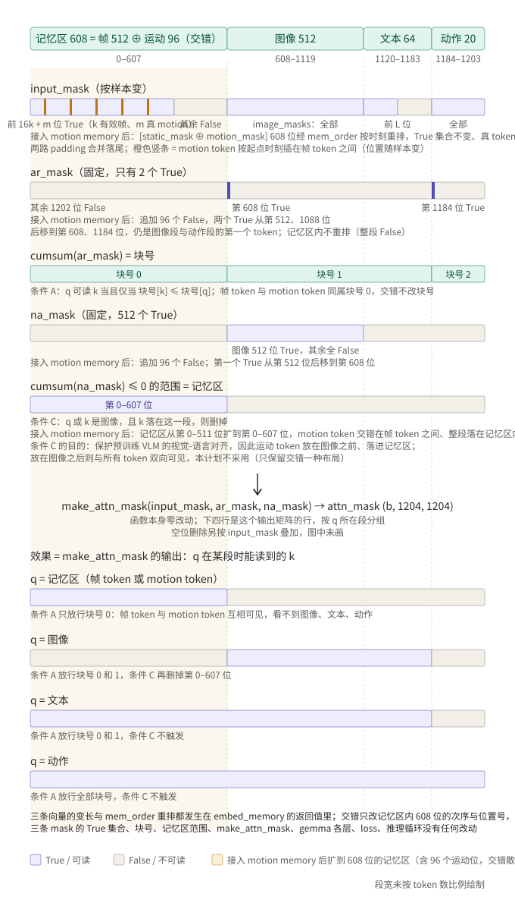
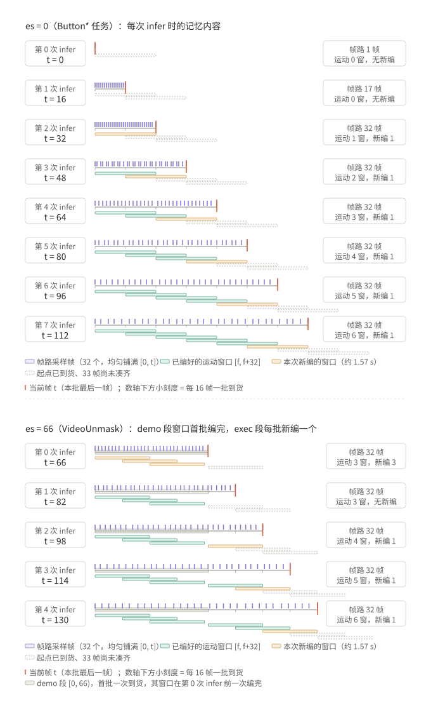
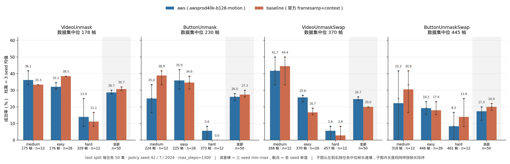

# motion memory：MotionJEPA motion token 接入 MME-VLA HistoryPi0

本文件是现行正本；`motion-memory-plan.md` 与 `motion-memory-interleave.md` 保留为过程档案，冲突以本文为准。

> **适用环境**：本文正文默认**环境 B**（AWS 单机 8 × A100-SXM4-80GB，仓库工作副本 `/scratch/hongze/robomme_policy_learning_MotionJEPA`，判定口径见 [`../AGENTS.md`](../AGENTS.md) 「运行环境判定」）。凡引用环境 A（GreatLakes / turbo + 2 × RTX 6000 Ada）的数字，句子里一律显式标注「环境 A 历史」，且**不与环境 B 数字放同一张表**。
> **代码锚点写法**：全文引用代码只写 `文件::类/函数/配置键`，不写行号（`AGENTS.md` 第 9 条）。

## 目录

1. [结论先行](#一结论先行)
2. [运动窗口口径](#二运动窗口口径前视-33-帧段内绝对网格预算-96)
3. [交错：三条口径与 608 位记忆区](#三交错三条口径与-608-位记忆区)
4. [三层代码：数据层 / 模型层 / 策略层](#四三层代码数据层--模型层--策略层)
5. [训练链路逐跳](#五训练链路逐跳从-h5-到全序列-1204)
6. [推理链路逐跳](#六推理链路逐跳add_buffersidecarkv_cache-与-10-步去噪)
7. [离线 motion 表与建库](#七离线-motion-表与建库)
8. [闸门体系与环境 B 结果](#八闸门体系与环境-b-结果)
9. [生产 run 与评估](#九生产-run-与评估)
10. [已知未知](#十已知未知)
11. [溯源](#十一溯源)

---

## 一、结论先行

**接了什么。** MME-VLA 的 `perceptual-framesamp-context` 原本只有**一路**记忆：`shared/sampling.py::even_sampling_indices` 在 `[0, t]` 上变长间隔选 32 个历史帧，每帧 16 个 4×4 池化的 SigLIP token，共 **512 个 memory token**，描述的是「那一帧长什么样」这种静态外观。本轮并联**第二路**——MotionJEPA 的 `WanLatentMotionEncoder`（前置 Wan VAE 冻结编码）把每个 **33 帧窗口**压成一个 **768 维 motion token**，描述「那一段时间里在发生什么」。运动路固定占 **96 个位置**（`motion.budget`），与帧路的 512 位**按起点时刻交错**排成一段 **608 位**记忆区；prefix 由 1088 → **1184**，全序列由 1108 → **1204**，attention 计算量 +18.08%。新增可训练参数只有两层：`motion_pos_proj = nnx.Linear(256→768)`（197,376）与 `motion_encoder_static = nnx.Linear(1536→2048)`（3,147,776），合计 **3,345,152 ≈ 3.35 M**，与预算无关。总开关是 history YAML 的 `motion.enabled`；关闭时两层根本不创建，训练链路与接入前**逐位相同**。

**训练与推理怎么共享。** 两侧共享三样东西，缺一条就会「不报错、只静默降效果」：

1. **同一套起点网格公式**——段内绝对位置 `0, 16, 32, …`，窗口 `[f, f+32]` 且尾端不越当前帧。训练侧在 `training/framesamp_dataset.py::FrameSampDataset.__getitem__` 里按 `meta/motion_index.json` 查表，在线侧在 `policies/framesamp_memory.py::FrameSampMemory` 里每批 `add_buffer` 后用 `while` 循环把已凑齐 33 帧的起点全部编掉。
2. **同一份排序函数**——`shared/sampling.py::memory_order`，训练侧与在线侧 `import` 同一个函数对象（闸门 M2 显式校验 `is` 成立），产出同一张 `mem_order`。
3. **同一个编码口径**——离线抽表与在线 sidecar 都调 `scripts/dataset/wan/wan_motion_infer.py` 这份整文件复制件的 `encode_chunk` / `motion_token`，起手 `check_env()` + `pin_numerics()`，fp32、关 TF32、33 帧一次喂、batch 恒 1。P5 闸门在环境 B 实测在线现编与离线表 **772 窗逐位相同**（`ONLINE_ENC_BITEXACT=PASS compared=772 mismatches=0`，[`training-doc/aws-p5-online/`](training-doc/aws-p5-online/)）。

**现状结论：三 seed 无差异。** 40k 步 b128 的生产 run `awsprod40k-b128-motion` 已跑完并完成仿真评估。**motion 组与官方 `framesamp+context` 组在三 seed 口径下没有可辨别的差异**——详见第九章的两张分表（环境 B 单 seed 一表、环境 A 三 seed 一表）。本文不写「motion 更好」。之所以要把结论说死在这里：单 seed 版本曾读出「长任务上 motion 占优」的印象，换三 seed 后该优势不成立（commit `c5280e4`）。

**两项闸门此前 FAIL。** 环境 B 复刻中 `A19_VALID_DIST`（400 ep 库上有效数分布期望写死了 40 ep 的数）与 `T3_MOTION_CAUSAL`（`pad_bitexact=0`，唯一变化的叶在同一 obs 连算两次时也变）判 FAIL，原始输出与证据链见第八章；这两项自 commitV7.1 起按新口径重跑，结果落在 [`train-infer-consistency.md`](train-infer-consistency.md)，本文不复述其结论。

---

## 二、运动窗口口径：前视 33 帧、段内绝对网格、预算 96

### 2.1 一个窗口是什么

一个运动窗口 = 从起点 `f` 往后**连续 33 帧** `[f, f+32]`，经 Wan VAE + `WanLatentMotionEncoder` 编成一个 768 维 motion token。方向是**前视**，与 encoder 的训练语义一致（motion 描述「相对锚点 z0 之后发生的运动」）。训练时窗口必须整体落在已发生的历史内，硬约束是**尾端 ≤ 当前帧**，即 `f + 32 ≤ t`。

### 2.2 起点集合：段内绝对网格，每 16 帧一个

起点**钉死在段内绝对位置** `0, 16, 32, …`，不随当前帧平移；当前帧 `t` 只决定网格上哪些起点「已经可见」。步长走独立配置键 `motion.stride`（默认 16），**不自动跟随** `streaming_obs_horizon` 或 `action_horizon`。

16 的依据是**推理阶段一个 action chunk 的执行长度**：`examples/robomme/eval.py::get_action_chunk` 返回 `action_chunk[:exec_horizon]`，`exec_horizon = Args.obs_horizon = 16`（`examples/robomme/utils.py::check_args` 断言 `obs_horizon == 16`；`scripts/training/train.py` 在 `streaming_obs_horizon == 16` 时断言 `action_horizon == 20`）。即模型每次预测 20 步、只执行前 16 步就重新推理；`action_horizon = 20` 是预测长度，不是 chunk 的执行长度。

**demo 段与 exec 段各自成网格、互不延续，窗口一律不跨边界**（latent 也是分段抽的，跨界窗口在库里根本不存在）。设当前样本全 timestep 域帧号为 `t`，该 episode 的 `exec_start_idx = es`：

```
exec 段网格： u = 0, 16, 32, …     合法条件： u + 32 ≤ t − es    且  u < num_chunks_exec
demo 段网格： s = 0, 16, 32, …     合法条件： s + 32 ≤ es − 1     且  s < num_chunks_demo
```

`num_chunks = max(0, 段帧数 − 32)`（demo 段帧数 = `es`，exec 段帧数 = `num_timesteps − es`，**exec 段不截尾**，取 MME-VLA 全长）；`num_grid = ceil(num_chunks / 16) = len(range(0, num_chunks, 16))`。

⚠ **段内偏移 u / s 只用于查 `motion_index.json` 的行号**；一切与帧路发生关系的场合（交错排序键、`motion_pos` 的查表帧号、预算上界检查）一律先换算成**全域帧号 `f`**——demo 段 `f = s`，exec 段 `f = es + u`。exec 段漏加 `es` 不报错，只静默把 exec 段 motion 排进 demo 区；`ButtonUnmask` / `ButtonUnmaskSwap` 两任务 `es = 0` 掩盖不了 Video* 两任务（`VideoUnmaskSwap` 的 demo 段可达 216 帧）。

**k 的公式**（一个样本的合法起点数）：

```
k(g, t) = #{u = 16m : u + 32 ≤ t − es, u < num_chunks_exec}
        + #{s = 16m : s + 32 ≤ es − 1,  s < num_chunks_demo}
```

demo 段那一半与 `t` 无关（整段已见），可在 `__init__` 里按 episode 预计算成定值。

**网格不动、`t` 只推可见边界**：`t` 从 205 走到 206 时，可见起点仍是 `0,16,…,160` 这 11 个，一个都不用重编；要到 `t = 208`（= 176+32）第 12 个起点才进入可见范围。所以离线表小、在线每 16 帧只新编 1 个窗口。

### 2.3 预算 N = 96：零截断，按 16 任务全集定标

**定标原则**：`motion.budget` 以及一切「随数据分布定的容量上限」，一律以 **16 任务完整数据集**（16 任务 × 100 ep = 1600 ep）的统计定标，**不以当前 4 任务训练集**定标。理由两条：4 任务集是全集的窄子集（且这四个恰好都是短 demo 任务），按它定的容量在 scope 扩到全集时必然溢出；两集段长口径同源，4 个共同任务 ep0–99 的 `(num_timesteps, exec_start_idx)` 逐条相同，所以全集统计可直接当上界用。扫描留档：[`dataset-build-doc/16task-h5-scan/`](dataset-build-doc/16task-h5-scan/)。

16 任务全集实测（1600 ep，476,857 个 exec 样本，stride 16 口径）：

```
P25 = 8   中位 = 15   P75 = 25   P90 = 45   P95 = 53   P99 = 69   最大 = 85
均值 19.01   一个合法起点都没有的样本：4.72%
```

| 预算 N | 32 | 48 | 64 | 80 | 85 | **96** |
|---|---|---|---|---|---|---|
| 截断样本数 | 76,225 | 36,613 | 8,213 | 199 | 0 | **0** |
| 截断样本占比 | 15.985% | 7.678% | 1.722% | 0.042% | 0.000% | **0.000%** |
| 平均填充率 | 51.0% | 38.0% | 29.5% | 23.8% | 22.4% | **19.8%** |

零截断的最小 N 是 **85**，由两个 episode 并列顶到：`VideoPlaceOrder` ep4（1411 帧 = demo 1118 + exec 293 → 68 + 17 = 85）与 ep3（1408 帧 = demo 1124 + exec 284 → 69 + 16 = 85）。**取 96 而不是 85** 的理由：96 = 16 × 6，是同时满足「零截断」与「16 的倍数」的最小值（16 × 5 = 80 会截断 199 个样本，全部落在 `VideoPlaceOrder` ep3/ep4 末段）；相对 85 的裕度 12.9%。不取 112 是因为填充率会从 19.8% 掉到 17.0%、每样本交付字节再增 16.6%，而 attention 只再多 2.7%。

**溢出根因是 demo 段而非 exec 段**：`VideoPlace*` 系列 demo 动辄 1000+ 帧，而 demo 段整段已见、与 `t` 无关，贡献的是「从 episode 第 0 步就顶满」的常数项——`num_grid(demo) > 32 ⟺ es > 544`，命中 200/1600 = 12.5% 的 episode（demo 网格 MAX = 70）。exec 网格单独看 MAX = 64、P90 = 32。

**硬地板 64**：即使给 demo 段单独放大 stride 到 32，零截断线也只能从 85 降到 64，再放大不再下降——瓶颈换成 `BinFill` 1044 帧（`ceil(1012/16) = 64`）/ `PickXtimes` 1025 帧（63）的 exec 段。守住「exec 每 16 帧一采 + 零截断」两条，N 不可能低于 64。本方案**不采用 demo 独立 stride**，stride 已冻结。

### 2.4 代价：96 个位置里平均只有 10 个是真数据

这是本方案最需要清醒认识的一点，不藏在技术细节里。当前 4 任务训练集（400 ep 口径）在 N=96 下的实况：

```
P25 = 5   中位 = 9   P75 = 15   P90 = 20   P95 = 23   P99 = 26   最大 = 34
均值 10.08   一个合法起点都没有的样本：6.48%
```

- 运动路固定占 **96 个 memory 位置**，4 任务集上平均只有 **10.08 个**是真 motion token（16 任务全集平均 19.01）；
- 其余约 **86 个位置（89.5%）是 padding**（16 任务全集为 77 个 / 80.2%），靠 `motion_mask=False` 屏蔽；
- **6.48% 的样本一个真 motion token 都没有**（16 任务全集 4.72%），充要条件是 demo 段不足 33 帧且当前样本 exec 段内偏移 `τ = t − es < 32`；这些样本等价于「motion 功能未启用」；
- 分布很偏：P25 只有 5 个真数据，中位 9 个，要到 P90 才有 20 个。

**仍然接受**的原因：这是「零截断 + 按全集定标」的直接代价。要提高填充率只能降预算（丢的是最早的历史）或改用变间隔采样（违背「间隔一个 action chunk」的本意）。三个后果需要在实验中盯住：(1) attention 里 89.5% 的运动位置被 mask，是恒定支出但无信息——形状固定是 JAX jit 的硬约束，省不掉；(2) 早期样本（`t` 小）与晚期样本的运动路信息量差异极大，模型可能学成「按 motion 有效数判断 episode 进度」的捷径；(3) 6.48% 全空样本使得「motion 到底有没有用」的评估**必须至少按全空 / 非空分层看**，整体平均会被全空样本稀释。

### 2.5 当前帧附近的空白：不补

起点钉在绝对网格上、训练样本的当前帧逐帧 dense，所以最近的合法窗口尾端与当前帧之间一般留一段空白。设 `τ = t − es`（训练样本全在 exec 段，`τ ≥ 0`）：

- `τ ≥ 32` 时最靠近当前帧的合法起点 `u_max = 16·floor((τ − 32)/16)`，空白 `gap = (τ − 32) mod 16 = τ mod 16 ∈ [0, 15]`（因为 16 整除 32）；
- `τ < 32` 时 exec 网格为空，最近的窗口落在 demo 段，`gap = τ + 1 + ((es − 33) mod 16)`，最大约 47 帧；demo 网格也空时该样本一个窗口都没有。

定义 **`phase = τ mod 16`**。训练数据逐帧 dense，phase 0–15 都有；稳态 phase 0 的最新 exec 窗口正好结束在当前帧（`gap = 0`），phase 1–15 分别落后 1–15 帧。**在线每执行 16 步才重推一次，重推点恒为 `τ = 0, 16, 32, …`，所以部署 100% 落在 phase 0**，而训练里 phase 0 只约占 1/16。这不是「在线出现了训练没见过的输入」（phase 0 在训练支持集内），但频率不匹配，所以 `T3_PHASE_REPORT` 必须把 phase 0 单列、并把冷启动（`τ = 0, 16` 尚无 exec 窗）与稳态拆开。

**用户已拍板：不补。** 不加网格外的起点（例如紧贴当前帧的 `t−32`），不做钳位回退。凑不齐完整 33 帧窗口的位置就是缺失，走 padding + mask。

### 2.6 段边界 `es`：实际取值与真正的边界数

`es = exec_start_idx` 是 demo 段与 exec 段的分界，也是 `f = es + u` 换算的唯一依据，取自库内 `meta/episode_manifest.json`，绝不从别处推。

**v1 四任务的实测取值**（16 任务全集扫描留档 `records/memory_axis_16task.json`）：`ButtonUnmask` / `ButtonUnmaskSwap` **恒 0**（无 demo 段）；`VideoUnmask` **恒 66**；`VideoUnmaskSwap` **∈ {114, 168, 216}**（min 114 / 中位 168 / max 216）。40 ep 库的 772 窗正是按这四档摊出来的：20 条 `es=0` + 10 条 `es=66` + 3 条 `es=114` + 6 条 `es=168` + 1 条 `es=216`。2.2 里那条告警——「`Button*` 两任务 `es = 0` 掩盖不了 Video* 两任务」——依据就是这组数。

**真正有判别意义的边界数是 544，不是别的**：`num_grid(demo) > 32 ⟺ es > 544`，在 16 任务全集里命中 **200/1600 = 12.5%** 的 episode，正是 2.3 说的「溢出根因是 demo 段」。全集 `es` 的极值是 `VideoPlaceOrder` 的 **1145**（最长 demo 段 → demo 网格 70 窗）。

在线侧对 `es` 有一条专门的状态机（`policies/policy.py::MME_VLA_Policy.add_buffer`，闸门 P4 覆盖）：每 episode 首批接受真实 `es`；`VideoUnmask` 首批传 66 之后，客户端因清空临时 buffer 再传 0 时，**0 按协议解释为「沿用已保存值」**而不是把 `es` 改回 0；后续非零值只有等于 66 才合法，不同则 `raise`。`Button*` 首批与后续均为 0。

### 2.7 预算上限与 1300 步评估的边界：`es = 289` 起 k 超 96

⚠ **289 不是数据里出现过的 `es` 值，是一个推导量**——它是「按当前 1300 步评估口径，`es` 大到多少就会顶穿 `motion.budget = 96`」的临界值。判定由 `scripts/training/tests/eval_rhythm_gates.py` 实测给出（2026-09-07，环境 B，CPU）：

```
ES_BOUNDARY=PASS scanned=[200,320) first_raise_es=289 predicted=289 k_at_288=96 k_at_289=97
  real_es_values=[0,66,114,168,216] real_max_k=92 margin_windows=4
TAU_LONG=PASS cases=2 es=0 tau=1296 k=80 raise=0 order_legal=1 | es=216 tau=1512 k=92 raise=0 order_legal=1
  budget=96 headroom_min=4
EVAL_TERMINATION=PASS max_steps=1300 infer_calls=82 first_batch_included=1 tau_max=es+1296
  last_partial_batch_dropped=1 termination=count_guard
```

**推导过程。** 评估最多跑 **1300** 个环境步、每 **16** 帧决策一次（`examples/robomme/eval.py` 的 `max_steps=1300`、`Args.obs_horizon=16`），所以一集**最晚的决策时刻**是 `τ_max = es + 1296`，全程含首批共 **82 次推理**（最后一个不足 16 帧的批被丢弃，终止方式记 `termination=count_guard`）。在该时刻这个样本的 motion 窗数是

```
k(τ_max) = num_grid(demo, es)  +  num_grid(exec, τ_max − es = 1296)
         = demo 段可见窗数     +  80
```

exec 段那一半是常数 80（`len(range(0, 1296−32, 16)) = 80`），所以 `k` 只随 `es` 增长：**`es = 288` 时 `k` 恰好 96、顶满预算；`es = 289` 时 `k = 97` 超预算**，`FrameSampMemory._prepare_motion` 立刻 `raise`（第七章的零截断契约：合法数大于 `motion.budget` 直接报错、**不做最近 N 裁剪**），而评估驱动会把这一集**静默记成 error**。

**当前四任务安全，余量只有 4 窗。** 实测 `real_es_values=[0, 66, 114, 168, 216]`，最长的 `es = 216` 在 `τ = 1512` 处 `k = 92`，距 96 的**余量是 4 个窗口**（`headroom_min=4`）。也就是说：不改预算、不改 stride 的前提下，本文口径能安全评估的 demo 段长度上限是 `es ≤ 288`。

**这条边界与 2.3 的 `es > 544` 是两回事，不能互相替代**：

| 边界 | 条件 | 含义 | 后果 |
|---|---|---|---|
| **`es > 544`** | `num_grid(demo) > 32` | demo 段单独就顶掉 32 个位置——2.3 说的「溢出根因是 demo 段」，在 16 任务全集里命中 200/1600 = 12.5% 的 episode | 训练侧按预算 96 仍零截断，只是填充率被长 demo 拉低 |
| **`es ≥ 289`** | `num_grid(demo, es) + 80 > 96` | 在 **1300 步评估口径**（`τ_max = es + 1296`）下 demo 窗 + exec 窗合计超预算 | `_prepare_motion` raise，该集被评估驱动静默记成 error |

前者是**训练侧的容量分布问题**（按 2.3 的定标口径已由 N=96 覆盖），后者是**评估侧的运行时硬边界**（由 `τ_max` 这个评估参数决定，与训练分布无关）。scope 扩到 16 任务全集时两条都会被触发：全集 `es` 最大 1145，远超 289。

---

## 三、交错：三条口径与 608 位记忆区

### 3.1 三条已定口径

1. **「帧路不动，只是交错拼接运动路」**——`even_sampling_indices(t, 32)` 一字不改，仍是 32 帧 × 16 token = 512 位；运动路仍是最多 96 个 motion token。（注意：「不动」指采样规则与 token 数值不变，**不承诺**端到端隐藏状态不变——交错会改变帧 token 进入 Gemma 后的 RoPE 位次。）
2. **「按起点 f 插入」**——一个 motion token 描述窗口 `[f, f+32]`，插入位置由**起点** `f` 决定，不按尾端、不按中点。
3. **「运动起点和采样帧号相同时，采样帧在前」**——同一时刻既有采样帧又有 motion 起点时，先放该帧的 16 个 token，再放这个 motion token。

附带一条不需要单独拍板的事实：**两路 padding 一并落到记忆区尾部**，这是排序的自然结果，不是额外要求，也不是正确性所需（「mask 全在尾部」不省任何计算）。

### 3.2 排序键：`key = 2·时刻 + 类型`，一维稳定排序

608 个候选位（帧路 512 + 运动路 96）各配一个**一维组合键**：

- 帧 `i` 的 16 个位置共享 `key = 2·帧号 + 0`；
- motion `k` 记 `key = 2·全域起点帧号 + 1`；
- 两路 padding 记 `+∞`（`np.inf`；用 float64 键，若改用 int 键就得换 `np.iinfo(np.int32).max` 哨兵）。

然后 `np.argsort(key, kind="stable").astype(np.int32)` 得 **`mem_order` (608,) int32**，产出后显式 `raise` 校验 `np.array_equal(np.sort(mem_order), np.arange(608))`。

一维组合键兑现了三条口径：按时刻排即「按起点 f 插入」；类型 `0 < 1` 即「同刻帧在前」；padding 时刻 `+∞` 即「padding 全在尾部」。稳定排序另外保证同帧的 16 位保持内部升序、帧路 padding 排在运动路 padding 之前。（若不用一维组合键而写二元组，`np.argsort` 收不了，只能 `np.lexsort((类型, 时刻))`。）

单点实现在 `shared/sampling.py::memory_order`，**训练侧与在线侧 import 同一份**——两侧各写一份不会报错，只静默让在线看到与训练不同的次序（风险 R20；闸门 M2 校验两个模块引用的是同一个函数对象，P3 / P5 在真实节奏下逐位兜底）。

### 3.3 `mem_order` 的语义

`mem_order` 是 **0..607 的置换**，形状 `(b, 608)`、dtype **int32**（必须是 `at.Int` 而非 `at.Float`——jaxtyping 的 `Float` 白名单不含 int32，写错则开启态第一个 batch 就被 beartype 拒，而关闭态因 `| None` 不触发，会静默到在线阶段）。它**不属于运动路**，是整个记忆区的置换表：模型侧先把两路 token 沿长度轴 concat 成并列序的 `(b,608,2048)`，再用同一张 `mem_order` 对 **token 与 `input_mask` 各做一次 `jnp.take_along_axis`**，把并列序换成时间序。`ar_mask` / `na_mask` 是无 batch 维的 `(L,)` 常量、记忆区 608 位恒 False，**不参与重排**。

`mem_order` 只决定这 608 位怎么摆，不携带任何新的有效性信息——关于 padding 的取值信息仍然只有 `static_mask` 与 `motion_mask` 两条布尔向量。

**并列 vs 交错**，同样 523 个真 token 的两种排法（`t = 200`、`es = 0`、帧路 32 帧全满、运动路 11 个合法起点）：

```
并列（不采用）：[f0 f6 f12 … f200（32×16=512 位）│ m0 m16 … m160（11 位）│ pad×85]
                 位 0–511                          位 512–522        位 523–607

交错（现行）：  f0×16 m0 f6×16 f12×16 m16 f19×16 … f193×16 f200×16 │ pad×85
                 └──────────── 523 个 True，同样的 523 个 token ────────────┘ 位 523–607 False
```

两条规律：motion 落在其起点之后最近的那个采样帧之前（m160 在 f154 之后、f161 之前）；同刻处（起点 0、32、64、96 恰好也是采样帧）帧在前。帧路没填满的样本（`t = 5`，6 帧 96 位、运动路 0 个）两种布局 True 的集合完全相同，区别只是并列方案里帧路自己的 padding 卡在段中间，交错方案里所有 padding 一并排到尾部。

### 3.4 mask 轴



全序列 1204 位上三条 mask 的取值：

- **`input_mask`** 是唯一随样本变化的一行。记忆区 608 位经 `mem_order` 重排后，**前 `16k + m` 位为 True**（`k` 是有效帧数、`m` 是采到的真起点数），其后 `608 − 16k − m` 位为 False——不再有「帧路 padding 卡在段中间」。文本段前 `L` 位 True，图像和动作全 True。
- **`ar_mask`** 全序列只有两个 True：第 608 位（图像段第一个 token）和第 1184 位（动作段第一个 token）。记忆区 608 位全 False。对 `ar_mask` 累加得块号：记忆区（帧 token 与 motion token 同属）块号 0，图像和文本块号 1，动作块号 2。
- **`na_mask`** 只有图像段 512 位为 True，位置是第 608–1119 位。第一个 `na=True` 之前的范围正好是第 0–607 位，即交错后的整个记忆区——这条规则让**图像看不到记忆区**。

块号规则合起来的效果：记忆只看记忆；图像看图像与文本、看不到记忆；文本看记忆、图像、文本；动作看一切。

`make_attn_mask(input_mask, ar_mask, na_mask)` 的三项（块号规则、`valid_mask = input_mask[:,None,:] ∧ input_mask[:,:,None]` 外积、`mask_not_attend`）**对记忆区内部的置换都等变**，所以交错不改这张表的 True 集合。padding 位整列 False，在 gemma 的 `where(mask, logits, −2.3819763e38)` → `softmax` 里权重严格为 0（`exp(−2.38e38)` 精确为 0，不是很小的正数），对任何输出零贡献。

### 3.5 交错到底改了什么

数学上：transformer 每一层对 token 顺序**置换等变**——把 token 行、它的 mask 行列、它的位置号一起换顺序，每个 token 算出来的向量不变。loss 只读 action 那 20 行，那 20 行不动。**所以物理交错本身没有效果，效果全部来自「换了位置号」**，进入计算的位置只有 `_apply_rope` 那两行（训练一次、推理前缀 pass 一次）。`positions = cumsum(input_mask) − 1`，padding 位不推进计数；旋转后 `q_i · k_j` 只取决于 `positions[i] − positions[j]`，所以交错只改三类序号之差：记忆区内部两两之差、文本到各记忆 token 之差、动作到各记忆 token 之差（图像被 `na_mask` 挡住，看不到记忆区）。

计算量：attention 仍是 1204 × 1204，padding 个数相同，jit 编译形状相同，kv_cache 形状相同。多出的两步——numpy 里 608 个元素的一次排序、GPU 上每样本约 2.5 MB（608 × 2048 × 2 B）的一次搬运——相对 1204² 的 attention 可忽略。

数值上：交错与并列**不逐位**，两个原因——位置号不同（语义差异，本来就该不同）、行序不同导致浮点累加顺序变。因此两者之间不做等价对拍；等价对拍只做一条：**motion 关闭态对接入前逐位相同**。

---

## 四、三层代码：数据层 / 模型层 / 策略层

三层的分工：**数据层**负责把离线表变成四个交付键并算出 `mem_order`；**模型层**负责把四个键变成 608 个 2048 维记忆 token 并按 `mem_order` 重排；**策略层**负责在线把边跑边攒的帧变成与训练同源的四个键。

### 4.1 数据层

| 文件 | 锚点 | 职责 |
|---|---|---|
| `src/mme_vla_suite/datastore/motion_store.py` | `LAYOUT` / `MotionMeta` / `MotionStore` | 离线 motion 表的读取与契约校验。`LAYOUT = "motion-768-grid16-v1"`，常量 `MOTION_ROW_SHAPE=(768,)`、`MOTION_DTYPE=np.float32`、`MOTION_ROW_BYTES=3072`、`WINDOW_FRAMES=33`、`GRID_STRIDE=16`、`GRID_ORIGIN="segment_start"`、`WINDOW_DIRECTION="forward"`、`TRUNCATION_POLICY="none"`、`FRAME_SIZE=256`。表只有几 MB（400 ep 库 20.0 MiB），**整表 `np.fromfile` 读进 worker 进程**，不走 `FrameSampStore` 的 pread 游程合并；仍照抄它的三条纪律：记 `_owner_pid`、`__reduce__` 直接 raise 禁 pickle、跨进程懒构造。网格公式也定义在这里、写读三方同式：`seg_num_chunks(L) = max(0, L−32)`、`seg_num_grid(L) = len(range(0, num_chunks, 16))`、`segment_lengths`、`segment_grid_starts`、`visible_motion_rows(entry, t)`、`max_visible_count(entry)`。`MotionMeta` 字段：`root / raw / status / num_rows / manifest_sha256 / manifest_path / motion_index_sha256 / table_sha256 / entries / provenance`。 |
| `src/mme_vla_suite/datastore/framesamp_store.py` | `StoreMeta` / `FrameSampStore.read_image_rows` / `pos_rows` / `state_rows` | 帧路离线表，**本轮零改动**。运动路只借用它的 `pos_rows` 取起点帧的时间码。 |
| `src/mme_vla_suite/training/framesamp_dataset.py` | `FrameSampDataset.__init__` 的 `_req` 断言、模块级 `_NONE_KEYS`、`__getitem__`、`_pad_motion`、`_ensure_motion_store` / `__getstate__` | 交付四个新键。`_req` 新增 `motion.*` 形制断言（显式 `raise`，禁 `assert`——`PYTHONOPTIMIZE=1` 会剥离 `assert`）：`motion.dim == MOTION_ROW_SHAPE[0]`(768)、`budget == 96`、`pos_dim == pos.input_dim // 3`(256)、`stride == GRID_STRIDE`(16)、`window_frames == WINDOW_FRAMES`(33)、`window_direction == "forward"`、`grid_origin == "segment_start"`、`frame_size == 256`；**关闭态只判 `enabled`、不判子键**（旧 YAML 缺整节照跑）。`__init__` 另遍历全部 entry 做**零截断预检** `max_visible_count(e) > budget` → raise（禁止最近 N 裁剪）；motion 开启时**拒绝 subset 迷你库**。spawn 生命周期：`__getstate__` 把 `_store` 与 `_mstore` 一并置 None，worker 内按 `owner_pid` 懒构造。 |
| `src/mme_vla_suite/training/dataloader.py` | `_create_framesamp_dataset`、`_motion_gates` | 启动前的**双 store 同源硬闸**：framesamp 走 `StoreMeta.load`、motion 走 `MotionMeta.load`（不得拿前者解析 motion layout），各自三闸（无 pack lock / meta 可读 / `status=verified`）后交叉核 `manifest_sha256` 相同、`motion_index.json` 每个 entry 与 `episode_manifest.json` 按 `g` 逐项比 `h5_file / raw_ep_idx / num_timesteps / exec_start_idx`、`row_base` 连续、`num_grid` 合公式、`totals` 与表行数一致；并核 `motion.stride == GRID_STRIDE`。任一不符在 worker 启动前 fail-loud。 |
| `src/mme_vla_suite/shared/sampling.py` | `even_sampling_indices`、`pad_times`、`memory_order`，模块常量 `MEM_ORDER_SENTINEL = np.iinfo(np.int32).max` | 三个纯 numpy 函数（**import 面只有 numpy**，硬约束：worker 导入链上不能拉起 flax/jax）。`even_sampling_indices(step_idx, token_budget)` 帧路选帧，函数体**逐字符未动**；`pad_times(times, budget)` 把 ≤ budget 个真实全域时刻右填充成 `(budget,) int64`、padding 位记哨兵（超 budget 或真实时刻撞哨兵均 raise）；`memory_order(frame_times, tokens_per_frame, motion_times)` 产 `mem_order`。训练与在线 **import 同一份**。 |
| `src/mme_vla_suite/training/config.py` | `RoboMMEDataConfig.create` 的 `RepackTransform` | 补四条恒等映射。这是旧版漏项：`RepackTransform.__call__` 是 `jax.tree.map(lambda k: flat_item[k], self.structure)`，输出**只由 structure 决定**，未登记的键会被**静默丢弃而不报错**。 |
| `scripts/training/compute_norm_stats.py` | 模块级 `_NONE_KEYS` | 与 `framesamp_dataset._NONE_KEYS` 同 commit 补齐四键（它复用同一个 `RepackTransform`，不补则关闭态也 `KeyError`）。 |

### 4.2 模型层

| 文件 | 锚点 | 职责 |
|---|---|---|
| `src/mme_vla_suite/models/config/robomme/perceptual-framesamp-context.yaml` | `motion` 节 | 关闭态 YAML，`motion.enabled: false`。 |
| `src/mme_vla_suite/models/config/robomme/perceptual-framesamp-context-motion.yaml` | `motion` 节 | 开启态 YAML，`motion.enabled: true`，其余键与关闭态**逐项相同**。两份不可变 YAML，**禁止在同一文件上来回改开关**。 |
| `src/mme_vla_suite/models/integration/history_observation.py` | `HistAugObservation` 五处（字段声明、`from_dict`、`to_dict`、`from_base_obs`、模块级 `preprocess_observation`） | 四个新字段：`motion_emb` `at.Float[..., "b l4 d4"] \| None`、`motion_pos` `at.Float[..., "b l4 d5"] \| None`、`motion_mask` `at.Bool[..., "b l4"] \| None`、`mem_order` `at.Int[..., "b l5"] \| None`。`l4 = 96`、`d4 = 768`、`d5 = 256`、`l5 = 608`；**`l5` 必须新开维名**，不得复用 `l1`（=512）或 `l4`（=96）——`@at.typecheck` 把全部字段塞进同一个 jaxtyping memo，同名维必须同值。 |
| `src/mme_vla_suite/models/integration/history_pi0.py` | `HistoryPi0Config.inputs_spec` | **仅当 `motion.enabled`** 时补四个 `jax.ShapeDtypeStruct`，全部从 config 键推导、不写死字面量。 |
| 同上 | `HistoryPi0.embed_memory` | 交错的落点：把三个 motion 键传进 `PerceptualMemory.__call__`；`input_mask = concat([static_mask, motion_mask])`；两次 `jnp.take_along_axis`（token 用 `mem_order[:, :, None]`、mask 用 `mem_order`，`axis=1`）；`ar_mask` / `na_mask` 由 `[False] * tokens.shape[1]` 生成、长度自动跟随、**不重排**。gather 前有**形状闸**（显式 `raise` 校验 `mem_order.shape[1] == tokens.shape[1] == input_mask.shape[1]` 且 dtype int32——长度写错时 `take_along_axis` 不报错，会静默把记忆区截成 `mem_order` 的长度）与**非 None 闸**。关闭态守卫是 `if not self.mem_encoder.motion_enabled:` 的**编译期 Python 分支 + 早返回**，禁止 `jnp.where` / 恒等 gather 旁路。 |
| 同上 | `embed_prefix` / `compute_loss` / `sample_actions` | **不动**——`embed_prefix` 只把 `embed_memory` 的四元组 append 进列表，长度变化自动透传；`context` 分支不碰 `embed_memory` 之外的东西。`expert` / `modulation` 两个 `integration_type` 本轮**不接 motion**。 |
| `src/mme_vla_suite/models/representation/percep_mem.py` | `PerceptualMemory.__init__` / `__call__` | **条件**新建两个 `nnx.Linear`，且必须建在 `self.feature_encoder` **之后**——nnx 单条 default RNG 流按调用顺序 `fold_in`，插在前面会改掉帧路的初始化值。`__call__` 多运动路分支：`pos_h = nnx.silu(motion_pos_proj(motion_pos))` → 与 `motion_emb` concat 1536 → `motion_encoder_static` → 与帧路 `jnp.concatenate(..., axis=1)` 返回**并列序** `(b,608,2048)`，**重排不在这里做**。`motion.enabled=false` 时两层根本不创建（177 叶 → 193 叶，差 16 = params 4 + ema 4 + opt_state 8）。 |
| `src/mme_vla_suite/models/representation/mem_encoder.py` | `FeatureEncoder.encode_perceptual_memory` / `_add_pos_emb` | **一字不动**（复用会共享 `use_pos_emb` 分支与参数树）。帧路的 `pos_h = silu(pos_proj(static_pos_emb))` → concat 2816 → `encoder_static` 就在这里；`use_state_emb=false` 时 `state_proj` 结构上不创建。 |
| `scripts/training/train.py` | `init_history_config` | 每个新 run 在 checkpoint run 根写 `history_config.txt`（源文件名标签）、`history_config.resolved.yaml` + `.sha256`（实际解析结果与原始字节 sha）、`motion_provenance.json`（`motion.enabled`、framesamp manifest sha256；open run 另填 motion manifest / `motion_index_sha256` / motion store meta sha 与 VAE、encoder provenance，closed run 对 motion-only 字段写 `null`，禁止省键）。 |

**开关的唯一同源判定式**是 `history_pi0.py` 的模块级函数 `_motion_enabled(history_config)`，被 dataset、`PerceptualMemory`、`inputs_spec` 三处共用；`HistoryPi0.__init__` 另有两条显式 `raise`：`_motion_enabled(config) != mem_encoder.motion_enabled` 即拒，`motion_enabled and integration_type != "context"` 即拒（`expert` / `modulation` 两分支本轮不接 motion）。

新参数名**不得含 `img`**——freeze filter `HistoryPi0Config.get_freeze_filter` 返回 `PathRegex(".*img.*")`，含 `img` 会被误冻结并强转 bf16。两个新层挂在 `mem_encoder` 下（路径形如 `mem_encoder.motion_encoder_static`），当前不匹配冻结正则 → **默认可训练**；即使日后启用 lora（`Any(All(".*llm.*", Not(".*lora.*"), Not(".*mem.*")), ".*img.*")`），含 `mem` 的路径恰被 `Not(".*mem.*")` 排除出冻结集 → 仍可训练。

### 4.3 策略层（在线）

| 文件 | 锚点 | 职责 |
|---|---|---|
| `src/mme_vla_suite/policies/policy.py` | `MME_VLA_Policy.__init__` / `add_buffer` / `infer` / `_prepare_history` / `reset` | 起 sidecar 子进程、下传 `exec_start_idx`、组装四个键。`_prepare_history` 补 `inputs["motion_emb"]` / `["motion_pos"]` / `["motion_mask"]` / `["mem_order"]`。 |
| `src/mme_vla_suite/policies/framesamp_memory.py` | `FrameSampMemory.add_buffer`、`prepare_frame_sampling` / `_prepare_frame_sampling`、`_prepare_motion`，及测试可见状态 `_history_feats_motion` / `_next_grid_start_demo` / `_next_grid_start_exec` / `_raw_frames` / `exec_start_idx` | 每批帧入库、增量编窗、组装运动路。`_prepare_motion` **另起一个方法**，不塞进 `_prepare_frame_sampling`——该函数注释明记「只换模块、不换数值路径」，不得改动。 |
| `src/mme_vla_suite/policies/motion_client.py` | `MotionEncoderClient` | 只依赖 numpy 与标准库，持 `threading.Lock`，把 33 帧发给 sidecar、收回 768 维向量。编码接口契约：`motion_enc_fn(frames: np.ndarray[(33,256,256,3), uint8, C 连续]) -> np.ndarray[(768,), float32]`；`FrameSampMemory` 只认接口不认实现。 |
| `src/mme_vla_suite/policies/motion_protocol.py` | 协议公共件 | **只 import stdlib**。统一小端；8 字节 magic 直接编码协议版本（v1 固定 `b"MMEMOT01"`）；握手 = uint32 长度 + JSON provenance；请求 = 8 字节 versioned magic + uint32 长度 + int64 起点全域帧号 + 33×256×256×3 原始 uint8（payload 精确 **6,488,064 B**）；响应 = uint32 状态 + 768×4 字节 f32（精确 **3,072 B**）。父子两侧共用 `_recv_exact(sock, n, deadline)`，按同一 monotonic 总 deadline 循环 `recv_into` 直到恰好 n 字节，禁止一次 `recv(n)` 假设。 |
| `scripts/dataset/wan/motion_sidecar.py` | `main` / `--stub` 档 | 编码子进程。跑在 **wan 子 venv**（`v1-store/venvs/wan`，torch 2.9.0+cu128 / diffusers 0.39.0），主 venv 是 torch 2.7.1，两者**无法同进程加载**——这就是要 sidecar 的原因。`--stub` 档不加载模型、不 import torch，按约定解出起点帧号并返回 `np.full(768, f, np.float32)`，供 P1–P4 走完整 IPC 路径。 |
| `src/mme_vla_suite/policies/policy_config.py` | `create_trained_policy` | 对带快照的新 run 只读 run 内 `history_config.resolved.yaml`，先核 sha 与 provenance，再据此构造模型；closed / open 新 run 都调 `BaseModelConfig.load(..., remove_extra_params=False)` 并要求 missing / extra 参数集合**均为空**。任何带 motion 参数的 checkpoint 缺 resolved 快照 / provenance，或快照声称关闭但 checkpoint 带 motion 参数，均**拒绝加载**。 |

---

## 五、训练链路逐跳：从 h5 到全序列 1204

本章从原始数据一路走到 attention，每跳标形状、dtype 与「这一跳有没有改数」。跟两个样本：**帧路取 `(g, t=5)`**（历史不足，帧路 padding）、**运动路取 `(g, t=200)`**（帧路满 32 帧、运动路 11 个起点）；两样本都取 `es = 0`。两路不能用同一个 `t`——帧路 `t ≥ 31` 起恒满 32 帧，而运动路 `t ≥ 32` 才有第一个合法起点，同一时刻两路不会同时出现部分填充。

### 5.0 离线段：h5 → Wan latent → motion token 表

```
原始 h5（front_rgb, uint8）
   │  按段切：demo [0, es)、exec [es, T)；每段网格起点 0,16,32,…，每起点取 33 帧
   │  scripts/dataset/wan/extract_wan.py（wan 子 venv，fp32、关 TF32、33 帧一次喂、B=1）
   ▼
Wan VAE 冻结编码 → 每窗 latent (9,16,32,32) f32 = 589,824 B
   │  落 <lib>/wan-latents/<Task>_ep<j>_{exec,demo}.bin + .sha256 + metadata.json
   │  scripts/dataset/wan/encode_motion.py → 复制件 wan_motion_infer.motion_token
   ▼
WanLatentMotionEncoder 冻结 → 每窗 (768,) f32
   │  scripts/dataset/pack_motion_store.py pack|verify
   ▼
<lib>/motion/motion_token.f32.bin （N 行 × 3,072 B）+ meta/{store_meta.json, motion_index.json, row_digests.blake2b.bin}
```

这一段全部在训练环外，只跑一次。详见第七章。

### 5.1 dataloader：`FrameSampDataset.__getitem__`（numpy / CPU，worker 进程内）

**第一站——这个时刻能取到多少真数据。**

- 帧路：`even_sampling_indices(step=5, token_budget=32)`，`step_idx < token_budget` 走 `range(step+1)` 分支返回 `[0,1,2,3,4,5]`，`n = 6`；`t ≥ 32` 走 `linspace(0, t, 32)` 分支恒返回 32 个（`t = 31` 两分支等值），所以**帧路 padding 只出现在每条 episode 的前 31 帧**。
- 运动路：`t = 200`、`es = 0` 时 `f ≤ 168`，合法起点 `0, 16, …, 160` 共 `k = 11` 个，缺 85 个。同一条 episode 在 `t = 5` 时 `k = 0`，96 位全是 padding。

**第二站——逐帧 / 逐起点取单帧特征，行数随真数据个数变。**

帧路 6 个帧号先加 `row_base[g]` 得全局行号，再三次查表：

| 键 | 调用 | 形状 | dtype | 字节 |
|---|---|---|---|---|
| img | `FrameSampStore.read_image_rows(rows)` | `(6, 16, 2048)` | bf16 | 393,216 |
| pos | `FrameSampStore.pos_rows(frames_arr)` | `(6, 16, 768)` | f32 | 294,912 |
| stt | `FrameSampStore.state_rows(rows)` | `(6, 8)` | f32 | 192 |

运动路 11 个起点先换算成全域帧号（exec `es + u`、demo `s`），再：

| 键 | 来源 | 形状 | dtype |
|---|---|---|---|
| motion 行 | `motion_token.f32.bin`，按 `(段, 网格序号)` 定位 `row = row_base + m`，`seek(row × 3072)` 读 1 行 | 每起点 `(768,)` → 堆成 `(11, 768)` | f32 |
| motion_pos | 同一张 `pos_rows`，取起点帧那行的 `[0, :256]` | 每起点 `(256,)` → 堆成 `(11, 256)` | f32 |

`motion_pos` 是**纯切片、不做算术**：`pos_emb_4x4.f32.bin` 按全 timestep 域逐帧存一行 `(16, 768)` f32，由 `shared/posemb_3d.py::PosEmb3D(dim=768)` 对 `arange(全域帧数)` 一次性预计算。768 维的内部构成（`dim // 6 = 128`）是

```
768 = [ 时间 sin 128 | 时间 cos 128 | y sin 128 | y cos 128 | x sin 128 | x cos 128 ]
       └── 前 256：帧号 t 的时间编码，同一帧 16 行完全相同 ──┘└─ 后 512：4×4 网格点，16 行各不同 ─┘
```

取 `[0, :256]` 就是该起点帧的**时间编码**。运动路需要它的原因：motion token 只描述「窗口里发生了什么」，不含「发生在什么时候」；窗口长度固定 33，编了起点就编了整个窗口。**不带 xy** 的三条理由：(1) 一个 motion token 描述整幅画面 33 帧的运动，本来就没有空间位置；(2) 沿 16 轴取均值凑 768 维的方案不成立——均值的空间部分对频率 ω 等于中心 (8,8) 的位置码乘幅值 `a(ω) = (cos 2ω + cos 6ω)/2`，128 档频率里约 40 档被打乱（ω=0.5 时 `a ≈ −0.23` 反号），向量不在单位圆上，既不是任何合法位置码也不是明确的「无位置」标记；(3) 若保留 768 维输入，`motion_pos_proj` 里对应 xy 的 512×768 = 393,216 个权重只见过同一个常数向量，整块退化成冗余 bias。去掉 xy 后输入维 256，权重 197,376，全部有效。

**第三站——补齐到固定长度并记 mask。**

帧路走 `FrameSampDataset._pad(img, pos, stt, n=6)`：按 `_max_frames = 32` 一次性 `np.empty` 预分配，`out[:6]` 放真数据、`out[6:] = 0`，三键同式；`mask = np.zeros(32, bool); mask[:6] = True`。

运动路走**另写的** `_pad_motion`，目标长度是配置项 `motion.budget = 96`，**不复用 `_pad`**（后者目标长度是类内常量、签名是 img/pos/stt 三键，运动路只有两键，长度语义与签名都不同）。它还要顺手产出每行对应起点的全域时刻（padding 行记哨兵）供第四站排序用。

| 键 | 形状 | dtype | 第 0–10 行 | 第 11–95 行 |
|---|---|---|---|---|
| motion_emb | `(96, 768)` | f32 | 11 个起点的 token，按时间序 | 全 0 |
| motion_pos | `(96, 256)` | f32 | 11 个起点帧的时间码 | 全 0 |
| motion_mask | `(96,)` | bool | True | False |

填 0 的 dtype 不需要特判：bf16 与 f32 的 0 位型都是全零字节，新旧链路对拍可以逐字节比。**填 0 本身不是屏蔽手段**——模型不是靠「看到 0」来忽略这些位置的，真正起作用的是第 5.3 节起的 mask。

**第四站——帧路摊平、两路排序。**

帧路一帧 16 个 token：`(32,16,2048).reshape(-1, 2048)` → 512 位，mask 跟着 `np.repeat(mask, 16)` → `(512,)`。运动路一个起点就是一个 token，`(96,)` 的 `motion_mask` 天然是 token 级，**没有这一步**。

然后按 3.2 的键做一次 `np.argsort(kind="stable")` 得 `mem_order (608,) int32`，并显式 `raise` 校验它是 `0..607` 的置换。`t=5` 样本：96 个真帧位按帧号占 0–95，其余 512 位 padding 占 96–607；`t=200` 样本：512 帧位与 11 个 motion 按时刻交错占 0–522，85 个 padding 占 523–607。

**交付给 collate 的完整键集（四个 motion 新键加粗）：**

| 键 | 形状（单样本 / batch） | dtype | 说明 |
|---|---|---|---|
| `static_image_emb` | `(512,2048)` / `(b,512,2048)` | bf16 | 帧路外观特征 |
| `static_pos_emb` | `(512,768)` / `(b,512,768)` | f32 | 帧路 3D 位置编码 |
| `static_state_emb` | `(512,8)` / `(b,512,8)` | **f64** | `_normalize_state` 的 q01/q99 是 f64，输出恒 f64（512×8×8 = 32,768 B）；`use_state_emb=false`，随行交付**不进链路** |
| `static_mask` | `(512,)` / `(b,512)` | bool | 帧路有效位 |
| **`motion_emb`** | `(96,768)` / `(b,96,768)` | **f32** | 运动路 token，padding 行填 0 |
| **`motion_pos`** | `(96,256)` / `(b,96,256)` | **f32** | 起点帧时间码，padding 行填 0 |
| **`motion_mask`** | `(96,)` / `(b,96)` | **bool** | padding 位 False |
| **`mem_order`** | `(608,)` / `(b,608)` | **int32** | 0..607 的置换 |

每样本交付字节 **+395,648 B ≈ 386 KiB**（`motion_emb` 294,912 + `motion_pos` 98,304 + `mem_order` 2,432；`motion_mask` 96 B 未计），相对原来的 3.53 MiB = 3,703,296 B **+10.7%**；batch=64 时每批额外 +25.32 MB，打在 worker→主进程 pickle 管道上约 +9.9%。**读盘 +0**——motion 表整表常驻 worker 内存。

### 5.2 transforms：`RepackTransform` 与 norm stats

`training/config.py::RoboMMEDataConfig.create` 的 `RepackTransform` 必须为四个新键各补一条**恒等映射**。这是最容易漏、且漏了不报错的一环：`RepackTransform.__call__` 是 `jax.tree.map(lambda k: flat_item[k], self.structure)`，输出只由 `structure` 决定，未登记的键**静默丢弃**。关闭态四键为 None → pytree 空节点 → `n_keys` 仍 12；开启态带数组透传 → `n_keys = 16`。`scripts/training/compute_norm_stats.py` 的模块级 `_NONE_KEYS` 复用同一个 `RepackTransform`，必须同 commit 补齐四键，否则**关闭态也会 KeyError**。

`policies/robomme_policy.py::RoboMMEInputs.__call__` 补四个 `data.get(..., None)`，与四个 `static_*` 写法同构。

### 5.3 `embed_memory`：两路投影 → 并列 concat → 一次 gather

`models/integration/history_pi0.py::HistoryPi0.embed_memory`（jit 内，GPU），**对 padding 位不做任何分支**：

```
帧路：static_pos_emb (b,512,768)
        → pos_proj = nnx.Linear(768→768)［W 768×768, b 768，可训练］ → nnx.silu → (b,512,768)
        → 与 static_image_emb (b,512,2048) 在最后一维 concat → (b,512,2816)
        → encoder_static = nnx.Linear(2816→2048)［W 2816×2048, b 2048，可训练］ → (b,512,2048)

运动路：motion_pos (b,96,256)
        → motion_pos_proj = nnx.Linear(256→768)［W 256×768, b 768，可训练］★新参数 → nnx.silu → (b,96,768)
        → 与 motion_emb (b,96,768) concat → (b,96,1536)
        → motion_encoder_static = nnx.Linear(1536→2048)［W 1536×2048, b 2048，可训练］★新参数 → (b,96,2048)

并列 concat（长度轴）：memory (b,608,2048)
                       input_mask = concat([static_mask, motion_mask], axis=1) → (b,608) bool
★重排：tokens     = jnp.take_along_axis(tokens, mem_order[:, :, None], axis=1)
       input_mask = jnp.take_along_axis(input_mask, mem_order, axis=1)
       → 形状不变，True 恰好占前 16k+m 位
       ar_mask / na_mask 由 [False] * tokens.shape[1] 生成，(L,) 无 batch 维常量，不重排
```

`embed_memory` 的开启态分支实际只有四行：`input_mask = jnp.concatenate([obs.static_mask, obs.motion_mask], axis=1)`、两次 `jnp.take_along_axis`、`ar_mask = na_mask = [False] * tokens.shape[1]`；关闭态是 `if not self.mem_encoder.motion_enabled:` 的**编译期早返回**，直接返回 `(tokens, obs.static_mask, [False]*512, [False]*512)`。

两列互为镜像：都是「特征 ⊕ 位置编码 → `nnx.Linear` + `nnx.silu` → concat → 一个 `nnx.Linear` 压到 2048」。区别只在输入粒度——帧路一帧出 16 个外观 token，运动路一个 33 帧窗口只出 1 个。两者终点都是 2048（gemma 隐层宽度），帧路恰好是压缩、运动路恰好是扩张，这只是特征本体宽度不同，不是设计取舍。**投影互不共享**：两路参数树互不沾边，只共享 `pos_emb_4x4` 这张只读底表——这也是 `motion.enabled=false` 能逐位退回的前提。

补齐的零行照样过这两层，出来是 bias 决定的**非零**向量；模型此刻分不出哪些是真的。

### 5.4 `compute_loss`：三段拼成 1204，mask 与位置号

```
input_mask = concat([mem 608 | img 512 + prompt ≤64 | action 20], axis=1) → (b,1204) bool
positions  = cumsum(input_mask, axis=1) − 1 → (b,1204) int32   （padding 位不推进）
attn_mask  = make_attn_mask(input_mask, ar_mask, na_mask) → (b,1204,1204) bool
```

prefix 段的构成与总长：

| 段 | token 数 | 说明 |
|---|---|---|
| 记忆区 | **608** | 帧路 512 + 运动路 96，按 (时刻, 类型) 交错 |
| 图像 | 512 | `base_0_rgb` 与 `left_wrist_0_rgb` 各 `(b,256,2048)` |
| 文本 | ≤ 64 | `tokenized_prompt`；本 run `discrete_state_input=False`，prompt 里没有 256 桶 state 串 |
| **prefix 合计** | **1184** | 原 1088 |
| suffix（动作） | 20 | pi05=True，无 state token；`obs.state` 只被取 shape 当 batch 载体，数值全程不进模型 |
| **全序列** | **1204** | 原 1108，attention 1204² |

`make_attn_mask` 四步：`cumsum(ar_mask)` 得块号 → `attn_mask[q,k] = 块号[k] ≤ 块号[q]`；`valid_mask = input_mask[:,None,:] ∧ input_mask[:,:,None]`；`mask_not_attend`（图像不看记忆区）；三项按位与。`t=5` 样本第 96–607 列整列 False，`t=200` 样本第 523–607 列整列 False。

### 5.5 gemma 内部与反向

`src/openpi/models/gemma.py::Attention.__call__`：

```
logits = q · k                                     (b, heads, 1204, 1204) f32
masked = where(attn_mask, logits, −2.3819763e38)   False 格子换成 f32 最小值
probs  = softmax(masked, axis=-1)                  exp(−2.38e38) 精确为 0
out    = probs @ v                                 padding 位的 value 乘 0，对输出零贡献
```

整件事收口在这里：padding 位的零向量确实经过了 `motion_pos_proj` / `motion_encoder_static`，算出了非零的 key 和 value，但**没有任何 query 能给它非零权重**。交错在这一站唯一留下的痕迹是 `_apply_rope` 吃到的记忆区位置号。

反向：`take_along_axis` 可微，梯度按同一张 `mem_order` 搬回并列顺序，再分别流向帧路与运动路的投影。SigLIP 不更新，其余参数全部更新。

### 5.6 一句话对照：改动前 vs 改动后

| 项 | 改动前 | 改动后 | 增幅 |
|---|---|---|---|
| 记忆区 token 数 | 512 | **608** | +18.75% |
| prefix 总长 | 1088 | **1184** | +8.82% |
| 全序列 | 1108 | **1204** | +8.66% |
| attention 计算量 O(L²) | 1108² | 1204² | **+18.08%** |
| 每样本交付字节 | 3,703,296 B | +395,648 B | +10.7% |
| 新增可训练参数 | — | 3,345,152 ≈ 3.35 M | 可忽略 |
| 记忆区之后 token 的 RoPE 位置右移量 | — | 等于本样本的**有效 motion 数 m**（0 ≤ m ≤ 96），**不是固定 96** | — |

最后一行值得单独强调：`positions = cumsum(input_mask) − 1`，padding 位不占号，所以右移量是逐样本变的 `m`（4 任务 400 ep 均值 10.08）；而且交错使记忆区内部 608 个位置号按时刻重排，不只是整体平移。

---

## 六、推理链路逐跳：add_buffer、sidecar、kv_cache 与 10 步去噪

推理没有离线特征库，记忆是边跑边攒的。帧**成批到货**：episode 开局第一批是整段 pre_traj（demo `[0, es)` 加 exec 首帧 `es`），之后每 16 个环境步一批（`examples/robomme/eval.py::get_action_chunk` 每 `obs_horizon = 16` 步调一次 `add_buffer` 再调一次 `infer`）。所以 **infer 只发生在 `τ = t − es = 0, 16, 32, …` 的时刻**。



### 6.1 阶段一：`MME_VLA_Policy.add_buffer` → `FrameSampMemory.add_buffer`

| 步 | 做什么 | 与训练的关系 |
|---|---|---|
| a | 归一化与缩放（整批一起做） | 同离线抽表脚本 |
| b | `module_jit(HistoryPi0.vision_encode)` 里的 `PaliGemma.img` 整批一次前向 | 同一个 SigLIP、同一份权重 |
| c | `pool_tokens_to_size(…, 16)` | 同一档 4×4 池化 |
| d | `PosEmb3D` 预计算表取各帧一行 | 与离线 `pos_emb_4x4` 表同算法同输入，两侧逐位同表 |
| e | 存字典 `_history_feats[step]` | 训练存离线表，推理存内存；一帧一条 |
| ★ | **另存一份 256 域原始帧** `_raw_frames`，然后编运动窗 | 见下 |

**为什么要另存 256 域原图**：现有 `add_buffer` 把 `images` 经 `resize_with_pad` 成 224 后就丢了原图，而 Wan VAE 要 **256 域**。新缓冲保留「自 `next_grid_start` 起到当前帧」的全部帧；入库前 `raise` 校验 `images.shape[-3:] == (motion.frame_size, motion.frame_size, 3)`，且 `motion.frame_size` 必须 `== motion_store.FRAME_SIZE`。首批峰值是整段 demo 一次到货（v1 最坏 `es = 216` → 217 帧 ≈ 40.7 MiB；16 任务全集最长 `es = 1145` → 1146 帧 ≈ 214.9 MiB）。编完一窗后删除 `< next_grid_start` 的帧。

**增量编码触发条件**（绝对网格的直接落地）：demo / exec 各持一个 `next_grid_start`（段内绝对位置，初值 0，每编完一个 `+= motion.stride`）。每次 `add_buffer` 之后用 **`while` 循环**（不是 `if`——帧成批到货，单次 `if` 只编 1 窗会让在线起点集合**永久落后于训练**，不报错只静默降效）：

```
demo 判据： next + 32 ≤ es − 1                    （与 t 无关，首批一次跑完 num_grid(demo) 窗）
exec 判据： next + 32 ≤ step_idx_list[-1] − es     （帧号取本批最后一帧的全域帧号）
```

⚠ **禁止在 `self.step_idx += len(images)` 之前读末帧**——那是上一批末帧，exec 段会整整晚 16 帧、首批更是 −1。exec 段从段内帧号 ≥ 32 起**每批恰新增 1 窗**（前两批 0 窗）。

**编窗走 sidecar**：`MotionEncoderClient` 把 33 帧原始 uint8（6,488,064 B）经 Unix socketpair 发给 `scripts/dataset/wan/motion_sidecar.py`，收回 `(768,) f32`（3,072 B），存 `_history_feats_motion[f]`（键 = 全域起点帧号）。子进程由 `MME_VLA_Policy.__init__` 用 `subprocess.Popen` 起（**禁 fork / 默认 `multiprocessing`**——此时 jax 已初始化 CUDA），argv 固定为 `["uv","run","--project","scripts/dataset/wan","--no-sync","scripts/dataset/wan/motion_sidecar.py","--fd",N,…]`，`child_env` 设 `UV_LINK_MODE=copy` 与 `UV_PROJECT_ENVIRONMENT=<v1-store>/venvs/wan`；子进程随 policy 生命周期存在，`reset()` 不动它（`FrameSampMemory` 每 episode 随 `reset()` 销毁重建，但**不得在其内部持模型**）。握手时子进程起手 `check_env()` + `pin_numerics()` + `check_versions()`，把 `provenance()` 发回，客户端与离线库 `store_meta.provenance` **逐键比对** torch / cudnn / diffusers 版本、`vae_state_sha256`、`checkpoint_sha256`、`precision`、`tf32`、`amp`、`module_sha256`、`pin_numerics` 读回（排除 hostname / pid / 路径），任一不等 `raise`。握手后用一窗全零帧预热一次、结果丢弃。

### 6.2 阶段二：`MME_VLA_Policy.infer` → `_prepare_history`

对应训练 worker 的四站，数据来源从离线表换成内存字典：

| 步 | 函数 | 与训练的区别 |
|---|---|---|
| f | `even_sampling_indices(step_idx, 32)` | 同一个函数 |
| g | `_load_emb` 从 `_history_feats` 堆出各帧特征 | 训练从离线表按行号读 |
| h | `shared/data_utils.py::right_padding_token_emb(…, 32)` | 与训练 `_pad` **数值相同**，只是用 `np.concatenate` 拼零块而非原地填 |
| i | `reshape` + `np.repeat(mask, 16)` | 同训练第四站 |
| i′ | `_normalize_state` 对 `static_state_emb` 归一化 | 训练侧在 transform 里做；该键随行交付、不进模型 |
| j ★ | `_prepare_motion` | 同一套网格公式、同一右填充；数据从 `_history_feats_motion` 取而非离线表；`motion_pos` 从 `FrameSampMemory.pos_emb_4x4[frame, 0, :motion.pos_dim]` 取——与训练侧 `store.pos_rows` 同表同切片。合法数 >96 立即报错，**不做最近 N 裁剪** |
| k ★ | 排序 | `_prepare_history` 再调一次 `get_frame_sampling_indices(step_idx, …)`（纯函数、与 f 步同值）拿到帧路 32 个帧号，与运动路的全域起点一起送进**与训练共用的** `shared/sampling.py::memory_order`，得同一张 `mem_order` |

`_prepare_history` 之后走 `_input_transform` → `HistAugObservation.from_dict`，与训练同样的归一化和格式转换，加一个 batch 维 `b = 1`。

### 6.3 阶段三：`sample_actions` = 前缀一次 + kv_cache + 10 步去噪

```
l  preprocess_observation(None, obs, train=False)   不增广、不加噪、不采时间，整段没有随机数
m  embed_prefix → (1,1184,2048)                     与训练同一函数，含 ★ 重排
n  make_attn_mask(prefix_mask, prefix_ar_mask, prefix_na_mask) → (1,1184,1184)
o  positions = cumsum(prefix_mask) − 1 → (1,1184)   ★ 交错改的就是记忆区这 608 个号
p  PaliGemma.llm([prefix_tokens, None], mask, positions)
     只跑 expert 0，前缀输出丢弃，每层旋转后的 k、v 收集成 kv_cache (18,1,1184,1,256) × 2
     ★ 交错改的记忆区旋转角在这一步烙进缓存
─── 去噪循环 × num_steps = 10，dt = −1/num_steps，time 从 1.0 走到 0.1 ───────
q  embed_suffix(obs, x_t, time) → (1,20,1024)，adarms_cond (1,1024)
r  make_attn_mask(suffix_mask, suffix_ar_mask) → 20×20 因果表
s  full_attn_mask = [einops.repeat(prefix_mask, …, s=20) | 20×20] → (1,20,1204)
     动作对前缀的可见性直接复制 prefix_mask，不再算外积——padding 列第二次被封
t  positions = sum(prefix_mask) + cumsum(suffix_mask) − 1 → (1,20)   取值与训练动作段相同，交错不改
u  PaliGemma.llm([None, suffix], mask, positions, kv_cache) 只跑 expert 1
     k、v = [缓存 1184 | 新算 20] → (1,1204,1,256)；logits (1,1,8,20,1204)
v  action_out_proj → v_t (1,20,32)；x_t ← x_t − 0.1·v_t；time ← time − 0.1
──────────────────────────────────────────────────────────────────────
x_0 (1,20,32) → (20,32) → 反归一化 → 动作
```

去噪步数 **10 没有配置键**：它是 `HistoryPi0.sample_actions` 的签名默认值 `num_steps: int | at.Int[at.Array, ""] = 10`。`policies/policy_config.py::create_trained_policy` 有一个 `sample_kwargs` 形参能透传下去，但仓库内所有调用点（`scripts/training/serve_policy.py`、`g0/serve_policy_probe.py`、`g0/compare_siglip_replay.py`）都不传，实际生效的就是这个默认值。**motion 只在前缀 pass 里出现一次，去噪循环内不再碰。**

**前缀能只算一次的原因**：前缀 token 本来就看不到动作段，每个 token 的 k、v 只由它自己的输入与序号决定，所以缓存里的 k、v 与训练时前缀部分算出的相同。训练与推理的唯一本质区别是「训练里动作 query 打分用的 1184 个前缀 k、v 是同一次前向现算的，推理里从缓存读」——数值上是同一个东西。

**交错在两侧的改动位置一一对应**：训练 `__getitem__` 的排序步 ↔ 在线 `_prepare_history` 的 k 步；两侧同一个 `embed_memory` 的 gather；记忆区位置号；记忆区 k 的旋转角。

### 6.4 在线 τ 与 k：稳态 gap 恒 0，延迟固定 +1 窗

infer 时刻 `τ` 恒是 16 的倍数。从 `τ ≥ 32` 起，最新合法起点 `u = τ − 32` 的窗口尾端**就是当前帧**，所以**在线稳态 `gap` 恒为 0**；`τ = 0, 16` 两次冷启动尚无 exec 窗（起点 0 的窗口要到 `τ = 32` 才凑齐），不能声称 `gap = 0`。

新窗口的最后一帧就是本批刚到货的当前帧，编码只能在 `add_buffer` 之后开始、`infer` 之前结束，**slack 恒为 0，预编在协议上不可能**。用户拍板：**接受每次 infer 前固定付一次窗口编码时间**，不做延后一拍（那会让在线 gap 从 0 变 16、越出训练支持集一格），不为压延迟改 TF32 / bf16（在线数值口径与离线表保持同源）。开局 demo 段窗口同样在第一次 infer 前同步编完、接受一次性等待，不做后台预热。

**耗时口径必须分记**：`MME_VLA_Policy.infer` 的 `infer_time_ms` 只夹 `_sample_actions` 的**派发**（jit 异步，不含 `_prepare_history`），编码时间落在 `add_buffer_time_ms`（`websocket_policy_server.py` 已产出，含 `jax.device_get` 同步，可信）。环境 B 实测数字见第八、九章，环境 A 数字不与之混比。

---

## 七、离线 motion 表与建库

### 7.1 三个阶段

建库分三个阶段，各自一个 detached tmux session，调度器 `scripts/dataset/run_local.py` 每 GPU 一常驻进程、动态领任务（`os.open(<out>/_claims/_claim_<key>, O_CREAT|O_EXCL)` 领一项、完成即 `unlink`），收尾打 `STAGE_DONE stage=… workers=… items=… elapsed=…`。

| 阶段 | 脚本 | venv | 工作项 | 产物 |
|---|---|---|---|---|
| **SigLIP** | `run_local.py --stage siglip` → `scripts/dataset/build_shard.py` | 主 venv | 一个 episode | `<lib>/source/{features,data}/` → `finalize_checks.py` → `pack_framesamp_store.py pack\|verify` → `<lib>/framesamp/` |
| **Wan 抽取** | `run_local.py --stage wan` → `scripts/dataset/wan/extract_wan.py` | wan 子 venv | 一个段 `<Task>_ep<j>_{exec,demo}` | `<lib>/wan-latents/<段>.bin + .sha256 + metadata.json` |
| **encoder** | `run_local.py --stage encode` → `scripts/dataset/wan/encode_motion.py` | wan 子 venv | 一个段 | `<lib>/motion-tokens/` → `scripts/dataset/pack_motion_store.py pack\|verify` → `<lib>/motion/` |

两个 venv 的分工：主 venv 不动；Wan-VAE 与 encoder 走 `scripts/dataset/wan/` 这个独立 uv 子项目（torch 2.9.0+cu128 / diffusers 0.39.0 / Python 3.11），venv 落 `v1-store/venvs/wan`。理由一句话：主 `uv.lock` 一动，训练基线的环境指纹全 FAIL。

**Wan / encoder 的数值口径**：整文件照抄 MotionJEPA（HEAD `2a484ad960ed6155321dc34def9011eb119f857f`）的 `scripts/inference-example/wan_motion_infer.py` 到 `scripts/dataset/wan/wan_motion_infer.py`，旁置 `SOURCE_PIN.json` 钉住 sha256；我方脚本只调它的 `encode_chunk` / `motion_token`，**不复写任何数值语句**。起手 `check_env()` + `pin_numerics()` + `check_versions()`；**B=1 是硬约束**；每窗 **33 帧一次喂** `vae.encode`，不得按组分 9 次调（diffusers 每次 `encode` 开头清空跨组因果 cache，仅第一组例外）。encoder ckpt 取 `runs/wan-v8-filter10-72ep-a/checkpoint_epoch_72.pt` 的 `ckpt["encoder"]`（EMA），整份 `strict=True` 加载。

### 7.2 表的格式契约

motion 表是**独立 store**，**不混进 framesamp packed 库**——帧路的 `row_of()` 与运动路的段内网格公式不同，混放会让两套索引互相污染。

```
<lib>/motion/
├── meta/store_meta.json          唯一契约，两阶段写：pack→"packed"、verify→"verified"
├── meta/motion_index.json        段基址表（唯一身份来源）
├── meta/row_digests.blake2b.bin  逐行 blake2b-128（verify 产出）
├── meta/pack_progress.jsonl      断点续跑记录
└── motion_token.f32.bin          (N, 768) f32 裸字节，每行 3,072 B
```

⚠ 沿用 framesamp 的**禁 `.npy` 容器**定论（`np.save` 对 ml_dtypes bf16 写 `V2` descr），一律裸 `.bin` + meta 声明 dtype。

`datastore/motion_store.py::MotionMeta.load` 照 `framesamp_store.StoreMeta.load` 的体例校验 `layout`，再逐项核 `grid_stride == GRID_STRIDE`、`window_frames == WINDOW_FRAMES`、`grid_origin == GRID_ORIGIN`、`window_direction == WINDOW_DIRECTION`、`truncation_policy == TRUNCATION_POLICY`、`frame_size == FRAME_SIZE`；`motion_index.json` 里的同名字段也必须与 store meta 和模块常量**三方相同**。`store_meta.json` 还保存 `motion_index_sha256`，加载时现场重算 `meta/motion_index.json` 的 sha256，不等立即拒绝。

**行序**：按库内 `meta/episode_manifest.json` 的 `canonical_order` 遍历 episode，每 episode **先 demo 段后 exec 段**，段内按网格序 `0, 16, 32, …` 升序。

`motion_index.json` 结构（entry 样例取 `ButtonUnmask` ep0）：

```json
{"schema": 1, "grid_stride": 16, "window_frames": 33, "grid_origin": "segment_start",
 "window_direction": "forward", "truncation_policy": "none",
 "entries": [{"g": 0, "h5_file": "record_dataset_ButtonUnmask.h5", "raw_ep_idx": 0,
              "num_timesteps": 291, "exec_start_idx": 0,
              "demo": {"row_base": null, "num_grid": 0, "num_chunks": 0},
              "exec": {"row_base": 0, "num_grid": 17, "num_chunks": 259}}, ...],
 "totals": {"rows": ..., "exec_rows": ..., "demo_rows": ...},
 "manifest_sha256": "<库内 episode_manifest.json 的 sha256>",
 "mj_repo_commit": "2a484ad960ed6155321dc34def9011eb119f857f"}
```

`store_meta.provenance` 必含：`manifest_sha256`、`motion_index_sha256`、`mj_repo_commit`、`source_pin`（`SOURCE_PIN.json` 原样）、`vae`（复制件 `load_vae` 返回的 `info` 原样：`vae_id`、`vae_state_sha256`、版本、GPU、driver、`flags`、`env`）、`encoder`（`{run_name, checkpoint_name, epoch, state_key, batch}` + `load_encoder` 返回的 `info`：`checkpoint_sha256`、`precision`、`amp`、`tf32`、`module_sha256`、`encoder_src_sha256`、`flags`、`env`）、每 worker 的硬件软件指纹。

### 7.3 `pack_motion_store.py` 与两个同源硬闸

`scripts/dataset/pack_motion_store.py` 分 `pack` / `verify` 两阶段：`pack` 把逐段 motion token 按行序拼成 `motion_token.f32.bin`、写 `motion_index.json` 与 `store_meta.json`（`status="packed"`）；`verify` 逐行算 blake2b-128 落 `row_digests.blake2b.bin` 并把 `status` 改成 `"verified"`。判定行 `PACK_MOTION_DONE=1` 与 `VERIFY_MOTION=PASS scanned=<rows> mismatches=0`。

⚠ **`pack_motion_store.gather_provenance` 要求 latents 与 tokens 两阶段所有 worker 的 `git_commit` 唯一**——它不区分「代码改了」与「文档改了」，所以 **Wan 抽取与 encode 之间不能有任何 commit**。400 ep 库为此重抽了两次 Wan（详见第十一章溯源）。

训练启动前的两个闸在 `training/dataloader.py::_motion_gates` 里（关闭态直接返回 `None`，什么都不读）：

1. **库路径与形制**：`root = os.environ.get("MMEVLA_MOTION_STORE") or str(mcfg.store_path)`（相对路径按仓库根解析）→ `require_no_pack_lock` → `MotionMeta.load`（**不得拿 `StoreMeta.load` 解析 motion layout**）→ `require_verified` → `int(mcfg.stride) == GRID_STRIDE`。
2. **同源**：`motion_store.check_same_source(frame_meta.manifest_sha256, mmeta, manifest)` 三件事——framesamp 与 motion 两库绑的清单 sha 相同、现场清单与 motion 库的 `manifest_sha256` 相同、`check_index_against_manifest` 逐 episode 比对身份。随后 `_parse_source_run(mcfg.source_run)` 把 `<run_name>/<checkpoint_name>#<state_key>` 规范化成 `{run_name, checkpoint_name, epoch, state_key}`（`checkpoint_epoch_72.pt` 必须解析出 `epoch=72`），与 `mmeta.provenance["encoder"]` 的同名四项**逐项相等**，并再核一次 `checkpoint_name` 解析出的 epoch 等于显式 `epoch`——禁止把 `source_run` 当注释字符串。

`MMEVLA_MOTION_STORE` 是**训练侧的库路径覆盖**（读取点唯一，就在 `_motion_gates`）。在线侧不读离线表——`src/mme_vla_suite/policies/` 下没有任何 `MotionStore` / `MMEVLA_MOTION_STORE` 引用。

### 7.4 两个库

| 库 | episode 口径 | framesamp | motion 表 | 用途 |
|---|---|---|---|---|
| `v1-store/datasets/4task-motion-40ep` | 4 任务 × ep0–9 = 40 ep，13,756 帧、11,530 exec 样本 | `num_rows=13756`、`num_exec_samples=11530`、`num_pos_rows=586` | **772 行 = exec 658 + demo 114**，2,371,584 B | 全部闸门 run（T2 / T3 / M / P 系列） |
| `v1-store/datasets/4task-motion-400ep` | 4 任务 × ep0–99 = 400 ep | `num_rows=123044`、`num_exec_samples=101066`，7.6 GB | **6,832 行 = exec 5,707 + demo 1,125**，20,987,904 B | 生产 run `awsprod40k-b128-motion`、A22 式 fixture |

40 ep 库的 772 窗构成（P5 留档口径）：40 集 = 20 条 `es=0`（Button*）+ 10 条 `es=66` + 3 条 `es=114` + 6 条 `es=168` + 1 条 `es=216`。

⚠ 计划文件里的「4env400ep 全量 26,777 行 / 78.45 MiB」是**环境 A 历史**的私有 4 任务 × 400 ep 录制版数字；环境 B 用的公开集是 4 任务 × 100 ep，对应 6,832 行——两者每 episode ≈17 行的量级一致，但**不是同一个库，不可混用**。

### 7.5 建库的逐位对拍（D1–D3）

三条零容差对拍，判定行原文见 [`dataset-build-doc/4task-motion-40ep-aws/`](dataset-build-doc/4task-motion-40ep-aws/) 与 [`dataset-build-doc/4task-motion-400ep/`](dataset-build-doc/4task-motion-400ep/)：

- **D1（SigLIP 逐位）**：新链路 vs 重构前旧脚本产的 oracle，`compare_datasets.py --mode bitexact` 按 `(h5_file, raw_ep_idx, t)` 物理身份匹配，`kept_indices` / pkl / `state_emb` / `pos_emb_*` / `image_emb_*` 全零容差。判定行 `COMPARE_RESULT=bitexact PASS`、`FINALIZE_EXIT_CODE=0`、`VERIFY_PACK=PASS scanned=13756 mismatches=0`。
- **D2（Wan-VAE 逐位）**：`scripts/dataset/wan/oracle_driver.py` **独立**读 `episode_manifest.json`，按段长与 `range(0, max(0, L-32), 16)` 重算全部 `(segment, m, start_global_frame)`，逐项反查被测 `metadata.json`，再从同一 h5 取期望的 33 帧、比两侧 uint8 sha256，最后用 MotionJEPA uv 环境里的**原版** `encode_chunk` 重编，与我方复制件的 latent 做 f32 原始字节 `np.array_equal`。**这样被测侧把同一个起点写错时不会和 oracle 同错同过。**
- **D3（motion encoder 逐位）**：两侧输入都取我方 `wan-latents/*.bin`，同机同卡、共用同一份 ckpt，全部窗 `np.array_equal`；另比 77 张量 sha256 清单、`provenance()` 白名单键、ckpt sha256。

另有一串附加检查：A5 原始帧同源、A6 清单一致、A7 字节数账（每段 `.bin == num_grid × 589,824`、motion 表 `== rows × 3,072`）、A8 抽表逐位（随机窗在线重编 vs 表）、A9 索引映射（随机 `(g, t)` 的起点集合 vs 独立实现）、A10 行数账。

---

## 八、闸门体系与环境 B 结果

### 8.1 闸门体系一览

编号只有两层：**用户关心的对拍** D1–D3 / T1–T3 / M1–M5 / P1–P5（十六个主编号），**附加检查** A1–A23。

| 闸 | 验什么 |
|---|---|
| **D1 / D2 / D3** | 建库三段各自对独立 oracle 逐位（见 7.5）。 |
| **T1**（环境 A 历史） | 关闭态在**旧库**上 1000 步 × b8 对黄金基线 G0b 逐位，证明**代码**等价。唯一成功行 `G0_EQ=PASS`。 |
| **T2** | 关闭态在**新库**上，pre-改码 reference 与 post-改码 candidate 逐位。唯一成功行 `T2_EQ=PASS`。 |
| **T3** | 真实训练端到端 umbrella，四层硬闸 `T3_COMMON_INIT` / `T3_SMOKE` / `T3_TOKEN_TRACE` / `T3_MECHANISM`（外加 `T3_MOTION_CAUSAL`），另有完整性硬校验的 `T3_PHASE_REPORT`；`T3_EFFECT_OBS` / `T3_EVAL_OBS` **纯观察、不出 PASS/FAIL**。 |
| **M1** 数据端交付 | `motion_gates_model.py --gate m1` 的**独立 oracle**（不 import 被测 dataset / store / sampling，直读 index、两张表与 manifest）与被测四键逐位；helper 合成网格 / 迷你库 / 全库真实样本三层。判定行 `MOTION_DELIVERY=PASS samples=<n> mismatches=0`。 |
| **M2** 排队函数 | `--gate m2`：10,000 组随机输入对 Python `sorted` 三元组逐位；五条性质（置换、真 token 占前 `16k+m` 位、同帧 16 位连续升序、同刻帧在 motion 前、padding 帧路在前）；**两侧引用同一函数对象**（`framesamp_dataset` 与 `policy` 模块的 `memory_order is sampling.memory_order`）；`sampling.py` import 面只有 numpy（`ast` 扫）。判定行 `MEM_ORDER=PASS cases=10000 mismatches=0`。 |
| **M3** 新层与重排 | `--gate m3`：帧路输出逐位；两个新层按生产 bf16 cast / dot 语义用独立 `jax.lax.dot_general + bias + silu + concat` 复算并同后端逐位；gather 对 20 个随机置换逐位；坏 shape / dtype 必 raise。判定行 `MOTION_ENC=PASS`、`MEM_GATHER=PASS`。 |
| **M4** mask 正确性 | `--gate m4`（CPU，随机 init，三样本 batch `k=6,m=0` / `k=32,m=11` / `k=32,m=96`）：(a) 补位塞 `N(0,1e3)` 后 `compute_loss` / `sample_actions` 输出**逐位不变**；(b) 补位输入梯度**全零**、真行非零；(c) `mem_order = arange(608)` 的 loss ≠ 交错 loss（证明重排真的生效）；(d) 真 motion 行随机置换 + 重算 `mem_order` 后 loss 逐位；(e) 关闭态参数拷入开启态、`m=0` 样本 `max\|Δloss\| ≤ 1e-4·max\|loss\|`。判定行 `MASK_INVARIANCE` / `GRAD_LEAK` / `ORDER_EFFECT` / `ZERO_MOTION_EQUIV`。 |
| **M5** 搬运环节 | `--gate m5`：正向核 spec / observation / preprocess / Repack / 双 store 与 resolved 快照；负向覆盖坏 `mem_order`、缺键、开关不符、stride/window/origin/frame size 不符、未 verified、换成另一个合法 store、只篡改 index、resolved sha 错、checkpoint 参数树 extra/missing——**每种都必须在启动前 raise**。判定行 `MOTION_PLUMBING=PASS`。 |
| **P1** 在线调度与协议（`P1_PROTOCOL=`） | `scripts/training/tests/motion_gates_online.py --gate p1`（`motion_sidecar.py --stub` 经**真** `MotionEncoderClient` 注入，走完整 IPC 路径）：握手 `protocol_sha256` 一致；起点 0 / 16 / 100000 三窗返回 `np.full(768, 起点)`；调用计数 `n_calls == 23`；喂 224 域输入 → `ValueError`；错帧 → `ProtocolError`（含「不连续」）且子进程退出码 4；`close()` 后退出码 0；进程死后再调 → `RuntimeError`。 |
| **P2** 在线装配（`P2_MEMORY=`） | `--gate p2`：三条 episode `(es,T) = (66,300) / (114,420) / (0,260)` 逐步核 `visible_motion_frames(t) == motion_store.visible_motion_rows(entry,t)`、`_history_feats_motion` 键集、编码调用数、四键形制 `(96,768)/(96,256)/(96,)/(96,)`、`pos[:k] == pos_emb_4x4[got, 0, :256]`、`times[k:] == MEM_ORDER_SENTINEL`、原始帧缓冲峰值 ≤ 32+16+1；`es=1600` 越界必 `RuntimeError`（含 `"> motion.budget"`）**不裁剪**。 |
| **P3** 次序表两侧（`P3_ORDER=`） | `--gate p3`：`_prepare_history` 产出的 `mem_order` vs 独立算的 `memory_order(pad_times(frames,32), 16, pad_times(f_m,96))` 逐位；并核 dtype int32、shape `(608,)`、`np.sort == arange(608)`。 |
| **P4** 段边界状态机与生命周期（`P4_ES_STATE=`） | `--gate p4`：首批 66 → 后续 0 沿用 → 后续 66 合法 → 后续 80 `raise`；`reset()` 后 `Button` 全 0 且 `visible_motion_frames(32) == [0]`；sidecar 端到端 `client.n_calls == mem.motion_encode_calls`。四条 gate 全 True 才打 `ONLINE_GATES=PASS`。 |
| **P5** 真编码器 vs 离线表 | `scripts/training/g0/compare_online_motion.py`（**不在 `motion_gates_online.py` 里**）：真 sidecar 按真实节奏（首批整段 pre_traj，之后每批 16 帧）喂 40 条 episode，每窗 `np.array_equal(在线 768, 表行)`，另核起点集合、`motion_pos`、`mem_order`、provenance。判定行 `ONLINE_ENC_BITEXACT=` / `ONLINE_START_SET=` / `ONLINE_POS=` / `ONLINE_ORDER=` / `PROVENANCE=` / `P5_ONLINE=`。 |
| **A22 式 `GRAD_EQ`** | 单步定点梯度：三个定点 batch（`mixed1` / `allshort` / `allfull`，后者为阴性对照）在改码前后两侧各算一次，逐叶梯度 sha256 + loss `float.hex()` **逐位相同**。环境 B 因没有环境 A 的固化基线，改为**两侧同机互核**。 |

**判定行都定义在哪**：M1–M5 与 T3 的 `T3_COMMON_INIT` / `T3_INIT_MATCH` / `T3_TRACE_PREFLIGHT` / `T3_TOKEN_TRACE` / `T3_MOTION_CAUSAL` / `T3_MECHANISM` / `T3_PHASE_REPORT` 在 `scripts/training/tests/motion_gates_model.py`（该文件里唯一的 `Axx` 编号就是 `A19`）；P1–P4 在 `scripts/training/tests/motion_gates_online.py`；`T3_SMOKE=` 在 `scripts/training/tests/t3_smoke.py`；`T3_EVAL_OBS` 在 `scripts/training/tests/summarize_t3_eval_obs.py`；A22 式的 `GRAD_EQ=` 在 `scripts/training/tests/compare_grad_summaries.py`；P5 的六条在 `scripts/training/g0/compare_online_motion.py`。

四条依赖：M1–M5 任一不过不得进入 T1；T1 / T2 任一不过不得宣称改动等价；`T3_COMMON_INIT` / `T3_SMOKE` / `T3_TOKEN_TRACE` / `T3_MECHANISM` 任一不过不得宣称真实训练接线正确；P1–P4 任一不过不得起 P5。

### 8.2 环境 B 实跑结果（2026-09-04，AWS 8×A100）

环境 B 没有环境 A 的任何固化产物，所以口径有四处改动：**T1 / A21 → T2 式同机对拍**（旧码 worktree `c5925d9` vs HEAD）；**A22 → 两侧互核（`GRAD_EQ`）**；A11 / A12 / `crosscheck.py --vae_check` → 不做（对照物不在本机）；T3 1000 步 / T2 300 步 → **100 步**。原始 H5 从公开集 `Yinpei/robomme_data_h5` 取，四个 h5 的 sha256 与字节数与环境 A 留档全部命中（同源，A5 结论可传递）。

统一训练口径：**100 步 × b8 × 2 卡 / fsdp 2 / seed 42 / WORKERS 4 / 确定性档 `XLA_FLAGS="--xla_gpu_deterministic_ops=true --xla_gpu_autotune_level=0"`**，摘要步 `{0,25,50,75,99}`、输入摘要步 `{0,1,2,25,50,75,99}`（56 样本），800 样本 < 11,530 单 epoch；8 卡当 4 组并行。

| 组 | 判定行原文 | 留档 |
|---|---|---|
| 40 ep 库重建 | A2/A3/A4 探针、D1 ×2、D2（8 片）、D3、A6–A10 **全 PASS**；`A19_VALID_DIST=PASS median=11.0 mean=11.46 max=34 zero_frac=0.0555 fill_rate=0.119`、`MOTION_DELIVERY=PASS samples=11530 mismatches=0 helper_checked=1863` | [`dataset-build-doc/4task-motion-40ep-aws/`](dataset-build-doc/4task-motion-40ep-aws/) |
| CPU 组 | pytest 90 passed / 1 skipped；M1–M5、P1–P4、`CLOSED_EQUIV`、`PROJECT_SELFTEST` **全 PASS** | 同上 `result.md` 三节 |
| P5 | `ONLINE_ENC_BITEXACT=PASS compared=772 mismatches=0 rows_total=772 covered=772`、`ONLINE_START_SET=PASS steps=738`、`ONLINE_POS=PASS`、`ONLINE_ORDER=PASS steps=738`、`PROVENANCE=PASS`、`P5_ONLINE=PASS episodes=40 stub=False` | [`training-doc/aws-p5-online/`](training-doc/aws-p5-online/) |
| T2 | `T2_EQ=PASS steps=100 batch=8 record_steps=[0, 25, 50, 75, 99] digest_steps=[0, 1, 2, 25, 50, 75, 99]`；两侧 `scalars_hex.tsv` sha256 同为 `85b8fe376729259c…` | [`training-doc/aws-t2-ref-s100/`](training-doc/aws-t2-ref-s100/)、[`aws-t2-cand-s100/`](training-doc/aws-t2-cand-s100/) |
| A22 式 | `GRAD_EQ=PASS kinds=3 leaves=32 mismatches=0`（两侧 `mixed1 loss=0.626972 / allshort 0.250215 / allfull 0.735208` 逐字相同；fixture 用 400 ep 库） | [`training-doc/aws-a22-grad/`](training-doc/aws-a22-grad/) |
| T3 | `T3_COMMON_INIT=PASS common_mismatches=0 open_only_params=4 open_only_ema=4 open_only_opt=8 closed_only=0 n_leaves_closed=177 n_leaves_open=193`、`T3_INIT_MATCH=PASS`、`T3_SMOKE=PASS steps=100 nan=0 motion_params_updated=4 n_keys=16/12 n_leaves=193/177`、`T3_TRACE_PREFLIGHT=PASS samples=56 empty=4 k_ge2=51 video=True`、`T3_TOKEN_TRACE=PASS steps=7 samples=56 keys=4 mismatches=0`；`T3_PHASE_REPORT samples=11530 phase0_n=738 …` 完整性硬校验全过；**`T3_MOTION_CAUSAL=FAIL pad_bitexact=0 emb_effect=1 pos_effect=1`**、**`T3_MECHANISM=FAIL step=0 input_grad_ok=1 group_norms_ok=1`** | [`training-doc/aws-t3-closed-s100/`](training-doc/aws-t3-closed-s100/)、[`aws-t3-open-s100/`](training-doc/aws-t3-open-s100/) |
| 400 ep 库 | `VERIFY_PACK=PASS scanned=123044 mismatches=0`、`PACK_MOTION_DONE=1`（rows=6832 = exec 5707 + demo 1125）、`VERIFY_MOTION=PASS scanned=6832 mismatches=0`、`WAN_BITEXACT=PASS compared=6832 frame_mismatches=0 latent_mismatches=0`、`ENCODER_BITEXACT=PASS compared=6832 mismatches=0`、A7/A8/A9/A10 PASS；**`A19_VALID_DIST=FAIL median=9.0 mean=10.31 max=34 zero_frac=0.0633 fill_rate=0.107`** → **`MOTION_DELIVERY=FAIL samples=101066 mismatches=0 helper_checked=1863`** | [`dataset-build-doc/4task-motion-400ep/`](dataset-build-doc/4task-motion-400ep/) |

**`T2_EQ` 第一次 FAIL 的处置**（值得单记）：ref 与 cand 计划放在不同两对卡上并行，gate 的环境指纹逐键相等判据于是被 `gpu.CUDA_VISIBLE_DEVICES`（`0,1` vs `2,3`）打掉，原文 `T2_GATE_FAIL reason=环境指纹不同: ['gpu']` / `T2_EQ=FAIL reasons=1`。**不改 gate、不改指纹采集**，把 candidate 挪到 GPU0,1 重跑，得 PASS。

### 8.3 两项 FAIL 的原文与证据链

#### `T3_MOTION_CAUSAL=FAIL pad_bitexact=0` / `T3_MECHANISM=FAIL`（环境 B）

> **2026-09-07 闭合（`docs/training-doc/tic-t3-causal-40k/`，HEAD `9b3b95f`，GPU 2+3）**：`cmd_t3mechanism` 改为先无条件跑 R=3 次确定性探针、不确定叶单列并从摘要排除；正式重跑 `T3_MOTION_CAUSAL=PASS pad_bitexact=1 loss_bitexact=1 emb_effect=1 pos_effect=1 det_probes=3 nondeterministic_leaves=[] excluded=0 covered=36/36`、`T3_MECHANISM=PASS`。09-04 的 `input_embedding` 不确定性未复现（换 GPU 对 / HEAD 后消失），下文保留为事故记录。

判据是「padding 垫料 → loss 与 36 个 trainable 叶的梯度摘要逐位不变」。诊断脚本的原始输出（`training-doc/aws-t3-open-s100/records/t3_mechanism.txt`）：

```
[t3mechanism] 选 step 0 的 batch: [6556, 671, 8452, 3987, 10070, 3804, 8928, 2595]   base loss 0.704831
[t3mechanism] 分组梯度范数 {"W2_content[:768]": 4.2752e+01, "W2_pos[768:]": 5.1713e+00, "W1": 5.3917e+00,
              "b1": 4.7280e-01, "b2": 1.6001e+00, "motion_emb_valid": 9.0971e-01, "motion_pos_valid": 1.4757e-01}
[pad-diag] 确定性探针：同一 obs 连算两次梯度，叶变化 1/36：["['PaliGemma']['llm']['embedder']['input_embedding']"]
[pad-diag] loss base=0x1.68df900000000p-1 pad(1e3)=0x1.68df900000000p-1 同=True；梯度叶变化 1/36：["['PaliGemma']['llm']['embedder']['input_embedding']"]
[pad-diag] 垃圾尺度 1: loss 同=True 摘要同=False 叶变化 1：["['PaliGemma']['llm']['embedder']['input_embedding']"]
[pad-diag] 垃圾尺度 0.001: loss 同=True 摘要同=False 叶变化 1：["['PaliGemma']['llm']['embedder']['input_embedding']"]
```

证据链（本文不裁决）：

- loss 三档垫料（1e3 / 1 / 1e-3）**逐位相同**；36 叶里 **35 叶逐位相同**；
- 唯一变化的 LLM 词表 embedding 叶，在**同一 obs 不改任何输入连算两次**时**也变** → 该叶梯度（embedding 反向 = scatter-add）在 A100 + jax 0.5.3 + 确定性档下于本诊断脚本的 `jax.jit(value_and_grad)` 里**本身不确定**，与 motion 垫料无关；
- 反证「训练路径确定」：`aws-t2-ref-s100` / `aws-t2-cand-s100` / `aws-t3-closed-s100` 三条独立 run 的 5 次 TrainState `state_digest`（177 叶，含该叶及其 ema/opt）**逐值相同**——训练 `train_step`（`nnx.DiffState` + fsdp 2）里该叶梯度是确定的；
- 与环境 A 同一闸门首次 FAIL **同构但不同叶**：环境 A 历史上不确定的是**冻结叶** `['PaliGemma']['img']['embedding']['kernel']`（SigLIP patch-embedding conv 的 wgrad），因不在 `trainable_filter` 内而可把摘要收窄到 trainable 叶后 PASS；**A100 上这一叶在 `trainable_filter` 内，不能套用同一理由**。

**处置状态**：本轮不放宽、不裁剪判据，原始输出交用户。候选修法（未实施）：诊断脚本先做「同 obs 两次」探针，把两次都变的叶从 `pad_bitexact` 摘要中单列（判定行加 `nondeterministic_leaves=[…]`），其余判据不变。

#### `A19_VALID_DIST=FAIL` → `MOTION_DELIVERY=FAIL`（400 ep 库）

> **2026-09-07 闭合（`docs/training-doc/tic-l0-rhythm-40k/`）**：`cmd_m1` 的期望改为按当前库 `meta/episode_manifest.json` 用 oracle 公式重算、实测改取 `FrameSampDataset[idx]["motion_mask"].sum()`；400 ep 库正式重跑 `A19_VALID_DIST=PASS source=manifest samples=101066 median=9.0 mean=10.31 max=34 zero_frac=0.0633 expect_mismatches=0`、`MOTION_DELIVERY=PASS samples=101066 mismatches=0`。下文保留为事故记录。

`A19_VALID_DIST` 的判据把 **40 ep 库的四个分布量写死在 `scripts/training/tests/motion_gates_model.py` 里**（`k_mean 11.46 ± 0.05`、`k_median == 11`、`k_max == 34`、`zero_frac 0.0555 ± 0.001`）。400 ep 库的实际分布是

```
[m1 real] samples=101066 mismatches=0 有效数分布 {k_median 9.0, k_mean 10.31, k_max 34,
          p25 5 / p75 15 / p90 20 / p95 23 / p99 27, zero_frac 0.0633, fill_rate 0.107}
```

——与第二章「4 任务 400 ep 均值 10.08」同量级，**分布本身合理**；M1 的核心判据（101,066 个真实样本逐样本对独立 oracle）是 `mismatches=0`。所以 `MOTION_DELIVERY=FAIL` 是**判据未参数化**导致的连带失败，不是交付出错。要过需把 A19 期望改成按清单独立重算或按库传参。

⚠ **这条 FAIL 与生产直接相关**——400 ep 库正是生产 run `awsprod40k-b128-motion` 用的那个库。

**这两项自 commitV7.1 起按新口径重跑**，结果落在 [`train-infer-consistency.md`](train-infer-consistency.md)，本文不复述其结论。

---

## 九、生产 run 与评估

### 9.1 `awsprod40k-b128-motion`：40k 步 × b128

留档 [`training-doc/awsprod40k-b128-motion/`](training-doc/awsprod40k-b128-motion/)。环境 B，8 × A100-SXM4-80GB / 96 vCPU / 1121 GB RAM，介质 AWS 本地 NVMe RAID（`/dev/md0`）；起跑 commit `934ccea`（clean HEAD）；tmux 会话 `prod-motion`；`2026-09-04 20:13:14 → 2026-09-06 00:46:09`，**28 h 33 min**，`EXIT_CODE=0`。

配置 `mme_vla_suite_b128`，与官方上游（commit `ecf086c`）**有意偏离五项**：

| 项 | 官方 | 本 run |
|---|---|---|
| `batch_size`（global） | 64 | **128** |
| `num_train_steps` | 80,000 | **40,000** |
| `lr_schedule.warmup_steps` | 10,000 | **5,000** |
| `lr_schedule.peak_lr` | 5e-5 | **1e-4** |
| `lr_schedule.decay_lr` | 5e-5 | **1e-4** |

与官方**逐项相同**的部分：`AdamW(b1=0.9, b2=0.95, eps=1e-8, weight_decay=1e-10, clip_gradient_norm=1.0)`、`ema_decay=0.999`、`fsdp_devices=4`、`seed=42`、`action_horizon=20`、`ResizeImages(224,224)`、`freeze_filter=PathRegex('.*img.*')`、初始权重 `pi05_base/params`、`dtype=bfloat16`。

档位与数据：8 卡 / `--num-workers=16`（命令行覆盖，config 默认 8 不变），per-device batch 16，mesh (2,4)；数据 `v1-store/datasets/4task-motion-400ep/framesamp`（**101,066 exec 样本**，`status=verified`，manifest sha256 `92fa17e9…`），motion store 经 `MMEVLA_MOTION_STORE=v1-store/datasets/4task-motion-400ep/motion` 覆盖 YAML 里硬写的 40 ep 路径；norm_stats `v1-store/train-assets/mme_vla_suite/robomme-400ep/robomme/norm_stats.json`（sha `750a8e9b…`）。history config 固定 `perceptual-framesamp-context-motion.yaml`，run 快照 `history_config.resolved.sha256 = 94d8660…927fb`。

**epoch 数**：40,000 × 128 = 5.12 M 样本 ÷ 101,066 = **约 50.6 个 epoch**。留档明写这一点并接受其过拟合风险（作为对照，官方 80k × 64 若按全 16 任务算只相当于约 12.7 epoch）。

loss 里程碑（`log_interval=100`；**这是训练 loss，本 run 没有验证集**）：

| step | loss | grad_norm | llm_grad_norm | mem_enc_norm | param_norm |
|---|---|---|---|---|---|
| 0 | 0.5666 | 28.27 | 21.11 | 18.58 | 1803.46 |
| 100 | 0.1961 | 11.07 | 8.21 | 7.36 | 1803.46 |
| 5,000 | 0.0045 | 0.0388 | 0.0307 | 0.0118 | 1808.48 |
| 10,000 | 0.0024 | 0.0260 | 0.0205 | 0.0048 | 1819.91 |
| 20,000 | 0.0015 | 0.0241 | 0.0200 | 0.0029 | 1838.32 |
| 30,000 | 0.0012 | 0.0216 | 0.0180 | 0.0034 | 1854.43 |
| 39,900 | 0.0010 | 0.0205 | 0.0173 | 0.0015 | 1868.97 |

步时与利用率（环境 B，A100，AGENTS 第 16 条口径，15 s 采样、8 卡合并）：checkpoint 区间实测 **2.570 s/step**（5k→10k）与 **2.562 s/step**（35k→40k），全程折合 2.569 s/step；训练窗口 util **均值 71.94%**、0% 采样占比 **26.4%**；稳态窗口（20:45 → 00:40）均值 **72.20%**、0% 占比 26.1%，逐卡 71.9–72.3% 无离群。

checkpoint 8 个（`5000, 10000, …, 35000, 39999`），每个 11 G。**本 run 没有 nomotion 对照**（用户明确「正式先只启动带 motion 的」）。

### 9.2 评估表一：环境 B（AWS 8×A100），单 seed 42

两份留档同口径：benchmark 上游原样，`examples/robomme/eval.py` `max_steps=1300`、`obs_horizon=16`，`env_runner.py` 硬编码 `dataset="test"`，**每任务 50 集**、policy 采样 **seed 42**；两侧都通过 `TEST_SEED_DISJOINT=PASS test=50x4 train_h5=100x4 overlap=0` 与 `TRAIN_H5_IN_TRAIN_SPLIT=PASS missing=0`。

| 任务 | motion（`awsprod40k-b128-motion/39999`） | 官方 `framesamp+context`（`79999`） |
|---|---|---|
| VideoUnmask | 14/50 = 28.0% | 17/50 = 34.0% |
| ButtonUnmask | 13/50 = 26.0% | 17/50 = 34.0% |
| VideoUnmaskSwap | 12/50 = 24.0% | 10/50 = 20.0% |
| ButtonUnmaskSwap | 17/50 = 34.0% | 4/50 = 8.0% |
| **四任务均值** | **56/200 = 28.0%** | **48/200 = 24.0%** |
| timeout / fail | 2 / 142 | 0 / 152 |

判定行原文：

```
EVAL_40K_MOTION=DONE tasks=4 episodes=200/200 errors=0 VideoUnmask=14/50 ButtonUnmask=13/50
  VideoUnmaskSwap=12/50 ButtonUnmaskSwap=17/50 mean_rate=0.2800 timeout=2/200 fail=142/200
EVAL_OFFICIAL_CTX=DONE tasks=4 episodes=200/200 errors=0 ButtonUnmask=17/50 VideoUnmask=17/50
  ButtonUnmaskSwap=4/50 VideoUnmaskSwap=10/50 mean_rate=0.2400 timeout=0/200 fail=152/200
PARAM_TREE_EXACT=PASS config=mme_vla_suite history_config=perceptual-framesamp-context.yaml
  yaml_sha256=38db33fa3c48ec8a n_model=55 n_ckpt=55 missing=0 extra=0 shape_mismatch=0
```

（同一脚本对 motion 侧的 `39999` 实测 `n_model=59 n_ckpt=59` PASS——多出的 4 叶正是两个 motion 模块的 W 与 b。官方权重来自 HF `Yinpei/mme_vla_suite` @ `5db4d53d…` 的 `perceptual-framesamp-context/79999.zip`，11,574,223,742 B，sha256 `387d4bd5…`。）

在线耗时（环境 B，独占卡）：motion 侧 sidecar 一窗 median **1.46 s**、policy `infer` median **69 ms**、`add_buffer` median 1462 ms；官方侧无 sidecar，`add_buffer` median **37 ms**、`infer` median 66 ms。每卡显存 motion 侧 policy 32.9 GB + sidecar 3.3 GB + 仿真 0.8 GB ≈ 37 GB。

⚠ **这一表是单 seed，不能作结论。** 官方组留档自己就写了「只能并列、不能归因……单 seed 下 ±4 个百分点在 200 集的采样噪声范围内（p=0.25 时 200 集标准差约 3.1 个百分点）」。

⚠ **一条确定性上限**（后续分片必须遵守）：官方组两个 worker（各 28 集）都在**第 28 次 `make_env`** 时抛 `RuntimeError: vk::createInstanceUnique: ErrorIncompatibleDriver`（`svulkan2` 先报 `Your GPU driver does not support Vulkan`），前 27 次正常 → 判定为单进程 Vulkan 资源泄漏累积到上限，**每个 `eval.py` 进程 ≤ 27 集**。

### 9.3 评估表二：环境 A（2 × RTX 6000 Ada），三 seed

留档 [`training-doc/eval-3seed-context-vs-motion/`](training-doc/eval-3seed-context-vs-motion/)。**环境 A 判定**（仓库根 `/data/hongzefu/…`、`/nfs/turbo` 可见、`~/.ssh/config` 存在），但 GPU 实测为 **2 × NVIDIA RTX 6000 Ada Generation（46,068 MiB/卡）**——既非环境 A 判据表里的 A40 也非环境 B 的 A100，属第三套硬件，已交用户裁决、拍板按环境 A 走而 GPU 按实测记。CPU 32 核 / 内存 377 GB。

被评权重与表一完全相同（官方 `79999` / motion `39999`，参数树自证均 PASS）；**3 个 policy 采样 seed（42 / 7 / 2024）**，每组每 seed 4 任务 × 50 集 = 200 集，两组共 **1200 集**，`SEED_AGG=DONE groups=2 seeds=3 tasks=4 episodes=1200/1200 errors=0`。

⚠ **seed 的语义**：只换 policy 采样噪声，**换不了环境**——每集的物理初始布局固化在 benchmark 元数据 `records[].seed` 里，`env.reset()` 不传 seed；`eval.py --args.model_seed` 只决定输出目录名。

| 任务 | motion 三 seed（42 / 7 / 2024） | motion 均值 ± 标准差 | 官方三 seed（42 / 7 / 2024） | 官方均值 ± 标准差 |
|---|---|---|---|---|
| ButtonUnmask | 24.0% / 28.0% / 26.0% | 26.0% ± 2.0 | 30.0% / 26.0% / 26.0% | 27.3% ± 2.3 |
| VideoUnmask | 28.0% / 30.0% / 28.0% | 28.7% ± 1.2 | 32.0% / 30.0% / 30.0% | 30.7% ± 1.2 |
| ButtonUnmaskSwap | 20.0% / 20.0% / 12.0% | 17.3% ± 4.6 | 18.0% / 22.0% / 20.0% | 20.0% ± 2.0 |
| VideoUnmaskSwap | 24.0% / 24.0% / 26.0% | 24.7% ± 1.2 | 20.0% / 20.0% / 20.0% | 20.0% ± 0.0 |
| **四任务均值** | 24.0% / 25.5% / 23.0% | **24.2% ± 1.3** | 25.0% / 24.5% / 24.0% | **24.5% ± 0.5** |

（**环境 A，2 × RTX 6000 Ada，三 seed**；这一表的数字与 9.2 表分属不同硬件、不同 seed 数，**绝不可互换、绝不可混比**。）

按任务长度排开的同一份数据：



**结论：两组权重在同硬件、3 个 policy 采样 seed 下无可辨别差异。** 两组四任务均值相差 **0.3 个百分点**，而 motion 组自身的 seed 标准差就有 1.3 个百分点、官方组 0.5 个百分点。9.2 表里那个 28.0% vs 24.0% 的 4pp 领先**不成立**（commit `c5280e4`：「成功率对照图改用三 seed 数据——单 seed 版的长任务优势不成立」）。

唯一在三 seed 下稳定的差异是 **VideoUnmaskSwap 上 motion 高 4.7pp**（官方三 seed 全 20.0%、零方差；motion 24 / 24 / 26%），但这是四选一的多重比较且 n = 3，只作**待验证线索**，不作结论。

逐集跨 seed 稳定性：官方组全成 33 / 全败 132 / 翻转 35 集（17.5%）；motion 组全成 34 / 全败 134 / 翻转 32 集（16.0%）。`ButtonUnmaskSwap` 翻转率最高，达 **30.0%**（3 全成 / 32 全败 / 15 翻转）——这正是 9.2 表里它方向反转（A100 单 seed motion 34% / 官方 8%，Ada 三 seed motion 17.3% / 官方 20.0%）的直接解释。

⚠ **两张表之间的差异是实测事实，本文不做调和**：同一 checkpoint、同一 seed 42、同一 test split 与同一批固定环境实例，A100 与 RTX 6000 Ada 上跑出的成功率不同（motion 组 28.0% vs 24.0%，官方组 24.0% vs 25.0%；单任务幅度可达 ±14pp）。三 seed 留档把它归因为「唯一变量是 GPU（compute_cap 8.0、108 SM vs 8.9、142 SM），浮点级差异经 1300 步轨迹放大即可翻转个别 episode」，并明写「本轮所有数字只与本轮内部互比有效」。

评估中两个需要记住的坑：① 端口 8042/8044 被用户长期服务占用，导致静默跑 0 集而退出码仍为 0（修复 commit `baa93fa`，`PORT_BASE` 默认改 9200，批后再核 `progress.json` 的实评集数）；② motion sidecar 的 GPU 指纹硬闸——22 项握手比对里只有硬件 4 项 × 2 段 = 8 条不同（`gpu_name` / `compute_cap` / `sm_count` / `driver`），其余 18 项（权重指纹、数值口径、软件栈）全一致，经用户拍板 `commitV5.8` 新增 `PROV_HW_KEYS`，把这 4 项降级为 stderr 告警 `MOTION_PROV_HW_MISMATCH`。

---

## 十、已知未知

按「已经知道自己不知道」的顺序列，**不给结论，只标明边界**。

1. **motion token 的语义未经独立验证。** 它是 MotionJEPA 为「从 z0 预测未来 8 段 latent」训练出来的，在 VLA 里当历史运动特征用属于**跨任务迁移**。`T3_MECHANISM` 只能证明模型确实消费了 token 并形成梯度（分组梯度范数 `W2_content 4.28e+01` / `W2_pos 5.17e+00` / `∂motion_emb` 有效位 `9.10e-01`），**不能证明这种语义对任务有益**。

2. **帧特征编码器：训练走 f32 离线表，推理走 bf16 checkpoint。** 训练建表走 `scripts/dataset/build_shard.py` 里的 SigLIP 离线 f32 逐帧编码；推理走 `history_pi0.py::HistoryPi0.vision_encode` 里 checkpoint 内的 bf16 `PaliGemma.img`、整批 16 帧（首批 `es+1` 帧）。两处差异是**权重精度**与**编码批形状**。这条差异**不在本文范围内**，独立成章写在 [`train-infer-consistency.md`](train-infer-consistency.md)（含权重同源证明、实测差多少、为什么不改、本轮怎么隔离、想闭合的两条路）。

3. **在线预算余量只有 4 个窗口，`es ≥ 289` 会让整集变成 error。** `policies/framesamp_memory.py::FrameSampMemory.visible_motion_frames` 是两个裸 `while` 循环，只按段边界与当前帧判定，**自己不检查 `motion.budget`**；上界由下游 `_prepare_motion` 的 `k > budget → RuntimeError` 兜住（训练侧对应 `FrameSampDataset.__init__` 的 `max_visible_count(e) > budget` 预检）。按 2.7 的实测边界（`ES_BOUNDARY=PASS first_raise_es=289 k_at_288=96 k_at_289=97`），在 1300 步评估口径下 `es = 288` 恰好顶满、`es ≥ 289` 即 raise，而评估驱动会把该集**静默记成 error**；当前四任务最长 `es = 216` 对应 `k = 92`，**余量 4 窗**（`headroom_min=4`）。scope 一旦扩到 16 任务全集（`es` 最大 1145），这条会被大量触发。**本轮不加上界、不改预算**——需要的是先决定评估口径与预算孰改。

4. **run 快照里的 `motion.store_path` 记的是 40 ep 库。** 生产 run 训练时靠 `MMEVLA_MOTION_STORE` 覆盖到 400 ep 库，但 `history_config.resolved.yaml` 快照里记的仍是 YAML 原值（40 ep）。这个瑕疵**不会静默生效**：不设覆盖时 `motion_store.check_same_source` 同样 raise（framesamp 与 motion 两库绑的清单 sha 不同），且在线侧根本不读离线表（`src/mme_vla_suite/policies/` 下没有任何 `MotionStore` / `MMEVLA_MOTION_STORE` 引用）。判据与静态检查见 `scripts/training/g0/check_config_provenance.py::MOTION_STORE_PATH`。**本轮不修。**

5. **预算消融没做。** 填充率 10.5%（4 任务）/ 19.8%（16 任务全集）的因果影响未经实验验证——`A19` 与 `T3_PHASE_REPORT` 只报告有效数、空/非空与 phase 分层的相关性，**不是消融**，不能证明改变预算会怎样。用户已放弃全部设计消融（预算 N / adaRMS / 冻结 vs 微调 / 布局 / 泄漏对照）。

6. **交错本身的收益未经验证。** 与并列相比 token 内容、权重、mask、计算量全同，数学上唯一区别是记忆区 608 个 token 的 RoPE 位置号；而 token 内容里**已经带了** `PosEmb3D` 时间码，交错只是把「时间相邻」额外写进 RoPE 距离。用户已拍板只保留交错一种布局、不做并列对照。

7. **记忆区内 RoPE 位置密度不均。** 一个采样帧占 **16 个**连续序号，一个 motion 窗只占 **1 个**，尺度差 16 倍，其对注意力的影响未评估。

8. **训练与部署的相位频率不匹配。** 训练逐帧 dense 覆盖 phase 0–15，在线 100% 落在 phase 0（约占训练样本 1/16）；phase 0 在训练支持集内只证明没有越界，**不代表出现频率一致**。`T3_PHASE_REPORT` 把 phase 0 拆冷启动 / 稳态单列量化，但消除不了这个偏移。

9. **数据泄漏。** MotionJEPA 的三个 v8 run `holdout_episodes: 90-99`，而闸门用的 40 ep 库是 ep0–9，**全在 encoder 自监督训练集里**；`T3_PHASE_REPORT` 与两个 `_OBS` 的任何收益都可能被放大。生产评估用的是 test split（`TEST_SEED_DISJOINT=PASS overlap=0`），但 test 的 ep0–9 同样落在 encoder 训练集内。

10. **生产 run 的两个空白**：没有 nomotion 同配置对照（用户明确只先跑带 motion 的），也**没有验证集**——9.1 表里的 loss 全是训练 loss，50.6 epoch 的过拟合程度无法从中读出。

11. **`A19_VALID_DIST` / `T3_MOTION_CAUSAL` 两项此前 FAIL 的最终判定不在本文。** 见第八章证据链；自 commitV7.1 起按新口径重跑，结果在 [`train-infer-consistency.md`](train-infer-consistency.md)。

12. **未覆盖 `expert` / `modulation` 两种 `integration_type`。** `HistoryPi0.__init__` 里显式 `raise`：`motion_enabled` 且 `integration_type != "context"` 直接拒绝启动。

13. **latent 域偏移（环境 A 历史遗留的观察）。** encoder 在 A40 抽的 v8 latent 上训练，环境 A 喂的是 Ada 抽的 latent（差 1.24e-5，集中在 VAE `conv_out`、沿 group 累积），实测到 token 级只落在最后一位（cos 0.999995），经入口 affine 归一化后可忽略。环境 B 换成 A100 后同性质的漂移未单独量化——已知的是 **motion 表的 sha256 跨架构不同**（40 ep 库环境 B `d374aff2…` vs 环境 A `708129f5…`），留档定性为 A100 与 Ada 的卷积与 bf16 实现差异、**不是链路差异**（同架构跨卡逐位由 A3 保证）。

---

## 十一、溯源

### 11.1 各节数字的出处

| 本文位置 | 数字 | 出处 |
|---|---|---|
| 二章 2.2 | stride 16 = 一个 action chunk 执行长度 | `examples/robomme/eval.py::get_action_chunk`、`examples/robomme/utils.py::check_args`、`scripts/training/train.py` 的断言 |
| 二章 2.3 | 16 任务全集 1600 ep / 476,857 exec 样本 / 44,328 窗（demo 16,944 + exec 27,384）；逐任务最大窗数 15 项；`es > 544` 命中 200/1600 | [`dataset-build-doc/16task-h5-scan/`](dataset-build-doc/16task-h5-scan/)（commit `c704bf5`，纯离线只读扫描，`EXIT_CODE=0`） |
| 二章 2.3 | 截断率表（N=32/48/64/80/85/96）、P25 8 / 中位 15 / 最大 85 / 均值 19.01 / 零起点 4.72% | `motion-memory-plan.md` 2.3（环境 A 2026-09-02 实测），已在环境 B 用公开集清单逐格复算命中 |
| 二章 2.4 | 4 任务 400 ep：均值 10.08 / 中位 9 / 最大 34 / 零起点 6.48% | 同上；400 ep 库实测 `k_mean 10.31 / k_median 9.0 / zero_frac 0.0633 / fill_rate 0.107` 见 [`dataset-build-doc/4task-motion-400ep/`](dataset-build-doc/4task-motion-400ep/) 的 `[m1 real]` 行 |
| 二章 2.7 | `first_raise_es=289` / `k_at_288=96` / `k_at_289=97` / `real_max_k=92` / `headroom_min=4` / `τ_max = es + 1296` / `infer_calls=82` | `scripts/training/tests/eval_rhythm_gates.py` 的 `ES_BOUNDARY` / `TAU_LONG` / `EVAL_TERMINATION` 三条判定行（2026-09-07，环境 B，CPU） |
| 二章 2.6 | `es ∈ {0, 66, 114, 168, 216}`、全集 max 1145 | `16task-h5-scan/records/memory_axis_16task.json`；40 ep 库的 es 分布见 [`training-doc/motion-p5-online/`](training-doc/motion-p5-online/)（环境 A 历史） |
| 五章 | 四个交付键的形状 dtype、608 / 1184 / 1204、3.35 M 新参数、+386 KiB/样本 | 源码 `training/framesamp_dataset.py::FrameSampDataset.__getitem__`、`models/integration/history_pi0.py::{embed_memory,embed_prefix}`、`models/representation/percep_mem.py::PerceptualMemory`；影响面表见 `motion-memory-plan.md` 第二部分十节 |
| 六章 | 协议 payload 6,488,064 B / 响应 3,072 B、`MAGIC=b"MMEMOT01"`、超时 60 s | `src/mme_vla_suite/policies/motion_protocol.py` 的模块常量 |
| 七章 | 40 ep 772 行（exec 658 + demo 114，2,371,584 B）；400 ep 6,832 行（exec 5,707 + demo 1,125，20,987,904 B） | [`dataset-build-doc/4task-motion-40ep-aws/`](dataset-build-doc/4task-motion-40ep-aws/)、[`4task-motion-400ep/`](dataset-build-doc/4task-motion-400ep/) 的 `A10_ROWS` / `VERIFY_MOTION` 行 |
| 七章 | VAE `vae_state_sha256=9980d252…`；encoder `checkpoint_sha256=bae96037…`、77 张量清单；`SOURCE_PIN` `source_sha256=af67fdd9…`、`mj_repo_commit=2a484ad9…` | `<lib>/motion/meta/store_meta.json` 的 `provenance`，摘录在 400 ep 留档 `records/motion.store_meta.json` |
| 八章 | 环境 B 全部判定行原文 | [`training-doc/aws-a22-grad/`](training-doc/aws-a22-grad/)、[`aws-p5-online/`](training-doc/aws-p5-online/)、[`aws-t2-ref-s100/`](training-doc/aws-t2-ref-s100/)、[`aws-t2-cand-s100/`](training-doc/aws-t2-cand-s100/)、[`aws-t3-closed-s100/`](training-doc/aws-t3-closed-s100/)、[`aws-t3-open-s100/`](training-doc/aws-t3-open-s100/) |
| 九章 9.1 | 28 h 33 min / 2.569 s/step / util 71.94% / loss 里程碑 / 50.6 epoch | [`training-doc/awsprod40k-b128-motion/`](training-doc/awsprod40k-b128-motion/) |
| 九章 9.2 | 28.0% 与 24.0% 两条 `EVAL_*=DONE` 行、Vulkan 27 集上限 | [`training-doc/eval-awsprod40k-b128-motion/`](training-doc/eval-awsprod40k-b128-motion/)、[`eval-official-framesamp-context/`](training-doc/eval-official-framesamp-context/) |
| 九章 9.3 | 三 seed 24.2% ± 1.3 vs 24.5% ± 0.5、逐集翻转率、`SEED_AGG=DONE` | [`training-doc/eval-3seed-context-vs-motion/`](training-doc/eval-3seed-context-vs-motion/)（**环境 A，2 × RTX 6000 Ada**） |
| 十章 | 盲区 1–13 | `motion-memory-plan.md` 第二部分八节「盲区诚实清单」与七节风险登记 R1–R23，按环境 B 实况更新 |

### 11.2 关键 commit

| commit | 内容 |
|---|---|
| `c5925d9` | `S2_BASE`——motion 接线前的最后一个 clean HEAD，T2 reference 与 A22 式互核的旧码侧 |
| `8093ebd` | commitV6.12：环境 B 适配（两份 `paths.sh` 的 `AWS_WORK_PREFIX`、`run_local.py --no-sync`、`oracle_driver.py` 分片、`fetch_assets.py` 补 `refs/main`、新增 `t3_smoke.py` / `compare_grad_summaries.py`），**不触碰训练语义** |
| `cbf24e9` | `fix:` 给 `run_t3_eval_obs.sh` / `summarize_t3_eval_obs.py` 加 `RUN_PREFIX` / `CKPT_*` 覆盖 |
| `c0e13aa` | 400 ep 库第三次（也是最终一次）Wan 抽取 → encode → pack 全程冻结的 HEAD，`store_meta.packer.git_commit` 与全部 9 条 worker 指纹都是它 |
| `934ccea` | 生产 run `awsprod40k-b128-motion` 的起跑 commit |
| `baa93fa` | 评估 `PORT_BASE` 默认改 9200（修「端口被占 → 静默跑 0 集而退出码仍为 0」） |
| `commitV5.8` | sidecar 握手新增 `PROV_HW_KEYS`，把 4 项 GPU 硬件字段从硬闸降级为 stderr 告警 |
| `c5280e4` | commitV5.14：成功率对照图改用三 seed 数据——单 seed 版的长任务优势不成立 |
| `892f73e` | commitV7.0：`docs/` 环境 A 历史留档迁入 `docs/archive/` |

### 11.3 建库过程中的三条教训（都已成纪律）

1. **Wan → encode → pack 之间不得有任何 commit。** `pack_motion_store.gather_provenance` 要求两阶段所有 worker 的 `git_commit` **唯一**，且不区分「代码改了」与「文档改了」。400 ep 库为此重抽了两次 Wan（第一次 encode 落在 `cbf24e9`，第二次续抽期间 HEAD 已推进到 `c0e13aa`），前两次半成品在 `v1-store/attic/400ep-attempt{1,2}-mixedcommit/`。
2. **绝不 `tmux kill-server`。** 2026-09-04 为清理四个评估会话误用一次，杀掉了机器上原有的用户会话 `0` / `7` / `19` / `20` / `claude-private` 与一条在跑的 400 ep Wan 抽取，**全部不可恢复**。现已成 [`../AGENTS.md`](../AGENTS.md) 第 7 条的仓库级红线：只允许 `tmux kill-session -t <确切会话名>`，一次一个、名字写全。
3. **`finalize_checks.py check` 的 JAX 进程会预分配 GPU0**，与 `run_local --stage encode` 的 20 GB 空闲显存预检冲突（实测 `GPU 0 空闲显存 19834 MiB < 要求 20000 MiB`）→ 两阶段串行，或给 finalize 指定一张不参与后续阶段的卡。

### 11.4 过程档案（冲突以本文为准）

- `motion-memory-plan.md`（仓库根，2,240 行）：权威计划的过程档案。第一部分讲窗口 / 链路 / 对齐 / model 改动 / 在线侧，第二部分是实现细节与「对拍闸门总表」（D1–D3 / T1–T3 / M1–M5 / P1–P5 与 A1–A23 的判据原文），末尾「环境 B 复刻」节记 2026-09-04 的结果。**其正文数字多为环境 A 口径**（含 `/data/hongzefu`、`/nfs/turbo` 路径与「4env400ep 26,777 行」这类环境 A 历史私有数据集的数字），引用前先按本文第七章 7.4 的说明分辨。
- `motion-memory-interleave.md`（仓库根，434 行）：交错方案从 dataloader 到 gemma 内部的逐函数数值推导（576 → 1088 → 1184 → 1204 三层链，每一跳的形状与 dtype）。其示例数字按 stride 20 / 预算 80 写的部分已随主计划换档，以本文为准。
- 图与产物：[`motion-memory-mask-axis.svg`](archive/motion-memory-mask-axis.svg)、[`motion-memory-online-timeline.svg`](archive/motion-memory-online-timeline.svg)、[`eval-success-by-task-length.png`](archive/eval-success-by-task-length.png)。
