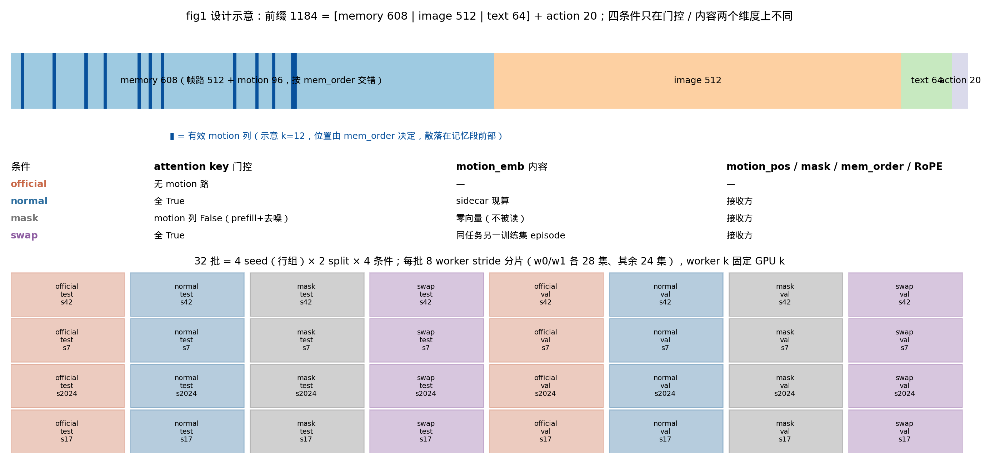
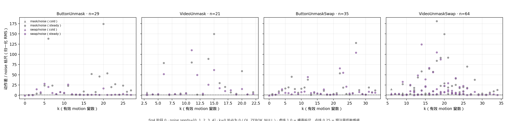
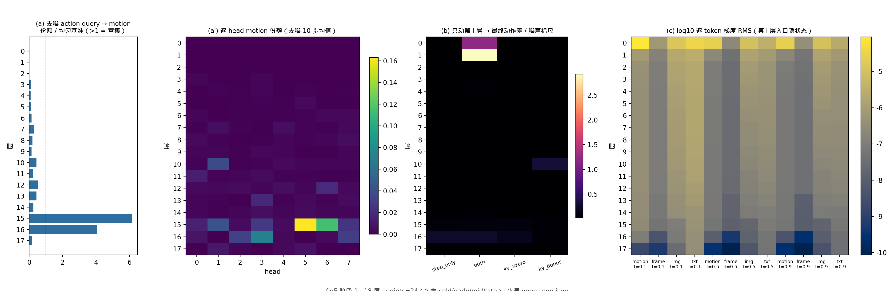
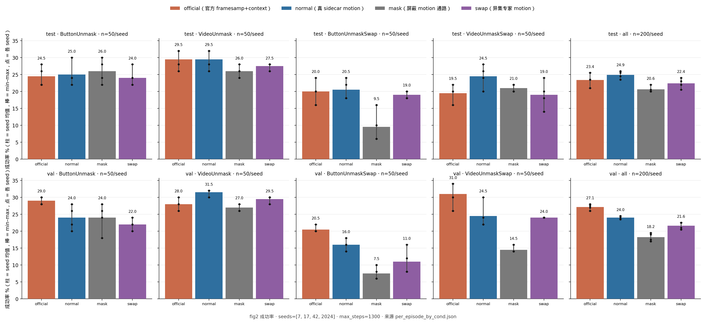
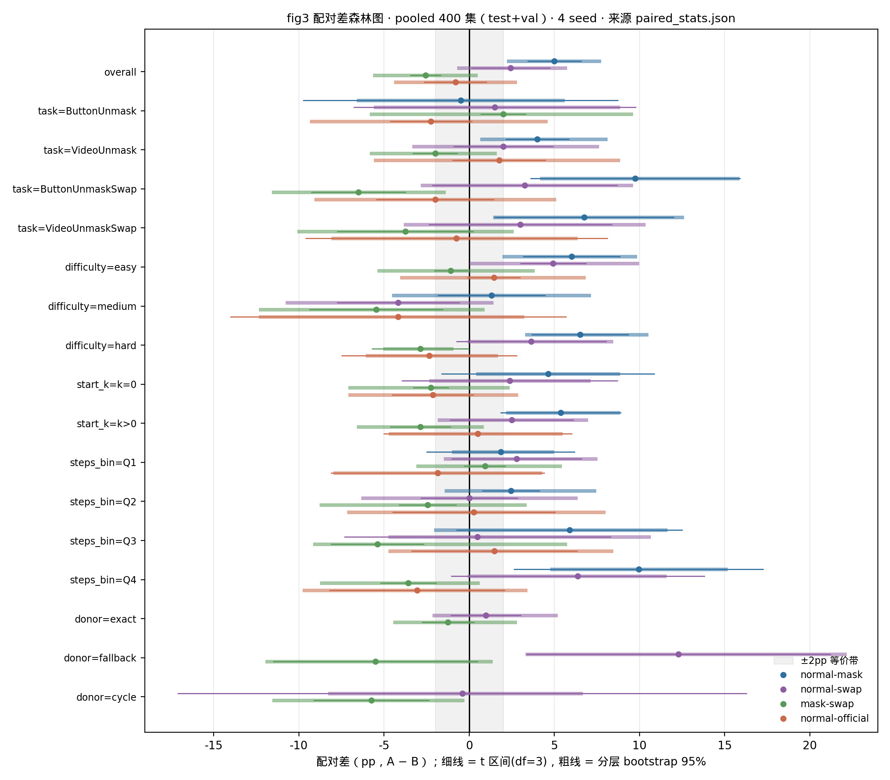
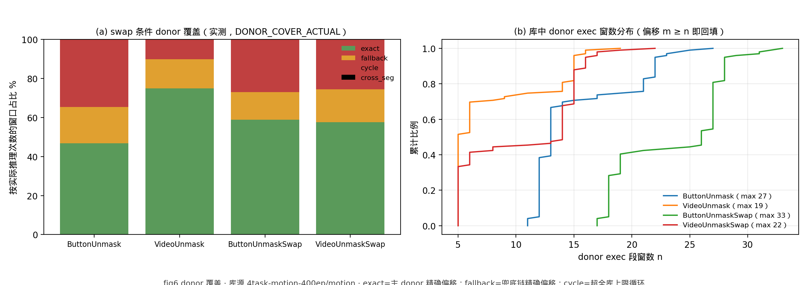

# motion memory 利用率评估（motion-variance）

> 环境 B（AWS 单机 8×A100，2026-09-08 起）。工具在 `scripts/motion-variance/`（目录 README 有文件清单与完整跑法）；留档 `training-doc/mv-openloop-40k/`（阶段 0+1）与 `training-doc/mv-matrix-40k/`（阶段 2）；图在 `motion-utilization/figures/`。
> 计划稿经 Codex 2026-09-08 审计修订（10 条），修订对照见第十一节。本页的数字一律现读留档 `records/`。

## 一、结论摘要

**motion token 通路被模型读取并带来成功率收益；收益主要来自通路存在 / 位置信号，正确内容相对异集内容的增量尚未分辨；自训模型与官方 baseline 尚未检出差异。**（2026-09-08，`training-doc/mv-openloop-40k/`、`mv-matrix-40k/`）

三个数：
- pooled 400 集 `normal − mask` = **+5.00pp**，t 区间 [+3.44, +6.56]、bootstrap [+2.31, +7.62]、Bonferroni [+2.36, +7.64]，四 seed 各 +5.25 / +6.25 / +3.25 / +5.25 → **POSITIVE**；屏蔽通路还使 27% 的集 timeout（normal 1.6%）。
- `mask − swap` = −2.56pp（异集内容略好于屏蔽），t [−3.44, −1.68] 全负但 bootstrap [−5.56, +0.38] 含 0 → NOT_DETECTED；`normal − swap` = +2.44 → NOT_DETECTED。
- 阶段 0 开环：屏蔽通路的动作差 = noise 标尺的 **9.9 倍**（动作 std 的 73%），换异集内容 6.4 倍；机制上 action 直读富集在第 15–16 层，主通路是第 0–1 层被帧/文本 token 吸收后间接传播，内容敏感点在第 10 层。

`normal − official` = −0.81pp，t [−2.63, +1.01]（下界跨出 ±2pp，不判等价）→ NOT_DETECTED。

## 二、问题与既有证据缺口

自训 `awsprod40k-b128-motion/39999` 每步多喂 96 个 motion token；两次评估结果打架（A100 单 seed 28% vs 官方 24%；Ada 三 seed 24.2% vs 24.5%，`training-doc/eval-3seed-context-vs-motion/result.md`）。`train-infer-consistency.md` 第十节把「未量化模型各层对 motion 的利用率」「未做推理时屏蔽 motion 的成功率」列为缺口；`motion-memory-audit-summary.md` 第 7 节第 2 条「真实 39999 内容干预」即本轮实验。

## 三、被评对象与 provenance

| 对象 | 路径 | 自证 |
|---|---|---|
| motion 模型 | `v1-store/train-runs/mme_vla_suite_b128/awsprod40k-b128-motion/39999` | `PARAM_TREE_EXACT=PASS n_model=59 n_ckpt=59`（`mv-matrix-40k/records/param_tree_motion.json`） |
| 官方 baseline | `v1-store/models/official-mme-vla/perceptual-framesamp-context/79999` | `PARAM_TREE_EXACT=PASS n_model=55 n_ckpt=55` |
| donor 库 | `v1-store/datasets/4task-motion-400ep/motion`（6832 行 × 768） | `DONOR_BANK=PASS rows=6832 self_loops=0`，bank sha `6e70604da518c156` |
| 评估 split | benchmark `env_metadata/{test,val}/`，每任务 50 集 | `TEST_SEED_DISJOINT=PASS` / `VAL_SEED_DISJOINT=PASS val=50x4 train_h5=100x4 overlap=0`（本轮首次核 val） |

## 四、四条件的定义与比较语义

| 条件 | 改了什么 | 没改什么 | sidecar |
|---|---|---|---|
| `official` | —（没有 motion 路） | — | 无 |
| `normal` | — | — | 真 sidecar |
| `mask` | prefill + 去噪两处 attention mask 的 motion key 列置 False，非 motion 的 query 读不到 motion token | `motion_emb/motion_pos/motion_mask/mem_order`、`positions=cumsum(input_mask)−1` 原样 | 无（零向量 stub，`MV_MASK_CONTENT_NULL` 证明内容无关） |
| `swap` | 有效槽 `motion_emb` 换成同任务另一训练集 episode 的内容 | `motion_pos/motion_mask/mem_order` 来自接收方（sha 断言） | 无（查表） |

motion token = `motion_encoder_static(concat(motion_emb, silu(motion_pos_proj(motion_pos))))`。因此 `normal−mask` 是**整个 motion token 通路**（内容 + 位置投影）的效应，不是「768 维内容的收益」；`mask−swap` 与 `normal−swap` 才涉及内容。为什么不能改 `motion_mask`：位置号是 `cumsum(input_mask)−1`，改 mask 会让其后所有 token（含动作）的 RoPE 位置整体前移。

## 五、实现要点与验收（`mv_model_adapter.py --selftest`）

- `f_sample`：逐字复刻 `HistoryPi0.sample_actions` context 分支，只在两处 mask 插 key 列门控；四臂共用 `apply_gate=True` 的同一份编译产物。
- 源码护栏：`inspect.getsource` 空白规范化后匹配预期片段，生产代码漂移即拒跑。
- 验收判定行（`v1-store/reports/motion-variance/adapter_selftest_*.log`，留档 `mv-openloop-40k/records/`）：

| 判定行 | 判据 | 结果 |
|---|---|---|
| `MV_NOOP_BITEXACT` | 无算子复刻 vs 生产 `policy._sample_actions` 逐位；带门控算子（gate=全 True）vs 无算子逐位 | PASS `ref_vs_prod=4/4 mv_vs_ref=4/4` |
| `MV_PAD_INVARIANT` | padding 槽灌 0 / N(0,10) / ±1e4，动作逐位不变 | PASS 12/12 |
| `MV_MASK_CONTENT_NULL` | `mask_all` 下有效槽内容换 0 / 随机，动作逐位不变 | PASS 12/12 |
| `UNROLL_VS_SCAN_BF16`（观察） | 18 层展开 vs `nn.scan`，bf16 | 不逐位：`rel_fro≈3.4e-3`，与仓库已知 `VT_FULL_VS_CACHED`（两份 XLA 编译产物）同性质 |
| `UNROLL_VS_SCAN_F32` / `LAYER_SELFCHECK_F32` | 参数与 `embed_dtype` 升 f32、`matmul_precision=highest`，`rel_fro ≤ 1e-5` | **PASS，rel_fro = 0（逐位相同）**（计划原定 bf16 逐位阻断，实测不成立后改为 f32 语义闸——对计划验收判据的一处偏离） |
| `ATTN_UNIFORM_SELFCHECK` | 合法 mask 均匀分布走同一归约，share == 逐 query 均匀基准 | PASS |
| `GRAD_SELFCHECK` | 18 层梯度有限、padding 位梯度严格 0 | PASS |

## 六、阶段 0：开环动作差与预注册解读

预注册措辞（Codex 审计 7）：

| 阶段 0 | 阶段 2（pooled 400 `normal−mask` 95% 区间） | 允许写的结论 |
|---|---|---|
| mask/noise 中位 < 0.25 | 区间完全落在 ±2pp 内（t 与 bootstrap 都在） | 「所测点动作敏感性较低；成功率在 ±2pp 实际等价界内」 |
| 任意 | 含 0 且跨出 ±2pp | 「尚未检出成功率收益（或损失）」，不写等价 |
| ≥ 0.25 | 全在 0 以上 | 「motion token 通路带来收益」；`mask−swap` 也为正 → 内容被读取；≈0 → 效应主要来自通路存在/位置信号 |
| 任意 | `normal ≈ mask`，`swap < mask` | 「异集内容有害」，不得写成「正确 motion 有收益」 |
| 任意 | 全在 0 以下 | 「motion token 通路造成损失」 |

结果（149 点 × 5 noise seed，`mv-openloop-40k/result.md`）：mask/noise **9.88（中位 7.52）**，swap/noise 6.36（中位 4.34）；反归一化 = 动作 std 的 73% / 43%。按 k：k=0 → 0.000（逐位，`OL_ZEROK_NULL=PASS`）、1–4 → 2.4 / 2.3、5–12 → 9.5 / 6.3、>12 → 11.1 / 7.0；cold 3.4 / 1.0，steady 10.3 / 6.7；四任务 mask 8.5–11.0，swap 2.7（ButtonUnmask）/ 6.5–7.9。→ 预注册第一行（敏感性较低）排除。

*fig4：x = 有效 motion 窗数 k，y = 动作差 / noise 标尺；149 点、5 noise seed；虚线 1.0 = 噪声标尺，点线 0.25 = 预注册低敏感阈；来源 `mv-openloop-40k/records/open_loop.json`。*

## 七、阶段 1：18 层机制

每集 cold / early / mid / late 4 点、6 集（含 ButtonUnmask）。(i) `LAYER_ATTN`：去噪 action query 的 motion 份额 / 逐 query 合法-key 均匀基准（剔除 padding query）；(ii) `LAYER_ACT_DELTA`：`step_only(l)` / `both(l)` / `kv_vzero(l)` / `kv_donor(l)` 四种逐层干预的完整 10 步最终动作差，donor K/V 来自接收方同 obs 换内容后重新 prefill；(iii) `LAYER_GRAD`：固定 `(obs, x_t, t, u_t)` 的 loss 对第 l 层入口隐状态的梯度，t ∈ {0.1, 0.5, 0.9}。结果（24 点）：(i) action query 富集度第 0–14 层全 < 1，**第 15 层 6.2、第 16 层 4.1**，第 17 层 0.18；第 15 层单 head 份额 0.31；prefill 侧 frame query 第 0/1 层富集 36/34，文本第 1 层 39。(ii) `both(l)`：第 1 层 2.9×、第 0 层 1.2× 噪声，其余 ≤ 0.26；`step_only(l)`：第 16 层 0.25；`kv_donor(l)`：**第 10 层 0.32**；18 层全挡 7.5×（与阶段 0 一致）。(iii) 梯度逐 token 比 motion/frame：第 0 层 68–137×、第 16 层 20–23×、其余 2–6×。→ 主通路是第 0–1 层被帧/文本 token 吸收后间接传播；action 直读 15–16 层；内容敏感读取点第 10 层。

*fig5：(a) 去噪 action query 的 motion 份额 / 逐 query 均匀基准；(a') 逐 head；(b) 只动第 l 层的最终动作差 / 噪声；(c) 第 l 层入口隐状态的逐 token 梯度 RMS（log10）。24 点 = 6 集 × cold/early/mid/late。*

## 八、阶段 2：闭环矩阵与 pooled 400 配对统计

4 条件 × 4 seed（42/7/2024/17）× (test 200 + val 200) = 6400 集，32 批 seed-major，8 worker stride 分片（每片 28/28/24×6 集，worker k 固定 GPU k）。统计（`summarize_mv.py`）：逐 seed 配对差 `mean ± 3.182·sd/√4`；episode bootstrap 10000 次按 split×task 分层、所有条件与 seed 共享索引；McNemar b/c 与精确二项 p；等价判定 = t 与 bootstrap 区间都落在 ±2pp 内；分层 task / difficulty / 启动时空窗（首步 k=0）/ donor 覆盖档 / steps 四分位（取 normal seed 42 的 steps，描述性）。结果（`mv-matrix-40k/result.md`；32 格 6400 集 0 error，`MV_STRUCT_IDENTICAL` 八格 200/200）：

| 条件 | pooled 400（4 seed 均值 ± sd） | test | val | timeout |
|---|---|---|---|---|
| official | 25.25 ± 1.10 | 23.37 | 27.12 | 0.4% |
| normal | 24.44 ± 0.52 | 24.87 | 24.00 | 1.6% |
| mask | **19.44 ± 0.97** | 20.62 | 18.25 | **27.0%** |
| swap | 22.00 ± 1.24 | 22.38 | 21.62 | 10.1% |

| 配对 | Δ（pp） | t 区间 df=3 | bootstrap | verdict |
|---|---|---|---|---|
| normal − mask | **+5.00** | [+3.44, +6.56] | [+2.31, +7.62] | **POSITIVE** |
| normal − swap | +2.44 | [+0.16, +4.72] | [−0.62, +5.62] | NOT_DETECTED |
| mask − swap | −2.56 | [−3.44, −1.68] | [−5.56, +0.38] | NOT_DETECTED |
| normal − official | −0.81 | [−2.63, +1.01] | [−4.31, +2.69] | NOT_DETECTED |

分层：`normal−mask` 在 VideoUnmask +4.0、ButtonUnmaskSwap +9.75、VideoUnmaskSwap +6.75（均 POSITIVE），ButtonUnmask −0.5（ND）；easy +6.0 / hard +6.5（POSITIVE）、medium +1.3；steps Q4 +9.95（集越长收益越大）。`mask−swap` 在 ButtonUnmaskSwap −6.5（NEGATIVE：异集内容好于屏蔽）。

*fig2：成功率，柱 = 4 seed 均值，棒 = min–max，点 = 各 seed；每格 n=50/seed（合计 200/seed）。*

*fig3：配对差森林图，细线 = t 区间（df=3），粗线 = 按 split×task 分层的 bootstrap 95%（10000 次，条件与 seed 共享索引），灰带 = ±2pp 等价界。*

## 九、donor bank 与覆盖率

主 donor = `hash(split|task|recv_ep)` 在同任务 100 集里固定选（四 seed 共用）；偏移超出主 donor → 沿同任务 exec 窗数降序的兜底链取精确偏移（fallback）；超全库上限（BU 27 / BUS 33 / VU 19 / VUS 22 窗）→ 循环（cycle）。最坏估计（接收方 t=es+1300）`DONOR_COVER_EST exact 20.9% / fallback 13.1% / cycle 66.1%`；实际（756,823 次窗口查表）`DONOR_COVER_ACTUAL exact 55.8% / fallback 15.9% / cycle 28.3% / cross_seg 0`；开环 exact 79%。阻断只有 `self_loops=0`、`cross_seg=0`。donor 档分层：`normal−swap` exact +1.0（ND, n=280）、fallback +12.3（POS, n=59）、cycle −0.4；`mask−swap` cycle −5.7（NEGATIVE）。

*fig6：(a) swap 条件按实际推理次数的 donor 覆盖占比；(b) 库中 donor exec 窗数分布。*

## 十、威胁到结论的因素与已做的否证

- k=0 的点屏蔽/替换逐位无影响（`OL_ZEROK_NULL=PASS`）；padding 扰动无影响（`MV_PAD_INVARIANT=PASS`）；三臂首步结构 sha 八格全等（`MV_STRUCT_IDENTICAL=PASS 200/200`）。
- donor 是专家演示 motion、接收方是策略 rollout（分布差异）——`swap` 固定称「异集专家 motion」，与 `mask` 并列报。
- 跨卡：不同型号（A100 vs Ada）已实测不一致（单任务 ±14pp）；同型号 A100 本轮 4 集校验 **`MV_XGPU=BITEXACT`**（GPU 0 vs 3，125/125 次推理动作 sha 一致）；矩阵固定映射使跨卡差异不进主比较。
- 本轮不能替代「带/不带 motion 训练」的因果对照；审计 D-A1 / B-A2 原样保留；test ep 0–9 在 encoder 训练集内。

## 十一、复现命令、判定行与计划修订对照

命令见 `scripts/motion-variance/README.md`「一次完整跑法」；判定行全文见两份 `result.md`。计划相对 Codex 审计的 10 条修订：donor 契约（主 donor + 兜底链，不设 wrap 闸）、`episode_plan` 三方唯一来源（28/28/24×6）、护栏空白规范化、展开路径含完整 10 步去噪与双门控自洽闸、逐 query 均匀基准、删除精度承诺 + pooled 400 主估计、预注册措辞收窄 + ±2pp 等价界、阶段 1 取点 cold/early/mid/late、固定-loss 梯度 + donor K 来源、`MV_ALLOW_DIRTY` 与不起 stub。实现期新增偏离：`UNROLL_VS_SCAN` 由 bf16 逐位改为 f32 语义闸（第五节）。

## 十二、留档索引

- `training-doc/mv-openloop-40k/{launch.md,result.md,records/}`：adapter 自检日志、`open_loop.{json,summary.txt}`。
- `training-doc/mv-matrix-40k/{launch.md,result.md,records/}`：`val_seeds.json`、`test_seeds.json`、`param_tree_{official,motion}.json`、`summary.txt`、`per_episode_by_cond.json`、`paired_stats.json`、`xgpu.txt`、批日志。
- 原始产物（不进 git）：`v1-store/reports/motion-variance/`（bank、open_loop、adapter 自检）、`v1-store/evaluation/mv-*/`、`v1-store/logs/mv-*`。
