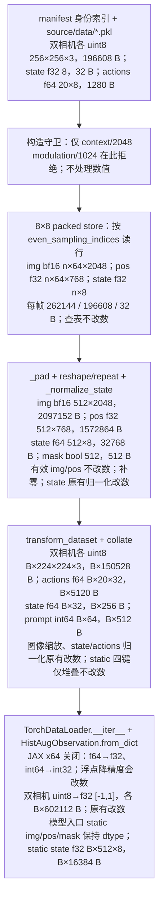
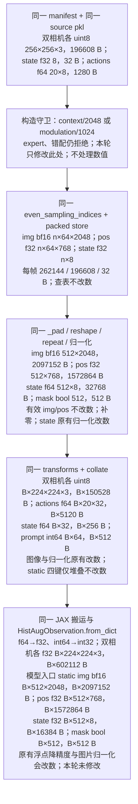

# t8-c8-guard-s100 守卫等价验证

本运行实施根目录 `0915-1600ep-m8x8-modul-training-plan.md` 的 F3：复用环境 B 的 `t8-c8-b` 前 100 步固化轨迹，验证 `FrameSampDataset.__init__` 的成对白名单放宽不改变既有 context 8×8 训练结果。用户已在计划中确定本 run_name、100 步、GPU 4,5 和完整状态摘要。起跑必须是 clean HEAD；准确 SHA 由 runner 的 `HEAD=` 与 `run_meta.json.start_head` 同时记录。候选功能提交为 `commitV9.6`（`81ba002`），其后仅加入本起跑留档。用户于本轮明确批准沿用 GitHub SSH 凭据推送。

## 改动与两张链路图

唯一生产代码改动在 `src/mme_vla_suite/training/framesamp_dataset.py::FrameSampDataset.__init__`：将两个独立的 context/2048 限制改成集合 `{("context", 2048), ("modulation", 1024)}`。同步改写 `scripts/training/tests/test_pack_guards.py::test_g13_integration_dim_pairs`。其余采样、读取、padding、归一化、transforms、collate 与模型计算不变。

下图的 B 为 batch size，本运行 B=8；n≤8 是实际采样帧数。字节量为张量逻辑字节，不含 Python 对象和分片副本。标注「改数」说明原有数据处理是否改变数值，与本轮是否修改该步骤分开。

改动前：



改动后：



两侧 motion 关闭，四个 motion 键恒为 None，0 张量字节。图示形状由 F2 原始样本以及现存 `c8-b` 定点 batch 核对；F3 输入逐键摘要进一步核实真实训练入口。图中的 context 与 modulation 在模型侧不同；F2 只证明数据交付相同，不声称两种模型等价。

## 第一块：非训练轻量对拍

在 1600 集新库 `v1-store/datasets/4task-v2-1600ep-604f16da`，以 `mme_vla_suite_b128_60k` 的真实 data_config 和新库 norm_stats 构造两个 Dataset。比较 modulation-8x8 与 context-8x8，在 `np.random.default_rng(20260915).choice(605611, 256)` 基础上加入首尾及全部 episode 边界，去重后共 3454 个样本；逐样本逐键比较类型、shape、dtype 与 raw bytes 的 SHA256，含字符串与 None。

```text
GUARD_MODUL_8X8=PASS
GUARD_MODUL_4X4=PASS
GUARD_EXPERT_REJECT=PASS
GUARD_MISMATCH_REJECT=PASS
DS_EQUIV=PASS samples=3454 keys=19 mismatches=0 sha256=53b623af3bb11cd4d8200922e8a5ded30e38742b63e72faff6efaa9e1b9a9d99 seconds=77.913
EXIT_CODE=0
```

该证据比较当前源码下两份配置，不比较 motion 接入前源码。迷你库 `ref-shard` 不存在，因此未执行依赖该库的 pytest；相同三类守卫通过上面的真实库调用验证。脚本及原始输出归档在 `records/f2_check.py`、`records/f2.log`。

## 第二块：真实训练 100 步

基线 `t8-c8-b` 的起跑 SHA 为 `38f0db46db19a3b645613e04fba3f6e635b47054`，候选源码 SHA 为 `c08ec2060a544af1869c1e24f755e536150569ca`。使用本机 `v1-store/bench/8x8/t8-c8-b` 的固化记录；运行前严格校验其环境指纹和产物 manifest，不允许 `--allow-difference`。

数据根 `v1-store/datasets/4task-motion-400ep/framesamp-8x8`，共 101066 个样本；norm_stats 为 `v1-store/train-assets/mme_vla_suite/robomme-400ep/robomme/norm_stats.json`，SHA256 `750a8e9bd6e1e5a3cf5c294864c44564153309ef92492eb083fa361096d470d2`。预训练权重为本机 `v1-store/models/openpi-assets/checkpoints/pi05_base/params`。环境 AWS 8×A100-80GB，本运行仅 GPU 4,5；存储 AWS 本地 NVMe RAID（`/dev/md0`）。

启动覆盖：`mme_vla_suite`、batch 8、worker 4、100 步、seed 42、fsdp 2、log/save interval 1、wandb 关闭；history_config 为 `perceptual-framesamp-context-8frame-8x8.yaml`。`XLA_FLAGS='--xla_gpu_deterministic_ops=true --xla_gpu_autotune_level=0'`，显存预分配比例 0.95，独立编译缓存，`BENCH_CHECKSUM=1`、`BENCH_BATCH_DIGESTS=1`、`BENCH_DIGEST_INTERVAL=1000`、`BENCH_EXTRA_DIGEST_STEPS=1,2,24,49`。

完整 runner 见 [records/runner.sh](records/runner.sh)。相对基线只缩至 100 步、摘要集合缩至 `{0,1,2,24,49,99}`、不保存最终 checkpoint、增加 clean HEAD 与真实退出码硬闸、不采性能，以及使用交集比较器；缓存路径移到仓库的 `v1-store/cache/uv`，不改变软件环境。

```bash
tmux new-session -d -s m8-guard "bash /scratch/hongze/robomme_policy_learning_MotionJEPA/v1-store/logs/m8-guard-runner.sh"
tmux has-session -t m8-guard
```

本次创建的会话清单仅 `m8-guard`。其他会话不属于本次清单，均不得清理。日志 `v1-store/logs/t8-c8-guard-s100.log`；记录 `v1-store/bench/8x8/t8-c8-guard-s100`；checkpoint 根 `v1-store/train-runs/t8-c8-guard-s100`；JAX 缓存 `v1-store/cache/jax/t8-c8-guard-s100`。归档后才允许删除这三个临时目录。

完整验收必须同时有 `BASELINE_ENV=PASS`、`SCALARS steps=100 keys=5 hex_mismatch_steps=0`、`INDEX_SEQ=PASS n=800`、`BATCH_DIGEST rows=6 mismatch=0`、`STATE_DIGEST rows=6 mismatch=0`、`CANON_CHECK=PASS steps=6` 和 `EXIT_CODE=0`。汇总行为 `GUARD_GRAD_100=PASS scalars_steps=100 index_n=800 batch_digest_rows=6 state_digest_rows=6`。任一失败按计划撤销 `commitV9.6` 并同步远端，然后向用户报告，不放宽判据。
