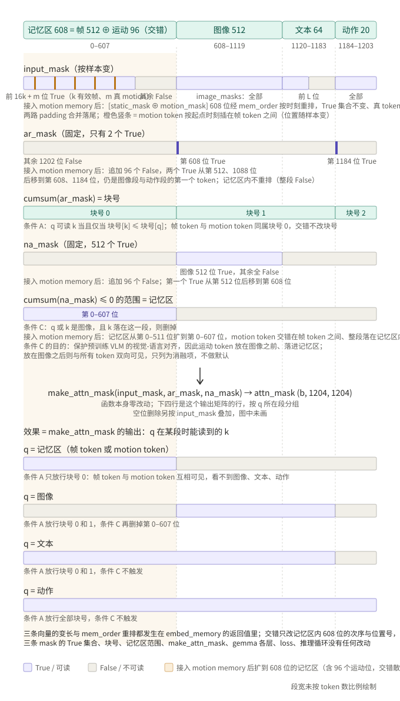

# motion memory 接入计划——framesample 记忆双路化（帧路 + 运动路）

> **本文件是 motion memory 工作的权威计划**（2026-09-01 定稿，2026-09-02 四节重写；只陈述当前定稿设计，历次修订见 git log）。
> **锚点**：分支 `v1-dataloader-Restructure`，代码锚点 HEAD = `4503ea2`（此后仅 `docs:` 提交，`src/` `scripts/` 零改动；工作区 clean）。
> **commit 编号**：代码切片 **commitV6.x**；本文件本身按 `docs:` 提交。
> **外部依赖仓库**：MotionJEPA 单副本 `/nfs/turbo/coe-chaijy-unreplicated/hongzefu/MotionJEPA`
> （HEAD 与 checkpoint 选型见第二部分〇节，**起工前须锚定并写死**）。
> **本计划只规划、不实施**：S0–S4 每步须逐步获批后动手。

---

# 第一部分（给人看）

## 一、Context 与方案总览

`AGENTS.md` 的项目 scope 写明「仓库总体目标：修改 MME-VLA 的 `perceptual-framesamp-context`，
并在后续阶段接入 MotionJEPA motion token」。v1–v5 已把 dataloader 与训练入口收敛到 packed
framesamp 单一路径（v5.2 收官，60k 全量 run 在跑），本计划是那个「后续阶段」。

当前记忆只有**一路**：`even_sampling_indices(step, 32)` 在 `[0, t]` 上变长间隔地选 32 个历史帧，
每帧给 16 个 4×4 池化的 SigLIP token，共 512 个 memory token。这一路描述的是**静态外观**
（那一帧长什么样），不描述**运动**（那一段时间里在发生什么）。本计划并联第二路。

**一句话方案**：memory 从「512 个外观 token」变成「512 个外观 token **并列** 80 个运动 token」，
prefix 记忆区 512 → **592**。运动特征来自 MotionJEPA 的两级链路：Wan VAE（离线冻结）→
`WanLatentMotionEncoder`；接入形态按用户拍板「**作为 memory 的一部分**」——记忆序列的
第二路，不是插单个 token 进 prefix。帧路照旧——用户明确「**逻辑不变，你不用管**」，
`even_sampling_indices` 一字不动、变长间隔铺满全历史；运动路与帧路**完全独立**：按段内
绝对网格每 20 帧取一个起点、每个起点往后 33 帧编一个运动向量、窗口尾端不得越过当前帧。
训练读离线表，在线评估每 20 帧增量现编一次。

五个已定死的口径（依据分别在 2.2、2.1、2.3–2.4、3.1、3.4）：

1. **段内绝对网格**（起点 = 段起点 + 20m）。
2. **前视窗口 + 尾端 ≤ 当前帧**（起点往后 33 帧）。
3. **预算 N=80，零截断**；容量按 16 任务全集 `/data/hongzefu/robomme_data_h5` 定标（全集最大需 69），
   **不按当前 4 任务训练集定标**；代价是平均填充率仅 4env 10.1% / 16env 19.1%。
4. **并列拼接**（512 + 80）。
5. **缺失走 `motion_mask`**（与 `static_mask` 同款）。

下文按 窗口（二节）→ 链路（三节）→ 对齐（四节）展开，再给 model 改动（五节）、实施步骤（六节）与影响面（七节）。

## 二、窗口：运动路怎么采样

### 2.1 窗口定义：前视 33 帧，尾端不越当前帧

一个运动窗口 = 从起点 `f` 往后连续 33 帧 `[f, f+32]`，经 Wan VAE + `WanLatentMotionEncoder`
编成一个 768 维 motion token。**前视**方向与 encoder 的训练语义完全一致（motion 描述
「相对锚点 z0 之后发生的运动」）。训练时窗口必须整体位于已发生的历史内，约束为
**尾端 ≤ 当前帧**（`f + 32 ≤ t`），出自用户原话「训练时候 f+32 窗口必须小于等于当前帧」。

起点的语义出自用户原话「以 VLA 训练时每个 action chunk 的开始作为 f」
「间隔一个 action chunk 抽取一次」——这句话如何落成具体的起点集合，见 2.2。

### 2.2 起点集合：段内绝对网格

起点**钉死在段内绝对位置** `0, 20, 40, …`（= 段起点 + 20m），不随当前帧平移；当前帧 `t`
只决定网格上哪些起点「已经可见」。间隔 20 走**独立配置键 `motion.stride`**——默认值写 20
（= 当前 `action_horizon`），但**不自动跟随**该超参。

设当前样本的全 timestep 域帧号为 `t`，该 episode 的 `exec_start_idx = es`，起点集合为：

```
exec 段网格： u = 0, 20, 40, …        （u 是 exec 段内偏移）
              合法条件： u + 32 ≤ t − es      且   u < num_chunks_exec

demo 段网格： s = 0, 20, 40, …        （s 是 demo 段内偏移；demo 段整段已见）
              合法条件： s + 32 ≤ es − 1      且   s < num_chunks_demo
```

（`num_chunks_*` = max(0, 段帧数 − 32)，由我方清单 `(num_timesteps, exec_start_idx)` 现算，口径见 4.1；
起点如何换算成 motion 表的行号，见第二部分一节。⚠ **待定**：该口径（exec 段不截尾，比 MotionJEPA 多 4~12 个）
需用户再次确认，未确认前阻塞 S1。）

⚠ **demo / exec 两段各自成网格、互不延续，窗口一律不跨 demo/exec 边界**——用户拍板
「独立的，也是一样采样不到 33 窗口都不补」（latent 分段抽，跨界窗口不存在）。
⚠ 起点集合与 `even_sampling_indices` 选出的 32 个帧号**没有任何对齐关系**——两路各采各的。

训练样本的当前帧 `t` 是**逐帧 dense** 的，多数不落在 20 的倍数上；网格不随 `t` 平移，
`t` 只把「可见边界」往右推——已经算过的窗口永远有效。下面用段起点 = 0、当前帧从
**205 走到 206** 的实际数轴演示：

```
【起点钉死在段内绝对位置 0,20,40,…，网格不动，t 只决定哪些已经可见】

t = 205
  帧号   0    20   40   60   80   100  120  140  160  180        205
         ●────●────●────●────●────●────●────●────●────●·········┤
         ✓    ✓    ✓    ✓    ✓    ✓    ✓    ✓    ✓    ✗
         └──── 这 9 个的窗口尾端都 ≤ 205 ────┘    180+32=212 > 205，还看不见

t = 206
  帧号   0    20   40   60   80   100  120  140  160  180         206
         ●────●────●────●────●────●────●────●────●────●··········┤
         ✓    ✓    ✓    ✓    ✓    ✓    ✓    ✓    ✓    ✗
         └──── 还是同样这 9 个，全部原样复用，一次都不用重编 ────┘

  要等到 t = 212（= 180+32），第 10 个起点才进入可见范围：
  帧号   0    20   40   60   80   100  120  140  160  180          212
         ●────●────●────●────●────●────●────●────●────●···········┤
         ✓    ✓    ✓    ✓    ✓    ✓    ✓    ✓    ✓    ✓ ← 新增第 10 个
                                    ⇒ 每 20 帧只新编 1 个窗口
                                      1.57 s ÷ 20 步 ≈ 0.079 s/step
```

绝对网格的两项直接收益（实测口径见 2.3 与 3.5）：

- **离线表小、在线增量少**：全数据集的网格窗口只有 **20,958 行 = 61.4 MiB**；在线每
  20 步只新编 1 个窗口，摊薄 **0.079 s/step**（实测 1.57 s/窗口）。
- **训练与部署共用同一套网格**：上线时 policy 每 20 步推理一次、真实 chunk 边界就是
  绝对网格，训练口径与部署口径天然一致。

### 2.3 预算 N=80：零截断，按 16 任务全集定标

**定标原则（明文口径）**：`motion.budget` 以及一切「随数据分布定的容量上限」类超参，一律以
16 任务完整数据集 **`/data/hongzefu/robomme_data_h5`**（16 任务 × 100 ep = 1600 ep）的统计定标，
**不以当前 v1 的 4 任务训练集** `robomme_data_h5_v2_4env400ep` 定标。理由两条：4 任务集是全集的
窄子集（只含 ButtonUnmask / ButtonUnmaskSwap / VideoUnmask / VideoUnmaskSwap，且这四个恰好都是
短 demo 任务），按它定的容量在 scope 扩到全集时必然溢出；两集段长口径同源——4 个共同任务
ep0–99 的 `(num_timesteps, exec_start_idx)` 400 条逐条相同，所以全集统计可以直接用作上界。
该原则在第二部分〇节列为红线 8。

**16 任务全集实测**（1600 ep，476,857 个 exec 样本；按 2.2 网格换算 `num_grid = ceil((段帧数 − 32) / 20)`，
一个样本的起点上界 = `num_grid(demo) + num_grid(exec)`）：

```
  P25 = 6    中位 = 12    P75 = 20    P90 = 36    P95 = 43    P99 = 56    最大 = 69
  均值 15.31    一个合法起点都没有的样本：4.72%
```

| 预算 N | 32 | 48 | 56 | 64 | 69 | 72 | **80** |
|---|---|---|---|---|---|---|---|
| 截断样本数 | 56,235 | 10,821 | 4,085 | 207 | 0 | 0 | **0** |
| 截断样本占比 | 11.793% | 2.269% | 0.857% | 0.043% | 0.000% | 0.000% | **0.000%** |
| 平均填充率 | 47.9% | 31.9% | 27.3% | 23.9% | 22.2% | 21.3% | **19.1%** |

零截断最小 N = **69**。最长纪录三条：最长 episode 是 VideoPlaceOrder ep4（1411 帧 = demo 1118 +
exec 293 → 55 + 14 = 69）；最长 demo 段 VideoPlaceOrder ep90（1145 帧 → 56）；最长 exec 段
BinFill（1044 帧 → 51）。逐任务上界超 32 的有五个：VideoPlaceOrder 69、VideoPlaceButton 52、
BinFill 51、VideoRepick 50、PickXtimes 50；RouteStick 32 正好卡满；v1 四任务分别为
ButtonUnmaskSwap 27、VideoUnmaskSwap 27、ButtonUnmask 21、VideoUnmask 18。

**溢出根因是 demo 段，不是 exec 段**：VideoPlace* 系列 demo 动辄 1000+ 帧，而按 2.2 的定义
demo 段整段已见、与 `t` 无关，贡献的是「从 episode 第 0 步就顶满」的常数项——200/1600 = 12.5%
的 episode 仅 demo 网格起点数就 > 32（demo 网格 MAX = 56），这些 episode 的每个样本都会截断，
丢的正是最早的历史。exec 网格单独看 MAX = 51、P90 = 25。

**为什么是 80 而不是 69 / 72**：裕度按同一把尺子——4env 上 MAX 27 取 32 是 18.5% 裕度，同比例
套到 69 是 81.8，80 落在同一档（15.9%）；69 / 72 贴着观测最大值走，数据集再动一下就顶穿。
另附一条弱证据：4 个共同任务上 400ep 版的各任务最长 exec 与前 100ep 逐个相同
（452/452、555/555、333/333、370/370），长尾大概率已采到，但无法证明饱和，这也是不取 72 的原因。

**硬地板 51**：若想压预算，demo 段单独放大 stride 到 40 可把零截断线从 69 降到 51，再放
（60 / 80 / 100）不再下降——瓶颈换成 BinFill 1044 帧 / PickXtimes 1025 帧的 exec 段（这两个任务
没有 demo 段）。守住「exec 每 20 帧一采 + 零截断」两条，N 不可能低于 51；要再往下压只能动
exec stride，那正是「间隔一个 action chunk」的本意所在。**本计划不采用 demo 独立 stride**，
只把它列为 S4 消融备选。

**当前 4 任务训练集在 N=80 下的实况**（395,289 个样本全量）：

```
  P25 = 4    中位 = 7    P75 = 12    P90 = 16    P95 = 18    P99 = 21    最大 = 27
  均值 8.09    一个合法起点都没有的样本：6.48%
```

| 预算 N | 32 | 48 | 64 | **80** |
|---|---|---|---|---|
| 截断样本占比 | 0.000% | 0.000% | 0.000% | **0.000%** |
| 平均填充率 | 25.3% | 16.9% | 12.6% | **10.1%** |

**与 framesample 的对齐关系**：N=80 不等于帧路的 `_max_frames = 32`，「两路同预算」这一层对齐
**不成立**；「尽可能和 framesample 对齐」只保留在 padding + mask 同款这一层（3.4）。用户的
三条拍板为「尽可能不截断任何样本」「容量按全集定标」「padding / mask 与 framesample 同款」。

### 2.4 ⚠ 零截断的代价：4env 上平均只有 8 个、16env 上平均只有 15 个位置是真数据

**这是本方案最需要清醒认识的一点，用户明确要求「写入 plan 让用户清楚认知」，
不藏在技术细节里：**

- 运动路固定占 **80 个 memory 位置**，但 4env 上平均只有 **8.09 个**是真 motion token，
  16env 上平均 **15.31 个**；
- 其余 **约 72 个位置（89.9%）是 padding**（16env 为 64.7 个 / 80.9%），靠 `motion_mask=False` 屏蔽；
- **6.48% 的样本（约 25,600 个）一个真 motion token 都没有**（16env 为 4.72%）——整条运动路全是
  padding，这些样本等价于「motion 功能未启用」；
- 分布很偏：4env P25 只有 4 个真数据，中位 7 个，要到 P90 才有 16 个；16env P25 6、中位 12、
  P75 20——四分之三的样本连 20 个位置都填不满，却要为 12.5% 的长 demo episode 全程背 80 个位置。

**为什么仍然接受**：这是「零截断 + 按全集定标」的直接代价。要提高填充率只能降预算（4env 上
N=16 时填充率 48.9%，但 8.88% 的样本被截断，丢的是最早的历史；全集上零截断硬地板是 51，
见 2.3），或改用变间隔采样（违背「间隔一个 action chunk」的本意）。用户已明确选择零截断优先。

**三个后果需要在实验中盯住**：
1. attention 里 89.9%（4env）/ 80.9%（16env）的运动位置被 mask，计算恒定支出但无信息——形状
   固定是 JAX jit 的硬约束，省不掉（详见 3.4）。
2. 早期样本（`t` 小）与晚期样本（`t` 大）的运动路信息量差异极大（0 个 vs 69 个，4env 内
   0 个 vs 27 个），模型可能学成「按 motion 有效数判断 episode 进度」的捷径——S4 需要一个消融
   专门测这个。
3. 6.48% 全空样本使得「motion 到底有没有用」的评估必须**分层看**（按有效数分桶），
   整体平均会被全空样本稀释。

### 2.5 当前帧附近的空白：不补

窗口 33 帧比网格步长 20 帧长，所以当前帧附近必然留一段空白：网格上最靠前的合法起点，
其窗口尾端离当前帧最近 8 帧、最远 27 帧（取决于 `t` 落在网格的哪个相位）——
**当前时刻的运动始终缺席**。

**用户已拍板：不补**（「采样不到 33 窗口都不补」）。不加网格外的起点（例如紧贴当前帧的
`t−32`），不做钳位回退。凑不齐完整 33 帧窗口的位置就是缺失，走 padding + mask（3.4）。

## 三、链路：运动特征怎么送入模型

### 3.1 改动前后链路图（`AGENTS.md` 第 18 条）

分两个子节：改动前全图（3.1.1）、改动后全图（3.1.2）。图中两处标注的 `static_pos_emb`
/ `motion_pos` 与 padding 分别在 3.2、3.4 单独展开。图中 `b` = batch size。

**带权重模块的统一写法**（全文图与正文照用）：`名字 = nnx.Linear(in→out)［W in×out, b out，可训练］`，
每个这样写的名字都是一个可训练的 `nnx.Linear`，含权重矩阵 W 与偏置 b；激活 `nnx.silu` 无参数，
单独占一行，不与 Linear 合写。

#### 3.1.1 改动前：memory 单路（帧路）

```
                     样本 = (episode g, 当前帧 t)
                               │
                               │ even_sampling_indices(t, 32)   [shared/sampling.py]
                               ▼
              32 个历史帧号（变长间隔铺满 [0, t]；历史不足时只有 n = t+1 < 32 个）
                               │
                               │ 逐帧号查离线表（FrameSampStore）
                               ▼
   ┌───────────────────────────┼────────────────────────────────┐
 image_emb_4x4            pos_emb_4x4                       state_emb
 (n,16,2048) bf16         (n,16,768) f32                    (n,8) f32
 每帧 16 个外观 token      每 token 一个 3D 位置编码         （use_state_emb=False，
   │                           │                             不进链路，只随行交付）
   │        _pad 右填充到 32 帧 + 帧级 mask (32,)（3.4）      │
   │        reshape / repeat：32 帧 × 16 token = 512            │
   ▼                           ▼                                ▼
 static_image_emb         static_pos_emb                  static_state_emb   static_mask
 (b,512,2048) bf16        (b,512,768) f32                 (b,512,8)          (b,512) bool
   │                           │
   │                           │ pos_proj = nnx.Linear(768→768)［W 768×768, b 768，可训练］
   │                           │ nnx.silu
   │                           ▼
   │                      (b,512,768)
   └───────────┬───────────────┘
               │ 最后一维 concat：2048 ⊕ 768 = 2816
               ▼
        (b, 512, 2816)
               │ encoder_static = nnx.Linear(2816→2048)［W 2816×2048, b 2048，可训练］
               ▼
      mem tokens (b, 512, 2048)      ar=F  na=F  input_mask = static_mask
               │
               ▼
 prefix ┌─ mem 512 ─┬─ img 2×256=512 ─┬─ prompt ≤64 ─┐ = 1088   (b,1088,2048)
        │ ar=F na=F │   ar=T/F na=T   │  ar=F na=F   │
        └── cumsum(na)==0 的「记忆区」：image 看不到，prompt / action 看得到 ──┘
 suffix  20 个 action token（pi05=True，无 state token；状态/时间走 adarms_cond）
         → 全序列 1108，attention 1108×1108
```

#### 3.1.2 改动后：memory 双路并列（左列逐位不动，右列整列新增）

```
                          样本 = (episode g, 当前帧 t)
              ┌────────────────────┴──────────────────────────────┐
     路1 帧路（3.1.1 整列逐位不变）              路2 运动路（★新增，独立采样）
              │                                                   │
  even_sampling_indices(t, 32)               段内绝对网格起点 0, 20, 40, …（2.2）
  变长间隔铺满 [0, t]                         合法条件：起点+32 ≤ 当前帧（前视 33 帧窗口）
              │                              取最近 ≤80 个（4env 最多 27、16env 最多 69）
              │                                                   │
  查 FrameSampStore                     ┌─ 训练：查离线表 motion_token.f32.bin
  (32,16,2048) bf16                     │      (20958,768) f32 = 61.4 MiB
  (32,16,768)  f32                      │      每起点 seek(row×3072) 读 1 行
              │                         └─ 在线：33 帧原图 (33,256,256,3)
  reshape 512                                  → Wan VAE 冻结 → (9,16,32,32)
              │                                → WanLatentMotionEncoder 冻结 → (768,)
              ▼                                                   ▼
  static_image_emb (b,512,2048)               motion_emb  (b,80,768) f32  padding 行填 0
  static_pos_emb   (b,512,768)                motion_mask (b,80) bool     padding 位 False
  static_mask      (b,512)                    motion_pos  (b,80,256) f32  padding 行填 0
              │                               ↑ 起点帧 PosEmb3D 时间码前 256 维（3.2）
              │                                                   │
  pos_proj = nnx.Linear(768→768)              motion_pos_proj = nnx.Linear(256→768)      ★新参数
    ［W 768×768, b 768，可训练］                 ［W 256×768, b 768，可训练］
  nnx.silu                                    nnx.silu
  concat → (b,512,2816)                       concat → (b,80,1536)
  encoder_static = nnx.Linear(2816→2048)      motion_encoder_static = nnx.Linear(1536→2048) ★新参数
    ［W 2816×2048, b 2048，可训练］              ［W 1536×2048, b 2048，可训练］
              │                                                   │
              ▼                                                   ▼
  帧 tokens (b,512,2048)                      motion tokens (b,80,2048)
              └────────────────────┬──────────────────────────────┘
                                   │ 长度轴 concat：512 + 80 = 592
                                   ▼
            memory (b,592,2048)    input_mask (b,592) = [static_mask ⊕ motion_mask]
                                   │ ar_mask / na_mask 各追加 80 个 False
                                   ▼
 prefix ┌─ mem 512 ─┬─ motion 80 ★─┬─ img 2×256=512 ─┬─ prompt ≤64 ─┐ = 1168（原 1088）
        │ ar=F na=F │  ar=F na=F   │   ar=T/F na=T   │  ar=F na=F   │
        └──── 记忆区扩到 592：image 看不到，prompt / action 看得到 ────┘
 suffix  不变 → 全序列 1188（原 1108），attention 1188²（+14.96%）
```

读图抓三条对应关系：

1. **右列是左列的镜像**：都是「特征 ⊕ 位置编码 → `nnx.Linear` 投影 + `nnx.silu` → concat →
   一个 `nnx.Linear` 压到 2048」。区别只在输入粒度——帧路一帧出 16 个外观 token，运动路一个 33 帧窗口只出
   1 个运动 token。
2. **两列在 concat 之前互不相干**：采样各采各的（变长间隔 vs 绝对网格）、表各查各的、
   投影各用各的参数；唯一交汇点就是最后那次 `512 + 80` 的长度轴 concat。
3. **重活全在训练环外**：右列的 Wan VAE 与 `WanLatentMotionEncoder` 只在离线抽表 /
   在线评估时跑（在线按 2.2 的网格每 20 帧才增量编 1 个窗口，见 3.5）；训练时右列就是
   「seek 读几行 f32 + 两个小 `nnx.Linear`」，新可训练参数只有打 ★ 的两层（`motion_pos_proj`
   256→768、`motion_encoder_static` 1536→2048），含 bias 合计 3.35 M（七节）。

### 3.2 `static_pos_emb` 与 `motion_pos` 的实现

**底表唯一**。`pos_emb_4x4.f32.bin` 按全 timestep 域逐帧存一行 `(16, 768)` f32，由
`PosEmb3D(dim=768)` 对 `arange(全域帧数)` 一次性预计算（在线侧 `FrameSampMemory.__init__`
用同一 `PosEmb3D`、同一 `arange` 构表，两侧逐位同表）。任意帧号都能经
`FrameSampStore.pos_rows(frames)` 直接取行。

**768 维的内部构成**（`dim // 6 = 128`）：

```
768 = [ 时间 sin 128 | 时间 cos 128 | y sin 128 | y cos 128 | x sin 128 | x cos 128 ]
       └── 前 256：帧号 t 的时间编码，同一帧 16 行完全相同 ──┘└─ 后 512：4×4 网格点
                                                y,x ∈ {2,6,10,14}（4*y+2），16 行各不同 ─┘
```

**帧路 `static_pos_emb`**：`FrameSampDataset.__getitem__` 拿 `even_sampling_indices` 选出的
帧号调 `store.pos_rows(frames_arr)` → `(n,16,768)` → `_pad` 右填充 → `(32,16,768)` →
`reshape(-1, 768)` → `(512, 768)`。逐 token 使用，每个向量都是某个真实网格点的合法编码。

**运动路 `motion_pos`**：每个合法起点先换算成全 timestep 域帧号（exec 段起点 `u` → `es + u`；
demo 段起点 `s` → `s`），调同一个 `pos_rows` 查出该帧 `(16, 768)`，**取第 0 行的前 256 维**
（`store.pos_rows(np.asarray([f]))[0, 0, :256]`），即该帧的时间编码 `[时间 sin 128 | 时间 cos 128]`
得 `(256,)`；80 个起点堆成 `(80, 256)`，padding 行填 0。这是纯切片、不做算术，逐位等于
`PosEmb3D` 的时间码。运动路需要它的原因：motion token 只描述「窗口里发生了什么」，不含
「发生在什么时候」；窗口长度固定 33，编了起点就编了整个窗口。

**为什么不带 xy**（2026-09-01 对抗审计后定）：

- 一个 motion token 描述整幅画面 33 帧的运动，本来就没有空间位置，xy 无物可编。
- 曾考虑把起点帧 16 行沿 16 轴取均值凑成 768 维。均值的空间部分对每个频率 ω 等于中心
  (8,8) 的位置码乘幅值 `a(ω) = (cos 2ω + cos 6ω) / 2`：ω=0.01 时 a≈0.999、ω=0.1 时 a≈0.90、
  ω=0.5 时 a≈−0.23（反号）、ω=1.0 时 a≈0.27。128 档频率里约 40 档被打乱，向量不在单位圆上，
  既不是任何合法位置码，也不是明确的「无位置」标记。均值在时间维也不保证逐位（逐行累加会
  舍入）。
- 运动路走独立的 `motion_pos_proj`，任何常数输入经 Linear 都等价于一个 bias；若保留 768 维
  输入，`motion_pos_proj` 里对应 xy 的 512×768 = 393,216 个权重只见过同一个常数向量，整块退化
  成冗余 bias。去掉 xy 后输入维 256，权重 197,376，全部有效。

**投影互不共享**：帧路走 `pos_proj = nnx.Linear(768→768)`、运动路走新建的
`motion_pos_proj = nnx.Linear(256→768)`，参数树互不沾边；
两路只共享 `pos_emb_4x4` 这张只读底表——这也是 `motion.enabled=false` 能逐位退回的前提。

### 3.3 三条 mask 在 token 数轴上的取值与效果



- `input_mask` 是唯一随样本变化的一行。记忆段前 16k 位为 True，k 是有效帧数。运动段前 m 位为 True，m 是采到的真起点数。文本段前 L 位为 True，L 是指令 token 数。图像和动作全 True。
- `ar_mask` 全序列只有两个 True，位置分别是第 592 位和第 1168 位，即图像段第一个 token 和动作段第一个 token。
- 对 `ar_mask` 做累加得到块号：记忆和运动是块号 0，图像和文本是块号 1，动作是块号 2。
- `na_mask` 只有图像段 512 位为 True。
- 第一个 `na=True` 之前的范围是第 0 到 591 位，正好是记忆加运动两段。条件 C 只在 k 落在这一段时才可能删格子。

### 3.4 两路 padding 与 mask 的实现

**这一节解决什么问题。** 模型走 JAX jit，每个输入张量的形状在编译期固定：帧路恒为 512 个
memory 位置、运动路恒为 `motion.budget = 80` 个位置。但每个样本的真数据个数是变的：帧路在
episode 开头只有 `t+1 < 32` 帧，运动路的合法起点在当前 4 任务集上平均 8.09 个、最多 27 个、
6.48% 的样本为 0 个（16 任务全集：平均 15.31、最多 69、4.72% 为 0；预算 80 按全集定标，2.3）。
所以要做两件事，缺一不可：不够的补齐到固定长度（**padding**），再告诉模型哪些位置是补的、让
它们对输出零贡献（**mask**）。

**阅读路线。** 先给两张调用链图（调用链 A 训练、调用链 B 推理），每个节点写清它在干什么、
负责数据流里的哪几步；再给一张两路数据流图，每一跳标形状、dtype、哪些位是 0 或 False；最后
固定一个样本逐站走到 attention 权重为 0。样本选法：帧路跟 `(g, t=5)`，运动路跟 `(g, t=200)`。
两路不能用同一个 `t`，因为帧路 `t ≥ 31` 起恒满 32 帧，而运动路 `t ≥ 32` 才有第一个合法起点，
同一时刻两路不会同时出现部分填充。

```
════════════════════ 调用链 A：训练（scripts/training/train.py）════════════════════

main(config)
│   训练入口：读配置、建模型、建数据加载器，然后进入「取一个 batch → 算一次梯度 →
│   更新一次参数」的循环。
│
├─ create_data_loader                         [src/mme_vla_suite/training/dataloader.py]
│  │   建数据加载器：一个不停产出 batch 的东西。训练循环只管从它手里拿，不管怎么来的。
│  │
│  ├─ _create_framesamp_dataset  三闸
│  │      建数据集对象之前先查三样：离线特征库有没有正在被写（require_no_pack_lock）、库的
│  │      元信息能不能读（StoreMeta.load）、库是否通过过校验（require_verified）。任一不过
│  │      拒绝启动，防止拿半成品数据训练。
│  │
│  └─ TorchDataLoader(num_workers=N)
│     │   开 N 个子进程并行准备样本。主进程只训练，子进程只读数据、拼数据，两边互不等待。
│     │
│     └─ 每个 worker 进程里：FrameSampDataset.__getitem__(idx)      ← numpy，CPU
│        │   「给我第 idx 个样本」的实现。一个样本 = 某条 episode 的某一帧 t，任务是把
│        │   这一帧的历史记忆准备好、形状固定、能直接进模型。
│        │
│        ├─ ① even_sampling_indices(step=t, 32)
│        │      选帧：决定回看哪 32 帧。t ≥ 31 时在 [0, t] 上均匀取 32 个；t < 31 时历史
│        │      不够，有多少拿多少，返回 t+1 个。例：t=5 → [0,1,2,3,4,5]，6 个，缺 26。
│        │
│        ├─ ② store.read_image_rows / pos_rows / state_rows
│        │      查表：按选出的帧号去离线特征库读每帧的外观特征与位置编码。行数 = 选出的
│        │      帧数，是变的。例：img (6,16,2048) bf16、pos (6,16,768) f32。
│        │
│        ├─ ③ _pad(img, pos, stt, n)
│        │      补齐：开一块固定 32 行的空间，前 n 行放真数据，后 32−n 行写 0；同时记一个
│        │      32 位布尔向量 mask，前 n 位 True。例：img → (32,16,2048)，第 6–31 帧全 0，
│        │      mask = [T×6, F×26]。这一步只解决「形状固定」，不负责「让模型忽略」。
│        │
│        ├─ ④ reshape(-1, d) + np.repeat(mask, 16)
│        │      摊平：一帧 16 个 token，32 帧摊成 512 个位置；mask 每位复制 16 份对齐成
│        │      512 位。产出 static_image_emb (512,2048)、static_pos_emb (512,768)、
│        │      static_mask (512,) = [T×96, F×416]。
│        │
│        └─ ★motion memory 接入：①′–③′ 运动路（同一个 __getitem__ 里另做一遍）
│               ①′ 选起点：网格 0,20,40,… 里满足 f+32 ≤ t 的起点，取最近 ≤80 个。
│                  例：t=200 → 0,20,…,160 共 9 个，缺 71；t=5 → 0 个。
│               ②′ 查表：每个起点去 motion_token.f32.bin 读一行 (768,) f32；起点帧 pos 行
│                  前 256 维（时间码）得 motion_pos (256,)。
│               ③′ 补齐：另写的填充函数补到 80 行，motion_emb/motion_pos 后 80−k 行填 0，
│                  motion_mask (80,) 前 k 位 True。一个起点 = 一个 token，没有 ④ 那步摊平。
│
├─ collate
│      把 64 个 worker 产出的单样本摞成一个 batch：(512,2048) → (64,512,2048)，其余键同理。
│      装进 HistAugObservation。
│
├─ batch = next(data_iter)
│      训练循环每轮从加载器取一个 batch。
│
└─ ptrain_step = jax.jit(train_step)                                    ← 以下 jit 内，GPU
   │   把「一步训练」编译成 GPU 程序：第一次运行时把整个计算图编好，之后每次直接跑编译
   │   产物。编译产物要求所有输入形状固定——这就是 ③ 必须补齐到 32、不能交变长数据的原因。
   │
   └─ loss_fn → model.compute_loss(rng, obs, actions)     [models/integration/history_pi0.py]
      │   真正的前向计算。
      │
      ├─ ⑤ embed_memory(obs)
      │      把 ④ 交来的 512 个位置的原始特征变成 512 个 2048 维「记忆 token」：
      │      static_pos_emb 过 pos_proj = nnx.Linear(768→768)［W 768×768, b 768，可训练］
      │      再过 nnx.silu，与 static_image_emb 拼成 2816 维，过 encoder_static =
      │      nnx.Linear(2816→2048)［W 2816×2048, b 2048，可训练］。补齐的零行也照过这两层，
      │      出来是非零向量，不做任何分支。static_mask 原样往下传。
      │      ★motion memory 接入：运动路走独立的 motion_pos_proj = nnx.Linear(256→768)
      │      ［W 256×768, b 768，可训练］+ nnx.silu 与 motion_encoder_static = nnx.Linear(1536→2048)
      │      ［W 1536×2048, b 2048，可训练］得 (b,80,2048)，两路 token 长度轴接成 (b,592,2048)，mask 接成
      │      [static_mask ⊕ motion_mask] (b,592)。
      │
      ├─ embed_prefix(obs)
      │      当前观测的两张图像编成 512 个 token，文本指令编成 ≤64 个 token，各带自己的 mask。
      │
      ├─ embed_suffix(obs, x_t, t)
      │      待预测的 20 步动作（加了噪声）编成 20 个 token。
      │
      ├─ ⑥ input_mask = concat([mem, prefix, suffix]) → (b,1188)
      │      三段布尔向量按 记忆 → 图像文本 → 动作 的顺序首尾相接。motion_mask 在这里没有
      │      任何特殊待遇。同时 positions = cumsum(input_mask) − 1：真数据位加一、补齐位不加，
      │      所以补齐位不占位置编号。
      │
      ├─ ⑦ make_attn_mask(input_mask, ar_mask, na_mask) → (b,1188,1188)
      │      把一条 1188 位布尔向量变成一张 1188×1188 的「第 q 个 token 能不能看第 k 个」表。
      │      核心是外积 valid_mask[q,k] = input_mask[q] ∧ input_mask[k]：补齐位所在的整列
      │      变 False，不管谁当 query 都看不到它。再与结构规则（prefix 双向 / action 因果 /
      │      image 不看 memory）按位与。
      │
      └─ ⑧ PaliGemma.llm([mem, prefix, suffix], mask, positions)      [src/openpi/models/gemma.py]
         │   把三段 token、这张表、位置编号交给语言模型主干。主干是一层层 Block，每层里的
         │   Attention.__call__ 是真正算注意力的地方：
         │      logits = q·k                         (b, heads, 1188, 1188) f32
         │      masked = where(mask, logits, −2.38e38) False 格子换成 f32 最小值
         │      probs  = softmax(masked)             exp(−2.38e38) 精确为 0 → 补齐列权重 0
         │      out    = probs @ v                   补齐位的 value 乘 0，对输出零贡献
         │
         └─ suffix_out → action_out_proj → loss
                主干输出里动作那 20 个位置的向量过 action_out_proj = nnx.Linear(action expert
                宽度→action_dim)［W, b，可训练；history_pi0.py］变回动作维度，与真实动作比较得 loss。
```

```
════════════════════ 调用链 B：推理（src/mme_vla_suite/policies/policy.py）════════════════════

推理没有离线特征库，记忆是边跑边攒的。每一步做两件事：先把当前帧存进记忆，再用记忆算动作。

阶段一（每步）：MME_VLA_Policy.add_buffer(obs)
│
└─ FrameSampMemory.add_buffer                              [policies/framesamp_memory.py]
       把当前帧图像过一次视觉编码器，得到与训练离线表同款的外观特征和位置编码，按步号存进
       内存字典 _history_feats[step]。这个字典就是推理时的「离线表」，一步步长出来。
       ★motion memory 接入：另存一份 256 域原图滚动缓冲（运动编码器要 256 域，视觉编码器用
       的是 224）。每当「下一个网格起点 + 32」这 33 帧全部到齐，把它们过运动编码器得一个
       768 维 motion token，存 _history_feats_motion[f]。每 20 帧才触发一次（3.5）。

阶段二（每步）：MME_VLA_Policy.infer(obs)
│
├─ _prepare_history                                                     ← numpy，CPU
│  │   对应训练 worker 的 ①–④，数据来源从离线表换成内存字典。
│  │
│  └─ FrameSampMemory.prepare_frame_sampling(step_idx, budget=512, token_per_image=16)
│        ① even_sampling_indices(step_idx, 32)     同一个选帧函数。
│        ② _load_emb(history_feats, indices)       从字典按帧号取特征。
│        ③ right_padding_token_emb(…, 32)          补齐到 32 行，训练侧 _pad 的等价老写法：
│                                                   用 concatenate 拼零块而不是原地填，数值相同。
│        ④ reshape + np.repeat(mask, 16)            同样摊平成 512 位。
│     ★motion memory 接入：另加 _prepare_motion，给运动路做 ①′–③′。不塞进
│        prepare_frame_sampling，因为该函数注释明记「只换模块、不换数值路径」，不许动。
│
├─ _input_transform → HistAugObservation.from_dict
│      做与训练同样的归一化和格式转换，加一个 batch 维，b = 1。
│
└─ _sample_actions = jit(model.sample_actions)                          ← 以下 jit 内，GPU
   │   与训练的差别：训练一次前向算 loss；推理先算一次前缀、再跑多轮去噪。
   │
   ├─ ⑤ embed_memory(obs) + embed_prefix(obs)
   │      与训练完全一样，得 592 个记忆 token 和 576 个图像文本 token。
   │
   ├─ ⑥ prefix_mask = [mem 592 | vlm 576] → (b,1168)；positions = cumsum − 1
   │
   ├─ ⑦ make_attn_mask(prefix_mask, ar, na) → (b,1168,1168)
   │      对 1168 位做外积，补齐列整列 False。
   │
   ├─ ⑧ 前缀 pass：PaliGemma.llm([mem, vlm, None], mask, positions) → kv_cache
   │      把 1168 个 token 交给主干算一遍，不要输出，只要每层算出的 key/value，存成 kv_cache。
   │      前缀在整个去噪过程中不变，所以只算这一次。kv_cache 里补齐位的 K/V 存在，
   │      但 ⑦ 已把它们的列封死。
   │
   └─ step(carry) 去噪循环 × num_steps
         embed_suffix(obs, x_t, time)
             把当前带噪声的动作编成 20 个 token。
         full_attn_mask = [repeat(prefix_mask, 20 行) | make_attn_mask(suffix)] → (b, 20, 1188)
             这 20 个 query 对前缀 1168 位的可见性，直接拿 prefix_mask 复制 20 行——
             prefix_mask 里 False 的位自然成了整列 False，补齐位第二次被封，不需要再做外积。
             对动作自己的 20 位用 make_attn_mask 得 20×20 因果表，拼在右边。
         positions = sum(prefix_mask) + cumsum(suffix_mask) − 1
             动作的位置编号接在「前缀真数据个数」之后，补齐位同样不占号。
         PaliGemma.llm([None, None, suffix], mask=full_attn_mask, kv_cache)
             只算这 20 个 token 的 query；key/value = 缓存的 1168 个 + 新的 20 个。
             Attention.__call__ 里 where / softmax / @v 与训练侧 ⑧ 同一段代码。
         → 循环结束输出 actions
```

**两路数据流图 ①–⑧**（编号与上面两张调用链图一致；左列 `t=5` 的帧路样本，右列 `t=200` 的
运动路样本，汇合后单列）：

```
                          样本 = (episode g, 当前帧 t)
          ┌────────────────────────┴────────────────────────────┐
     帧路，取 t=5 的样本                              运动路，取 t=200 的样本
          │                                                     │
 ① 选帧 even_sampling_indices(5, 32)              ① 选起点：网格 0,20,40,… 中满足 f+32 ≤ 200 者
    → 帧号 [0,1,2,3,4,5]，n=6，缺 26                  → f ∈ {0,20,…,160}，k=9，缺 71
          │                                                     │
 ② 查表 FrameSampStore                            ② 查表 motion_token.f32.bin + pos_rows 切片
    img (6,16,2048) bf16                             motion 行  (9,768) f32
    pos (6,16,768)  f32                              motion_pos (9,256) f32
    stt (6,8)       f32
          │                                                     │
 ③ _pad(…, n=6)  目标长度 _max_frames=32          ③ 另写填充函数  目标长度 motion.budget=80
    img (32,16,2048)  第 6–31 帧 = 0                 motion_emb (80,768)  第 9–79 行 = 0
    pos (32,16,768)   第 6–31 帧 = 0                 motion_pos (80,256)  第 9–79 行 = 0
    mask (32,) bool   [T×6, F×26]  ← 帧级            motion_mask (80,) bool [T×9, F×71] ← 已是 token 级
          │                                                     │
 ④ reshape(-1, d) + np.repeat(mask, 16)           ④ （无此步：一个起点 = 一个 token）
    static_image_emb (512,2048) bf16  位 96–511 = 0
    static_pos_emb   (512,768)  f32   位 96–511 = 0
    static_mask      (512,) bool      [T×96, F×416]
          │                                                     │
 ═════════╪═══════════ dataloader 结束 / collate 成 batch ═══════╪═════════════
          │                                                     │
 ⑤ embed_memory（padding 行照算，不分支）
    pos_proj = nnx.Linear(768→768)                   motion_pos_proj = nnx.Linear(256→768)
      ［W 768×768, b 768，可训练］                      ［W 256×768, b 768，可训练］
    nnx.silu → concat 2816                           nnx.silu → concat 1536
    encoder_static = nnx.Linear(2816→2048)           motion_encoder_static = nnx.Linear(1536→2048)
      ［W 2816×2048, b 2048，可训练］                   ［W 1536×2048, b 2048，可训练］
    → (b,512,2048)  第 96–511 行非零                 → (b,80,2048)  第 9–79 行非零
          └──────────────────┬──────────────────────────────────┘
                             │ 长度轴 concat
                    memory (b,592,2048)
                    input_mask (b,592) bool = [static_mask ⊕ motion_mask]
                             │
 ⑥ compute_loss：三段 mask 首尾相接
    input_mask = [mem 592 | img 512 + prompt ≤64 | action 20] → (b,1188) bool
    positions  = cumsum(input_mask) − 1 → (b,1188) int，padding 位不推进
                             │
 ⑦ make_attn_mask(input_mask, ar_mask, na_mask) → (b,1188,1188) bool
    = 结构规则 attn_mask  ∧  valid_mask  ∧  ¬mask_not_attend
      valid_mask = input_mask[:,None,:] * input_mask[:,:,None]   ← padding 屏蔽的全部
      → 帧路第 96–511 列、运动路第 521–591 列 整列 False
                             │
 ⑧ gemma Attention.__call__
    logits (b,heads,1188,1188) f32
    masked = where(attn_mask, logits, −2.3819763e38)
    probs  = softmax(masked)         ← False 列 exp(−2.38e38) 精确为 0
    out    = probs @ v               ← padding 位 value × 0，对任何输出零贡献
```

下面跟着这两个样本逐站走。第一至四站在 dataloader 侧（训练时是 worker 进程里的
`FrameSampDataset.__getitem__`，推理时是主进程的 `FrameSampMemory`，都是 numpy / CPU）；
第五至七站在 JAX jit 内（GPU）。每站给输入输出的形状与 dtype。

**第一站（dataloader 侧）：这个时刻能取到多少真数据**

帧路，样本 `(g, t=5)`。`FrameSampDataset.__getitem__` 调 `even_sampling_indices(step=5,
token_budget=32)`（`shared/sampling.py`），`step < 32` 走 `range(step+1)` 分支，返回帧号
`[0,1,2,3,4,5]`，`n = 6`。`t ≥ 31` 起走 `linspace(0, t, 32)` 分支恒返回 32 个，所以帧路 padding
只出现在每条 episode 的前 31 帧。

运动路，样本 `(g, t=200)`。一个运动窗口 = 从起点 `f` 往后连续 33 帧 `[f, f+32]`，经 Wan VAE +
`WanLatentMotionEncoder` 编成一个 768 维 motion token。前视方向与 encoder 的训练语义一致
（motion 描述「相对锚点 z0 之后发生的运动」）。训练时窗口必须整体位于已发生的历史内，约束为
尾端 ≤ 当前帧，即 `f + 32 ≤ t`（2.1）。起点只能取段内绝对网格 `0, 20, 40, …`（2.2）。`t = 200`
时 `f ≤ 168`，合法起点为 `0, 20, …, 160` 共 `k = 9` 个，缺 71 个。同一条 episode 若在 `t = 5`，
一个合法起点都没有，`k = 0`，80 位全是 padding，这就是 2.4 说的 6.48%。

**第二站（dataloader 侧）：逐帧 / 逐起点取单帧特征，行数随真数据个数变**

帧路。6 个帧号先加 `row_base[g]` 得到全局行号，然后三次查表（`FrameSampStore`）：

| 键 | 调用 | 形状 | dtype | 字节 |
|---|---|---|---|---|
| img | `store.read_image_rows(rows)` | `(6, 16, 2048)` | bf16 | 393,216 |
| pos | `store.pos_rows(frames_arr)` | `(6, 16, 768)` | f32 | 294,912 |
| stt | `store.state_rows(rows)` | `(6, 8)` | f32 | 192 |

每帧 16 个外观 token 与 16 个 3D 位置编码（768 维的构成见 3.2），state 只随行交付、不进链路
（`use_state_emb=False`）。

运动路。9 个起点先换算为全 timestep 域帧号（exec 段 `es + u`，demo 段 `s`，见第二部分一节），然后：

| 键 | 来源 | 形状 | dtype |
|---|---|---|---|
| motion 行 | `motion_token.f32.bin (20958, 768)`，按 `(段, 网格序号)` 定位行号，`seek(row × 3072)` 读 1 行 | 每起点 `(768,)`，堆成 `(9, 768)` | f32 |
| motion_pos | 同一张 `pos_rows`，取起点帧行 `[0, :256]`（时间码，3.2） | 每起点 `(256,)`，堆成 `(9, 256)` | f32 |

训练时 motion 行从离线表读，在线评估时现编（3.5）。

**第三站（dataloader 侧）：拼成这一个时刻的完整 memory，不足补 0 并记下 mask**

帧路走 `FrameSampDataset._pad(img, pos, stt, n=6)`：按目标长度 `m = _max_frames = 32` 一次性
`np.empty` 预分配，`out[:6]` 放真数据，`out[6:] = 0`，三键同式；同时
`mask = np.zeros(32, bool); mask[:6] = True`。输出：

| 键 | 形状 | dtype | 第 0–5 帧 | 第 6–31 帧 |
|---|---|---|---|---|
| img | `(32, 16, 2048)` | bf16 | 真数据 | 全 0 |
| pos | `(32, 16, 768)` | f32 | 真数据 | 全 0 |
| stt | `(32, 8)` | f32 | 真数据 | 全 0 |
| mask | `(32,)` | bool | True | False |

在线侧同一步由 `right_padding_token_emb`（`shared/data_utils.py`）完成，用 `np.concatenate` 把
零块拼到尾部而不是原地填，数值结果与 `_pad` 相同；`framesamp_memory.py` 注释明记「必须复用
——只换模块、不换数值路径」，`_pad` 是它在训练侧的等价预分配版。

运动路另写一个填充函数，目标长度是配置项 `motion.budget = 80`，不复用 `_pad`（`_pad` 的目标
长度是类内常量 `_max_frames`，签名是 img/pos/stt 三键，运动路只有 motion_emb/motion_pos 两键，长度语义与
签名都不同，第二部分 2.6 已定）。输出：

| 键 | 形状 | dtype | 第 0–8 行 | 第 9–79 行 |
|---|---|---|---|---|
| motion_emb | `(80, 768)` | f32 | 9 个起点的 token，按时间序 | 全 0 |
| motion_pos | `(80, 256)` | f32 | 9 个起点帧的时间码 | 全 0 |
| motion_mask | `(80,)` | bool | True | False |

填 0 的 dtype 不需要特判：bf16 与 f32 的 0 位型都是全零字节，新旧链路对拍可以逐字节比。填 0
本身不是屏蔽手段，模型不是靠「看到 0」来忽略这些位置的，真正起作用的是从第五站开始的 mask。

**第四站（dataloader 侧）：帧路把帧级 memory 摊成 token 级，mask 跟着 ×16**

帧路一帧 16 个 token，`__getitem__` 把 `(32,16,2048)` `reshape(-1, 2048)` 铺成 512 个位置，mask
必须跟着每位复制 16 份：`np.repeat(mask, 16)`，`(32,) → (512,)`。交付：

| 键 | 形状 | dtype | 位 0–95 | 位 96–511 |
|---|---|---|---|---|
| static_image_emb | `(512, 2048)` | bf16 | 6 帧 × 16 token | 全 0 |
| static_pos_emb | `(512, 768)` | f32 | 同上 | 全 0 |
| static_mask | `(512,)` | bool | True | False |

运动路一个起点只对应 1 个 token，`(80,)` 的 `motion_mask` 天然就是 token 级，没有这一步。

到这里 dataloader 结束。collate 后进模型的是 `static_image_emb (b,512,2048)`、
`static_pos_emb (b,512,768)`、`static_mask (b,512)`、`motion_emb (b,80,768)`、`motion_pos (b,80,256)`、
`motion_mask (b,80)`。关于 padding 的全部信息只有两条布尔向量。

**第五站（JAX，jit 内）：帧路 img ⊕ pos 2816→2048、运动路 motion ⊕ motion_pos 1536→2048，各自压成 2048 维记忆 token；再把各段 mask 接成一条**

模型主干只认 2048 维 token，所以这一站前半段是一次「翻译」：帧路每个位置把外观特征（2048）
和位置编码（768，先过 `pos_proj = nnx.Linear(768→768)` 与 `nnx.silu`）拼成 2816 维，过
`encoder_static = nnx.Linear(2816→2048)` 压到 2048；运动路把 `motion_pos`（256）先过
`motion_pos_proj = nnx.Linear(256→768)` 与 `nnx.silu` 变 768，再与 motion token（768）拼成
1536 维，过 `motion_encoder_static = nnx.Linear(1536→2048)` 扩到 2048。四个名字都是带 W 与 b
的可训练 `nnx.Linear`。两者终点都是 2048，因为那是 gemma 的隐层宽度，
帧路恰好是压缩、运动路恰好是扩张，只是特征本体宽度不同，不是设计上的取舍。补齐的零行照样过
这两层，出来是普通的非零向量，模型此刻分不出哪些是真的。后半段是「拼装」：记忆、图像、文本、
动作各段自带的布尔向量按顺序首尾接成一条 1188 位的 `input_mask`，`motion_mask` 没有任何特殊
待遇，接完之后下游不再知道哪一位来自哪一路。

`embed_memory`（`history_pi0.py`）不对 padding 位做任何分支：

- 帧路：`static_pos_emb` 过 `pos_proj = nnx.Linear(768→768)［W 768×768, b 768，可训练］` 与
  `nnx.silu` → `(b,512,768)`，与 `static_image_emb` 在最后一维 concat → `(b,512,2816)`，过
  `encoder_static = nnx.Linear(2816→2048)［W 2816×2048, b 2048，可训练］` → `(b,512,2048)`。
  第 96–511 行输入是零向量，输出是 bias 决定的**非零**向量。
- 运动路：`motion_pos` 过 `motion_pos_proj = nnx.Linear(256→768)［W 256×768, b 768，可训练］`
  与 `nnx.silu` → `(b,80,768)`，与 `motion_emb` concat → `(b,80,1536)`，过
  `motion_encoder_static = nnx.Linear(1536→2048)［W 1536×2048, b 2048，可训练］` → `(b,80,2048)`。
  第 9–79 行同样是非零向量。`motion_pos` 只有起点帧的时间码（3.2），padding 行是零向量，
  过 `nnx.Linear` 后同样是 bias 决定的非零向量。
- 两段在长度轴 concat → memory `(b,592,2048)`；`input_mask = [static_mask ⊕ motion_mask]` →
  `(b,592)` bool。`motion_mask` 在这里没有任何特殊处理，只是接在后面。

`compute_loss` 再把三段拼成整条序列：`input_mask = concat([mem 592, prefix 512 img + ≤64 prompt,
suffix 20 action], axis=1)` → `(b,1188)` bool（现状 1108）。`ar_mask`、`na_mask` 同长同序。拼完后
下游不知道也不关心哪一位来自帧路、哪一位来自运动路。

对 `t=5` 的帧路样本，这 1188 位里第 96–511 位 False；对 `t=200` 的运动路样本，第 521–591 位
False。

**第六站（JAX，jit 内）：`make_attn_mask` 把三条 1188 位向量变成 1188 × 1188「谁能看谁」表；接入 motion memory 后函数定义不变，只是三条 mask 输入有改变**

`make_attn_mask(input_mask, ar_mask, na_mask)` 输出 `(b,1188,1188)` 布尔表，`(q,k)` 为 True 表示
query q 允许看 key k。三条输入的取值与合成后的可读范围见 3.3 的数轴图，这里只讲图里没画的
padding 一项：`valid_mask = input_mask[:, None, :] * input_mask[:, :, None]` 是 `input_mask` 与自己
的外积，`(q,k)` 为 True 当且仅当第 q 位和第 k 位都是真数据，所以 padding 位整列 False（任何 query
都看不到它）、整行 False（它自己也看不到别人，但其输出无人消费）。回到我们的样本：`t=5` 时第
96–511 列、`t=200` 时第 521–591 列整列 False，不论块号规则怎么允许。

接入 motion memory 后，函数定义一字不改，有改变的只是三条 mask 输入：`input_mask` 追加
`motion_mask` 80 位，`ar_mask` 与 `na_mask` 各追加 80 个 False；输出从 `(b,1108,1108)` 变为
`(b,1188,1188)`。两个 `ar_mask=True`、第一个 `na_mask=True` 的位移和记忆区扩到第 0–591 位，3.3
图内已逐行注明，不重复。

**第七站（JAX，jit 内，gemma）：False 格子在 softmax 里权重严格为 0，补齐位对任何输出零贡献；接入 motion memory 后这一站不改**

这一站把第六站的「不能看」落实成数值上的 0。

`src/openpi/models/gemma.py` 的 `Attention.__call__` 收到的 mask 形状是 `(b,1,1188,1188)`：

```
logits = q · k                                  (b, heads, 1188, 1188) f32
masked = where(attn_mask, logits, −2.3819763e38)   False 格子换成 f32 最小值
probs  = softmax(masked, axis=-1)                  exp(−2.38e38) 精确为 0，不是很小的正数
out    = probs @ v                                 padding 列的 value 乘的是 0
```

所以整件事收口在这里：padding 位的零向量确实经过了 `motion_pos_proj` / `motion_encoder_static`，
算出了非零的 key 和 value，但没有任何 query 能给它非零权重。模型的每一个输出，与这 26 帧、这
71 个运动位置是否存在完全无关。

**两条补充**

- 位置编号也跳过 padding。`compute_loss` 里 `positions = cumsum(input_mask, axis=1) − 1`，
  `(b,1188)` int，padding 位不推进计数，RoPE 因此不受影响。运动路填 71 位还是 80 位，后面
  image / prompt / action 拿到的位置编号一样；`motion.enabled=false` 时全 False 的 80 位对
  positions 零贡献，这是逐位退回的又一个前提。
- 两路在这条链上完全对称。从第三站填 0 到第七站权重为 0，帧路和运动路走的是同一条路，没有
  任何一处按来源分支。运动路 padding 与 `static_mask`「完全同款」，指的就是这个。

**推理时 padding 被封两次**

推理的前缀 pass 和去噪步是两次独立的注意力计算，各自要有自己的 mask（调用链 B 的 ⑦ 与
`step`）。第一次：前缀 pass 对 `prefix_mask (b,1168)` 做外积，帧路第 96–511 列、运动路第
521–591 列在 `(b,1168,1168)` 里整列 False；⑧ 算出的 `kv_cache` 里这些位置的 K/V 存在但从未被
读到。第二次：每个去噪步里 action 的 20 个 query 用的是
`full_attn_mask (b, 20, 1168 + 20) = [prefix_mask 广播成 20 行 | suffix 自己的 20 × 20]`，
`prefix_mask` 里 False 的位直接成了整列 False，所以 action token 在每一步都看不到 padding 列，
不需要再算一次外积；`positions` 用 `sum(prefix_mask)` 起算，padding 位同样不占位置编号。

### 3.5 在线推理：增量编码与延迟账

MotionJEPA v8 全量抽取的**实测吞吐 0.635 chunk/s**（单 A40，fp32、**关 TF32**、窗口 batch 恒 1；
`docs/dataset-build-doc/v8-400ep-full/README.md` 记 396,302 chunk ÷ 8 分片，sacct Elapsed
22:21:51–22:56:48，全部 `COMPLETED 0:0`）→ **≈1.57 s/窗口**。

段内绝对网格下**每 20 帧才新增一个起点**，所以：

```
  1.57 s / 20 步 ≈ 0.079 s/step（摊薄）
  实际形态是「19 步零开销 + 第 20 步一次 1.57 s 的尖峰」
```

`MME_VLA_Policy.infer` 现有 `infer_time_ms` 是几十到几百毫秒量级，摊薄后的 79 ms 属同量级，
**「测试时同步推理」可行**。

两个仍需处理的细节：

1. **尖峰而非均摊**：第 20 步会出现 1.57 s 的单步延迟尖峰。若控制回路对单步延迟敏感，
   可在 policy 侧把编码放到后台线程 / 提前一步预编（起点可见性是可预测的），S3 决定。
2. **可选提速**：抽取时关 TF32、batch=1 是为了与 `wan_motion_infer.encode_chunk` 逐位（D2；`pin_numerics()` 把这两项钉死，
   MotionJEPA `scripts/inference-example/README.md` 4.2 第一档表）；**在线不需要这个保证**，但提速空间要按实测口径看：
   VAE 段 cudnn TF32 改位 1.8e-3 相对（加速未测）、bf16 差 3.2%（README 4.2）；「bf16 快 1.35×、batch>1 零加速」为 2026-09-02
   crosscheck 会话记录实测、README 刻意未收录；encoder 段在 bf16 autocast 下 TF32 无作用、无提速空间。代价是与 fp32 离线表的
   数值漂移，**启用前必须以上述数为先验实测漂移量（M1）**。⚠ 无论哪档精度，在线增量编码都**必须凑齐 33 帧一次喂** `vae.encode`，
   不得按组分 9 次调（README 3.1：diffusers 每次 `encode` 开头清空跨组因果 cache，仅第一组例外）；sidecar 进程同样起手
   `check_env()` + `pin_numerics()`。

## 四、对齐：数据集本机重抽、`scripts/dataset` 重构与模型对上

本节讲三件事：数据集在本机从 16 任务原始 H5 重抽（本轮 4 任务 × 前 10 ep = 40 episode）；两条抽取各对一个同机 oracle 逐位一致；`scripts/dataset/` 破坏性重构。全部在本机，不上集群。

### 4.1 重构的约定

| 约定 | 内容 |
|---|---|
| 数据源与范围 | `/data/hongzefu/robomme_data_h5`（16 任务 × 100 ep），本轮 ButtonUnmask / ButtonUnmaskSwap / VideoUnmask / VideoUnmaskSwap × ep0–9 = **40 ep**：13,756 帧、11,530 exec 样本、网格窗 **619 = demo 87 + exec 532**（Button* 两任务 `exec_start_idx = 0` 无 demo 段；VideoUnmask 660 帧、VideoUnmaskSwap 1,566 帧 demo） |
| 数值代码零改动 | `DatasetProcessor._process_episode`、`MemoryBuffer.add_buffer`、`SigLipTokenizer`、`pool_tokens_to_size`、`PosEmb3D`、`atomic_write_json` 一字不动；SigLIP 每次前向仍只喂 1 帧、不加任何 XLA flag。重构只换编排（清单、调度、落盘目录）；散 npy 中间层与 pkl 仍按现格式产出 |
| Wan-VAE 与 encoder 口径 | 整文件照抄 MotionJEPA（HEAD `2a484ad`）`scripts/inference-example/wan_motion_infer.py`，旁置 `SOURCE_PIN.json` 钉 sha256；我方脚本只调它的 `encode_chunk` / `motion_token`，不复写任何数值语句；B=1 是硬约束；起手 `check_env()` + `pin_numerics()` + `check_versions()` |
| encoder ckpt | `runs/wan-v8-filter10-72ep-a/checkpoint_epoch_72.pt`，取 `ckpt["encoder"]`（EMA），整份 `strict=True` |
| motion 表 | 只存网格起点，stride-20，前视 33 帧；**exec 段不截尾**，`num_chunks = max(0, 段帧数 − 32)`（demo 段帧数 = `exec_start_idx`，exec 段帧数 = `num_timesteps − exec_start_idx`）。⚠ **待定：该口径需用户再次确认，未确认前阻塞 S1**（与 2.2 括号句同一标记） |
| 两套 venv | 主 venv 不动；Wan-VAE 与 encoder 走 `scripts/dataset/wan/` 子项目（torch 2.9.0+cu128 / diffusers 0.39.0 / Python 3.11），venv 落 `v1-store/venvs/wan`。理由一句话：主 `uv.lock` 一动，G0b 黄金基线的环境指纹全 FAIL |
| 运行方式 | 全部在本机多 GPU 跑（每 GPU 一常驻进程、动态领任务、`--gpus` 任选卡），不再提交集群；MotionJEPA 仓库只读；产物全部落 `v1-store/` |
| oracle | 两条 oracle 都必须在本机同一张卡上产出（跨架构不逐位）；SigLIP oracle 必须在重构动手之前、clean HEAD 上产出（重构一落地旧脚本就没了） |
| 命名 | 库 `v1-store/datasets/4task-motion-40ep/`；留档 `docs/dataset-build-doc/4task-motion-40ep/`；tmux `motion-siglip` / `motion-wan-oracle` / `motion-wan-extract` / `motion-encode` / `motion-pack` / `motion-dlbench` |

### 4.2 新数据集怎么构造

1. **准备（S0）**：建 `scripts/dataset/wan/` 子 venv；HF VAE 权重拷入 `v1-store/cache/hf` 并核指纹 `9980d252…`；复制 `wan_motion_infer.py` 并写 `SOURCE_PIN.json`；把 run 的 `config.yaml` 与 ckpt 拷到 `v1-store/external/motionjepa/wan-v8-filter10-72ep-a/` 并记 sha256（oracle 侧与被测侧共用这一份）；在目标卡上跑 MotionJEPA `crosscheck.py --vae_check` 拿到 `CROSSCHECK=PASS`；用现 HEAD 的旧脚本产出 SigLIP oracle（命令见 4.3）。
2. **清单**：`scan_manifest.py --tasks … --episodes-per-task 10` → `<lib>/meta/episode_manifest.json`（40 ep，schema 与旧版逐字段相同）+ `meta/input_manifest.json`（四个 h5 的 sha256）。
3. **SigLIP 阶段**（主 venv）：`run_local.py --stage siglip --gpus 0,1`，每卡一进程，工作项 = episode，按 `num_timesteps` LPT 降序排队；worker 以 `os.open(<out>/_claims/_claim_<key>, O_CREAT|O_EXCL)` 领一项、完成即 `unlink`。产 `<lib>/source/{features,data}/` → `finalize_checks.py` → `pack_framesamp_store.py pack|verify` → `<lib>/framesamp/`（LAYOUT `framesamp-4x4-v1` 不变）。
4. **Wan 抽取阶段**（子 venv，与 SigLIP 阶段不并发）：`run_local.py --stage wan --gpus 0,1`，工作项 = 段 `<Task>_ep<j>_{exec,demo}`（demo `[0, es)`、exec `[es, T)`），每 20 帧一个起点、33 帧 → 复制件 `encode_chunk` → `<lib>/wan-latents/<段>.bin + .sha256 + metadata.json`（619 窗，365 MB）。
5. **encoder 阶段**（子 venv）：`encode_motion.py` 读 `.bin` → 复制件 `motion_token` → 每窗 `(768,)` f32 → `pack_motion_store.py pack|verify` → `<lib>/motion/motion_token.f32.bin`（619 行，1.9 MB）+ `meta/motion_index.json`。
6. **对拍与留档**：4.3 全过后留档到 `docs/dataset-build-doc/4task-motion-40ep/`。

每阶段一个 detached tmux session，调度器收尾打 `STAGE_DONE stage=… workers=… items=… elapsed=…`；预估双卡 SigLIP ≈2.3 min、Wan 抽取 ≈8 min（按 A40 外推，Ada 起工先跑 20 窗探针）。`AGENTS.md` 第 18 条要求的重构前后链路图放到 S1 留档的 `result.md`，不放本文。

### 4.3 bit-by-bit 对拍

**SigLIP 对现有链路（D1）。** oracle 在重构动手前、clean HEAD、本机同一张卡上产出，命令与当时 HEAD 记进 `launch.md`，不另写包装脚本。四个 h5 经只含符号链接的目录 `$V1_STORE/raw-link-4task/` 喂给旧脚本，建成后到对拍结束不得重建（目录序决定 `global_episode_idx`）。

- 主 oracle：现 HEAD 的 `scripts/dataset/gl/build_shard.py --num_shards 1 --shard_idx 0` → `<lib>/oracle/siglip-shard1/`；
- 旁证：`scripts/dataset/build_dataset.py --dataset_type robomme_pkl --raw_data_path <绝对路径> --preprocessed_data_path <lib>/oracle/siglip-serial --max_episodes 10`。

新链路产出后用 `compare_datasets.py --mode bitexact --steps_per_episode 0 --all_pkl` 比，按 `(h5_file, raw_ep_idx, t)` 物理身份匹配，`kept_indices` / pkl / `state_emb` / `pos_emb_*` / `image_emb_*` 全零容差。
判定行：`COMPARE_RESULT=bitexact PASS`；`FINALIZE_EXIT_CODE=0`；`VERIFY_PACK=PASS scanned=13756 mismatches=0`。

**Wan-VAE 对 inference-example（D2）。** 「与 MotionJEPA 建库主循环逐位」这一保证只经 crosscheck [V1]（`encode_chunk ≡ encode_window`）传递，所以前置闸是在目标卡上跑一次 MotionJEPA 自带的 crosscheck：

```bash
mkdir -p <lib>/oracle/wan-mj && PYTHONDONTWRITEBYTECODE=1 CUDA_VISIBLE_DEVICES=<目标卡> HF_HOME=$V1_STORE/cache/hf HF_HUB_OFFLINE=1 \
  <MotionJEPA>/.venv/bin/python <MotionJEPA>/scripts/inference-example/crosscheck.py --vae_check --out_json <lib>/oracle/wan-mj/crosscheck.json
```

（`crosscheck.py` 无 `--device`，选卡只能靠 `CUDA_VISIBLE_DEVICES`；`--out_json` 不建父目录。）拿到 `CROSSCHECK=PASS` 后：oracle = **原版** `encode_chunk`，由 MotionJEPA `.venv/bin/python` 执行我方薄驱动 `scripts/dataset/wan/oracle_driver.py`，读我方 `wan-latents/metadata.json`、按同一起点从同一 h5 取 33 帧重编，落 `<lib>/oracle/wan-mj/`；`compare_wan.py` 逐窗 f32 原始字节 `np.array_equal`，全覆盖含每段 exec 尾窗。
判定行：`WAN_BITEXACT=PASS compared=619 mismatches=0`（`num_chunks` 口径若变更，须同步第二部分四节 D2 行、六节、九节）。

**motion encoder 对 inference-example（D5）。** oracle = 原版 `motion_token`（同一驱动、MotionJEPA `.venv`），被测 = 复制件 `motion_token`（`v1-store/venvs/wan`）；两侧输入都取我方 `wan-latents/*.bin`，同机同卡、共用 `v1-store/external/motionjepa/` 那份 ckpt。全部 619 窗 `np.array_equal`，另比两侧 77 张量 sha256 清单与 `provenance()` 白名单键。
判定行：`ENCODER_BITEXACT=PASS compared=619 mismatches=0`。

另有八条低成本附加检查——原始帧同源、清单一致、跨卡与双 venv 探针、旧库 crossarch 旁证、v7 latent 旁证、字节数账——判据与失败处置见第二部分四节 D3–D10。

### 4.4 改完后的数据集结构

```
v1-store/datasets/4task-motion-40ep/
├── meta/{episode_manifest.json, input_manifest.json}   40 ep 清单 + 四个 h5 的 sha256；只放库内，不覆盖 v1-store/episode_manifest.json
├── source/{features/, data/, meta/}                    散 npy + pkl，形制同 4task-gl
├── framesamp/                                          packed 三表 + meta（LAYOUT framesamp-4x4-v1，status=verified）
├── motion/                                             motion_token.f32.bin + meta（LAYOUT motion-768-grid20-v1）
├── wan-latents/                                        <Task>_ep<j>_{exec,demo}.bin + .sha256 + metadata.json
└── oracle/{siglip-shard1, siglip-serial, wan-mj}/      wan-mj = crosscheck.json + 原版 encode_chunk 的 619 窗 .bin + motion_token.f32.bin + provenance.json
```

- **motion 表**：行 `(768,)` f32 3,072 B，619 行 = demo 87 + exec 532；行序按清单 `canonical_order`，每 episode 先 demo 后 exec，段内网格升序；`motion_index.json` 逐段记 `row_base` / `num_grid`。查表公式与 `motion_index.json` 全文见第二部分一节。
- **字节数账**：每段 `.bin == num_grid × 589,824`（组优先 `(9,16,32,32)` f32）；`wan-latents/` 与 `oracle/wan-mj/` 各 365 MB；motion 表 1.9 MB；本轮共约 29 GB，/data 余 3.0 TB，起工前 `df` 复核。`wan-latents/metadata.json` 是唯一窗口清单（oracle 驱动、字节数账、索引映射检查都读它），字段契约见第二部分一节。
- **训练侧读到什么**：`FrameSampDataset.__getitem__` 在 `static_*` 四键之外多出 `motion_emb`（80×768 f32）、`motion_pos`（80×256 f32）、`motion_mask`（80 bool）；表整表常驻 worker 内存，turbo 读盘 +0，每样本交付 +320 KiB（七节）。
- **不动的东西**：`v1-store/episode_manifest.json`（旧库仍引用并现场核 sha）与 `4task-gl*` 旧库一字不动；新清单落盘后冻结。留档目录 `docs/dataset-build-doc/4task-motion-40ep/{launch.md, result.md, records/}`。

### 4.5 改完后的 `scripts/dataset/` 结构

```
scripts/dataset/
├── README.md                 新链路说明（替代 gl/README.md 与 pack/README.md）
├── paths.sh                  本机路径 / 环境源（RAW_H5_DIR、V1_STORE、OPENPI_DATA_HOME、HF_HOME；禁覆盖 HOME）
├── scan_manifest.py          清单（沿用，加 --tasks / --episodes-per-task，schema 不变）
├── build_shard.py            SigLIP worker（沿用，sidecar 去掉 SLURM 字段）
├── run_local.py              ★ 本机多 GPU 调度器
├── finalize_checks.py        SigLIP 守卫（沿用）
├── compare_datasets.py       SigLIP 对拍（沿用，加 --b_manifest / --all_pkl）
├── pack_framesamp_store.py   framesamp 打包（从 pack/ 上提，逻辑不改）
├── pack_motion_store.py      ★ motion 表 pack / verify（锁、续跑、两阶段、逐行 digest 照抄打包器）
├── test_guards.py            守卫单测（沿用，去 quota 三条，加调度器 / motion store）
├── wan/                      ★ torch 侧 uv 子项目（独立 pyproject.toml + uv.lock 进 git；venv 落 v1-store/venvs/wan）
│   ├── wan_motion_infer.py   inference-example 整文件复制件 + SOURCE_PIN.json
│   ├── extract_wan.py        网格窗抽取 → wan-latents/
│   ├── encode_motion.py      latent → motion token
│   ├── compare_wan.py        Wan / encoder 逐位比对
│   └── oracle_driver.py      在 MotionJEPA .venv 下调原版函数产 oracle
└── build_dataset.py、tarxz_h5.py、unzip_data.py、finetune_vlm_subgoal_predictor.sh、hf_export/   非抽取件，原地不动
```

- **删什么、搬什么**：`gl/` 整目录（含 `legacy/`、两个 sbatch、`step*.sh`、`check_quota.py`、`stage_models.sh`、`paths.sh`、README）与 `pack/` 整目录（含 `probe_layout.py`、`run_pack.sh`、README）删除；`gl/gl_submit.py` 搬到 `scripts/training/gl_submit.py`，`greatlakes.md` 与 `pyproject.toml` 的 ruff 豁免同步改路径；历史留档里的旧路径不回改。
- **沿用件**：`scan_manifest` / `build_shard` / `finalize_checks` / `compare_datasets` / `pack_framesamp_store` 的函数逻辑不改，只改 CLI、仓库根定位与落盘目录；`paths.sh` 的原始 h5 校验从「恰好 4 个 h5 + 各带 sidecar + 400 ep」改为「4 个目标 h5 存在 + 各 ≥10 ep + 逐文件 sha256 记入 `input_manifest.json`」；`src/mme_vla_suite/datastore/framesamp_store.py` 禁改，新增 `motion_store.py`。仓库内其他引用的同步清单见第二部分 1.3。

## 五、model 改动一览与关闭态一致性

> 本节只讲 S2（model 接线）；数据侧（S1）只列接口，在线（S3）只列文件。

**一句话结论**：S2 一共动 **12 个文件 + 1 个新模块 + 5 处对拍硬编码**；其中 `training/config.py` 的 `RepackTransform` 是第二部分二节旧版漏掉的一处
（未登记的键会被**静默丢弃**，不报错）。全部改动由 `motion.enabled` 统一门控，**关闭态与今天的训练逐位相同**——不是「数值接近」，
是 loss / grad_norm / 参数摘要三者的 `float.hex()` 与 sha256 全部逐位命中既有黄金基线。

### 5.1 一览表

数据从 dataloader 进到模型要经过这几站，每站都要认识三个新键 `motion_emb`（80×768 f32）、`motion_pos`（80×256 f32）、`motion_mask`（80 bool）：

| # | 文件 | 锚点 | 改什么 | 关闭态（`motion.enabled=false`） | 开启态 |
|---|---|---|---|---|---|
| 1 | `models/config/robomme/perceptual-framesamp-context.yaml` | 顶层 | 新增 `motion` 节（第二部分 2.1），既有键一字不动 | `enabled: false`；旧 yaml 缺整节也合法 | `enabled: true` + `source_run` 填实 |
| 2 | `training/framesamp_dataset.py` | `FrameSampDataset.__init__` 的 `_req` | 新增 `motion.*` 形制断言（显式 `raise`，禁 `assert`） | **只判 `enabled`，不判子键** | 全套断言 |
| 3 | 同上 | 模块级 `_NONE_KEYS` | 尾部追加三键 | 三键恒 None | 已赋值，补空不触发 |
| 4 | 同上 | `__getitem__` | 末尾加运动路 ①′–③′（起点集合 → 查 motion 表 → `pos_rows(f)[0,0,:256]` → 右填充） | 整段不执行 | 产出三键 |
| 5 | 同上 | 新成员 + `_motion_starts` / `_pad_motion` | 预计算每 episode `num_grid` 与 demo 段合法集合；另写右填充（目标长 `budget`、两键签名，**不复用 `_pad`**） | `self._motion = None`，不 import `motion_store` | 构造 |
| 6 | `training/dataloader.py` | `_create_framesamp_dataset` | motion store 再走 `require_no_pack_lock` / `StoreMeta.load` / `require_verified` 三闸 + `motion.stride == GRID_STRIDE` 核对 | 不执行 | fail-loud |
| 7 | **`training/config.py`** | `RoboMMEDataConfig.create` 的 `RepackTransform({...})` | 补三条恒等映射——**旧版漏项**：`RepackTransform.__call__` 是 `jax.tree.map(lambda k: flat_item[k], self.structure)`，输出只由 structure 决定 | None 透传 → pytree 空节点 → `n_keys` 仍 12 | 带数组透传 |
| 8 | `policies/robomme_policy.py` | `RoboMMEInputs.__call__` | 补三个 `data.get(..., None)`，与四个 `static_*` 逐字同构 | None | 数组 |
| 9 | `models/integration/history_observation.py` | `HistAugObservation` 五处 | 三字段声明（**必须追加在四个 `static_*` 之后**，插中间会改 `treedef`）+ `from_dict` + `to_dict` + `from_base_obs` + 模块级 `preprocess_observation` 透传 | 默认 None，叶子数与 treedef 不变 | 随行 |
| 10 | `models/integration/history_pi0.py` | `HistoryPi0Config.inputs_spec` | 条件补三个 `jax.ShapeDtypeStruct`（从 config 键推导） | 不补，返回值与 HEAD 同构 | 补三项 |
| 11 | 同上 | `HistoryPi0.embed_memory` | 三键传入 `PerceptualMemory.__call__`；tokens 沿 axis=1 concat；`input_mask` 拼 `motion_mask`；`ar_mask` / `na_mask` 各追加 `budget` 个 False | **三处一个元素都不追加**，四返回值逐位同 HEAD | 512 → 592 |
| 12 | 同上 | `embed_prefix` / `compute_loss` / `sample_actions` | 不动（长度变化自动透传） | — | — |
| 13 | `models/representation/percep_mem.py` | `PerceptualMemory.__init__` / `__call__` | **条件**新建两个 `nnx.Linear`（在 `feature_encoder` 之后）+ 运动路分支 + 与 `inputs_spec` 的一致性 `raise` | **两个 Linear 完全不创建**（5.2） | 建在 count 4–7 |
| 14 | `models/representation/mem_encoder.py` | `FeatureEncoder` | 一字不动（复用会共享 `use_pos_emb` 分支与参数树） | — | — |
| 15 | `datastore/motion_store.py`（新） | `LAYOUT` / `MotionStore` | 体例照 `framesamp_store.py`；整表 `np.fromfile` 进 worker；记 `owner_pid`、`__reduce__` 直接 raise、跨进程懒构造 | 不 import | 构造 |
| 16 | `policies/framesamp_memory.py` | `FrameSampMemory` | S3 再做（第二部分三节） | — | — |
| 17 | `policies/policy.py` | `MME_VLA_Policy._prepare_history` | S3 再做 | — | — |
| 18 | 对拍工具链 5 处硬编码 | 5.4 | — | 多数不该变 | 部分必变 |

新参数名不得含 `img`（freeze filter `PathRegex(".*img.*")` 会误冻结 + 强转 bf16）；`params_split` 的 `.*mem.*` 会把两个新参数收进 `memory_params`（路径含 `mem_encoder`）。

### 5.2 「关闭态 == 现在的训练」怎么做到

**唯一原则：模块不是在 `__call__` 里跳过，而是在 `__init__` 里根本不创建。**

```python
# percep_mem.py::PerceptualMemory.__init__ —— 紧跟在 self.feature_encoder 之后
mcfg = getattr(config, "motion", None)                       # 旧 yaml 缺整节 → None
self.motion_enabled = bool(mcfg is not None and mcfg.get("enabled", False))
if self.motion_enabled:                                       # ← 条件在 __init__，不在 __call__
    self.motion_pos_proj = nnx.Linear(
        mcfg.pos_dim, config.memory_feature.pos.hidden_dim,    # 256 → 768
        rngs=rngs, dtype=dtype, kernel_init=kernel_init)
    self.motion_encoder_static = nnx.Linear(
        mcfg.dim + config.memory_feature.pos.hidden_dim,       # 1536 → 2048
        config.memory_token_dim,
        rngs=rngs, dtype=dtype, kernel_init=kernel_init)
```

`__call__` 里对应地 `if not self.motion_enabled: return hidden_states, None, None`——与 HEAD 逐字相同的返回。
先例就在同一条链上：`FeatureEncoder` 的 `use_state_emb=False` 时 `state_proj` 根本不建。

**为什么必须这样，而不是「建了但不用」——两颗地雷**：

1. `scripts/training/train.py::train_step` 的 `param_norm = optax.global_norm(kernel_params)`，
   `kernel_params = nnx.state(model, All(Param, Not(PathRegex(".*/(bias|scale|pos_embedding|input_embedding)")), ndim>1))`。
   两个新 kernel 只要**存在**就入选，`param_norm` 立刻变 → `scalars_hex.tsv` 第六列变 → 文件 sha256 打不中锚点 `c799a0b2…` → `g0_gate.py` FAIL。
2. `bench_train_steps.py::_checksum_full_state` 的 `n_leaves`：今天 **177** = params 55 + ema_params 55 + opt_state 66（mu 33 + nu 33）+ step 1。
   建两个 Linear → params +4、ema +4、opt_state +8 = **193**，`state_digest` / `global_digest` 全变。

**RNG 消耗序**（flax nnx 单条 default 流、共享计数器按调用顺序 `fold_in`，每个 `nnx.Linear` 消耗 2 次，`ToNNX.lazy_init` 与 `img.lazy_init` 不消耗）：

| count | HEAD / 关闭态 | 开启态 |
|---|---|---|
| 0–1 | `mem_encoder.feature_encoder.pos_proj` | 同 |
| 2–3 | `mem_encoder.feature_encoder.encoder_static` | 同 |
| 4–5 | `action_in_proj` | **`mem_encoder.motion_pos_proj`** ★ |
| 6–7 | `time_mlp_in` | **`mem_encoder.motion_encoder_static`** ★ |
| 8–15 | — | `action_in_proj` / `time_mlp_in` / `time_mlp_out` / `action_out_proj` 整体右移 8 |

关闭态消耗序与 HEAD **逐位相同**。开启态右移 8，但被右移的四层全部由 `pi05_base` checkpoint 覆盖（`v1-store/models/openpi-assets/checkpoints/pi05_base/params` 的 51 个数组里，
非 `PaliGemma.*` 的恰是 `action_in_proj` / `action_out_proj` / `time_mlp_in` / `time_mlp_out` 的 kernel+bias），而 `mem_encoder.*` 不在 checkpoint 里、其 count 0–3 不动——
所以**开启态也不会改变帧路的初始化值**。这就是红线 5「新参数一律建在 `feature_encoder` 之后」的兑现方式（旁证见 5.3 的 L1′）。

**关闭态三个数字的期望值**（全部 = HEAD 现值，一位都不许动）：

| 数字 | 出处 | 关闭态期望 | 开启态 |
|---|---|---|---|
| `param_norm` | `scalars_hex.tsv` 第六列 | 逐位等于 G0b r1 每一步 | 必变 |
| `n_leaves` | `param_checksums.jsonl` | **177**，且 177 个叶子 sha256 逐条命中 G0b step 0 | 193 |
| `n_keys` | `batch_digests.jsonl` 首行 | **12**（三键 None → pytree 空节点，不计叶子） | 15 |

两侧 `enabled` 必须同源：`FrameSampDataset` 与 `PerceptualMemory` 从同一份 `get_history_config` 加载的 DictConfig 推 `enabled`，不能一侧读 yaml 一侧读 env
（数据侧给了、模型侧不消费 → `n_keys` 悄悄变 15 但训练照跑，静默破坏对拍）；`HistoryPi0.__init__` 里对 `inputs_spec` 与 `mem_encoder.motion_enabled` 做一次一致性 `raise`。

### 5.3 对拍一致性阶梯（`AGENTS.md` 第 18 条）与对照怎么取

**第一块：非训练轻量（全部零容差，逐位）**

| 阶 | 用什么 | 对照物 | 判定 | 耗时 |
|---|---|---|---|---|
| L0 静态 | `git diff` + `grep` | — | `mem_encoder.py` 零改动；新参数名不含 `img`；三字段在四个 `static_*` 之后 | 分钟 |
| L1 参数树 / RNG | `tests/single_step_grad.py` 的 `_verify_same_origin`（`DTYPE_BASELINE_CHECKSUMS=docs/training-doc/v1-grad-baseline-g0b/records/r1/param_checksums.jsonl`） | G0b r1 step 0 的 177 个 `per_leaf` sha256 | 脚本不 `SystemExit` 且 `n_leaves == 177`。**与数据集无关**——init state 只取决于 config + seed + `pi05_base`，新旧库都能直接对 | ~10 min |
| L1′ 开启态旁证 | 同上，开 / 关两态各 init 一次 | 自身 | `mem_encoder.feature_encoder.*` 四个叶子 sha256 两态相同 | ~10 min |
| L2 样本 / batch 位型 | `tests/dump_fixture_samples.py`（两侧各一次）+ **新写薄比对** | HEAD vs 新代码（motion off） | `__getitem__` **全键**与 collate 后 **batch 全键**的 raw sha256 / canonical sha256 / dtype / shape 逐键相同；键集合不变（三个 None 不产生数组叶子） | 20–40 min/侧 |
| L3 index 序列 | `tests/dump_index_seq.py` | 两侧 | `INDEX_SEQ_EQ=PASS` | 分钟 |
| L4 `embed_prefix` 逐位（M5 本体） | **新写薄脚本**（`JAX_PLATFORMS=cpu`，`nnx.Rngs(0)` 现场 init，喂 L2 落盘的 batch fixture） | HEAD vs 新代码 | `embed_memory` 四返回（`tokens (b,512,2048)`、`input_mask (b,512)`、`ar_mask`、`na_mask`）与 `embed_prefix` 四返回（`tokens (b,1088,2048)` …）`np.array_equal` on `.view(uint8)` | <10 min |

⚠ `tests/compare_dtype_fix.py` **不能直接复用**：它的 `_EXPECTED_DTYPE` 写死的是「短样本 f64→bf16」这类**预期变化**清单，本轮预期是**零变化**，直接跑必 FAIL；
需加 `--expect-identical` 档或另写薄比对，**不得改动既有清单**（它同时是 G2/G3 的判据）。

**第二块：训练梯度（M9）**

| 阶 | 用什么 | 判定 | 耗时 |
|---|---|---|---|
| L5 单步定点梯度 | `tests/single_step_grad.py`，三个定点 batch `mixed1` / `allshort` / `allfull` | 逐叶梯度 sha256 + loss `float.hex()` 两侧逐位相同；`allfull` 是阴性对照 | ~30 min/侧 |
| L6 1000 步 G 链 | `g0/run_2gpu_epoch_bench.sh` → `g0/compare_baseline.py` → `tests/g0_gate.py` | 唯一成功行 **`G0_EQ=PASS`**（内含 `SCALARS 1000/5/0`、`STATE_DIGEST 12/0`、`BATCH_DIGEST_CANONICAL 14/0`、`CANON_CHECK=PASS/14`、`INDEX_SEQ=PASS n≥8072`、`scalars_hex.tsv` sha256 命中 `c799a0b299f243c1740f1594b62aec920cf7ad0033a29d37b851051d52105757`、`n_keys=12`、`BASELINE_ENV=PASS`） | ~1.5 h/侧 |

确定性档必须注入 `XLA_FLAGS="--xla_gpu_deterministic_ops=true --xla_gpu_autotune_level=0"`。

**数据集同时在换 → M9 的对照怎么取。** 黄金基线 G0b 是在 `4task-gl`（4env 400ep，`exec_samples = 395,289`）上跑的；换成 40 ep 新库
（exec 样本 11,530，单 epoch 约束 `steps × batch < 11,530` → 1000 步 × batch 8 = 8,000 可行，`index_sequence` 实抽 8,072 也在内，步数上限 1,441）后，
数据集 spot digest 与 `episode_manifest` sha 都变，指纹 preflight 必 FAIL。两个方案：

- **(i) 旧库上 HEAD vs 新代码（motion off），直接对 G0b r1 固化产物。** 指纹 preflight 能过、`scalars_hex.tsv` 能**逐位命中黄金锚点**、`g0_gate.py` 的 `_EXPECT_*` 一个不用改、只跑一侧（1.5 h）。
  证明的是「**代码**等价」。前置：`v1-store/datasets/4task-gl` 与 `4task-gl-framesamp` 仍在盘上（已核）。
- **(ii) 新 40 ep 库上 HEAD 与新代码同场次各跑一遍。** 证明「新库上仍等价」，覆盖新库特有的形状 / 边界。没有黄金锚点只能 A/B 互比；要重设 `--expect-sha256`、`EPOCH_SAMPLES`（395,289 → 11,530）、
  `_EXPECT_RAW_MISMATCH`（两侧同代码 dtype 一致 → 应为 0/0 而非 4/2）；跑两侧。

**推荐先 (i) 后 (ii)，(ii) 降档到 200–300 步**（跨库差异只可能来自数据形状触发的新分支，200 步足以覆盖且远在单 epoch 内，~40 min/侧）。
⚠ **起工前先做一次「HEAD 代码原样复跑 G0b」的自校**（不改任何代码，1.5 h）——否则「新代码 vs 基线」FAIL 时无法区分是代码问题还是基线腐烂 / 环境漂移。
G0b r1 的 `run_meta.json` 记的入口是旧路径 `scripts/smoke-local/bench_train_steps.py`（已迁到 `scripts/training/g0/`）与 `--dataset-path v1-store/datasets/4task-gl`，复跑必须逐字复现同一 argv 与数据集路径。

### 5.4 需要同步的硬编码

| 位置 | 常量 | 关闭态 | 开启态 |
|---|---|---|---|
| `tests/_common.py` | `MEMORY_KEYS`（现四键） | **不变**（三键为 None，无数组本体可落） | 追加三键 → 7 键 |
| `tests/g0_gate.py` | `n_keys == 12` | **不变** | 15 |
| | `--expect-sha256 c799a0b2…` | 旧库**必须命中**；新库无锚点，需新建并登记 | 必变 |
| | `_EXPECT_RAW_MISMATCH=4` / `_EXPECT_RAW_BAD_KEYS=2` | 旧库对 G0b 时不变；新库同场次 A/B 应为 0/0 | 同 |
| | `_EXPECT_LINES=1001` / `_EXPECT_INDEX_N_MIN=8072` / `SCALARS keys=5` / `STATE_DIGEST rows=12` / `BATCH_DIGEST rows=14` | 全不变（由步数与记录步集决定） | 全不变 |
| `g0/bench_train_steps.py` | `_checksum_full_state` 的 `n_leaves` | **177** | 193 |
| `g0/run_2gpu_epoch_bench.sh` | `EPOCH_SAMPLES=395289` | 旧库不变；**新库须 11530** | 同 |
| `g0/check_baseline_env.py` | `_EPOCH_SAMPLES=395289`、`default_dataset=v1-store/datasets/4task-gl` | 旧库不变；**新库须 11530 + 显式 `--dataset`**。建议改为从 `meta/store_meta.json` 现读并写进 `run_meta.json`——现在是静默失效的一颗雷（>1,441 步跨 epoch 后对拍无意义但 preflight 仍 PASS） | 同 |
| `tests/_common.py` | `FIXTURE_SEED` / `build_fixture_indices` | 旧库不变；新库 manifest 换 → 定点集合整体变（两侧同源即可） | 同 |

## 六、实施步骤（S0–S4）

| 阶段 | 内容 | 判据 |
|---|---|---|
| **S0 先验与 oracle** | ① Ada 上 Wan-VAE 20 窗探针（ms/窗、`max_memory_allocated`；直接用复制件 `encode_chunk`）；② **在重构动手前**产出 SigLIP oracle O1/O2（4.3）+ 本机目标卡跑 MotionJEPA `crosscheck.py --vae_check`（4.3 命令，≈2 min）；③ 建 `scripts/dataset/wan` 子 venv（`v1-store/venvs/wan`）；④ HF 缓存拷入 `v1-store/cache/hf` 并核 VAE 指纹 `9980d252…`；⑤ 复制 `wan_motion_infer.py` + 写 `SOURCE_PIN.json` + 拷 run 的 `config.yaml`/ckpt 到 `v1-store/external/motionjepa/` 并核 sha256（第二部分 1.5）；⑥ 4.1 的 `num_chunks` 口径经用户再次确认 | 拿到 ms/窗实测；SigLIP oracle 落盘并记 commit；`CROSSCHECK=PASS`（json 归档）；D6 跨卡 / D7 双 venv 探针 max\|diff\|=0；复制件 sha256 == `SOURCE_PIN.source_sha256` |
| **S1 数据集重抽** | `scripts/dataset/` 破坏性重构（4.5）+ 40 ep 全链路（4.2，tmux；含 `oracle_driver.py` 产 D2/D5 oracle，须与被测同机同型号卡）+ D1–D10 全过 + dataloader 微基准（第二部分 1.6）；留档 `docs/dataset-build-doc/4task-motion-40ep/` | `COMPARE_RESULT=bitexact PASS`；`FINALIZE_EXIT_CODE=0`；`VERIFY_PACK=PASS scanned=13756 mismatches=0`；`WAN_BITEXACT=PASS compared=<Σ num_grid> mismatches=0`；`ENCODER_BITEXACT=PASS compared=<Σ num_grid> mismatches=0`；motion 表 619 行 = 87 + 532 |
| **S2 model 接线** | 五节：双路 memory + `motion.enabled` 条件建模块 + `RepackTransform` 登记 + 对拍硬编码同步 | L0–L4 全过；L5 逐叶逐位；L6 方案 (i) 旧库 `G0_EQ=PASS` 命中锚点 + 方案 (ii) 新库 200–300 步 A/B 逐位；开启态 M6/M7/M8 形制、分布、尺度检查 |
| **S3 在线接线** | `FrameSampMemory` 绝对网格增量编码 + Wan VAE 常驻 + 尖峰处理；⚠ policy server 在主 venv（torch 2.7.1），Wan-VAE + encoder 无法同进程加载，需 sidecar 进程或另行决策（第二部分三节） | 在线 / 离线同一起点特征一致（M10）；端到端 ms/step 实测 |
| **S4 消融** | ① 预算 N（80 / 64 / 48 / 32）+ demo 独立 stride（2.3「硬地板 51」） ② 叠加 adaRMS 调制 ③ 运动段放 img 之后 ④ `motion.stride`（网格表下每档重抽，40 ep 一档 8 min） ⑤ 冻结 vs JAX 移植微调 ⑥ 按有效数分桶的分层评估（2.4 后果 3） ⑦ **ep90–99 泄漏对照**（第二部分八节 6） ⑧ `motion_pos` 改传 `motion_start_frames` int32（第二部分 1.6） | 训练曲线 + 在线成功率 |

S0 的 oracle 产出、S1、S3 属「预计超过 5 分钟的全量数据构建 / 评估」，按 `AGENTS.md` 第 12、17 条从 clean HEAD 起跑并留档。**全部在本机，不上集群**。

## 七、影响面结论

| 项 | 现在 | 之后 | 增幅 |
|---|---|---|---|
| memory 段 | 512 | **592**（512 帧路 + 80 运动路） | +15.63% |
| prefix 总长 | 1088（mem 512 + img 2×256 + prompt 64） | 1168 | +7.35% |
| 全序列（含 20 个 action token） | 1108 | 1188 | +7.22% |
| attention 计算量（O(L²)） | 1108² | 1188² | **+14.96%** |
| 每样本数据字节 | 3.52 MiB（`static_*` 四键） | +320 KiB（`motion_emb` 80×768 f32 = 240 KiB + `motion_pos` 80×256 f32 = 80 KiB） | +8.9% |
| batch=64 每批额外 | — | +20 MiB（打在 worker→主进程 pickle 管道上 +7.8%，≈+38 ms/批） | — |
| turbo 读盘 | 2.43 MB/样本 | 不变（motion 表常驻内存） | +0 |
| 离线表 | — | 40 ep 1.9 MB（4env400ep 全量 61.4 MiB） | — |
| 中间产物 | — | Wan latents 365 MB + oracle latents 365 MB + 两个散 npy oracle 库 + encoder ckpt/config 拷贝 0.92 GB + HF VAE 权重 578 MB | — |
| 环境 | 主 venv | 主 venv 不动 + 子 venv `v1-store/venvs/wan`（torch 2.9.0+cu128） | — |
| 新增训练参数（含 bias） | — | `motion_pos_proj = nnx.Linear(256→768)` 197,376 + `motion_encoder_static = nnx.Linear(1536→2048)` 3,147,776 = **3,345,152 ≈ 3.35 M**（仅开启态创建） | 可忽略 |

- **训练语义**：`motion.enabled=false` 时零影响（逐位等价，L1–L6 判据；关闭态两个新模块根本不创建，`param_norm` / `n_leaves=177` / `n_keys=12` 不变）；
  `true` 时 prefix 记忆区 512 → 592，其后所有 token 的 RoPE 位置整体右移 80。
- **冻结**：两个新投影挂在 `HistoryPi0.mem_encoder`（`PerceptualMemory`）下，路径形如 `mem_encoder.motion_encoder_static`。
  当前 `HistoryPi0Config.get_freeze_filter` 返回 `PathRegex(".*img.*")`（`paligemma_variant="gemma_2b"`，无 lora），不匹配 → **默认可训练**。
  若日后启用 lora，filters 为 `Any(All(".*llm.*", Not(".*lora.*"), Not(".*mem.*")), ".*img.*")`，路径含 `mem` 恰被 `Not(".*mem.*")` 排除出冻结集 → **仍可训练**。两种情形都安全。
- **数据**：新库 `v1-store/datasets/4task-motion-40ep/`（`v1-store/` 内，不进 git，符合第 14 条）；MotionJEPA 仓库零写入；`v1-store/episode_manifest.json` 与旧库不动。
- **在线评估**：多背一个 Wan VAE（PyTorch 2.9）常驻，延迟见 3.5；venv 隔离问题见 S3。
- **不影响**：正在跑的 `v1-prod-100k` 全量 run（本计划一行代码都还没动）。

---

# 第二部分（技术细节，供 agent 追踪）

## 〇、前置声明与红线

1. **本计划只规划不实施**。S0–S4 每一步动手前须单独获批（`AGENTS.md` 第 2 条）。
2. **外部仓库锚定（已定）**：MotionJEPA 单副本 `/nfs/turbo/coe-chaijy-unreplicated/hongzefu/MotionJEPA`，分支 `v6.1.1-slurmWanExtract`，
   HEAD `2a484ad960ed6155321dc34def9011eb119f857f`（与 `origin` 同 sha，工作区 clean；相对旧锚点 `4328562f` 仅新增 `scripts/inference-example/{wan_motion_infer.py, crosscheck.py, README.md}`
   与两次 README 补写，数值文件 diff 为空，重锚定不改任何数值）。checkpoint 用户已拍板：
   `runs/wan-v8-filter10-72ep-a/checkpoint_epoch_72.pt`，取 `ckpt["encoder"]`（EMA；`arch == "wan-latent-v7"`）。
   起工时把 run 名 + epoch + ckpt `sha256` + MotionJEPA HEAD 写进 `store_meta.json` 的 `provenance` 块。
3. **归一化常数不得二次读取**。`WanLatentMotionEncoder` 继承 `LatentAffineMixin`，`latents_mean` / `latents_std` 是 persistent buffer、随 checkpoint 存档；
   编码脚本必须 `load_state_dict(..., strict=True)` 让 buffer 从 ckpt 填充，**禁止**再调 `load_wan_latent_stats(vae_id)`（`normalize()` 首行的 finite 断言为此存在）。
   本轮该动作由复制件 `wan_motion_infer.load_encoder` 完成（整份 strict + `latents_std` finite 断言），policy 侧脚本不得自行重建模型或加载 state_dict。整份 strict 的原因：EMA 把常数 buffer 也凸组合过（与 VAE config 真值差 ~1e-5），重建模型再手填常数永远不逐位。
4. **抽取口径必须与 oracle 一致**。Wan-VAE 与 encoder：数值语句照抄 MotionJEPA `scripts/inference-example/wan_motion_infer.py` 的 🔒 行（fp32 VAE、窗口 batch 恒 1、`latent_dist.mode()`、
   `use_tiling` / `use_slicing` 关、bf16 autocast 按 run 配置），外加五类保险——起手 `check_env()`（三个环境变量未设）+ `pin_numerics()`（12 项开关，`disable_tf32()` 的超集）+ `check_versions()`
   （torch 2.9.0+cu128 / cudnn 91002 / diffusers 0.39.0）、调用方无外层 autocast、入口连续布局、VAE 指纹 `9980d252…`、ckpt sha256。SigLIP：现链路口径——每次前向只喂 1 帧、`resize_with_pad(224,224)` LINEAR pad −1.0、不加任何 XLA determinism / TF32 flag、
   `nnx.Rngs(2)` 只用于 lazy_init。**两条 oracle 与被测都必须在本机同一张卡上产出**（跨架构不逐位）。在线阶段可放开（3.5 与 S0）。
5. **新参数必须条件创建且在所有现有模块之后创建**。`motion.enabled=false` 时 `PerceptualMemory.__init__` 根本不建 `motion_pos_proj` / `motion_encoder_static`
   （否则 `param_norm` 与 `n_leaves` 必变，五节 5.2）；`true` 时一律建在现有 `feature_encoder` **之后**（`rngs` 消耗序），否则帧路初始化值被连带改变。
6. **禁止 `git clean -x` / `-X`**（`AGENTS.md` 第 19 条附则），会删掉 `v1-store/` 全部产物。
7. **禁止引入两类已废弃设计**：① motion 与 framesample 采样帧一一对齐；② `missing_motion_emb` + 恒 True 的 `input_mask`。
8. **容量类超参按 16 任务全集定标**。`motion.budget` 及一切随数据分布定的容量上限，一律以 `/data/hongzefu/robomme_data_h5`（16 任务 × 100 ep）的统计定标，
   不以 4 任务训练集定标（2.3 定标原则）。改预算前必须先在全集上重跑 2.3 的起点统计。
9. **MotionJEPA 仓库只读**。oracle（crosscheck 与 `scripts/dataset/wan/oracle_driver.py`）直调其 `.venv/bin/python`（不用 `uv run`，避免 sync 写锁），并设 `PYTHONDONTWRITEBYTECODE=1`（导入其树内模块不落 `__pycache__`）；一切 `--output` 指向 `v1-store/`；本仓库不做 path 依赖（setuptools 会往其树里写 `build/`）。
10. **主 `pyproject.toml` / 根 `uv.lock` 禁动**。torch 侧全部走 `scripts/dataset/wan/pyproject.toml` 子项目（`UV_PROJECT_ENVIRONMENT=$V1_STORE/venvs/wan`，子项目 `uv.lock` 进 git、不放仓库根；根 `uv.lock` 一动，`scripts/training/g0/check_baseline_env.py` 的指纹全 FAIL、G0b 黄金基线作废）；
   抽取与训练分进程分 venv、不共享 `PYTHONPATH`；禁 `uv run --project <repo_root>` 拉新依赖。
11. **缓存落 `v1-store/cache/`**：`HF_HOME=$V1_STORE/cache/hf`、`HF_HUB_OFFLINE=1`，禁覆盖 `HOME`（`AGENTS.md` 第 14 条）。VAE 权重 `state_dict` sha256 须等于 `9980d252230c265cc2869466a74f85f5ee45b01ea9521bbb31159f90b75fe6d0`。
12. **`build_dataset.py --force` 会 `rmtree` 整个输出目录**：oracle 与新库的输出根一律绝对路径、先 `ls` 确认。
13. **一项未落定事项未确认前不得起跑 S1**：`num_chunks` 口径（第一部分 4.1 与 2.2 括号句，用户要求再次确认）。encoder 前向口径已于 2026-09-02 落定（第一部分 4.1）。

## 一、数据集侧实现细节（S1）

### 1.1 离线 motion 表格式契约

新建独立 store，**不混进** framesamp packed 库（帧路的 `row_of()` 与运动路的段内网格公式不同，混放会让两套索引互相污染）：

```
v1-store/datasets/4task-motion-40ep/motion/
├── meta/store_meta.json          唯一契约，两阶段写：pack→"packed"、verify→"verified"
├── meta/motion_index.json        段基址表（唯一身份来源）
├── meta/row_digests.blake2b.bin  逐行 blake2b-128（verify 产出）
├── meta/pack_progress.jsonl      断点续跑记录
└── motion_token.f32.bin          (619, 768) f32 裸字节 = 1,901,568 B（4env400ep 全量口径为 (20958, 768) = 61.4 MiB）
```

布局常量（照 `datastore/framesamp_store.py` 的 `LAYOUT` 体例，新增到同包内新模块 `motion_store.py`，**不改 `framesamp_store.py`**）：

```python
LAYOUT = "motion-768-grid20-v1"
META_SCHEMA = 1
MOTION_KEY = "motion_token"
MOTION_ROW_SHAPE = (768,)
MOTION_DTYPE = np.float32
MOTION_ROW_BYTES = 768 * 4            # 3,072
MOTION_TABLE_RELPATH = "motion_token.f32.bin"
WINDOW_FRAMES = 33                    # 与 MotionJEPA 的 WINDOW 同值，verify 时核对
GRID_STRIDE = 20                      # 段内绝对网格步长；加载时须 == motion.stride
GRID_ORIGIN = "segment_start"         # 网格锚点：每段各自从段起点起算，两段互不延续
WINDOW_DIRECTION = "forward"          # 前视：窗口 = [起点, 起点+32]
TRUNCATION_POLICY = "none"            # exec 段不截尾：num_chunks = max(0, 段帧数 − 32)
```

⚠ 沿用 framesamp 的**禁 `.npy` 容器**定论（`np.save` 对 ml_dtypes bf16 写 `V2` descr），一律裸 `.bin` + meta 声明 dtype。

**行序（写进 `store_meta.json`）**：按库内 `meta/episode_manifest.json` 的 `canonical_order` 遍历 40 个 episode，每 episode 先 `demo` 段后 `exec` 段，
段内按网格序 `0, 20, 40, …` 升序。实测行数 **619 = exec 532 + demo 87**。

`motion_index.json`：

```json
{"schema": 1, "grid_stride": 20, "window_frames": 33, "truncation_policy": "none",
 "entries": [{"g": 0, "h5_file": "record_dataset_ButtonUnmask.h5", "raw_ep_idx": 0,
              "num_timesteps": 291, "exec_start_idx": 0,
              "demo": {"row_base": null, "num_grid": 0, "num_chunks": 0},
              "exec": {"row_base": 0, "num_grid": 13, "num_chunks": 259}}, ...],
 "totals": {"rows": 619, "exec_rows": 532, "demo_rows": 87},
 "manifest_sha256": "<库内 episode_manifest.json 的 sha256>",
 "mj_repo_commit": "2a484ad960ed6155321dc34def9011eb119f857f"}
```

`num_chunks = max(0, 段帧数 − 32)`（demo 段帧数 = `exec_start_idx`，exec 段帧数 = `num_timesteps − exec_start_idx`，不截尾）；
`num_grid = ceil(num_chunks / 20) = len(range(0, num_chunks, 20))`。

**查表**（`t` = 当前样本全 timestep 域帧号，`es = exec_start_idx`；训练侧与在线侧同式）：

```
exec 段： for m in range(entries[g].exec.num_grid):
              u = 20*m
              if u + 32 <= t - es:  取 row = entries[g].exec.row_base + m
demo 段： for m in range(entries[g].demo.num_grid):
              s = 20*m
              if s + 32 <= es - 1:  取 row = entries[g].demo.row_base + m
          （demo 段整段已见，该条件与 t 无关，可在 __init__ 预计算成每 episode 的定值）
合并后按起点的全局帧号升序排列，取最近 80 个（40 ep 最大 27、16env 最大 69，永不触发），右填充到 80
```

**读取实现**：表只有 1.9 MB（全量 61.4 MiB），**每 worker 整表 `np.fromfile` 读入进程内**即可，不必走 `FrameSampStore` 的 pread 游程合并。
仍照抄它的三条纪律：记录 `owner_pid`、`__reduce__` 直接 raise 禁 pickle、跨进程懒构造。

**起点帧的 pos**：`pos_emb_4x4.f32.bin` 是按全 timestep 域 `t` 存的全表，任意起点帧都能直接查（`FrameSampStore.pos_rows` 现成）。
`motion_pos` 取该帧 pos 行前 256 维（时间码），不含 xy（3.2）。

**`store_meta.provenance` 必含**：`manifest_sha256`、`mj_repo_commit`、`source_pin`（`SOURCE_PIN.json` 原样）、`vae`（复制件 `load_vae` 返回的 `info` 原样：`vae_id`、`vae_state_sha256`、版本、GPU、driver、`flags`、`env`）、
`encoder`（`{run_name:"wan-v8-filter10-72ep-a", epoch:72, state_key:"encoder", batch:1}` + 复制件 `load_encoder` 返回的 `info` 原样：`checkpoint_sha256`、`precision`、`amp`、`tf32`、`module_sha256`、`encoder_src_sha256`、`flags`、`env`）、每 worker 硬件软件指纹（字段清单见 1.3）。

### 1.2 `wan-latents/metadata.json` 窗口清单契约

唯一窗口清单：D2 的 oracle 驱动、D10 字节数账、M3 索引映射都读它，不重算网格。

```json
{"schema": 1, "grid_stride": 20, "window_frames": 33, "truncation_policy": "none",
 "segments": {"<Task>_ep<j>_<exec|demo>": {"num_grid": n, "seg_len": L,
                                           "rows": [{"m": m, "seg_offset": "20*m", "start_global_frame": f}, ...],
                                           "sha256": "<该段 .bin 的 sha256>"}, ...}}
```

每段 `.bin` 与 MotionJEPA 抽取器同构（裸 f32、组优先 `(9,16,32,32)`、chunk 序 = 网格序），文件名 `<Task>_ep<j>_{exec,demo}.bin`，旁置 `.sha256`；分段按 MME-VLA 全域（demo `[0, es)`、exec `[es, T)`）。

### 1.3 调度器 `run_local.py`、续跑与 provenance

| 阶段 | venv | 每 GPU 一个常驻进程 | 工作项 |
|---|---|---|---|
| SigLIP | 主 venv | `CUDA_VISIBLE_DEVICES=<gpu>` + `build_shard.py` | episode，按 `num_timesteps` LPT 降序排队 |
| Wan 抽取 | `v1-store/venvs/wan` | 同上 + `wan/extract_wan.py` | 段 `<Task>_ep<j>_{exec,demo}`，按网格窗数 LPT |
| encoder 编码 | 同上 | 同上 + `wan/encode_motion.py` | 段 |

- jax 与 torch 不同进程；SigLIP 阶段与 Wan 阶段不并发（显存）。`--gpus 0,1,...` 决定 fork 几个子进程，每子进程只暴露一张卡（崩溃隔离）；`--require-free-mib` 起跑预检。
- 动态领任务：工作项按 LPT 降序排队，worker 以 `os.open(<out>/_claims/_claim_<key>, O_CREAT|O_EXCL)` 领一项、完成即 `unlink`（`finalize_checks.check_completeness` 已在查残留 claim，天然接上）。同型卡下与静态 LPT 等效，异型卡或中途被占也不失衡。
- 续跑：SigLIP 沿用 `episode_is_complete` 三段判据 + `purge_episode`；Wan 沿用 `.bin` 字节数断言 + `.sha256` sidecar + `tmp.<pid>` 原子替换。
- provenance 逐 worker 记 `gpu_name / compute_cap / gpu_uuid / driver_version / torch|jax|jaxlib / cudnn_version / hostname / cuda_visible_devices / git_commit / mj_commit / pid`；finalize 断言跨 worker 唯一：`(gpu_name, compute_cap, driver_version, torch|jax, cudnn, git_commit, mj_commit)`。Wan 侧指纹键与 SigLIP 侧分开（不复用 `FINGERPRINT_SAME_KEYS` 的 jax/jaxlib）。
- MotionJEPA 仓库零写入：oracle（crosscheck 与 `wan/oracle_driver.py`）直调其 `.venv/bin/python`，设 `PYTHONDONTWRITEBYTECODE=1`，`--output` 一律指向 `v1-store/`（红线 9）。
- tmux：session `motion-siglip` / `motion-wan-oracle` / `motion-wan-extract` / `motion-encode` / `motion-pack` / `motion-dlbench`；`PYTHONUNBUFFERED=1`、`set -o pipefail`、`tee`、尾行 `EXIT_CODE=`；调度器打 `STAGE_DONE stage=… workers=… items=… elapsed=…`。

40 ep 耗时预估（双卡；Wan 按 A40 的 1.57 s/窗外推，Ada 未测，起工第一件事跑 20 窗探针：计时 + `max_memory_allocated`）：

| 阶段 | 量 | 双卡 |
|---|---|---|
| SigLIP | 13,756 帧 @≈67 step/s（本机 NVMe） | ≈2.3 min |
| Wan 网格抽取 | 619 窗 | ≈8 min（单卡 16 min） |
| encoder B=1 | 619 窗 | 秒级 |
| framesamp pack + verify | 13,756 帧，16 进程 CPU | ≈2 min |
| MotionJEPA `crosscheck.py --vae_check`（S0 前置闸） | 24 latent 块 + 8 窗 | ≈2 min，<10 GiB |
| Wan oracle 驱动（原版 `encode_chunk` + `motion_token`） | 619 窗 | ≈16 min 单卡（可按段分两卡） |

磁盘：/data 余 3.0 TB，本轮约 29 GB（两个散 npy oracle 库 26 GB + Wan latents 365 MB + oracle latents 365 MB + encoder ckpt/config 拷贝 0.92 GB + HF VAE 权重 578 MB + motion 表 1.9 MB）；起工前 `df` 复核 turbo。

仓库内引用同步清单（删 `gl/`、`pack/` 与平铺后必须一起改）：`scripts/training/tests/test_pack_guards.py` 的打包器路径 `scripts/dataset/pack/pack_framesamp_store.py`；各脚本的仓库根定位 `_REPO_ROOT = …parents[N]` 随目录深度减一（`scan_manifest.py` / `pack_framesamp_store.py` 的 `parents[3]` → `parents[2]`，`build_shard.py` / `compare_datasets.py` / `finalize_checks.py` / `test_guards.py` 的 `_HERE.parents[2]` → `parents[1]`）；`pyproject.toml` `per-file-ignores` 的两条 `scripts/dataset/gl/` 键（改为 `scripts/dataset/*.py`、`scripts/dataset/wan/*.py` 与 `scripts/training/gl_submit.py`）；`greatlakes.md` 提交器路径四处（改完重新 `cp` 到 `~/.claude/greatlakes.md`）；`scripts/training/paths.sh` 头注释；`src/mme_vla_suite/datastore/manifest.py` 文档串；`datastore/README.md`；`framesamp_store.py` 两处提示文案（`probe_layout.py` / `pack_framesamp_store.py`）；`README-ZH.md`「集群数据处理链路全部在 `scripts/dataset/gl/`」一句。

### 1.4 oracle 产出细节

**SigLIP 侧（O1 / O2）。** 必须在重构动手之前、clean HEAD、本机同一张卡上产出：`AGENTS.md` 第 19 条禁在 worktree 快照内执行脚本，且快照无 `v1-store` / `.venv`；重构一落地旧脚本就没了。先建只含 4 个 h5 符号链接的目录 `$V1_STORE/raw-link-4task/`，建成后到对拍结束不得重建——`build_dataset.py` 用 `os.listdir` 遍历，目录序决定它的 `global_episode_idx`。O2 三条坑：`--raw_data_path` 默认是相对路径 `data/robomme_data_h5`，必须给绝对路径；输出目录已存在须 `--force` 且会 `rmtree`（红线 12）；`OPENPI_DATA_HOME` 未设会退到 `~/.cache/openpi` 找不到 `siglip_params.pkl`。比对时 bitexact 档下 `kept_indices` / `pkl` / `state_emb` / `pos_emb_*` / `image_emb_*` 全零容差，两库编号不同一律按物理身份 `(h5_file, raw_ep_idx, t)` 匹配；`FINALIZE_EXIT_CODE=0` 含 `--spot_check 256` 同卡复算 max|diff|=0。

**Wan 侧（`wan/oracle_driver.py`）。** 由 MotionJEPA `.venv/bin/python` 执行（不用 `uv run`，避免 sync 写锁），`sys.path` 指向 `<MotionJEPA>/scripts/inference-example` 导入原版模块；起手 `check_env()` + `pin_numerics()`；`load_vae(cfg.wan.vae_id, expected_state_sha256="9980d252…")`；只依赖 stdlib + numpy + h5py + 原版模块，禁止 import `mme_vla_suite` / jax / openpi。窗口来源不重算网格：读我方 `wan-latents/metadata.json`（1.2），按同一起点从官方 h5 `front_rgb` 读 33 帧 → 原版 `encode_chunk` → `<lib>/oracle/wan-mj/<段>.bin`（与我方同构、同 chunk 序）；D5 用同一驱动对同一批 `.bin` 跑原版 `motion_token`。VAE 权重先从 `/nfs/turbo/coe-chaijy-unreplicated/hongzefu/hf-cache/hub/models--Wan-AI--Wan2.1-T2V-1.3B-Diffusers` 拷入 `v1-store/cache/hf`（578 MB）并核指纹。

### 1.5 复制件与子项目

- `wan/wan_motion_infer.py` = MotionJEPA `scripts/inference-example/wan_motion_infer.py` 整文件逐字节复制（该文件在 `scripts/` 下、不在 `motion_jepa` 包内，git 依赖装不到），旁置 `SOURCE_PIN.json`：`{mj_repo_commit: "2a484ad960ed6155321dc34def9011eb119f857f", source_path, source_sha256, copied_at}`；`test_guards.py` 断言复制件 sha256 == `source_sha256`。`extract_wan.py` / `encode_motion.py` 只做「读输入 → 调 `encode_chunk` / `motion_token` → 落盘」，不得复写任何 🔒 数值语句。
- `WanLatentMotionEncoder` 类以 git 依赖 `motion-jepa @ git+https://github.com/hongzefu/MotionJEPA@2a484ad960ed6155321dc34def9011eb119f857f` 接入子项目；若私有仓库拉取失败，退回「`sys.path` 指向本地检出 + 启动断言 `git rev-parse HEAD == 2a484ad` 且 porcelain 为空」。不做 path 依赖（setuptools 会往只读的 MotionJEPA 树里写 `build/`、`egg-info`）。
- `load_encoder` 需要 `run_dir/config.yaml` + ckpt，而 MotionJEPA `runs/` 不进 git 且仓库只读：S0 把两份文件拷到 `v1-store/external/motionjepa/wan-v8-filter10-72ep-a/`（不放 `v1-store/models/`，避免与 `OPENPI_DATA_HOME` 下的 openpi 资产树混放），sha256 记入 `store_meta.provenance`，`load_encoder(..., expected_sha256=<sha>)` 起手断言；oracle 侧与被测侧共用这份拷贝（否则 D7 的 `run_dir` 键必不等）。
- 为什么必须整份 `strict=True`：EMA 把 `latents_mean/std` 与 RoPE cache 这类常数 buffer 也凸组合过（与 VAE config 真值差 ~1e-5），重建模型再手填常数永远不逐位；三个 v8 run 均无 `checkpoint_best.pt`，评估侧恒读 `ckpt["encoder"]`。
- `encode_motion.py` CLI：`--encoder-run-dir / --checkpoint / --expected-ckpt-sha256`，输出目录名带 ckpt 短 sha；不设 `--encoder-key`（主键恒 `encoder`）、`--tf32`（`pin_numerics()` 钉死且对 encoder 段无影响）、`--amp`（由 run 配置决定）。
- provenance：`load_vae` / `load_encoder` 返回的 `info` 原样写进 `store_meta.provenance.vae` / `.encoder` + `SOURCE_PIN`（1.1 末段）。
- `paths.sh` 的 `v1_validate_raw_h5` 必须重写：现要求恰好 4 个 h5、各带 `_metadata.json` 且 `record_count == 400`；16 任务目录一个 sidecar 都没有、各 100 ep，改为「4 个目标 h5 存在 + 各 ≥10 ep + 逐文件 sha256 记入库内 `input_manifest.json`」。
- 口径 A 的依据（A 与 inference-example 24/24 逐位、A ≡ B 只差 batch、TF32 / seed 不改位）见 MotionJEPA `2a484ad` 的 `scripts/inference-example/README.md` 三节与 4.3 表，本文不复述。

### 1.6 吞吐评估（S1 收尾，不上集群）

1. 算账：表常驻内存 → turbo 读字节 +0；每样本交付 +327,680 B（`motion_emb` 80×768 f32 = 245,760 + `motion_pos` 80×256 f32 = 81,920），batch 64 → +20 MiB，打在 257 MB 的批载荷上 = +7.8%，那条 worker→主进程 ~520 MB/s 的 pickle 管道每批多 ≈38 ms。对照 `docs/training-doc/v1-framesamp-dl/result.md` 的 w4c6 实测 97.7 样本/s vs 需求 12.8（7.6×），退化后仍 7.0×。
2. 本机 dataloader-only 基准：40 ep 库上 b64 / warmup 5 / measure 40，w4c6 与 w8c10 各两档（motion 开 / 关）。历史 harness `scripts/bottleneck-bench/gl-dataloader/dataloader_bench.py` 已于 commitV4.1 删除，须重写最小版。`result.md` 必须写明局限：40 ep 库 12.9 GB 全在页缓存里，绝对值只是乐观上界，只有开 / 关差值有意义；本机吞吐不作最终结论（第 13 条）；每样本读盘字节按新清单 `mean_sampled_frames` 现算，不得沿用 2.43 MB。
3. 30 秒微基准：带 / 不带两个 motion 键的 batch dict 经 `multiprocessing.Pipe` pickle 往返计时。

可选优化记入 S4：`motion_pos` 是起点帧的纯函数，改传 `motion_start_frames` int32（320 B）由模型侧查 `pos_emb_4x4` 表，增量可从 +7.8% 降到 +5.8%。

## 二、model 侧逐文件改动清单（S2）

按 `AGENTS.md` 第 9 条，以下全部用函数 / 类 / 配置键作锚点，不写行号。总表见第一部分五节 5.1。

### 2.1 `src/mme_vla_suite/models/config/robomme/perceptual-framesamp-context.yaml`

新增 `motion` 节（**只加节，不动任何既有键**）：

```yaml
motion:
  enabled: false            # 总开关；false 时链路逐位等价于当前 HEAD（两个新模块根本不创建）
  dim: 768                  # = MotionJEPA config 的 motion.dim
  budget: 80                # 运动路 memory 位置数。零截断；按 16 任务全集定标
                            #   （全集最大需 69，4env 最大需 27），见红线 8
  stride: 20                # 段内绝对网格步长。⚠ 独立配置键：默认值取自当前
                            #   action_horizon=20，但**不自动跟随**——改 action_horizon
                            #   不改本键；加载时必须 == motion store 的 GRID_STRIDE
  window_frames: 33
  window_direction: forward # 前视：窗口 = [起点, 起点+32]，尾端 ≤ 当前帧
  grid_origin: segment_start  # demo / exec 各自从段起点起算，窗口不跨界
  store_path: v1-store/datasets/4task-motion-40ep/motion
  source_run: wan-v8-filter10-72ep-a/checkpoint_epoch_72.pt#encoder   # 前向口径 = inference-example 口径 A（第一部分 4.1），由复制件 + SOURCE_PIN.json 固定
  pos_dim: 256              # motion_pos 维数 = 起点帧 PosEmb3D 时间码（sin 128 + cos 128），不含 xy
```

已核对：`scripts/training/g0/bench_train_steps.py` 与 `scripts/training/tests/dump_fixture_samples.py` 的 `_EXPECTED_HISTORY_CONFIG` 只断言**文件名**
（`"perceptual-framesamp-context.yaml"`），不校验内容；`FrameSampDataset.__init__` 的 `_req(...)` 形制断言只查既有键的值。**加节不触发任何现有断言**，
但**必须新增对 `motion.*` 的同款 `_req` 断言**（显式 `raise`，禁 `assert`——`PYTHONOPTIMIZE=1` 会剥离 `assert`），且**关闭态只判 `enabled`、不判子键**（旧 yaml 缺整节照跑）；
开启态至少覆盖：`motion.dim == 768`、`motion.budget == 80`、`motion.pos_dim == pos.input_dim // 3`（768 // 6 × 2 = 256）、`motion.stride >= 1`、`motion.window_frames == 33`、
`motion.window_direction == "forward"`、`motion.grid_origin == "segment_start"`、`motion.stride == store.GRID_STRIDE`。

### 2.2 `src/mme_vla_suite/models/integration/history_observation.py`

`HistAugObservation` 新增三字段（`@at.typecheck` + `@struct.dataclass` 下必须同步五处），**字段声明必须追加在四个 `static_*` 之后**（`@struct.dataclass` 的 pytree 顺序按声明序，插中间会改 `treedef`，`entry_equiv.py` 的 `treedef_sha` 会失配）：

| 字段 | 类型 | 说明 |
|---|---|---|
| `motion_emb` | `at.Float[at.Array, "b l4 d4"] \| None` | `l4 = motion.budget = 80`，`d4 = 768` |
| `motion_pos` | `at.Float[at.Array, "b l4 d5"] \| None` | `d5 = motion.pos_dim = 256`，起点帧时间码 |
| `motion_mask` | `at.Bool[at.Array, "b l4"] \| None` | padding 位 False，语义与 `static_mask` 同款 |

同步改动：`from_dict`（`data.get(..., None)`）、`to_dict`、`from_base_obs` 形参与传递、模块级 `preprocess_observation` 的透传
（它调完基类 `_preprocess_observation` 后重建 `HistAugObservation`，漏传即静默丢特征）。

### 2.3 `src/mme_vla_suite/models/integration/history_pi0.py`

- `HistoryPi0Config.inputs_spec`：**仅当 `motion.enabled`** 时在 `with at.disable_typechecking():` 块内补三个 `jax.ShapeDtypeStruct`——
  `[batch_size, motion.budget, motion.dim] float32`、`[batch_size, motion.budget, motion.pos_dim] float32` 与 `[batch_size, motion.budget] bool_`。从 config 键推导，不写死字面量。关闭态返回值与 HEAD 同构。
- `HistoryPi0.__init__`：对 `inputs_spec` 是否含 motion 键与 `self.mem_encoder.motion_enabled` 做一致性显式 `raise`（两侧 `enabled` 同源，五节 5.2）。
- `HistoryPi0.embed_memory`：现签名返回 `(tokens, input_mask, ar_mask, na_mask)`，内部调 `self.mem_encoder(obs.static_image_emb, obs.static_pos_emb, obs.static_state_emb)`。
  改为把 `obs.motion_emb` / `obs.motion_pos` / `obs.motion_mask` 一并传入 `PerceptualMemory.__call__`；返回值三处拼接——`tokens` 沿 axis=1 concat、`input_mask` 变
  `jnp.concatenate([obs.static_mask, obs.motion_mask], axis=1)`、`ar_mask` 与 `na_mask` 各追加 `motion.budget` 个 `False`。
  **`motion.enabled=false` 时三处一个元素都不追加**，返回值与当前 HEAD 逐位相同。
- `HistoryPi0.embed_prefix`：**无需改动**——它只把 `embed_memory` 的四元组 append 进列表，长度变化自动透传。
- `HistoryPi0.compute_loss` / `sample_actions`：`integration_type == "context"` 分支不碰 `embed_memory` 之外的东西，无需改动；`expert` / `modulation` 两分支本轮**不接 motion**。

### 2.4 `src/mme_vla_suite/models/representation/percep_mem.py` / `mem_encoder.py`

`PerceptualMemory.__init__` 在现有 `self.feature_encoder` **之后**（红线 5）**条件**新建两件：

```python
mcfg = getattr(config, "motion", None)                       # 旧 yaml 缺整节 → None
self.motion_enabled = bool(mcfg is not None and mcfg.get("enabled", False))
if self.motion_enabled:                                       # 条件在 __init__，不在 __call__
    self.motion_pos_proj       = nnx.Linear(mcfg.pos_dim, pos.hidden_dim, rngs=rngs, dtype=dtype,
                                            kernel_init=kernel_init)          # 256 → 768，W 256×768 + b 768
    self.motion_encoder_static = nnx.Linear(mcfg.dim + pos.hidden_dim, memory_token_dim,
                                            rngs=rngs, dtype=dtype,
                                            kernel_init=kernel_init)          # 1536 → 2048，W 1536×2048 + b 2048
```

`PerceptualMemory.__call__` 现有 `assert static_image_emb.shape[1] == self.config.budget` 保留不动（帧路仍是 512）；
`if not self.motion_enabled: return hidden_states, None, None`（与 HEAD 逐字相同）；开启态新增运动路分支，形制断言同款显式 `raise`：

```
motion_emb (b,80,768) ──────────────────────────────────────────────────────┐
motion_pos (b,80,256) ── motion_pos_proj = nnx.Linear(256→768) ── nnx.silu ──┼→ concat(-1) → (b,80,1536)
                                                                            └→ motion_encoder_static = nnx.Linear(1536→2048) → (b,80,2048)
```

形制断言：`motion_emb` 须为 `(b, motion.budget, motion.dim)`、`motion_pos` 须为 `(b, motion.budget, motion.pos_dim)`、`motion_mask` 须为 `(b, motion.budget)`。
padding 位不做特殊处理（`motion_emb` 该位为 0），屏蔽完全交给 `input_mask`——与帧路对 padding 帧的处理逐字同构。
返回值仍为 `(hidden_states, None, None)` 三元组以保持 `embed_memory` 的解包不变，运动段作为 `hidden_states` 的后 80 个位置拼接返回。
新参数名不得含 `img`（freeze filter `PathRegex(".*img.*")`）。

`mem_encoder.py` 的 `FeatureEncoder` **一字不动**——运动路不复用它（复用会共享 `use_pos_emb` 分支与参数树，破坏可退性）。

### 2.5 `src/mme_vla_suite/policies/robomme_policy.py`

`RoboMMEInputs.__call__` 的 `inputs` 字典补三键，写法与既有四个 `static_*` 键完全一致：
```python
"motion_emb":  data.get("motion_emb", None),   # (80, 768)
"motion_pos":  data.get("motion_pos", None),   # (80, 256)
"motion_mask": data.get("motion_mask", None),  # (80,)
```

### 2.6 数据侧（本轮只定契约，实现归 S1/S3）

- `src/mme_vla_suite/training/framesamp_dataset.py`：`FrameSampDataset.__getitem__` 已有 `g` 与 `step`，运动路查表**不复用** `frames`（两路独立采样，见 2.2）；
  起点集合按一节的公式现算（纯整数运算，`num_grid` 与 demo 段的合法集合可在 `__init__` 预计算）。
  `motion_pos` 取法：起点换算成全域帧号 `f` 后 `store.pos_rows(np.asarray([f]))[0, 0, :motion.pos_dim]`（3.2，纯切片）。
  `_NONE_KEYS` 尾部补 `motion_emb` / `motion_pos` / `motion_mask` 三项；运动路的右填充**另写**（目标长度 `motion.budget`，签名是 motion_emb/motion_pos 两键，
  不复用 `_pad`——后者的目标长度是 `_max_frames`、签名是 img/pos/stt 三键）。关闭态 `self._motion = None`，`__getitem__` 整段不执行、不 import `motion_store`。
- `src/mme_vla_suite/training/dataloader.py`：`_create_framesamp_dataset` 的三闸（`require_no_pack_lock` / `StoreMeta.load` / `require_verified`）对 motion store 照做一遍，
  并核对 `motion.stride == GRID_STRIDE`；关闭态不执行。
- `src/mme_vla_suite/datastore/motion_store.py`（新）：格式常量（一节）+ `MotionMeta` + 只读 `MotionStore`；在 `datastore/__init__.py` 导出。

### 2.7 `src/mme_vla_suite/training/config.py`（旧版漏项）

`RoboMMEDataConfig.create` 的 `RepackTransform({...})` 补三条恒等映射 `"motion_emb": "motion_emb"` 等。
`openpi/transforms.py::RepackTransform.__call__` 是 `jax.tree.map(lambda k: flat_item[k], self.structure)`——**输出只含 structure 里列出的键，未列出的键静默消失**。
关闭态三键为 None 透传，jax pytree 把 None 当空节点，`batch_digests.jsonl` 的 `n_keys` 仍为 12。

### 2.8 对拍工具链硬编码（第一部分五节 5.4）

`scripts/training/tests/_common.py::MEMORY_KEYS`（关闭态不变；开启态 7 键）；`scripts/training/tests/g0_gate.py` 的 `n_keys == 12`（关闭态不变 / 开启态 15）、
`--expect-sha256`（旧库必须命中 `c799a0b2…`；新库需新建锚点）、`_EXPECT_RAW_MISMATCH=4` / `_EXPECT_RAW_BAD_KEYS=2`（旧库对 G0b 不变；新库同场次 A/B 应 0/0）；
`scripts/training/g0/bench_train_steps.py` 的 `n_leaves`（177 / 193）；`scripts/training/g0/run_2gpu_epoch_bench.sh` 与 `g0/check_baseline_env.py` 的 `EPOCH_SAMPLES=395289`
（新库 11,530；建议改为从 `meta/store_meta.json` 现读并写进 `run_meta.json`）。

## 三、在线侧改动（S3）

`src/mme_vla_suite/policies/framesamp_memory.py` 的 `FrameSampMemory`：

- `__init__` 注入 `motion_enc_fn`（同 `vision_enc_fn` 的注入范式），内部持 Wan VAE + encoder。
  ⚠ **venv 墙**：policy server 跑在主 venv（`torch==2.7.1`），Wan-VAE + `WanLatentMotionEncoder` 要求 `torch 2.9.0+cu128 / diffusers 0.39.0`，
  无法同进程加载；S3 须先决策 sidecar 进程（子 venv 起一个编码服务，policy 侧走 IPC）或其他方案，本计划不预设。
- **新缓一份 256 域原始帧**：现有 `add_buffer` 把 `images` 经 `resize_with_pad` 成 224 后就丢了原图，而 Wan VAE 要 256 域。必须另存一个滚动缓冲（只需保留最近 33 帧 + 尚未编码的网格窗口）。
- **增量编码触发条件**（绝对网格的直接落地）：维护 `next_grid_start`（下一个待编起点，段内绝对位置，初值 0，每编完一个 `+= motion.stride`）。
  每步 `add_buffer` 后检查 `next_grid_start + 32 <= 当前段内帧号`；成立则编一个窗口、存 `_history_feats_motion[next_grid_start]`，然后 `next_grid_start += stride`。**每 20 帧才触发一次**。
- `_prepare_frame_sampling` 之外**另加**一个 `_prepare_motion`：按一节的查表公式取合法起点、取最近 `motion.budget` 个、右填充 + mask；同时按每个起点的全域帧号从
  `FrameSampMemory.pos_emb_4x4[frame, 0, :motion.pos_dim]` 取 `motion_pos`——与训练侧 `store.pos_rows` 同表同切片。**不塞进 `_prepare_frame_sampling`**——该函数的数值路径注释明记「只换模块、不换数值路径」，不得改动。
- `MME_VLA_Policy._prepare_history`：补 `inputs["motion_emb"]` / `inputs["motion_pos"]` / `inputs["motion_mask"]` 三键。
- ⚠ 注释里那条红线仍然有效：**禁把 encode 与 pool 包进新的 `jax.jit`**。motion 编码走 PyTorch、在 jit 之外，天然不违反。
- **尖峰处理**（3.5 细节 1）：第 20 步的 1.57 s 尖峰若不可接受，可提前一步预编——起点的可见时刻 `起点 + 32` 完全可预测。S3 决定是否需要。
- **编码口径与离线表同源**：sidecar 里同样用复制件 `encode_chunk` + `motion_token`，起手 `check_env()` + `pin_numerics()`；每窗 **33 帧一次喂** `vae.encode`、B=1（diffusers 分 9 次调 `encode` 与一次喂 33 帧不等价；batch>1 改 encoder 输出最后一位）。若 S3 为了延迟改用 TF32 / bf16 VAE，须先过 M1 且在 provenance 里与离线表分开登记。

## 四、对拍闸门总表

| 闸 | 阶段 | 判据 | 失败处置 |
|---|---|---|---|
| **M0** 环境指纹 | S0 前 | 引用既有基线 run 时先过指纹 preflight（`AGENTS.md` 第 18 条末款）；起工前 HEAD 原样复跑 G0b 自校 | 指纹不符即基线失效，重跑基线 |
| **M1** 延迟与漂移 | S0 | Ada 20 窗探针 ms/窗；fp32/关TF32 与 TF32+bf16 两档输出余弦 ≥ 阈值（在线用）。先验：VAE 段 cudnn TF32 改位 1.8e-3 相对、bf16 差 3.2%（inference-example README 4.2）；encoder 段 TF32 无作用 | 漂移超阈值则在线也用 fp32/关TF32 |
| **D1** SigLIP 逐位 | S0 产 oracle / S1 比 | `compare_datasets.py --mode bitexact --steps_per_episode 0` 对 O1（`--all_pkl`）与 O2（`--a_untouched_log`）：`COMPARE_RESULT=bitexact PASS`；`FINALIZE_EXIT_CODE=0`（`--spot_check 256`）；`VERIFY_PACK=PASS scanned=13756 mismatches=0` | `kept_indices` / pkl / `state_emb` 不逐位 → 代码 bug，立即停；`pos_emb_*` 不逐位 → 推翻「无归约 ⇒ 跨机逐位」对照论证，人工重判；只 `image_emb_*` 不逐位 → 查 jax/jaxlib 版本、物理卡、XLA flag |
| **D2** Wan-VAE 逐位 | S0 `CROSSCHECK=PASS` 前置 / S1 产 oracle 并比 | 我方全部网格窗（复制件 `encode_chunk`）vs 原版 `wan_motion_infer.encode_chunk`（MotionJEPA `.venv`，`oracle_driver.py` 按 `metadata.json` 同起点重编），f32 原始字节 `np.array_equal`，含每段 exec 尾窗：`WAN_BITEXACT=PASS compared=<Σ num_grid> mismatches=0`（不截尾口径下 = 619） | ① 两侧 33 帧 uint8 逐字节；② VAE 指纹 → 版本 → `pin_numerics` 读回 → 环境变量 → 外层 autocast → 输入布局 → 喂法 → permute 顺序 → driver/cuBLAS/cudnn（TF32 / seed 已实测无影响，不首查） |
| **D3** 原始帧同源 | S1 | 40 ep `front_rgb` 与 4env400ep 同 ep 逐帧相等（13,756 帧）；我方内存帧 == 既有 MJ data-raw `video_exec.h5` 的 `frames`（截尾处以内；`video_demo.h5` 仅 Video* 两任务有，demo 段只在这 20 个 episode 上比）；本轮不新建 data-raw | 帧不同即数据源问题，停 |
| **D4** 清单一致 | S1 | 新清单 `(num_timesteps, exec_start_idx)` 与 `v1-store/episode_manifest.json` 对应 40 条相同；Video* `exec_start_idx == MJ demo frames` | 停，查 `first_execution_step` |
| **D5** encoder 双实现 | S1 | 我方 `encode_motion.py`（复制件）vs 原版 `wan_motion_infer.motion_token`，输入都取我方 `wan-latents/*.bin`，全部 Σ num_grid 窗 `np.array_equal`：`ENCODER_BITEXACT=PASS compared=<Σ num_grid> mismatches=0`；附加：77 张量 sha256 清单逐键相等、affine buffer finite 且与 ckpt 逐位同、`provenance()` 白名单逐键相等、ckpt sha256 == 记录值、`grep -n 'load_wan_latent_stats('` 无命中 | ckpt sha / 加载路径 → batch 形状（必须 1）→ 外层 autocast 与缓存 → 输入连续性 → `pin_numerics` 读回 → 环境变量 → 版本 → driver/cuBLAS/cudnn（TF32 / seed 不首查） |
| **D6** 跨卡探针 | S0 | 同 64 窗 GPU0 vs GPU1 跑复制件 `encode_chunk` + `motion_token` max\|diff\|=0 | 不等则被测与 oracle 所有阶段单卡跑 |
| **D7** 双 venv 探针 | S0 | MJ `.venv`（原版）vs `v1-store/venvs/wan`（复制件）同窗 max\|diff\|=0；两侧 `check_versions()` 硬断言 torch 2.9.0+cu128 / cudnn 91002 / diffusers 0.39.0；`provenance()` 白名单键逐键相等（`module_sha256 == SOURCE_PIN.source_sha256`），排除 `hostname` / `python` 补丁号 / 路径键 | 版本不符即重锁子项目；`module_sha256` 不符即复制件被改 |
| **D8** 旧库 crossarch 旁证 | S1 | `--mode crossarch --b_manifest` 对 `4task-gl`：`min_cosine ≥ 1−1e-3`、`p5 ≥ 1−1e-4`、`err_floor_rel ≤ 0.05` | 只报不阻断 |
| **D9** v7 latent 旁证 | S1 | 与 `/data/hongzefu/dataset-4env-v7/.../wan_chunk_latents/` 同窗逐位；唯一按 chunk 索引对齐 MotionJEPA 抽取器实抽产物的旁证 | 非阻断，FAIL 只作提示（v7 metadata 无 provenance；环境若已变则不逐位） |
| **D10** 字节数账 | S1 | 每段 `.bin` == `num_grid × 589,824`；motion 表 == `rows × 3,072` | 不符即中间产物残缺 |
| **M2** 抽表逐位 | S1 | 随机 100 个 `(段, 网格序号)`，在线跑 encoder（复制件 `motion_token`，B=1 硬约束）vs 表逐位相等（`np.array_equal`） | 任一不等即停 |
| **M3** 索引映射 | S1 | 随机 500 个 `(g, t)`，按一节公式解出的起点集合 == 独立实现（直接遍历 `wan-latents/` 目录 + 清单现算）解出的集合；`row_base + m` 读出的行 == 直读该窗 latent 过 encoder | 不等即查 `motion_index.json` 定序 |
| **M4** 行数账 | S1 | 表行数 == **619**；exec 532 + demo 87；逐段 `num_grid == len(range(0, max(0, seg_len−32), 20))` | 不符即清单与实际 `.bin` 不配套 |
| **M5** 关闭态等价 | S2 | 五节 L0–L4：`n_leaves == 177`；`embed_prefix` 四返回张量与 HEAD 逐位相同 | 不等即红线 5 被违反 |
| **M6** 开启态形制 | S2 | prefix 序列长 == 1168；`ar_mask` / `na_mask` 在运动段全 False；运动段 `input_mask` == `motion_mask`；`motion_pos` 形状 `(b,80,256)` 且 padding 行全 0；`n_leaves == 193`、`n_keys == 15` | — |
| **M7** 有效数分布 | S2 | 逐 batch 统计 `motion_mask.sum(axis=1)`，分布须与**新 40 ep 清单上重跑 2.3 的统计**一致（ButtonUnmask / ButtonUnmaskSwap 无 demo 段，不得照抄 4env 全库的中位 7 / 均值 8.09） | 不一致即起点集合算错 |
| **M8** 尺度 | S2 | `‖motion_tok‖₂ / ‖mem_tok‖₂`（只在 valid 位上算）的 batch 均值落在 [0.3, 3.0] | 越界则在 `motion_encoder_static` 后补 RMSNorm |
| **M9** 梯度一致 | S2 收尾 | 五节 L5–L6：方案 (i) 旧库 `G0_EQ=PASS` 命中锚点 `c799a0b2…`；方案 (ii) 新库 200–300 步 A/B 逐位 | 不一致即 S2 不得宣称等价 |
| **M10** 在线/离线一致 | S3 | 同一 `(g, 段, 网格序号)` 的在线编码 vs 离线表，余弦 ≥ M1 阈值；在线起点集合 == 离线；同一起点的在线 `motion_pos` vs `store.pos_rows(f)[0, :256]` 逐位（口径同 `compare_online_memory.py` 的 `POS_TABLE`） | — |

## 五、第一块：非训练轻量对拍明细（`AGENTS.md` 第 18 条第一块）

不启动训练，两组：

**数据集侧（S1）**：D1–D10 + M2–M4（第二部分四节）。全部零容差逐位，只有 D8 是阈值旁证、D9 非阻断。

**model 侧（S2）**：五节 5.3 的 L0–L4：

1. **L1 参数树 / RNG**：`scripts/training/tests/single_step_grad.py` 的 `_verify_same_origin` 对 `docs/training-doc/v1-grad-baseline-g0b/records/r1/param_checksums.jsonl` step 0 的 177 个叶子；与数据集无关。
2. **L2 逐样本 / 逐 batch 内容**：`scripts/training/tests/dump_fixture_samples.py` 改动前后各 dump 一次同一批 `idx`，新写薄比对逐键比 dtype / shape / 字节——
   `motion.enabled=false` 时新增三键应为 `None`（走 `_NONE_KEYS`），其余键逐位不变；`compare_dtype_fix.py` 的 `_EXPECTED_DTYPE` 不得改。
3. **L3 index 序列**：`scripts/training/tests/dump_index_seq.py`，`INDEX_SEQ_EQ=PASS`。
4. **L4 M5 关闭态逐位**：新写薄脚本，`JAX_PLATFORMS=cpu`、`nnx.Rngs(0)` 现场 init，喂 L2 落盘的 batch fixture，改动前后各跑一次 `embed_memory` 与 `embed_prefix`，比八个张量的原始字节。

## 六、第二块：本机训练梯度一致 runbook（`AGENTS.md` 第 18 条第二块）

- **自校**：起工前用未改动的 HEAD 原样复跑 G0b（逐字复现 `run_meta.json` 的 argv：入口已迁到 `scripts/training/g0/bench_train_steps.py`，`--dataset-path v1-store/datasets/4task-gl`），`G0_EQ=PASS`。
- **L5**：`scripts/training/tests/single_step_grad.py` 三个定点 batch，逐叶梯度 sha256 + loss hex 两侧逐位。
- **L6 方案 (i)**：旧库上新代码（`motion.enabled=false`）跑 1000 步 × batch 8，`scripts/training/g0/run_2gpu_epoch_bench.sh` → `compare_baseline.py` 对 G0b r1 → `tests/g0_gate.py`，`G0_EQ=PASS`、sha256 命中锚点。
  引用基线前必须 `check_baseline_env.py check` 输出 `BASELINE_ENV=PASS`，并在留档写明所引用基线的 `run_name`、commit 与指纹比对结论；指纹不符即基线失效，必须重跑基线后再对拍。
- **L6 方案 (ii)**：新 40 ep 库上 HEAD 与新代码同场次各跑 200–300 步 × batch 8（单 epoch 约束 `steps × batch < 11,530`），`EPOCH_SAMPLES=11530`，两侧 `scalars_hex.tsv` sha256 相等、`STATE_DIGEST` 逐位。
- 第二块不通过不得宣称改动等价（M9）。
- `motion.enabled=true` 的梯度**不做等价对拍**——那是新语义，只做 M6/M7/M8 的形制、分布与尺度检查。

## 七、风险登记

| # | 风险 | 概率 | 影响 | 处置 |
|---|---|---|---|---|
| R1 | 在线延迟 | 低 | 低 | 绝对网格下摊薄 0.079 s/step；剩余的是第 20 步 1.57 s 尖峰，S3 可预编化解 |
| R2 | **填充率仅 10.1%（4env）/ 19.1%（16env），运动路信号被 padding 稀释** | **高** | **中** | 已在 2.4 显式记账；M7 盯有效数分布；S4 增「按有效数分桶的分层评估」与预算 N 消融 |
| R3 | 6.48% 样本运动路全空，模型可能学成「按有效数猜 episode 进度」的捷径 | 中 | 中 | S4 专项消融 |
| R4 | TF32+bf16 在线口径与离线表漂移过大 | 中 | 低 | M1 定量；可退回 fp32/关TF32 |
| R5 | 新参数插入位置错误改变 RNG 消耗序、或未条件创建改变 `param_norm` / `n_leaves` | 低 | 高 | 红线 5 明写；L1 / L4 / L6 是它的探测器 |
| R6 | MotionJEPA encoder 的已知缺陷（对 32×32 网格零权重共享、两种编码模式共用一个投影） | 已知 | 未知 | 沿用其 checkpoint，不修 |
| R7 | 在线侧多背一个 Wan VAE 的显存 + **venv 墙**（主 venv torch 2.7.1 无法加载 torch 2.9 栈） | 高 | 中 | S3 先决策 sidecar 进程；显存实测 |
| R8 | 窗口跨 demo/exec 边界被误判为合法 | 低 | 高 | M3 专项覆盖跨界样本；`motion_index.json` 按段独立记 `row_base` / `num_grid` |
| R9 | SigLIP oracle 若在重构之后才跑、或 Wan oracle 与被测不同机 / 不同型号卡 / 不同 venv 版本 → 永远不逐位 | 中 | 高 | SigLIP oracle 在重构前产出；Wan oracle 与被测同机同型号卡，逐窗跨卡等价由 D6 前置保证（不过则两侧一律退单卡），同版本由 D7 保证；provenance 记 `gpu_uuid`（1.3 worker sidecar；模块 `provenance()` 只给 `gpu_name/compute_cap/sm_count/driver`） |
| R10 | Ada 上 Wan 吞吐未知、GPU 被其他任务占用 | 中 | 低 | S0 20 窗探针；`--require-free-mib` 预检 |
| R11 | **数据泄漏**：ep0–9 在 encoder 训练集内（holdout 90–99） | 已知 | 中 | 写入八节；S4 用 ep90–99 对照 |
| R12 | latent 域偏移：encoder 训于 A40 latent，喂 Ada latent（1.24e-5，进 encoder 后只落 token 最后一位，cos 0.999995） | 低 | 低 | 写入八节；入口 affine 归一化后可忽略 |
| R13 | `paths.sh` 的 `v1_validate_raw_h5` 对 16 任务目录直接炸（无 sidecar、100 ep/h5） | 确定 | 低 | `paths.sh` 重写校验（1.5） |
| R14 | `EPOCH_SAMPLES=395289` 两处硬编码在新库上静默失效 | 高 | 中 | 改为从 `store_meta.json` 现读；方案 (ii) 显式设 11,530 |
| R15 | `store_meta.manifest_path` 绝对路径 + 现场重算 sha：新清单落盘后改一字即全库 fail-loud；误覆盖 `v1-store/episode_manifest.json` 会让旧库失效 | 中 | 高 | 新清单放库内 `meta/`，落盘后冻结 |
| R16 | `build_dataset.py --force` 误指路径 `rmtree`；`git clean -x/-X` 删 `v1-store/` | 低 | 高 | 红线 6 / 12 |
| R17 | `_process_episode` 在首帧 `is_completed=True` 的 episode 上 subgoal 变量 `NameError` | 低 | 低 | ep0–9 已跑通；换 ep 前注意 |
| R18 | 40 ep 库 12.9 GB 全在页缓存，dataloader 基准只是乐观上界 | 确定 | 低 | 只看开/关差值；加 `multiprocessing.Pipe` 微基准；result.md 写明局限 |

## 八、盲区诚实清单（写入 S1/S2 的 `result.md`）

1. **motion token 的语义未经独立验证**。它是 MotionJEPA 为「从 z0 预测未来 8 段 latent」训练出来的，在 VLA 里当历史运动特征用属于跨任务迁移，本计划不含对该迁移有效性的先验证据。
2. **本方案用的是前视窗口**（起点往后 33 帧），与 encoder 训练时的语义一致；但对 VLA 而言这些窗口全部位于历史，最靠前的窗口尾端离当前帧 8~27 帧——**当前时刻的运动始终缺席**（2.5，用户已知并拍板不补）。
3. **填充率 10.1%（4env）/ 19.1%（16env）的影响未经实验量化**，2.4 的三条后果都是推理不是实测。
4. **消融覆盖不全**：S4 各项互相有交互，本计划不承诺跑满全矩阵。
5. **未覆盖 `expert` / `modulation` 两种 integration_type**。
6. **数据泄漏**：三个 v8 run 的 `holdout_episodes: 90-99`，本轮 ep0–9 全在 encoder 自监督训练集里，motion 路在这 40 ep 上的任何收益都可能被放大。
7. **latent 域偏移**：encoder 在 A40 抽的 v8 latent 上训，我们喂 Ada 抽的 latent（差 1.24e-5，集中在 VAE `conv_out`、沿 group 累积），已实测到 token 级只落在最后一位（cos 0.999995），经入口 affine 归一化后可忽略。
8. **与 MotionJEPA 抽取器实抽产物无直接的逐 chunk 对照**（用户拍板接受）：D2 的 oracle 是原版 `encode_chunk` 对同一 33 帧的重编，VAE 前向的逐位保证经 crosscheck [V1]（S0）传递；我方网格窗与 MotionJEPA chunk 索引的分段 / 索引一致性只由 D4（`exec_start_idx == MJ demo frames`）与非阻断 D9 间接覆盖，MotionJEPA finalize 四道守卫不再运行。
9. **40 ep 库的吞吐结论只是上界**：全在页缓存里，turbo 冷缓存行为测不到；本机吞吐按第 13 条不作最终结论。
10. **`num_chunks` 口径尚未落定**（红线 13），落定前 D2 / D5 / M2 / M3 判据里的 `Σ num_grid` 取值不可执行；encoder 前向口径已落定（4.1）。

## 九、留档与 commit 纪律

- S0 的 oracle 产出与 S1 属正式数据集构建 → `docs/dataset-build-doc/4task-motion-40ep/{launch.md, result.md, records/}`（`AGENTS.md` 第 12 条）：
  记本仓库 commit、MotionJEPA HEAD `2a484ad`、命令、GPU 列表、四个 h5 的 sha256、encoder ckpt 与 sha256、`SOURCE_PIN.json`、`crosscheck.json`、两侧 `provenance` 表、77 项 state_dict sha256 清单、
  D1–D10 与 M2–M4 判据结果原文（含 `CROSSCHECK=` / `WAN_BITEXACT=` / `ENCODER_BITEXACT=`）、Ada 实测耗时；不归档 encoder 权重与 latents。
- S2 的等价对拍 run 若超 5 分钟 → 视作完整运行，`docs/training-doc/<run_name>/`（launch.md / result.md / records/，第 17 条）。
- 正式 run 起跑前按第 6 条向用户确认全新 `run_name`；从 clean HEAD 起跑（第 12 条）。
- 代码切片按 `commitV6.<小版本>` 编号，文档 / 修补用 `docs:` / `fix:`；逐文件 `git add`，禁 `git add .` / `-A` / `commit -a`；每次 commit 后立即 `git push` 同步 origin（第 11 条）。
- 全部在本机，不再提交集群作业；`greatlakes.md` 与 Okta 流程本计划不再涉及。
